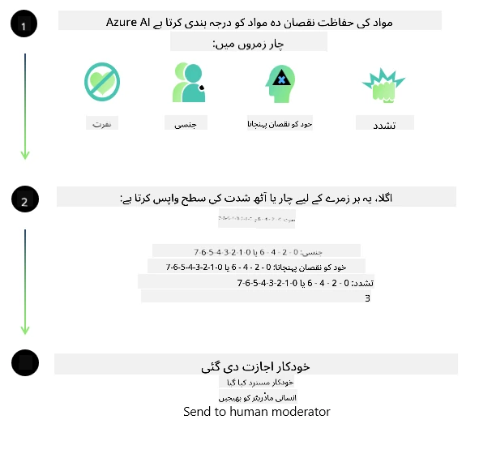
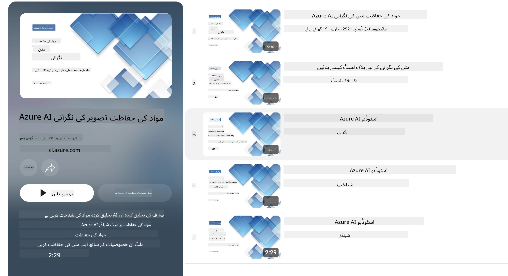

# فی ماڈلز کے لیے AI حفاظت  
فی خاندان کے ماڈلز [Microsoft Responsible AI Standard](https://www.microsoft.com/ai/principles-and-approach#responsible-ai-standard) کے مطابق تیار کیے گئے تھے، جو کہ ایک کمپنی بھر میں ضروریات کا مجموعہ ہے جو درج ذیل چھ اصولوں پر مبنی ہے: جوابدہی، شفافیت، منصفانہ پن، اعتبار اور حفاظت، رازداری اور سلامتی، اور شمولیت جو کہ [Microsoft کے Responsible AI اصول](https://www.microsoft.com/ai/responsible-ai) کی تشکیل دیتے ہیں۔

پچھلے فی ماڈلز کی طرح، ایک کثیر جہتی حفاظت کی تشخیص اور تربیت کے بعد حفاظت کے طریقہ کار کو اپنایا گیا ہے، اس ریلیز کی کثیر لسانی صلاحیتوں کو مدنظر رکھتے ہوئے اضافی اقدامات کیے گئے ہیں۔ ہماری حفاظت کی تربیت اور تشخیص کا طریقہ کار، جس میں متعدد زبانوں اور خطرے کی اقسام میں ٹیسٹنگ شامل ہے، [Phi Safety Post-Training Paper](https://arxiv.org/abs/2407.13833) میں بیان کیا گیا ہے۔ اگرچہ فی ماڈلز اس طریقہ کار سے فائدہ اٹھاتے ہیں، ڈویلپرز کو ذمہ دار AI بہترین طریقوں کا اطلاق کرنا چاہیے، جس میں اپنے مخصوص استعمال کے کیس اور ثقافتی و لسانی سیاق و سباق سے منسلک خطروں کی نقشہ سازی، پیمائش، اور تخفیف شامل ہے۔

## بہترین طریقے

دیگر ماڈلز کی طرح، فی خاندان کے ماڈلز ممکنہ طور پر غیر منصفانہ، غیر قابل اعتماد، یا ناخوشگوار انداز میں برتاؤ کر سکتے ہیں۔

SLM اور LLM کی کچھ محدود رویے جو آپ کو جاننے چاہئیں وہ شامل ہیں:

- **خدمت کا معیار:** فی ماڈلز خصوصاً انگریزی متن پر تربیت یافتہ ہیں۔ انگریزی کے علاوہ دوسری زبانوں میں کارکردگی کم ہوگی، اور تربیتی ڈیٹا میں کم نمائندگی والی انگریزی زبان کی اقسام کی کارکردگی معیاری امریکی انگریزی سے کم ہو سکتی ہے۔
- **نقصانات کی نمائندگی اور دقیانوسی تصورات کا جاری ہونا:** یہ ماڈلز لوگوں کے گروہوں کی زیادہ یا کم نمائندگی کر سکتے ہیں، کچھ گروہوں کی نمائندگی مٹا سکتے ہیں، یا تحقیر آمیز یا منفی دقیانوسی تصورات کو مستحکم کر سکتے ہیں۔ حفاظت کے بعد تربیت کے باوجود، یہ حدود مختلف گروہوں کی نمائندگی کی مختلف درجات اور تربیتی ڈیٹا میں منفی دقیانوسی تصورات کی مثالوں کی موجودگی کی وجہ سے موجود ہو سکتی ہیں، جو حقیقی دنیا کے نمونوں اور سماجی تعصبات کی عکاسی کرتی ہیں۔
- **نامناسب یا ناخوشگوار مواد:** یہ ماڈلز دیگر اقسام کا نامناسب یا ناخوشگوار مواد پیدا کر سکتے ہیں، جس کی وجہ سے یہ حساس سیاق و سباق میں استعمال کے لیے مخصوص تخفیفی اقدامات کے بغیر نامناسب ہو سکتا ہے۔
- **معلومات کی قابلِ اعتمادیت:** زبان کے ماڈلز غیر منطق پرتخلیق کر سکتے ہیں یا ایسا مواد تخلیق کر سکتے ہیں جو معقول لگے لیکن غیر درست یا پرانا ہو۔
- **کوڈ کے محدود دائرہ کار:** فی-3 تربیتی ڈیٹا کا زیادہ تر حصہ Python پر مبنی ہے اور عام پیکجز جیسے "typing, math, random, collections, datetime, itertools" استعمال کرتا ہے۔ اگر ماڈل Python اسکرپٹس تیار کرتا ہے جو دوسرے پیکجز یا زبانوں کی اسکرپٹس استعمال کرتے ہیں، تو ہم صارفین کو تمام API استعمالات کی دستی طور پر تصدیق کرنے کی سختی سے سفارش کرتے ہیں۔

ڈویلپرز کو ذمہ دار AI بہترین طریقے اپنانے چاہئیں اور یہ ذمہ داری ان پر ہوگی کہ وہ یقینی بنائیں کہ مخصوص استعمال کا کیس متعلقہ قوانین اور ضوابط (مثلاً پرائیویسی، تجارت وغیرہ) کی تعمیل کرے۔

## ذمہ دار AI غور و خوض

دیگر زبان کے ماڈلز کی طرح، فی سیریز کے ماڈلز ممکنہ طور پر غیر منصفانہ، غیر قابل اعتماد، یا ناخوشگوار طریقے سے برتاؤ کر سکتے ہیں۔ کچھ محدود رویے جن کا خیال رکھنا چاہیے وہ شامل ہیں:

**خدمت کا معیار:** فی ماڈلز بنیادی طور پر انگریزی متن پر تربیت یافتہ ہیں۔ انگریزی کے علاوہ دوسری زبانوں میں کارکردگی کم ہوگی۔ تربیتی ڈیٹا میں کم نمائندگی رکھنے والی انگریزی زبان کی اقسام معیاری امریکی انگریزی سے کم کارکردگی دکھا سکتی ہیں۔

**نقصانات کی نمائندگی اور دقیانوسی تصورات کا جاری ہونا:** یہ ماڈلز گروہوں کی زیادہ یا کم نمائندگی کر سکتے ہیں، کچھ گروہوں کی نمائندگی مٹا سکتے ہیں، یا تحقیر آمیز یا منفی دقیانوسی تصورات کو مستحکم کر سکتے ہیں۔ حفاظتی تربیت کے باوجود، یہ محدودیتیں موجود رہ سکتی ہیں کیونکہ مختلف گروہوں کی نمائندگی یا تربیتی ڈیٹا میں منفی دقیانوسی تصورات کی مثالوں کی مقدار مختلف ہو سکتی ہے، جو حقیقی دنیا کے نمونوں اور سماجی تعصبات کی عکاسی کرتی ہیں۔

**نامناسب یا ناخوشگوار مواد:** یہ ماڈلز دیگر اقسام کا نامناسب یا ناخوشگوار مواد پیدا کر سکتے ہیں، جو مخصوص تخفیفی اقدامات کے بغیر حساس سیاق و سباق میں استعمال کے لیے نا مناسب ہو سکتا ہے۔  
معلومات کی قابلِ اعتمادیت: زبان کے ماڈلز غیر منطقی مواد پیدا کر سکتے ہیں یا ایسا مواد تیار کر سکتے ہیں جو معقول لگے مگر غیر درست یا پرانا ہو۔

**کوڈ کے محدود دائرہ کار:** میجرٹی فی-3 کی تربیتی معلومات Python پر مبنی ہے اور عام پیکجز جیسے "typing, math, random, collections, datetime, itertools" استعمال کرتی ہے۔ اگر ماڈل Python اسکرپٹس جن میں دوسرے پیکجز یا دوسری زبانوں کی اسکرپٹس استعمال کی گئی ہوں تخلیق کرے، تو ہم صارفین کو تمام API استعمالات کی دستی طور پر جانچ کرنے کی سختی سے سفارش کرتے ہیں۔

ڈویلپرز کو ذمہ دار AI بہترین طریقے اپنانے چاہئیں اور یہ ان کی ذمہ داری ہے کہ وہ یقینی بنائیں کہ مخصوص استعمال کا کیس متعلقہ قوانین اور ضوابط (مثلاً رازداری، تجارت، وغیرہ) کی تعمیل کرے۔ غور طلب اہم علاقے شامل ہیں:

**تخصیص:** ماڈلز ایسے حالات کے لیے موزوں نہیں ہو سکتے جہاں قانونی حیثیت یا وسائل یا زندگی کے مواقع کی تخصیص پر گہرا اثر پڑے (مثلاً: رہائش، ملازمت، کریڈٹ، وغیرہ) جب تک کہ مزید جائزے اور اضافی تعصبات کے خاتمے کی تکنیکیں نہ اپنائی جائیں۔

**خطرناک حالات:** ڈویلپرز کو چاہیے کہ ماڈلز کو ایسے خطرناک حالات میں استعمال کے مناسبت کا جائزہ لیں جہاں غیر منصفانہ، غیر قابل اعتماد، یا ناخوشگوار نتائج مہنگے یا نقصان دہ ہو سکتے ہیں۔ اس میں حساس یا ماہر شعبوں میں مشورہ فراہم کرنا شامل ہے جہاں درستگی اور اعتبار انتہائی اہم ہوں (مثلاً: قانونی یا صحت کے مشورے)۔ اضافی حفاظتی اقدامات کو تعیناتی کے ماحول کے مطابق ایپلیکیشن سطح پر نافذ کرنا چاہیے۔

**غلط معلومات:** ماڈلز غلط معلومات پیدا کر سکتے ہیں۔ ڈویلپرز کو چاہیے کہ شفافیت کے بہترین طریقے اپنائیں اور اختتامی صارفین کو آگاہ کریں کہ وہ AI نظام سے بات کر رہے ہیں۔ ایپلیکیشن سطح پر، ڈویلپرز رائے شماری کے میکانزم اور پائپ لائنز بنا سکتے ہیں تاکہ جوابات کو استعمال کی مخصوص، سیاق و سباق کی معلومات پر مبنی بنایا جائے، جسے Retrieval Augmented Generation (RAG) کہا جاتا ہے۔

**مضر مواد کی تخلیق:** ڈویلپرز کو چا ہیے کہ اپنے سیاق و سباق کے لیے پیداوار کا جائزہ لیں اور دستیاب حفاظتی کلاسیفائرز یا اپنی مرضی کے حل استعمال کریں جو اُن کے استعمال کیس کے لیے مناسب ہوں۔

**غلط استعمال:** دیگر طرح کے غلط استعمال جیسے فراڈ، سپیم، یا مالویئر کی تخلیق ممکن ہے، اور ڈویلپرز کو یقینی بنانا چاہیے کہ ان کی ایپلیکیشنز قابل اطلاق قوانین اور ضوابط کی خلاف ورزی نہ کریں۔

### فائن ٹیوننگ اور AI مواد کی حفاظت

ماڈل کی فائن ٹیوننگ کے بعد، ہم سختی سے سفارش کرتے ہیں کہ [Azure AI Content Safety](https://learn.microsoft.com/azure/ai-services/content-safety/overview) کے اقدامات کو استعمال کیا جائے تاکہ ماڈلز کی طرف سے پیدا ہونے والے مواد کی نگرانی کی جا سکے، ممکنہ خطروں، دھمکیوں، اور معیار کے مسائل کی نشاندہی اور روکا جا سکے۔

[Azure AI Content Safety](https://learn.microsoft.com/azure/ai-services/content-safety/overview) متن اور تصویر دونوں قسم کے مواد کی حمایت کرتا ہے۔ اسے کلاؤڈ میں، منقطع کنٹینرز میں، اور ایج/ایمبیڈڈ ڈیوائسز پر تعینات کیا جا سکتا ہے۔

## Azure AI Content Safety کا جائزہ

Azure AI Content Safety ایک یکساں حل نہیں؛ اسے کاروباری پالیسیوں کے مطابق مخصوص کیا جا سکتا ہے۔ مزید برآں، اس کے کثیر اللسانی ماڈلز اسے متعدد زبانوں کو بیک وقت سمجھنے کے قابل بناتے ہیں۔

- **Azure AI Content Safety**  
- **Microsoft Developer**  
- **5 ویڈیوز**

Azure AI Content Safety سروس ایپلیکیشنز اور خدمات میں نقصان دہ صارف اور AI پیدا کردہ مواد کی شناخت کرتی ہے۔ اس میں متن اور تصویر کے APIs شامل ہیں جو آپ کو نقصان دہ یا نامناسب مواد کی شناخت کرنے کی اجازت دیتی ہیں۔

[AI Content Safety Playlist](https://www.youtube.com/playlist?list=PLlrxD0HtieHjaQ9bJjyp1T7FeCbmVcPkQ)

---

<!-- CO-OP TRANSLATOR DISCLAIMER START -->
**خاکہ شُدہ بیان**:  
یہ دستاویز AI ترجمہ سروس [Co-op Translator](https://github.com/Azure/co-op-translator) کے ذریعے ترجمہ کی گئی ہے۔ اگرچہ ہم درستگی کی کوشش کرتے ہیں، براہ کرم ذہن میں رکھیں کہ خودکار ترجموں میں غلطیاں یا بے ضابطگیاں ہو سکتی ہیں۔ اصل دستاویز اپنی مادری زبان میں سب سے معتبر ذریعہ سمجھی جانی چاہیے۔ اہم معلومات کے لیے پیشہ ور انسانی ترجمہ کی سفارش کی جاتی ہے۔ ہم اس ترجمہ کے استعمال سے پیدا ہونے والی کسی بھی غلط فہمی یا غلط تشریح کے لیے ذمہ دار نہیں ہیں۔
<!-- CO-OP TRANSLATOR DISCLAIMER END -->