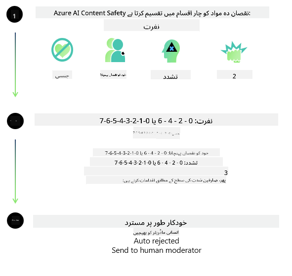
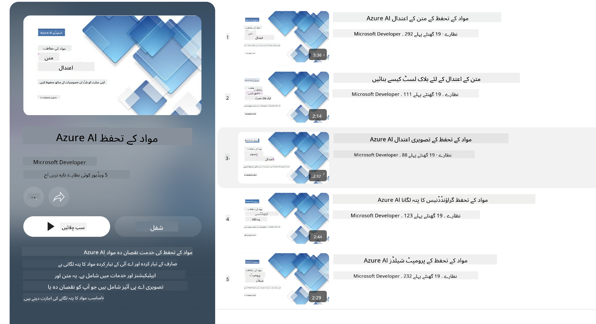

<!--
CO_OP_TRANSLATOR_METADATA:
{
  "original_hash": "1f6b561a224336bd4f413176ec40d994",
  "translation_date": "2025-04-03T06:32:08+00:00",
  "source_file": "md\\01.Introduction\\01\\01.AISafety.md",
  "language_code": "ur"
}
-->
# اے آئی سیفٹی فار فائی ماڈلز  
فائی ماڈلز کی فیملی [Microsoft Responsible AI Standard](https://query.prod.cms.rt.microsoft.com/cms/api/am/binary/RE5cmFl) کے مطابق تیار کی گئی ہے، جو کمپنی کے اصولوں پر مبنی ضروریات کا مجموعہ ہے۔ یہ اصول ہیں: جواب دہی، شفافیت، انصاف، اعتبار اور حفاظت، پرائیویسی اور سیکیورٹی، اور شمولیت، جو [Microsoft کے ذمہ دارانہ اے آئی اصول](https://www.microsoft.com/ai/responsible-ai) تشکیل دیتے ہیں۔  

پچھلے فائی ماڈلز کی طرح، ایک جامع حفاظتی جائزے اور پوسٹ ٹریننگ کا طریقہ اپنایا گیا، اور اس ریلیز کے کثیر لسانی صلاحیتوں کو مدنظر رکھتے ہوئے اضافی اقدامات کیے گئے۔ ہمارے حفاظتی تربیت اور جائزے کے طریقہ کار، بشمول مختلف زبانوں اور خطرات کی اقسام کے مطابق جانچ، کو [Phi Safety Post-Training Paper](https://arxiv.org/abs/2407.13833) میں تفصیل سے بیان کیا گیا ہے۔ اگرچہ فائی ماڈلز اس طریقہ سے فائدہ اٹھاتے ہیں، ڈویلپرز کو ذمہ دارانہ اے آئی کی بہترین طریقوں کو اپنانا چاہیے، جس میں اپنے مخصوص استعمال کے کیس اور ثقافتی و لسانی سیاق و سباق سے منسلک خطرات کی نقشہ سازی، پیمائش، اور تخفیف شامل ہے۔  

## بہترین طریقے  

دیگر ماڈلز کی طرح، فائی ماڈلز بھی ممکنہ طور پر غیر منصفانہ، ناقابل اعتبار، یا توہین آمیز طریقے سے کام کر سکتے ہیں۔  

ایس ایل ایم اور ایل ایل ایم کے کچھ محدود رویے جن سے آگاہ رہنا ضروری ہے:  

- **سروس کا معیار:** فائی ماڈلز بنیادی طور پر انگریزی متن پر تربیت یافتہ ہیں۔ انگریزی کے علاوہ دیگر زبانوں میں کارکردگی خراب ہو سکتی ہے۔ انگریزی زبان کی وہ اقسام جن کی تربیتی ڈیٹا میں نمائندگی کم ہے، معیاری امریکی انگریزی کے مقابلے میں خراب کارکردگی کا سامنا کر سکتی ہیں۔  
- **نقصانات کی نمائندگی اور دقیانوسی تصورات کو فروغ دینا:** یہ ماڈلز لوگوں کے گروہوں کی زیادہ یا کم نمائندگی کر سکتے ہیں، کچھ گروہوں کی نمائندگی کو مٹا سکتے ہیں، یا توہین آمیز یا منفی دقیانوسی تصورات کو تقویت دے سکتے ہیں۔ حفاظتی پوسٹ ٹریننگ کے باوجود، یہ محدودیاں اب بھی موجود ہو سکتی ہیں کیونکہ مختلف گروہوں کی نمائندگی کے مختلف درجے یا تربیتی ڈیٹا میں منفی دقیانوسی تصورات کی مثالیں حقیقی دنیا کے نمونوں اور سماجی تعصبات کی عکاسی کرتی ہیں۔  
- **نامناسب یا توہین آمیز مواد:** یہ ماڈلز دیگر اقسام کے نامناسب یا توہین آمیز مواد تیار کر سکتے ہیں، جو حساس سیاق و سباق میں اضافی تخفیفی اقدامات کے بغیر تعیناتی کے لیے نامناسب ہو سکتا ہے۔  
- **معلومات کی اعتباریت:** زبان کے ماڈلز بے معنی مواد یا ایسی معلومات تیار کر سکتے ہیں جو معقول لگتی ہیں لیکن غلط یا پرانی ہوتی ہیں۔  
- **کوڈ کے محدود دائرہ کار:** فائی-3 تربیتی ڈیٹا کا بڑا حصہ Python پر مبنی ہے اور عام پیکجز جیسے "typing, math, random, collections, datetime, itertools" استعمال کرتا ہے۔ اگر ماڈل Python اسکرپٹس تیار کرتا ہے جو دیگر پیکجز یا دیگر زبانوں میں اسکرپٹس استعمال کرتے ہیں، تو ہم صارفین کو سختی سے مشورہ دیتے ہیں کہ وہ تمام API استعمالات کو دستی طور پر تصدیق کریں۔  

ڈویلپرز کو ذمہ دارانہ اے آئی کی بہترین طریقے اپنانے چاہئیں اور اس بات کو یقینی بنانا چاہیے کہ مخصوص استعمال کے کیس متعلقہ قوانین اور ضوابط (جیسے پرائیویسی، تجارت، وغیرہ) کے مطابق ہوں۔  

## ذمہ دارانہ اے آئی کے اعتبارات  

دیگر زبان کے ماڈلز کی طرح، فائی سیریز ماڈلز بھی ممکنہ طور پر غیر منصفانہ، ناقابل اعتبار، یا توہین آمیز طریقے سے کام کر سکتے ہیں۔ کچھ محدود رویے جن سے آگاہ رہنا ضروری ہے:  

**سروس کا معیار:** فائی ماڈلز بنیادی طور پر انگریزی متن پر تربیت یافتہ ہیں۔ انگریزی کے علاوہ دیگر زبانوں میں کارکردگی خراب ہو سکتی ہے۔ انگریزی زبان کی وہ اقسام جن کی تربیتی ڈیٹا میں نمائندگی کم ہے، معیاری امریکی انگریزی کے مقابلے میں خراب کارکردگی کا سامنا کر سکتی ہیں۔  

**نقصانات کی نمائندگی اور دقیانوسی تصورات کو فروغ دینا:** یہ ماڈلز لوگوں کے گروہوں کی زیادہ یا کم نمائندگی کر سکتے ہیں، کچھ گروہوں کی نمائندگی کو مٹا سکتے ہیں، یا توہین آمیز یا منفی دقیانوسی تصورات کو تقویت دے سکتے ہیں۔ حفاظتی پوسٹ ٹریننگ کے باوجود، یہ محدودیاں اب بھی موجود ہو سکتی ہیں کیونکہ مختلف گروہوں کی نمائندگی کے مختلف درجے یا تربیتی ڈیٹا میں منفی دقیانوسی تصورات کی مثالیں حقیقی دنیا کے نمونوں اور سماجی تعصبات کی عکاسی کرتی ہیں۔  

**نامناسب یا توہین آمیز مواد:** یہ ماڈلز دیگر اقسام کے نامناسب یا توہین آمیز مواد تیار کر سکتے ہیں، جو حساس سیاق و سباق میں اضافی تخفیفی اقدامات کے بغیر تعیناتی کے لیے نامناسب ہو سکتا ہے۔  

**معلومات کی اعتباریت:** زبان کے ماڈلز بے معنی مواد یا ایسی معلومات تیار کر سکتے ہیں جو معقول لگتی ہیں لیکن غلط یا پرانی ہوتی ہیں۔  

**کوڈ کے محدود دائرہ کار:** فائی-3 تربیتی ڈیٹا کا بڑا حصہ Python پر مبنی ہے اور عام پیکجز جیسے "typing, math, random, collections, datetime, itertools" استعمال کرتا ہے۔ اگر ماڈل Python اسکرپٹس تیار کرتا ہے جو دیگر پیکجز یا دیگر زبانوں میں اسکرپٹس استعمال کرتے ہیں، تو ہم صارفین کو سختی سے مشورہ دیتے ہیں کہ وہ تمام API استعمالات کو دستی طور پر تصدیق کریں۔  

ڈویلپرز کو ذمہ دارانہ اے آئی کی بہترین طریقے اپنانے چاہئیں اور اس بات کو یقینی بنانا چاہیے کہ مخصوص استعمال کے کیس متعلقہ قوانین اور ضوابط (جیسے پرائیویسی، تجارت، وغیرہ) کے مطابق ہوں۔ اہم اعتبارات شامل ہیں:  

**مختص:** ماڈلز ان منظرناموں کے لیے موزوں نہیں ہو سکتے جو قانونی حیثیت یا وسائل یا زندگی کے مواقع (جیسے رہائش، ملازمت، قرض وغیرہ) پر اثر ڈال سکتے ہیں، بغیر مزید جائزوں اور اضافی ڈی بائسینگ تکنیک کے۔  

**اعلی خطرے والے منظرنامے:** ڈویلپرز کو ماڈلز کے استعمال کی موزونیت کا جائزہ لینا چاہیے، خاص طور پر ان منظرناموں میں جہاں غیر منصفانہ، ناقابل اعتبار، یا توہین آمیز نتائج بہت مہنگے یا نقصان دہ ہو سکتے ہیں۔ اس میں حساس یا ماہر شعبوں میں مشورہ دینا شامل ہے جہاں درستگی اور اعتبار اہم ہیں (جیسے قانونی یا صحت کے مشورے)۔ تعیناتی کے سیاق و سباق کے مطابق ایپلیکیشن سطح پر اضافی حفاظتی اقدامات نافذ کیے جانے چاہئیں۔  

**غلط معلومات:** ماڈلز غلط معلومات پیدا کر سکتے ہیں۔ ڈویلپرز کو شفافیت کی بہترین طریقے اپنانا چاہیے اور صارفین کو آگاہ کرنا چاہیے کہ وہ ایک اے آئی سسٹم کے ساتھ تعامل کر رہے ہیں۔ ایپلیکیشن سطح پر، ڈویلپرز فیڈ بیک میکانزم اور مخصوص سیاق و سباق کی معلومات میں جوابات کو بنیاد دینے کے لیے پائپ لائنز بنا سکتے ہیں، جسے Retrieval Augmented Generation (RAG) کہا جاتا ہے۔  

**نقصان دہ مواد کی پیداوار:** ڈویلپرز کو سیاق و سباق کے لیے آؤٹ پٹس کا جائزہ لینا چاہیے اور دستیاب حفاظتی کلاسیفائرز یا مخصوص حل استعمال کرنے چاہئیں جو ان کے استعمال کے کیس کے لیے موزوں ہوں۔  

**غلط استعمال:** دیگر غلط استعمال کی اقسام جیسے فراڈ، اسپام، یا مالویئر پیدا کرنا ممکن ہو سکتا ہے، اور ڈویلپرز کو یہ یقینی بنانا چاہیے کہ ان کی ایپلیکیشنز قابل اطلاق قوانین اور ضوابط کی خلاف ورزی نہ کریں۔  

### فائن ٹوننگ اور اے آئی مواد کی حفاظت  

ماڈل کو فائن ٹون کرنے کے بعد، ہم سختی سے مشورہ دیتے ہیں کہ [Azure AI Content Safety](https://learn.microsoft.com/azure/ai-services/content-safety/overview) کے اقدامات کا استعمال کریں تاکہ ماڈلز کے ذریعہ تیار کردہ مواد کی نگرانی کی جا سکے، ممکنہ خطرات، دھمکیوں، اور معیار کے مسائل کی شناخت اور روک تھام کی جا سکے۔  

  

[Azure AI Content Safety](https://learn.microsoft.com/azure/ai-services/content-safety/overview) متن اور تصویر کے مواد دونوں کی حمایت کرتا ہے۔ یہ کلاؤڈ میں، ڈسکنیکٹڈ کنٹینرز میں، اور ایج/ایمبیڈڈ ڈیوائسز پر تعینات کیا جا سکتا ہے۔  

## Azure AI Content Safety کا جائزہ  

Azure AI Content Safety کوئی ایک سائز کے مطابق حل نہیں ہے؛ اسے کاروباری اداروں کی مخصوص پالیسیوں کے مطابق بنایا جا سکتا ہے۔ اس کے علاوہ، اس کے کثیر لسانی ماڈلز اسے ایک ساتھ متعدد زبانوں کو سمجھنے کے قابل بناتے ہیں۔  

  

- **Azure AI Content Safety**  
- **Microsoft Developer**  
- **5 ویڈیوز**  

Azure AI Content Safety سروس ایپلیکیشنز اور سروسز میں صارف کے تیار کردہ اور اے آئی کے تیار کردہ نقصان دہ مواد کا پتہ لگاتی ہے۔ اس میں متن اور تصویر APIs شامل ہیں جو نقصان دہ یا نامناسب مواد کا پتہ لگانے کی اجازت دیتے ہیں۔  

[AI Content Safety Playlist](https://www.youtube.com/playlist?list=PLlrxD0HtieHjaQ9bJjyp1T7FeCbmVcPkQ)  

**ڈسکلیمر**:  
یہ دستاویز AI ترجمہ سروس [Co-op Translator](https://github.com/Azure/co-op-translator) کا استعمال کرتے ہوئے ترجمہ کی گئی ہے۔ ہم درستگی کے لیے کوشش کرتے ہیں، لیکن براہ کرم یہ بات ذہن میں رکھیں کہ خودکار ترجمے میں غلطیاں یا غیر درستیاں ہوسکتی ہیں۔ اصل دستاویز کو اس کی اصل زبان میں مستند ذریعہ سمجھا جانا چاہیے۔ اہم معلومات کے لیے، پیشہ ورانہ انسانی ترجمہ تجویز کیا جاتا ہے۔ ہم اس ترجمے کے استعمال سے پیدا ہونے والی کسی بھی غلط فہمی یا غلط تشریح کے ذمہ دار نہیں ہیں۔