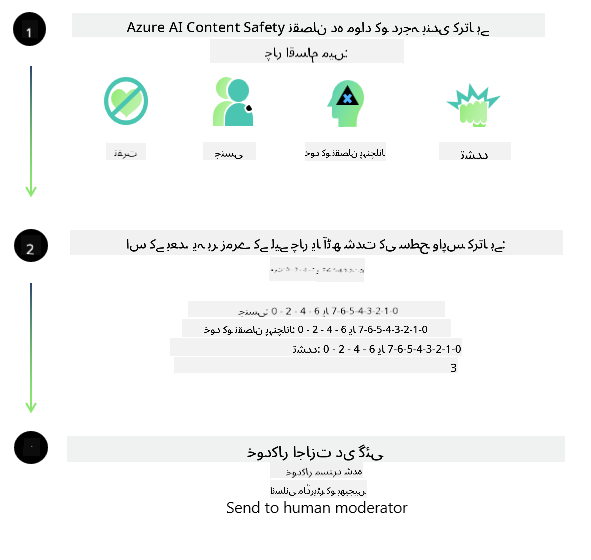

<!--
CO_OP_TRANSLATOR_METADATA:
{
  "original_hash": "c8273672cc57df2be675407a1383aaf0",
  "translation_date": "2025-05-07T14:55:06+00:00",
  "source_file": "md/01.Introduction/01/01.AISafety.md",
  "language_code": "ur"
}
-->
# AI safety for Phi models  
خاندان Phi کے ماڈلز کو [Microsoft Responsible AI Standard](https://query.prod.cms.rt.microsoft.com/cms/api/am/binary/RE5cmFl) کے مطابق تیار کیا گیا ہے، جو کمپنی بھر کے تقاضوں کا مجموعہ ہے اور درج ذیل چھ اصولوں پر مبنی ہے: جوابدہی، شفافیت، انصاف، اعتبار اور حفاظت، رازداری اور سیکیورٹی، اور شمولیت، جو [Microsoft کے Responsible AI اصول](https://www.microsoft.com/ai/responsible-ai) کی تشکیل دیتے ہیں۔

پچھلے Phi ماڈلز کی طرح، ایک جامع حفاظتی جائزہ اور پوسٹ-ٹریننگ حفاظتی طریقہ اپنایا گیا ہے، اور اس ریلیز کی کثیر لسانی صلاحیتوں کو مدنظر رکھتے ہوئے اضافی اقدامات کیے گئے ہیں۔ ہماری حفاظتی تربیت اور جائزوں کا طریقہ کار، جس میں متعدد زبانوں اور خطرے کی اقسام کے حوالے سے جانچ شامل ہے، [Phi Safety Post-Training Paper](https://arxiv.org/abs/2407.13833) میں بیان کیا گیا ہے۔ اگرچہ Phi ماڈلز اس طریقہ کار سے فائدہ اٹھاتے ہیں، ڈیولپرز کو چاہیے کہ وہ ذمہ دار AI کی بہترین مشقیں اپنائیں، جن میں ان کے مخصوص استعمال کے کیس اور ثقافتی و لسانی سیاق و سباق سے منسلک خطرات کا نقشہ بنانا، ماپنا اور کم کرنا شامل ہے۔

## Best Practices  
دوسرے ماڈلز کی طرح، Phi خاندان کے ماڈلز ممکنہ طور پر ایسے رویے دکھا سکتے ہیں جو غیر منصفانہ، غیر قابل اعتماد، یا ناگوار ہوں۔

SLM اور LLM کی کچھ محدودیتیں جن سے آپ کو آگاہ ہونا چاہیے، درج ذیل ہیں:

- **معیارِ خدمت:** Phi ماڈلز بنیادی طور پر انگریزی متن پر تربیت یافتہ ہیں۔ انگریزی کے علاوہ دوسری زبانوں میں کارکردگی کم ہو سکتی ہے۔ تربیتی ڈیٹا میں کم نمائندگی والی انگریزی زبان کی اقسام کی کارکردگی معیاری امریکی انگریزی کے مقابلے میں کم ہو سکتی ہے۔  
- **نقصانات کی نمائندگی اور دقیانوسی تصورات کا برقرار رہنا:** یہ ماڈلز لوگوں کے گروہوں کی زیادہ یا کم نمائندگی کر سکتے ہیں، کچھ گروہوں کی نمائندگی مٹ سکتے ہیں، یا تحقیر آمیز یا منفی دقیانوسی تصورات کو مضبوط کر سکتے ہیں۔ حفاظتی پوسٹ-ٹریننگ کے باوجود، یہ محدودیتیں اب بھی موجود ہو سکتی ہیں کیونکہ مختلف گروہوں کی نمائندگی کی سطحیں مختلف ہوتی ہیں یا تربیتی ڈیٹا میں منفی دقیانوسی تصورات کی مثالیں موجود ہوتی ہیں جو حقیقی دنیا کے نمونوں اور معاشرتی تعصبات کی عکاسی کرتی ہیں۔  
- **نا مناسب یا ناگوار مواد:** یہ ماڈلز دیگر قسم کا نا مناسب یا ناگوار مواد بھی پیدا کر سکتے ہیں، جو حساس سیاق و سباق میں اضافی حفاظتی تدابیر کے بغیر تعیناتی کے لیے نامناسب ہو سکتا ہے۔  
- **معلومات کی قابلِ اعتباریت:** زبان کے ماڈلز غیر منطقی مواد پیدا کر سکتے ہیں یا ایسا مواد بنا سکتے ہیں جو معقول لگے لیکن غلط یا پرانا ہو۔  
- **کوڈ کے لیے محدود دائرہ:** Phi-3 کے تربیتی ڈیٹا کا زیادہ تر حصہ Python پر مبنی ہے اور عام پیکجز جیسے "typing, math, random, collections, datetime, itertools" استعمال کرتا ہے۔ اگر ماڈل Python اسکرپٹس جن میں دیگر پیکجز یا دوسری زبانوں کے اسکرپٹس شامل ہوں تیار کرے، تو ہم صارفین کو سختی سے مشورہ دیتے ہیں کہ وہ تمام API استعمالات کو دستی طور پر تصدیق کریں۔

ڈیولپرز کو چاہیے کہ وہ ذمہ دار AI کی بہترین مشقیں اپنائیں اور اس بات کو یقینی بنائیں کہ مخصوص استعمال کا کیس متعلقہ قوانین اور ضوابط (مثلاً رازداری، تجارت وغیرہ) کے مطابق ہو۔

## Responsible AI Considerations  
دوسرے زبان کے ماڈلز کی طرح، Phi سیریز کے ماڈلز ممکنہ طور پر ایسے رویے دکھا سکتے ہیں جو غیر منصفانہ، غیر قابل اعتماد، یا ناگوار ہوں۔ چند محدود رویے جن سے آگاہ ہونا ضروری ہے، درج ذیل ہیں:

**معیارِ خدمت:** Phi ماڈلز بنیادی طور پر انگریزی متن پر تربیت یافتہ ہیں۔ انگریزی کے علاوہ دوسری زبانوں میں کارکردگی کم ہو سکتی ہے۔ تربیتی ڈیٹا میں کم نمائندگی والی انگریزی زبان کی اقسام کی کارکردگی معیاری امریکی انگریزی کے مقابلے میں کم ہو سکتی ہے۔

**نقصانات کی نمائندگی اور دقیانوسی تصورات کا برقرار رہنا:** یہ ماڈلز لوگوں کے گروہوں کی زیادہ یا کم نمائندگی کر سکتے ہیں، کچھ گروہوں کی نمائندگی مٹا سکتے ہیں، یا تحقیر آمیز یا منفی دقیانوسی تصورات کو مضبوط کر سکتے ہیں۔ حفاظتی پوسٹ-ٹریننگ کے باوجود، یہ محدودیتیں اب بھی موجود ہو سکتی ہیں کیونکہ مختلف گروہوں کی نمائندگی کی سطحیں مختلف ہوتی ہیں یا تربیتی ڈیٹا میں منفی دقیانوسی تصورات کی مثالیں موجود ہوتی ہیں جو حقیقی دنیا کے نمونوں اور معاشرتی تعصبات کی عکاسی کرتی ہیں۔

**نا مناسب یا ناگوار مواد:** یہ ماڈلز دیگر قسم کا نا مناسب یا ناگوار مواد بھی پیدا کر سکتے ہیں، جو حساس سیاق و سباق میں اضافی حفاظتی تدابیر کے بغیر تعیناتی کے لیے نامناسب ہو سکتا ہے۔  
معلومات کی قابلِ اعتباریت: زبان کے ماڈلز غیر منطقی مواد پیدا کر سکتے ہیں یا ایسا مواد بنا سکتے ہیں جو معقول لگے لیکن غلط یا پرانا ہو۔

**کوڈ کے لیے محدود دائرہ:** Phi-3 کے تربیتی ڈیٹا کا زیادہ تر حصہ Python پر مبنی ہے اور عام پیکجز جیسے "typing, math, random, collections, datetime, itertools" استعمال کرتا ہے۔ اگر ماڈل Python اسکرپٹس جن میں دیگر پیکجز یا دوسری زبانوں کے اسکرپٹس شامل ہوں تیار کرے، تو ہم صارفین کو سختی سے مشورہ دیتے ہیں کہ وہ تمام API استعمالات کو دستی طور پر تصدیق کریں۔

ڈیولپرز کو چاہیے کہ وہ ذمہ دار AI کی بہترین مشقیں اپنائیں اور اس بات کو یقینی بنائیں کہ مخصوص استعمال کا کیس متعلقہ قوانین اور ضوابط (مثلاً رازداری، تجارت وغیرہ) کے مطابق ہو۔ غور طلب اہم پہلوؤں میں شامل ہیں:

**Allocation:** ماڈلز ایسے حالات کے لیے موزوں نہیں ہو سکتے جہاں قانونی حیثیت، وسائل کی تقسیم یا زندگی کے مواقع (مثلاً رہائش، ملازمت، قرض وغیرہ) پر گہرا اثر پڑ سکتا ہو، جب تک کہ مزید جائزے اور اضافی تعصبات کم کرنے کی تکنیکیں نہ اپنائی جائیں۔

**High-Risk Scenarios:** ڈیولپرز کو چاہیے کہ وہ ایسے اعلیٰ خطرے والے حالات میں ماڈلز کے استعمال کی مناسبت کا جائزہ لیں جہاں غیر منصفانہ، غیر قابل اعتماد، یا ناگوار نتائج انتہائی مہنگے یا نقصان دہ ہو سکتے ہیں۔ اس میں حساس یا ماہر شعبوں میں مشورہ دینا شامل ہے جہاں درستگی اور اعتبار بہت اہم ہیں (مثلاً قانونی یا صحت کا مشورہ)۔ تعیناتی کے سیاق و سباق کے مطابق ایپلیکیشن کی سطح پر اضافی حفاظتی تدابیر نافذ کی جانی چاہئیں۔

**Misinformation:** ماڈلز غلط معلومات پیدا کر سکتے ہیں۔ ڈیولپرز کو چاہیے کہ وہ شفافیت کی بہترین مشقوں پر عمل کریں اور صارفین کو اطلاع دیں کہ وہ AI نظام کے ساتھ بات چیت کر رہے ہیں۔ ایپلیکیشن کی سطح پر، ڈیولپرز فیڈبیک میکانزم اور پائپ لائنز تیار کر سکتے ہیں تاکہ جوابات کو مخصوص استعمال کے کیس اور سیاق و سباق کی معلومات کی بنیاد پر مضبوط کیا جا سکے، جسے Retrieval Augmented Generation (RAG) کہا جاتا ہے۔

**Generation of Harmful Content:** ڈیولپرز کو چاہیے کہ وہ نتائج کا سیاق و سباق کے مطابق جائزہ لیں اور دستیاب حفاظتی درجہ بندی کرنے والے یا اپنی مرضی کے مطابق حل استعمال کریں جو ان کے استعمال کے کیس کے مطابق ہوں۔

**Misuse:** فراڈ، اسپیم، یا مالویئر کی تخلیق جیسے دیگر غلط استعمال کے امکانات ہو سکتے ہیں، اور ڈیولپرز کو چاہیے کہ وہ یقینی بنائیں کہ ان کی ایپلیکیشنز قابلِ اطلاق قوانین اور ضوابط کی خلاف ورزی نہیں کرتیں۔

### Finetuning and AI Content Safety  
ماڈل کی فائن ٹیوننگ کے بعد، ہم سختی سے تجویز کرتے ہیں کہ آپ [Azure AI Content Safety](https://learn.microsoft.com/azure/ai-services/content-safety/overview) کے اقدامات کا استعمال کریں تاکہ ماڈلز کی جانب سے پیدا کردہ مواد کی نگرانی کی جا سکے، ممکنہ خطرات، دھمکیوں، اور معیار کے مسائل کی نشاندہی اور بلاکنگ کی جا سکے۔

[Azure AI Content Safety](https://learn.microsoft.com/azure/ai-services/content-safety/overview) متن اور تصویر دونوں قسم کے مواد کی حمایت کرتا ہے۔ اسے کلاؤڈ، ڈسکنیکٹڈ کنٹینرز، اور ایج/ایمبیڈڈ ڈیوائسز پر تعینات کیا جا سکتا ہے۔

## Overview of Azure AI Content Safety  
Azure AI Content Safety ایک یکساں حل نہیں ہے؛ اسے کاروباری پالیسیوں کے مطابق حسب ضرورت بنایا جا سکتا ہے۔ مزید برآں، اس کے کثیر لسانی ماڈلز اسے متعدد زبانوں کو بیک وقت سمجھنے کے قابل بناتے ہیں۔

- **Azure AI Content Safety**  
- **Microsoft Developer**  
- **5 videos**

Azure AI Content Safety سروس ایپلیکیشنز اور سروسز میں صارفین اور AI کی جانب سے پیدا کردہ نقصان دہ مواد کی شناخت کرتی ہے۔ اس میں متن اور تصویر کے API شامل ہیں جو نقصان دہ یا نا مناسب مواد کی شناخت کی اجازت دیتے ہیں۔

[AI Content Safety Playlist](https://www.youtube.com/playlist?list=PLlrxD0HtieHjaQ9bJjyp1T7FeCbmVcPkQ)

**دستخطی**:  
یہ دستاویز AI ترجمہ سروس [Co-op Translator](https://github.com/Azure/co-op-translator) کے ذریعے ترجمہ کی گئی ہے۔ اگرچہ ہم درستگی کی کوشش کرتے ہیں، براہ کرم آگاہ رہیں کہ خودکار ترجمے میں غلطیاں یا کمی بیشی ہو سکتی ہے۔ اصل دستاویز اپنی مادری زبان میں معتبر ذریعہ سمجھا جانا چاہیے۔ اہم معلومات کے لیے پیشہ ور انسانی ترجمہ کی سفارش کی جاتی ہے۔ اس ترجمے کے استعمال سے پیدا ہونے والی کسی بھی غلط فہمی یا غلط تشریح کی ذمہ داری ہم پر عائد نہیں ہوتی۔