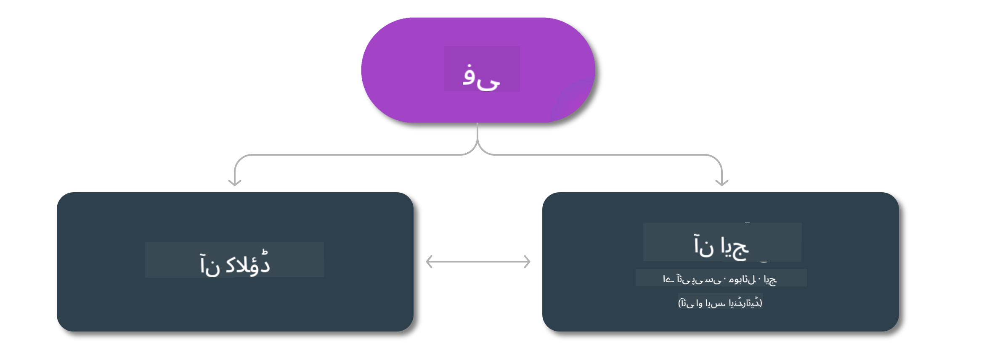

<!--
CO_OP_TRANSLATOR_METADATA:
{
  "original_hash": "777aa0ff38fceecc29a00834f2f7a2f0",
  "translation_date": "2025-07-16T17:57:04+00:00",
  "source_file": "md/01.Introduction/01/01.Edgeandcloud.md",
  "language_code": "ur"
}
-->
# Phi ماڈلز اور مختلف پلیٹ فارمز پر دستیابی

## ایج اور کلاؤڈ کے منظرنامے

## ماڈل کی دستیابی اور وسائل

| | | | | | | | | |
|-|-|-|-|-|-|-|-|-|
|ماڈل|ان پٹ|مواد کی لمبائی|Azure AI (MaaS)|Azure ML (MaaP)|ONNX|Hugging Face|Ollama|Nvidia NIM|
|Phi-3-vision-128k-instruct|متن + تصویر|128k|[پلے گراؤنڈ اور تعیناتی](https://ai.azure.com/explore/models/Phi-3-vision-128k-instruct/version/2/registry/azureml)|[پلے گراؤنڈ، تعیناتی اور فائن ٹیوننگ](https://ml.azure.com/registries/azureml/models/Phi-3-vision-128k-instruct/version/2)|[CUDA](https://huggingface.co/microsoft/Phi-3-vision-128k-instruct-onnx-cuda/tree/main),[CPU](https://huggingface.co/microsoft/Phi-3-vision-128k-instruct-onnx-cpu/tree/main), [DirectML](https://huggingface.co/microsoft/Phi-3-vision-128k-instruct-onnx-directml/tree/main)|[ڈاؤن لوڈ](https://huggingface.co/microsoft/Phi-3-vision-128k-instruct)|-NA-|[NIM APIs](https://build.nvidia.com/microsoft/phi-3-vision-128k-instruct)|
|Phi-3-mini-4k-instruct|متن|4k|[پلے گراؤنڈ اور تعیناتی](https://aka.ms/phi3-mini-4k-azure-ml)|[پلے گراؤنڈ، تعیناتی](https://aka.ms/phi3-mini-4k-azure-ml) اور فائن ٹیوننگ|[CUDA](https://huggingface.co/microsoft/Phi-3-mini-4k-instruct-onnx), [Web](https://huggingface.co/microsoft/Phi-3-mini-4k-instruct-onnx)|[پلے گراؤنڈ اور ڈاؤن لوڈ](https://huggingface.co/chat/models/microsoft/Phi-3-mini-4k-instruct)|[GGUF](https://huggingface.co/microsoft/Phi-3-mini-4k-instruct-gguf)|[NIM APIs](https://build.nvidia.com/microsoft/phi-3-mini-4k)|
|Phi-3-mini-128k-instruct|متن|128k|[پلے گراؤنڈ اور تعیناتی](https://ai.azure.com/explore/models/Phi-3-mini-128k-instruct/version/9/registry/azureml)|[پلے گراؤنڈ، تعیناتی](https://ai.azure.com/explore/models/Phi-3-mini-128k-instruct/version/9/registry/azureml) اور فائن ٹیوننگ|[CUDA](https://huggingface.co/microsoft/Phi-3-mini-128k-instruct-onnx)|[ڈاؤن لوڈ](https://huggingface.co/microsoft/Phi-3-mini-128k-instruct-onnx)|-NA-|[NIM APIs](https://build.nvidia.com/microsoft/phi-3-mini)|
|Phi-3-small-8k-instruct|متن|8k|[پلے گراؤنڈ اور تعیناتی](https://ml.azure.com/registries/azureml/models/Phi-3-small-8k-instruct/version/2)|[پلے گراؤنڈ، تعیناتی](https://ai.azure.com/explore/models/Phi-3-small-8k-instruct/version/2/registry/azureml) اور فائن ٹیوننگ|[CUDA](https://huggingface.co/microsoft/Phi-3-small-8k-instruct-onnx-cuda)|[ڈاؤن لوڈ](https://huggingface.co/microsoft/Phi-3-small-8k-instruct-onnx-cuda)|-NA-|[NIM APIs](https://build.nvidia.com/microsoft/phi-3-small-8k-instruct?docker=false)|
|Phi-3-small-128k-instruct|متن|128k|[پلے گراؤنڈ اور تعیناتی](https://ai.azure.com/explore/models/Phi-3-small-128k-instruct/version/2/registry/azureml)|[پلے گراؤنڈ، تعیناتی](https://ml.azure.com/registries/azureml/models/Phi-3-small-128k-instruct/version/2) اور فائن ٹیوننگ|[CUDA](https://huggingface.co/microsoft/Phi-3-medium-128k-instruct-onnx-cuda)|[ڈاؤن لوڈ](https://huggingface.co/microsoft/Phi-3-small-128k-instruct)|-NA-|[NIM APIs](https://build.nvidia.com/microsoft/phi-3-small-128k-instruct?docker=false)|
|Phi-3-medium-4k-instruct|متن|4k|[پلے گراؤنڈ اور تعیناتی](https://huggingface.co/microsoft/Phi-3-medium-4k-instruct)|[پلے گراؤنڈ، تعیناتی](https://ml.azure.com/registries/azureml/models/Phi-3-medium-4k-instruct/version/2) اور فائن ٹیوننگ|[CUDA](https://huggingface.co/microsoft/Phi-3-medium-4k-instruct-onnx-cuda/tree/main), [CPU](https://huggingface.co/microsoft/Phi-3-medium-4k-instruct-onnx-cpu/tree/main), [DirectML](https://huggingface.co/microsoft/Phi-3-medium-4k-instruct-onnx-directml/tree/main)|[ڈاؤن لوڈ](https://huggingface.co/microsoft/Phi-3-medium-4k-instruct)|-NA-|[NIM APIs](https://build.nvidia.com/microsoft/phi-3-medium-4k-instruct?docker=false)|
|Phi-3-medium-128k-instruct|متن|128k|[پلے گراؤنڈ اور تعیناتی](https://ai.azure.com/explore/models/Phi-3-medium-128k-instruct/version/2)|[پلے گراؤنڈ، تعیناتی](https://ml.azure.com/registries/azureml/models/Phi-3-medium-128k-instruct/version/2) اور فائن ٹیوننگ|[CUDA](https://huggingface.co/microsoft/Phi-3-medium-128k-instruct-onnx-cuda/tree/main), [CPU](https://huggingface.co/microsoft/Phi-3-medium-128k-instruct-onnx-cpu/tree/main), [DirectML](https://huggingface.co/microsoft/Phi-3-medium-128k-instruct-onnx-directml/tree/main)|[ڈاؤن لوڈ](https://huggingface.co/microsoft/Phi-3-medium-128k-instruct)|-NA-|-NA-|

**دستخطی نوٹ**:  
یہ دستاویز AI ترجمہ سروس [Co-op Translator](https://github.com/Azure/co-op-translator) کے ذریعے ترجمہ کی گئی ہے۔ اگرچہ ہم درستگی کے لیے کوشاں ہیں، براہ کرم آگاہ رہیں کہ خودکار ترجمے میں غلطیاں یا عدم درستیاں ہو سکتی ہیں۔ اصل دستاویز اپنی مادری زبان میں معتبر ماخذ سمجھی جانی چاہیے۔ اہم معلومات کے لیے پیشہ ور انسانی ترجمہ کی سفارش کی جاتی ہے۔ اس ترجمے کے استعمال سے پیدا ہونے والی کسی بھی غلط فہمی یا غلط تشریح کی ذمہ داری ہم پر عائد نہیں ہوتی۔