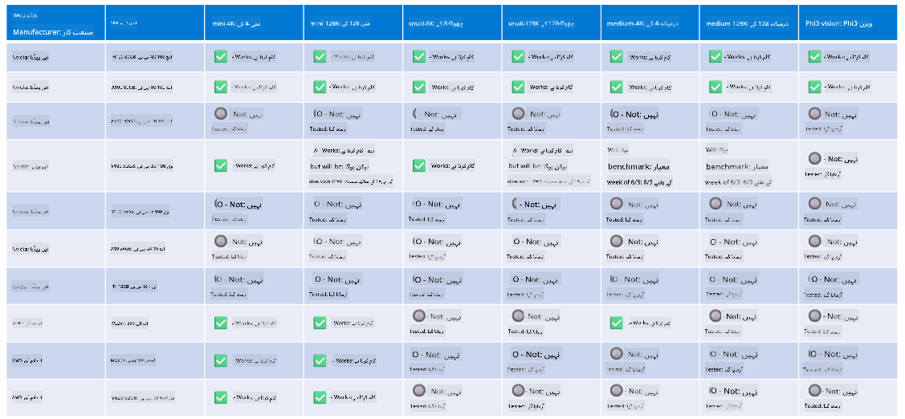

<!--
CO_OP_TRANSLATOR_METADATA:
{
  "original_hash": "c4afa6ffd13f29eb34e5f204b94310ff",
  "translation_date": "2025-04-03T06:37:28+00:00",
  "source_file": "md\\01.Introduction\\01\\01.Hardwaresupport.md",
  "language_code": "ur"
}
-->
# فی ہارڈویئر سپورٹ

مائیکروسافٹ فی کو ONNX Runtime کے لیے بہتر بنایا گیا ہے اور یہ ونڈوز DirectML کو سپورٹ کرتا ہے۔ یہ مختلف قسم کے ہارڈویئر پر اچھی طرح کام کرتا ہے، جن میں GPUs، CPUs، اور یہاں تک کہ موبائل ڈیوائسز بھی شامل ہیں۔

## ڈیوائس ہارڈویئر  
خاص طور پر، سپورٹ کیے گئے ہارڈویئر میں شامل ہیں:

- GPU SKU: RTX 4090 (DirectML)
- GPU SKU: 1 A100 80GB (CUDA)
- CPU SKU: Standard F64s v2 (64 vCPUs، 128 GiB میموری)

## موبائل SKU

- اینڈرائیڈ - سامسنگ گلیکسی S21
- ایپل آئی فون 14 یا اس سے زیادہ A16/A17 پروسیسر

## فی ہارڈویئر اسپیسفیکیشن

- کم سے کم مطلوبہ کنفیگریشن۔
- ونڈوز: DirectX 12-capable GPU اور کم از کم 4GB مشترکہ RAM

CUDA: NVIDIA GPU جس کی Compute Capability >= 7.02 ہو



## کئی GPUs پر onnxruntime چلانا

فی الحال دستیاب فی ONNX ماڈلز صرف 1 GPU کے لیے ہیں۔ فی ماڈل کے لیے ملٹی-GPU کو سپورٹ کرنا ممکن ہے، لیکن ORT کے ساتھ 2 GPU یہ ضمانت نہیں دیتا کہ یہ 2 انسٹینسز کے مقابلے میں زیادہ تھروپٹ فراہم کرے گا۔ تازہ ترین اپڈیٹس کے لیے براہ کرم [ONNX Runtime](https://onnxruntime.ai/) دیکھیں۔

[Build 2024 the GenAI ONNX Team](https://youtu.be/WLW4SE8M9i8?si=EtG04UwDvcjunyfC) پر اعلان کیا گیا کہ انہوں نے فی ماڈلز کے لیے ملٹی انسٹینس کو ملٹی-GPU کے بجائے فعال کیا ہے۔

فی الحال یہ آپ کو CUDA_VISIBLE_DEVICES ماحول کے ویری ایبل کے ساتھ ایک onnxruntime یا onnxruntime-genai انسٹینس چلانے کی اجازت دیتا ہے، جیسے کہ:

```Python
CUDA_VISIBLE_DEVICES=0 python infer.py
CUDA_VISIBLE_DEVICES=1 python infer.py
```

فی کو مزید دریافت کرنے کے لیے [Azure AI Foundry](https://ai.azure.com) پر جائیں۔

**ڈسکلیمر**:  
یہ دستاویز AI ترجمہ سروس [Co-op Translator](https://github.com/Azure/co-op-translator) کا استعمال کرتے ہوئے ترجمہ کی گئی ہے۔ ہم درستگی کے لیے کوشش کرتے ہیں، لیکن براہ کرم آگاہ رہیں کہ خودکار ترجمے میں غلطیاں یا غیر درستیاں ہو سکتی ہیں۔ اصل دستاویز، جو اس کی اصل زبان میں ہے، کو مستند ذریعہ سمجھا جانا چاہیے۔ اہم معلومات کے لیے، پیشہ ور انسانی ترجمہ کی سفارش کی جاتی ہے۔ ہم اس ترجمے کے استعمال سے پیدا ہونے والی کسی بھی غلط فہمی یا غلط تشریح کے ذمہ دار نہیں ہیں۔