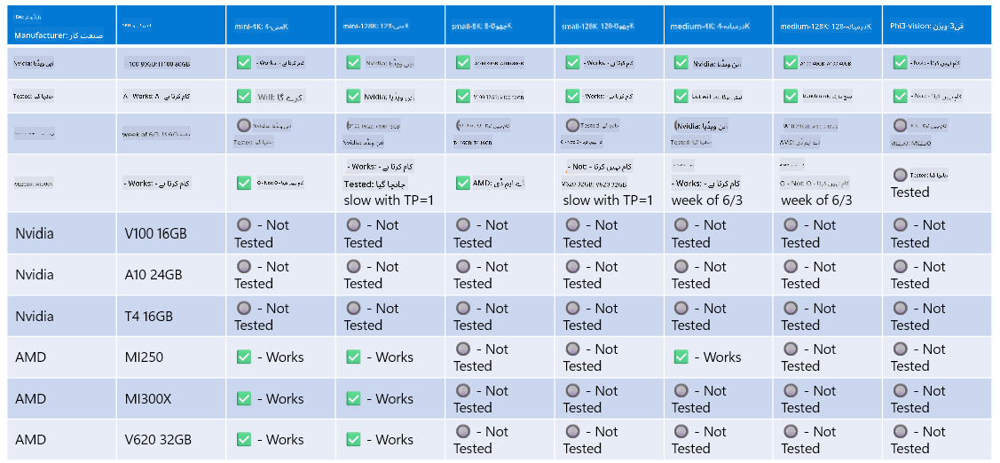

<!--
CO_OP_TRANSLATOR_METADATA:
{
  "original_hash": "8cdc17ce0f10535da30b53d23fe1a795",
  "translation_date": "2025-07-16T18:23:17+00:00",
  "source_file": "md/01.Introduction/01/01.Hardwaresupport.md",
  "language_code": "ur"
}
-->
# Phi ہارڈویئر سپورٹ

Microsoft Phi کو ONNX Runtime کے لیے بہتر بنایا گیا ہے اور یہ Windows DirectML کو سپورٹ کرتا ہے۔ یہ مختلف قسم کے ہارڈویئر پر اچھا کام کرتا ہے، جن میں GPUs، CPUs، اور یہاں تک کہ موبائل ڈیوائسز بھی شامل ہیں۔

## ڈیوائس ہارڈویئر  
خاص طور پر، سپورٹ شدہ ہارڈویئر میں شامل ہیں:

- GPU SKU: RTX 4090 (DirectML)
- GPU SKU: 1 A100 80GB (CUDA)
- CPU SKU: Standard F64s v2 (64 vCPUs، 128 GiB میموری)

## موبائل SKU

- Android - Samsung Galaxy S21  
- Apple iPhone 14 یا اس سے اوپر A16/A17 پروسیسر

## Phi ہارڈویئر کی تفصیلات

- کم از کم مطلوبہ کنفیگریشن۔  
- Windows: DirectX 12-قابل GPU اور کم از کم 4GB مشترکہ RAM

CUDA: NVIDIA GPU جس کی Compute Capability >= 7.02 ہو



## متعدد GPUs پر onnxruntime چلانا

فی الحال دستیاب Phi ONNX ماڈلز صرف 1 GPU کے لیے ہیں۔ Phi ماڈل کے لیے ملٹی-GPU سپورٹ ممکن ہے، لیکن 2 GPUs کے ساتھ ORT اس بات کی ضمانت نہیں دیتا کہ یہ 2 ORT انسٹینسز کے مقابلے میں زیادہ تھروپٹ دے گا۔ تازہ ترین اپ ڈیٹس کے لیے براہ کرم [ONNX Runtime](https://onnxruntime.ai/) دیکھیں۔

[Build 2024 the GenAI ONNX Team](https://youtu.be/WLW4SE8M9i8?si=EtG04UwDvcjunyfC) نے اعلان کیا کہ انہوں نے Phi ماڈلز کے لیے ملٹی-GPU کی بجائے ملٹی-انسٹینس کو فعال کیا ہے۔

اس وقت یہ آپ کو ایک onnxruntime یا onnxruntime-genai انسٹینس کو CUDA_VISIBLE_DEVICES ماحول کی متغیر کے ساتھ اس طرح چلانے کی اجازت دیتا ہے۔

```Python
CUDA_VISIBLE_DEVICES=0 python infer.py
CUDA_VISIBLE_DEVICES=1 python infer.py
```

Phi کو مزید دریافت کرنے کے لیے [Azure AI Foundry](https://ai.azure.com) پر جائیں۔

**دستخطی نوٹ**:  
یہ دستاویز AI ترجمہ سروس [Co-op Translator](https://github.com/Azure/co-op-translator) کے ذریعے ترجمہ کی گئی ہے۔ اگرچہ ہم درستگی کے لیے کوشاں ہیں، براہ کرم آگاہ رہیں کہ خودکار ترجمے میں غلطیاں یا عدم درستیاں ہو سکتی ہیں۔ اصل دستاویز اپنی مادری زبان میں معتبر ماخذ سمجھی جانی چاہیے۔ اہم معلومات کے لیے پیشہ ور انسانی ترجمہ کی سفارش کی جاتی ہے۔ اس ترجمے کے استعمال سے پیدا ہونے والی کسی بھی غلط فہمی یا غلط تشریح کی ذمہ داری ہم پر عائد نہیں ہوتی۔