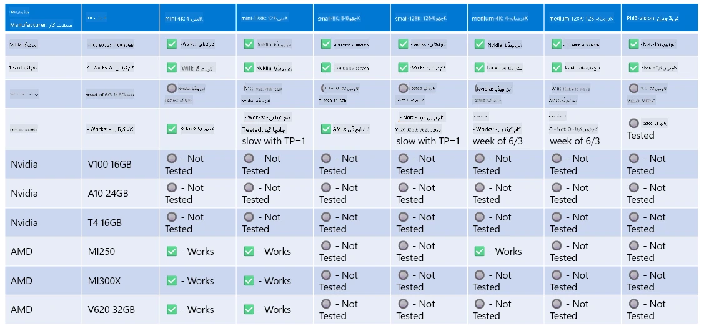

# Phi ہارڈ ویئر سپورٹ

مائیکروسافٹ فی کو ONNX رن ٹائم کے لیے بہتر بنایا گیا ہے اور یہ ونڈوز ڈائریکٹ ایم ایل کی حمایت کرتا ہے۔ یہ مختلف قسم کے ہارڈ ویئر پر اچھا کام کرتا ہے، جن میں GPU، CPU، اور یہاں تک کہ موبائل ڈیوائسز شامل ہیں۔

## ڈیوائس ہارڈ ویئر
خاص طور پر، سپورٹ شدہ ہارڈ ویئر میں شامل ہیں:

- GPU SKU: RTX 4090 (DirectML)
- GPU SKU: 1 A100 80GB (CUDA)
- CPU SKU: Standard F64s v2 (64 vCPUs، 128 GiB میموری)

## موبائل SKU

- اینڈرائیڈ - سیمسنگ گلیکسی S21
- ایپل آئی فون 14 یا اس سے اوپر A16/A17 پروسیسر

## Phi ہارڈ ویئر کی وضاحت

- کم از کم کنفیگریشن درکار ہے۔
- ونڈوز: DirectX 12 کے قابل GPU اور کم از کم 4 جی بی مشترکہ ریم

CUDA: NVIDIA GPU جس کی کمپیوٹ کیپیبیلٹی >= 7.02 ہو



## ایک سے زیادہ GPUs پر onnxruntime چلانا

اس وقت دستیاب Phi ONNX ماڈلز صرف 1 GPU کے لیے ہیں۔ Phi ماڈل کے لیے ملٹی-GPU کی حمایت ممکن ہے، لیکن ORT کے ساتھ 2 GPU ہونے کا مطلب یہ نہیں کہ یہ 2 انسٹانسز کے مقابلے میں زیادہ تھروپٹ دے گا۔ تازہ ترین اپ ڈیٹس کے لیے براہ کرم [ONNX Runtime](https://onnxruntime.ai/) دیکھیں۔

[Build 2024 the GenAI ONNX Team](https://youtu.be/WLW4SE8M9i8?si=EtG04UwDvcjunyfC) نے اعلان کیا کہ انہوں نے Phi ماڈلز کے لیے ملٹی-GPU کی بجائے ملٹی-انسٹنس کو فعال کیا ہے۔

اس وقت آپ ایک onnxruntime یا onnxruntime-genai انسٹنس کو CUDA_VISIBLE_DEVICES ماحول کی ویری ایبل کے ساتھ اس طرح چلا سکتے ہیں۔

```Python
CUDA_VISIBLE_DEVICES=0 python infer.py
CUDA_VISIBLE_DEVICES=1 python infer.py
```

مزید معلومات کے لیے آزادانہ طور پر [Microsoft Foundry](https://ai.azure.com) میں Phi کو دریافت کریں۔

---

<!-- CO-OP TRANSLATOR DISCLAIMER START -->
**اعلانِ دستبرداری**:  
یہ دستاویز AI ترجمہ سروس [Co-op Translator](https://github.com/Azure/co-op-translator) کے ذریعہ ترجمہ کی گئی ہے۔ جبکہ ہم درستگی کے لیے کوشاں ہیں، براہِ کرم نوٹ کریں کہ خودکار ترجموں میں غلطیاں یا بے ضابطگیاں ہو سکتی ہیں۔ اصل دستاویز اپنی مادری زبان میں ہی مستند ماخذ سمجی جائے۔ اہم معلومات کے لیے پیشہ ور انسانی ترجمہ تجویز کیا جاتا ہے۔ اس ترجمے کے استعمال سے پیدا ہونے والے کسی بھی غلط فہمی یا غلط ترجمانی کے لیے ہم ذمہ دار نہیں ہیں۔
<!-- CO-OP TRANSLATOR DISCLAIMER END -->