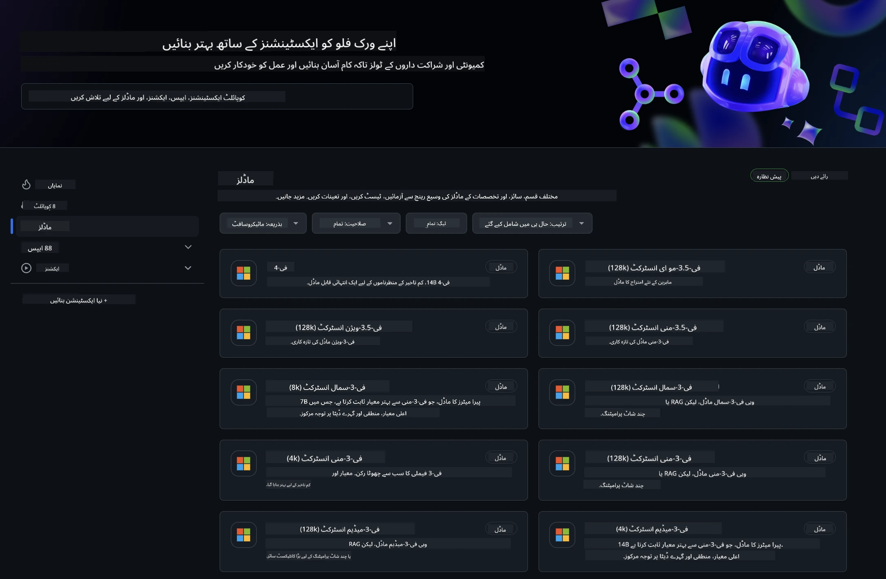
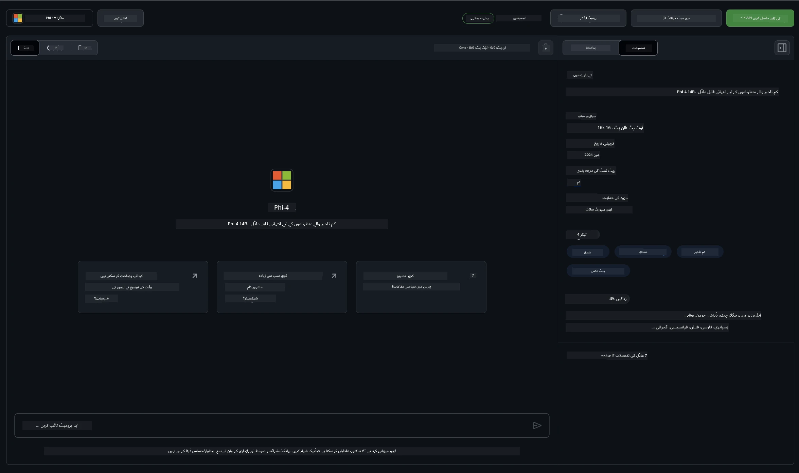
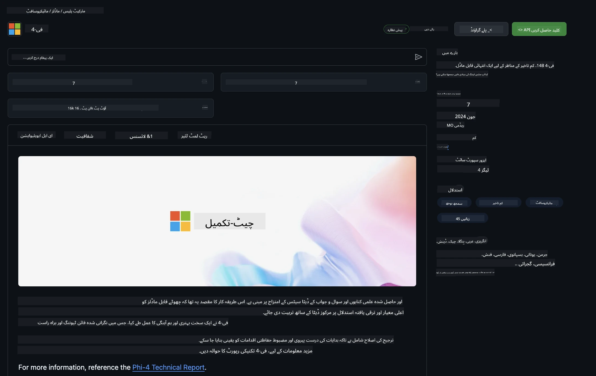

## GitHub Models میں Phi فیملی

[GitHub Models](https://github.com/marketplace/models) میں خوش آمدید! ہم نے Azure AI پر میزبانی کیے گئے AI ماڈلز کو دریافت کرنے کے لیے سب کچھ تیار کر رکھا ہے۔



GitHub Models پر دستیاب ماڈلز کے بارے میں مزید معلومات کے لیے، [GitHub Model Marketplace](https://github.com/marketplace/models) دیکھیں۔

## دستیاب ماڈلز

ہر ماڈل کے لیے ایک مخصوص پلے گراؤنڈ اور نمونہ کوڈ موجود ہے۔



### GitHub Model Catalog میں Phi فیملی

- [Phi-4](https://github.com/marketplace/models/azureml/Phi-4)

- [Phi-3.5-MoE instruct (128k)](https://github.com/marketplace/models/azureml/Phi-3-5-MoE-instruct)

- [Phi-3.5-vision instruct (128k)](https://github.com/marketplace/models/azureml/Phi-3-5-vision-instruct)

- [Phi-3.5-mini instruct (128k)](https://github.com/marketplace/models/azureml/Phi-3-5-mini-instruct)

- [Phi-3-Medium-128k-Instruct](https://github.com/marketplace/models/azureml/Phi-3-medium-128k-instruct)

- [Phi-3-medium-4k-instruct](https://github.com/marketplace/models/azureml/Phi-3-medium-4k-instruct)

- [Phi-3-mini-128k-instruct](https://github.com/marketplace/models/azureml/Phi-3-mini-128k-instruct)

- [Phi-3-mini-4k-instruct](https://github.com/marketplace/models/azureml/Phi-3-mini-4k-instruct)

- [Phi-3-small-128k-instruct](https://github.com/marketplace/models/azureml/Phi-3-small-128k-instruct)

- [Phi-3-small-8k-instruct](https://github.com/marketplace/models/azureml/Phi-3-small-8k-instruct)

## شروع کرنے کا طریقہ

چند بنیادی مثالیں آپ کے چلانے کے لیے تیار ہیں۔ آپ انہیں samples ڈائریکٹری میں پا سکتے ہیں۔ اگر آپ اپنی پسندیدہ زبان میں براہ راست جانا چاہتے ہیں، تو آپ درج ذیل زبانوں میں مثالیں دیکھ سکتے ہیں:

- Python  
- JavaScript  
- C#  
- Java  
- cURL  

نمونہ اور ماڈلز چلانے کے لیے ایک مخصوص Codespaces Environment بھی موجود ہے۔


## نمونہ کوڈ

ذیل میں چند استعمال کے کیسز کے لیے مثال کوڈ کے ٹکڑے دیے گئے ہیں۔ Azure AI Inference SDK کے بارے میں مزید معلومات کے لیے مکمل دستاویزات اور نمونے دیکھیں۔

## سیٹ اپ

1. ایک personal access token بنائیں  
آپ کو ٹوکن کے لیے کوئی اجازتیں دینے کی ضرورت نہیں ہے۔ نوٹ کریں کہ یہ ٹوکن Microsoft سروس کو بھیجا جائے گا۔

ذیل میں دیے گئے کوڈ کے ٹکڑوں کو استعمال کرنے کے لیے، اپنے ٹوکن کو کلائنٹ کوڈ کے لیے کلید کے طور پر سیٹ کرنے کے لیے ایک environment variable بنائیں۔

اگر آپ bash استعمال کر رہے ہیں:  
```
export GITHUB_TOKEN="<your-github-token-goes-here>"
```  
اگر آپ powershell میں ہیں:  

```
$Env:GITHUB_TOKEN="<your-github-token-goes-here>"
```  

اگر آپ Windows command prompt استعمال کر رہے ہیں:  

```
set GITHUB_TOKEN=<your-github-token-goes-here>
```  

## Python نمونہ

### dependencies انسٹال کریں  
Azure AI Inference SDK کو pip کے ذریعے انسٹال کریں (ضروریات: Python >=3.8):

```
pip install azure-ai-inference
```  
### ایک بنیادی کوڈ نمونہ چلائیں

یہ نمونہ chat completion API کو بنیادی طور پر کال کرنے کا طریقہ دکھاتا ہے۔ یہ GitHub AI ماڈل inference endpoint اور آپ کے GitHub ٹوکن کا استعمال کر رہا ہے۔ کال synchronous ہے۔

```python
import os
from azure.ai.inference import ChatCompletionsClient
from azure.ai.inference.models import SystemMessage, UserMessage
from azure.core.credentials import AzureKeyCredential

endpoint = "https://models.inference.ai.azure.com"
model_name = "Phi-4"
token = os.environ["GITHUB_TOKEN"]

client = ChatCompletionsClient(
    endpoint=endpoint,
    credential=AzureKeyCredential(token),
)

response = client.complete(
    messages=[
        UserMessage(content="I have $20,000 in my savings account, where I receive a 4% profit per year and payments twice a year. Can you please tell me how long it will take for me to become a millionaire? Also, can you please explain the math step by step as if you were explaining it to an uneducated person?"),
    ],
    temperature=0.4,
    top_p=1.0,
    max_tokens=2048,
    model=model_name
)

print(response.choices[0].message.content)
```

### ملٹی ٹرن گفتگو چلائیں

یہ نمونہ chat completion API کے ساتھ ملٹی ٹرن گفتگو کی مثال دیتا ہے۔ جب آپ ماڈل کو چیٹ ایپلیکیشن کے لیے استعمال کرتے ہیں، تو آپ کو اس گفتگو کی تاریخ کو منظم کرنا ہوگا اور تازہ ترین پیغامات ماڈل کو بھیجنے ہوں گے۔

```
import os
from azure.ai.inference import ChatCompletionsClient
from azure.ai.inference.models import AssistantMessage, SystemMessage, UserMessage
from azure.core.credentials import AzureKeyCredential

token = os.environ["GITHUB_TOKEN"]
endpoint = "https://models.inference.ai.azure.com"
# Replace Model_Name
model_name = "Phi-4"

client = ChatCompletionsClient(
    endpoint=endpoint,
    credential=AzureKeyCredential(token),
)

messages = [
    SystemMessage(content="You are a helpful assistant."),
    UserMessage(content="What is the capital of France?"),
    AssistantMessage(content="The capital of France is Paris."),
    UserMessage(content="What about Spain?"),
]

response = client.complete(messages=messages, model=model_name)

print(response.choices[0].message.content)
```

### آؤٹ پٹ کو stream کریں

بہتر صارف تجربے کے لیے، آپ ماڈل کے جواب کو stream کرنا چاہیں گے تاکہ پہلا ٹوکن جلدی ظاہر ہو اور آپ طویل جوابات کے انتظار سے بچ سکیں۔

```
import os
from azure.ai.inference import ChatCompletionsClient
from azure.ai.inference.models import SystemMessage, UserMessage
from azure.core.credentials import AzureKeyCredential

token = os.environ["GITHUB_TOKEN"]
endpoint = "https://models.inference.ai.azure.com"
# Replace Model_Name
model_name = "Phi-4"

client = ChatCompletionsClient(
    endpoint=endpoint,
    credential=AzureKeyCredential(token),
)

response = client.complete(
    stream=True,
    messages=[
        SystemMessage(content="You are a helpful assistant."),
        UserMessage(content="Give me 5 good reasons why I should exercise every day."),
    ],
    model=model_name,
)

for update in response:
    if update.choices:
        print(update.choices[0].delta.content or "", end="")

client.close()
```

## GitHub Models کے لیے مفت استعمال اور ریٹ لمٹس



[playground اور مفت API استعمال کے لیے rate limits](https://docs.github.com/en/github-models/prototyping-with-ai-models#rate-limits) آپ کو ماڈلز کے ساتھ تجربہ کرنے اور اپنی AI ایپلیکیشن کا پروٹوٹائپ بنانے میں مدد دینے کے لیے ہیں۔ ان حدود سے آگے استعمال کے لیے، اور اپنی ایپلیکیشن کو اسکیل کرنے کے لیے، آپ کو Azure اکاؤنٹ سے وسائل فراہم کرنے ہوں گے، اور وہاں سے authentication کرنا ہوگا بجائے اپنے GitHub personal access token کے۔ آپ کو اپنے کوڈ میں کچھ اور تبدیل کرنے کی ضرورت نہیں۔ Azure AI میں مفت سطح کی حدود سے آگے جانے کے طریقے جاننے کے لیے اس لنک کا استعمال کریں۔

### انکشافات

یاد رکھیں کہ جب آپ ماڈل کے ساتھ تعامل کر رہے ہوتے ہیں تو آپ AI کے ساتھ تجربہ کر رہے ہوتے ہیں، اس لیے مواد میں غلطیاں ممکن ہیں۔

یہ فیچر مختلف حدود (جیسے کہ فی منٹ درخواستیں، فی دن درخواستیں، فی درخواست ٹوکنز، اور متوازی درخواستیں) کے تابع ہے اور پروڈکشن استعمال کے لیے نہیں بنایا گیا۔

GitHub Models Azure AI Content Safety استعمال کرتا ہے۔ یہ فلٹرز GitHub Models کے تجربے کے حصے کے طور پر بند نہیں کیے جا سکتے۔ اگر آپ ماڈلز کو کسی ادائیگی شدہ سروس کے ذریعے استعمال کرنے کا فیصلہ کرتے ہیں، تو براہ کرم اپنے مواد کے فلٹرز کو اپنی ضروریات کے مطابق ترتیب دیں۔

یہ سروس GitHub کے Pre-release Terms کے تحت ہے۔

**دستخطی نوٹ**:  
یہ دستاویز AI ترجمہ سروس [Co-op Translator](https://github.com/Azure/co-op-translator) کے ذریعے ترجمہ کی گئی ہے۔ اگرچہ ہم درستگی کے لیے کوشاں ہیں، براہ کرم آگاہ رہیں کہ خودکار ترجمے میں غلطیاں یا عدم درستیاں ہو سکتی ہیں۔ اصل دستاویز اپنی مادری زبان میں ہی معتبر ماخذ سمجھی جانی چاہیے۔ اہم معلومات کے لیے پیشہ ور انسانی ترجمہ کی سفارش کی جاتی ہے۔ اس ترجمے کے استعمال سے پیدا ہونے والی کسی بھی غلط فہمی یا غلط تشریح کی ذمہ داری ہم پر عائد نہیں ہوتی۔