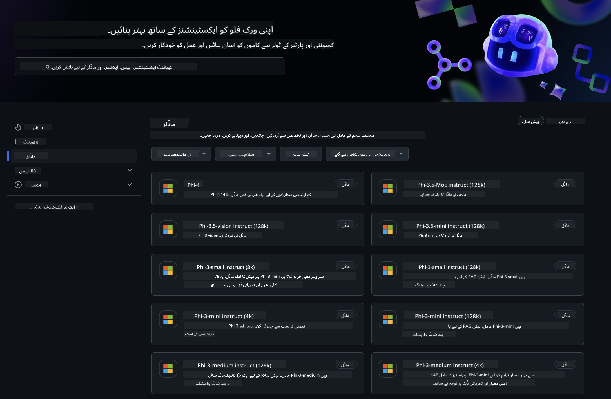
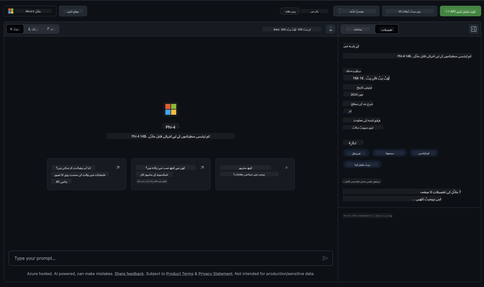
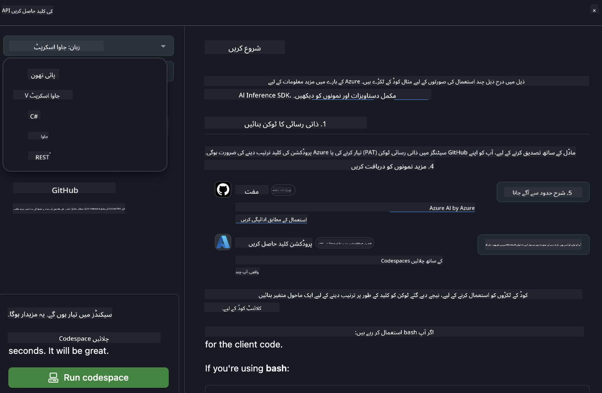

<!--
CO_OP_TRANSLATOR_METADATA:
{
  "original_hash": "fa5cdbc832e5bcffebb25ce25ec1a3c3",
  "translation_date": "2025-04-03T06:41:36+00:00",
  "source_file": "md\\01.Introduction\\02\\02.GitHubModel.md",
  "language_code": "ur"
}
-->
## گِٹ ہب ماڈلز میں فائی فیملی

[گِٹ ہب ماڈلز](https://github.com/marketplace/models) میں خوش آمدید! ہم نے سب کچھ تیار کر رکھا ہے تاکہ آپ Azure AI پر ہوسٹ کیے گئے AI ماڈلز کو دریافت کر سکیں۔



گِٹ ہب ماڈلز پر دستیاب ماڈلز کے بارے میں مزید معلومات کے لیے، [گِٹ ہب ماڈل مارکیٹ پلیس](https://github.com/marketplace/models) کو چیک کریں۔

## دستیاب ماڈلز

ہر ماڈل کے لیے ایک مخصوص پلے گراؤنڈ اور نمونہ کوڈ موجود ہے۔



### گِٹ ہب ماڈل کیٹلاگ میں فائی فیملی

- [Phi-4](https://github.com/marketplace/models/azureml/Phi-4)

- [Phi-3.5-MoE instruct (128k)](https://github.com/marketplace/models/azureml/Phi-3-5-MoE-instruct)

- [Phi-3.5-vision instruct (128k)](https://github.com/marketplace/models/azureml/Phi-3-5-vision-instruct)

- [Phi-3.5-mini instruct (128k)](https://github.com/marketplace/models/azureml/Phi-3-5-mini-instruct)

- [Phi-3-Medium-128k-Instruct](https://github.com/marketplace/models/azureml/Phi-3-medium-128k-instruct)

- [Phi-3-medium-4k-instruct](https://github.com/marketplace/models/azureml/Phi-3-medium-4k-instruct)

- [Phi-3-mini-128k-instruct](https://github.com/marketplace/models/azureml/Phi-3-mini-128k-instruct)

- [Phi-3-mini-4k-instruct](https://github.com/marketplace/models/azureml/Phi-3-mini-4k-instruct)

- [Phi-3-small-128k-instruct](https://github.com/marketplace/models/azureml/Phi-3-small-128k-instruct)

- [Phi-3-small-8k-instruct](https://github.com/marketplace/models/azureml/Phi-3-small-8k-instruct)

## شروعات کریں

کچھ بنیادی مثالیں تیار ہیں جنہیں آپ فوری طور پر چلا سکتے ہیں۔ آپ انہیں نمونہ ڈائریکٹری میں تلاش کر سکتے ہیں۔ اگر آپ اپنی پسندیدہ زبان پر جانا چاہتے ہیں تو درج ذیل زبانوں میں مثالیں دستیاب ہیں:

- Python  
- JavaScript  
- C#  
- Java  
- cURL  

نمونوں اور ماڈلز کو چلانے کے لیے ایک مخصوص Codespaces ماحول بھی موجود ہے۔



## نمونہ کوڈ

نیچے کچھ استعمال کے معاملات کے لیے مثال کوڈ دیا گیا ہے۔ Azure AI Inference SDK کے بارے میں مزید معلومات کے لیے مکمل دستاویزات اور نمونوں کو دیکھیں۔

## سیٹ اپ

1. ایک پرسنل ایکسیس ٹوکن بنائیں  
آپ کو ٹوکن کو کسی بھی اجازت دینے کی ضرورت نہیں ہے۔ یاد رکھیں کہ یہ ٹوکن Microsoft سروس کو بھیجا جائے گا۔

نیچے دیے گئے کوڈ نمونوں کو استعمال کرنے کے لیے، ایک ماحول متغیر بنائیں تاکہ آپ کا ٹوکن کلائنٹ کوڈ کے لیے کلید کے طور پر سیٹ ہو۔

اگر آپ bash استعمال کر رہے ہیں:  
```
export GITHUB_TOKEN="<your-github-token-goes-here>"
```  
اگر آپ powershell میں ہیں:  

```
$Env:GITHUB_TOKEN="<your-github-token-goes-here>"
```  

اگر آپ Windows command prompt استعمال کر رہے ہیں:  

```
set GITHUB_TOKEN=<your-github-token-goes-here>
```  

## Python نمونہ

### انحصارات انسٹال کریں  
pip کے ذریعے Azure AI Inference SDK انسٹال کریں (ضرورت: Python >=3.8):  

```
pip install azure-ai-inference
```  

### ایک بنیادی کوڈ نمونہ چلائیں  

یہ نمونہ chat completion API کو کال کرنے کا ایک بنیادی مظاہرہ پیش کرتا ہے۔ یہ GitHub AI ماڈل انفرنس اینڈ پوائنٹ اور آپ کے GitHub ٹوکن کو استعمال کر رہا ہے۔ یہ کال سنکرونس ہے۔

```python
import os
from azure.ai.inference import ChatCompletionsClient
from azure.ai.inference.models import SystemMessage, UserMessage
from azure.core.credentials import AzureKeyCredential

endpoint = "https://models.inference.ai.azure.com"
model_name = "Phi-4"
token = os.environ["GITHUB_TOKEN"]

client = ChatCompletionsClient(
    endpoint=endpoint,
    credential=AzureKeyCredential(token),
)

response = client.complete(
    messages=[
        UserMessage(content="I have $20,000 in my savings account, where I receive a 4% profit per year and payments twice a year. Can you please tell me how long it will take for me to become a millionaire? Also, can you please explain the math step by step as if you were explaining it to an uneducated person?"),
    ],
    temperature=0.4,
    top_p=1.0,
    max_tokens=2048,
    model=model_name
)

print(response.choices[0].message.content)
```  

### ایک ملٹی ٹرن گفتگو چلائیں  

یہ نمونہ chat completion API کے ساتھ ایک ملٹی ٹرن گفتگو کا مظاہرہ پیش کرتا ہے۔ جب آپ ماڈل کو کسی چیٹ ایپلیکیشن کے لیے استعمال کرتے ہیں، تو آپ کو اس گفتگو کی تاریخ کو منظم کرنا ہوگا اور ماڈل کو تازہ ترین پیغامات بھیجنے ہوں گے۔

```
import os
from azure.ai.inference import ChatCompletionsClient
from azure.ai.inference.models import AssistantMessage, SystemMessage, UserMessage
from azure.core.credentials import AzureKeyCredential

token = os.environ["GITHUB_TOKEN"]
endpoint = "https://models.inference.ai.azure.com"
# Replace Model_Name
model_name = "Phi-4"

client = ChatCompletionsClient(
    endpoint=endpoint,
    credential=AzureKeyCredential(token),
)

messages = [
    SystemMessage(content="You are a helpful assistant."),
    UserMessage(content="What is the capital of France?"),
    AssistantMessage(content="The capital of France is Paris."),
    UserMessage(content="What about Spain?"),
]

response = client.complete(messages=messages, model=model_name)

print(response.choices[0].message.content)
```  

### آؤٹ پٹ کو اسٹریم کریں  

بہتر صارف تجربے کے لیے، آپ ماڈل کے ردعمل کو اسٹریم کرنا چاہیں گے تاکہ پہلا ٹوکن جلدی ظاہر ہو اور آپ کو لمبے ردعمل کے لیے انتظار نہ کرنا پڑے۔

```
import os
from azure.ai.inference import ChatCompletionsClient
from azure.ai.inference.models import SystemMessage, UserMessage
from azure.core.credentials import AzureKeyCredential

token = os.environ["GITHUB_TOKEN"]
endpoint = "https://models.inference.ai.azure.com"
# Replace Model_Name
model_name = "Phi-4"

client = ChatCompletionsClient(
    endpoint=endpoint,
    credential=AzureKeyCredential(token),
)

response = client.complete(
    stream=True,
    messages=[
        SystemMessage(content="You are a helpful assistant."),
        UserMessage(content="Give me 5 good reasons why I should exercise every day."),
    ],
    model=model_name,
)

for update in response:
    if update.choices:
        print(update.choices[0].delta.content or "", end="")

client.close()
```  

## گِٹ ہب ماڈلز کے لیے مفت استعمال اور ریٹ کی حدیں  


[پلے گراؤنڈ اور مفت API استعمال کی ریٹ کی حدیں](https://docs.github.com/en/github-models/prototyping-with-ai-models#rate-limits) آپ کو ماڈلز کے ساتھ تجربہ کرنے اور اپنی AI ایپلیکیشن کی پروٹوٹائپنگ میں مدد کے لیے بنائی گئی ہیں۔ ان حدود سے آگے کے استعمال کے لیے، اور اپنی ایپلیکیشن کو بڑے پیمانے پر لانے کے لیے، آپ کو Azure اکاؤنٹ سے وسائل کی فراہمی کرنی ہوگی اور وہاں سے تصدیق کرنی ہوگی بجائے کہ اپنے گِٹ ہب پرسنل ایکسیس ٹوکن کے۔ آپ کو اپنے کوڈ میں کچھ اور تبدیل کرنے کی ضرورت نہیں ہوگی۔ Azure AI میں مفت حدوں سے آگے جانے کے بارے میں جاننے کے لیے اس لنک کا استعمال کریں۔

### انکشافات  

یاد رکھیں، جب آپ کسی ماڈل کے ساتھ تعامل کر رہے ہیں تو آپ AI کے ساتھ تجربہ کر رہے ہیں، لہذا مواد میں غلطیاں ممکن ہیں۔

یہ فیچر مختلف حدود (جیسے فی منٹ درخواستیں، فی دن درخواستیں، فی درخواست ٹوکن، اور بیک وقت درخواستیں) کے تابع ہے اور پروڈکشن استعمال کے معاملات کے لیے ڈیزائن نہیں کیا گیا۔

گِٹ ہب ماڈلز Azure AI Content Safety استعمال کرتے ہیں۔ ان فلٹرز کو گِٹ ہب ماڈلز کے تجربے کے حصے کے طور پر بند نہیں کیا جا سکتا۔ اگر آپ ماڈلز کو کسی ادائیگی شدہ سروس کے ذریعے استعمال کرنے کا فیصلہ کرتے ہیں، تو براہ کرم اپنے مواد کے فلٹرز کو اپنی ضروریات کے مطابق ترتیب دیں۔

یہ سروس گِٹ ہب کی پری ریلیز شرائط کے تحت ہے۔  

**ڈسکلیمر**:  
یہ دستاویز AI ترجمہ سروس [Co-op Translator](https://github.com/Azure/co-op-translator) کا استعمال کرتے ہوئے ترجمہ کی گئی ہے۔ ہم درستگی کے لیے پوری کوشش کرتے ہیں، لیکن براہ کرم یہ بات ذہن میں رکھیں کہ خودکار ترجمے میں غلطیاں یا خامیاں ہوسکتی ہیں۔ اصل دستاویز کو اس کی اصل زبان میں مستند ذریعہ سمجھا جانا چاہیے۔ اہم معلومات کے لیے، پیشہ ور انسانی ترجمے کی سفارش کی جاتی ہے۔ ہم اس ترجمے کے استعمال سے پیدا ہونے والی کسی بھی غلط فہمی یا غلط تشریح کے ذمہ دار نہیں ہیں۔