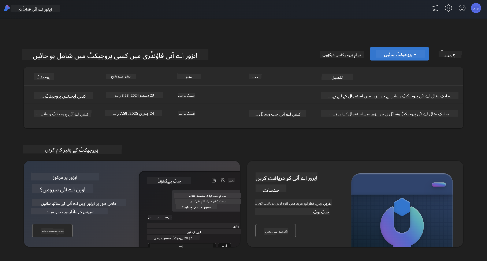
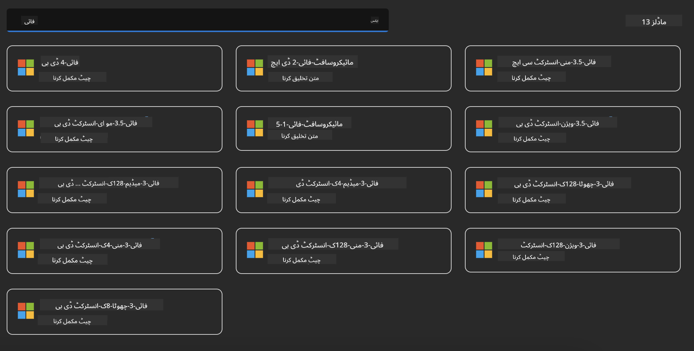
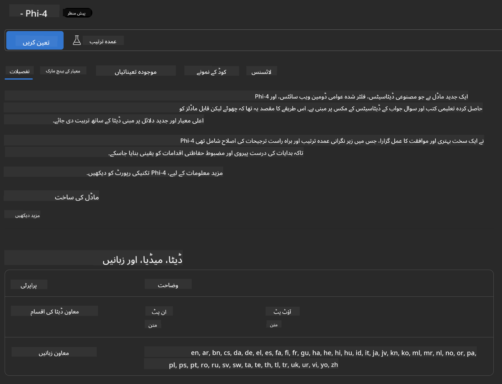

<!--
CO_OP_TRANSLATOR_METADATA:
{
  "original_hash": "70dc9bd6453f70f1a5f6833fe6e24bd0",
  "translation_date": "2025-04-03T06:42:36+00:00",
  "source_file": "md\\01.Introduction\\02\\03.AzureAIFoundry.md",
  "language_code": "ur"
}
-->
## فی فیملی ایزور اے آئی فاؤنڈری میں

[Azure AI Foundry](https://ai.azure.com) ایک قابل اعتماد پلیٹ فارم ہے جو ڈیولپرز کو محفوظ، محفوظ اور ذمہ دار طریقے سے اے آئی کے ذریعے جدت اور مستقبل کی تشکیل کے قابل بناتا ہے۔

[Azure AI Foundry](https://ai.azure.com) ڈیولپرز کے لیے بنایا گیا ہے تاکہ وہ:

- انٹرپرائز گریڈ پلیٹ فارم پر جنریٹو اے آئی ایپلیکیشنز بنا سکیں۔
- جدید اے آئی ٹولز اور مشین لرننگ ماڈلز کے ساتھ دریافت کریں، بنائیں، ٹیسٹ کریں اور تعینات کریں، جو ذمہ دار اے آئی اصولوں پر مبنی ہوں۔
- ایپلیکیشن ڈیولپمنٹ کے مکمل لائف سائیکل کے لیے ٹیم کے ساتھ تعاون کریں۔

ایزور اے آئی فاؤنڈری کے ذریعے، آپ مختلف ماڈلز، سروسز اور صلاحیتوں کو دریافت کر سکتے ہیں اور ایسی اے آئی ایپلیکیشنز بنا سکتے ہیں جو آپ کے مقاصد کے لیے بہترین ہوں۔ ایزور اے آئی فاؤنڈری پلیٹ فارم پروف آف کانسیپٹ کو مکمل پروڈکشن ایپلیکیشنز میں تبدیل کرنے کے لیے آسانی سے اسکیل ایبلٹی فراہم کرتا ہے۔ مسلسل نگرانی اور اصلاح طویل مدتی کامیابی کو سپورٹ کرتے ہیں۔



ایزور اے آئی فاؤنڈری میں ایزور AOAI سروس کے استعمال کے علاوہ، آپ ایزور اے آئی فاؤنڈری ماڈل کیٹلاگ میں تھرڈ پارٹی ماڈلز بھی استعمال کر سکتے ہیں۔ یہ ایک اچھا انتخاب ہے اگر آپ ایزور اے آئی فاؤنڈری کو اپنی اے آئی سلوشن پلیٹ فارم کے طور پر استعمال کرنا چاہتے ہیں۔

ہم ایزور اے آئی فاؤنڈری ماڈل کیٹلاگ کے ذریعے فی فیملی ماڈلز کو جلدی سے تعینات کر سکتے ہیں۔



### **ایزور اے آئی فاؤنڈری میں Phi-4 کو تعینات کریں**



### **ایزور اے آئی فاؤنڈری پلے گراؤنڈ میں Phi-4 کو ٹیسٹ کریں**


### **ایزور اے آئی فاؤنڈری Phi-4 کو کال کرنے کے لیے پائتھون کوڈ چلانا**

```python

import os  
import base64
from openai import AzureOpenAI  
from azure.identity import DefaultAzureCredential, get_bearer_token_provider  
        
endpoint = os.getenv("ENDPOINT_URL", "Your Azure AOAI Service Endpoint")  
deployment = os.getenv("DEPLOYMENT_NAME", "Phi-4")  
      
token_provider = get_bearer_token_provider(  
    DefaultAzureCredential(),  
    "https://cognitiveservices.azure.com/.default"  
)  
  
client = AzureOpenAI(  
    azure_endpoint=endpoint,  
    azure_ad_token_provider=token_provider,  
    api_version="2024-05-01-preview",  
)  
  

chat_prompt = [
    {
        "role": "system",
        "content": "You are an AI assistant that helps people find information."
    },
    {
        "role": "user",
        "content": "can you introduce yourself"
    }
] 
    
# Include speech result if speech is enabled  
messages = chat_prompt 

completion = client.chat.completions.create(  
    model=deployment,  
    messages=messages,
    max_tokens=800,  
    temperature=0.7,  
    top_p=0.95,  
    frequency_penalty=0,  
    presence_penalty=0,
    stop=None,  
    stream=False  
)  
  
print(completion.to_json())  

```

**ڈسکلئمر**:  
یہ دستاویز AI ترجمہ سروس [Co-op Translator](https://github.com/Azure/co-op-translator) کا استعمال کرتے ہوئے ترجمہ کی گئی ہے۔ ہم درستگی کے لیے کوشش کرتے ہیں، لیکن براہ کرم آگاہ رہیں کہ خودکار ترجمے میں غلطیاں یا غیر درستیاں ہو سکتی ہیں۔ اصل دستاویز کو اس کی اصل زبان میں معتبر ذریعہ سمجھا جانا چاہیے۔ اہم معلومات کے لیے، پیشہ ور انسانی ترجمہ کی سفارش کی جاتی ہے۔ ہم اس ترجمے کے استعمال سے پیدا ہونے والے کسی بھی غلط فہمی یا غلط تشریح کے لیے ذمہ دار نہیں ہیں۔