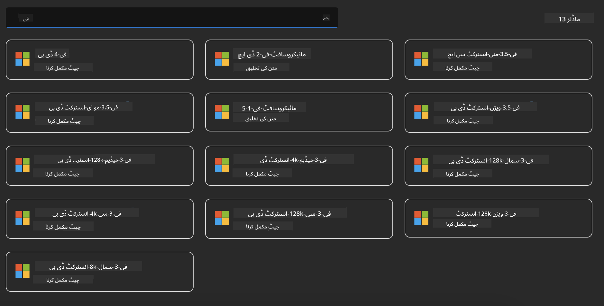

<!--
CO_OP_TRANSLATOR_METADATA:
{
  "original_hash": "3ae21dc5554e888defbe57946ee995ee",
  "translation_date": "2025-07-16T19:07:07+00:00",
  "source_file": "md/01.Introduction/02/03.AzureAIFoundry.md",
  "language_code": "ur"
}
-->
## Azure AI Foundry میں Phi فیملی

[Azure AI Foundry](https://ai.azure.com) ایک معتبر پلیٹ فارم ہے جو ڈویلپرز کو محفوظ، محفوظ اور ذمہ دار طریقے سے AI کے ذریعے جدت لانے اور مستقبل کی تشکیل دینے کا موقع فراہم کرتا ہے۔

[Azure AI Foundry](https://ai.azure.com) ڈویلپرز کے لیے ڈیزائن کیا گیا ہے تاکہ وہ:

- انٹرپرائز گریڈ پلیٹ فارم پر جنریٹو AI ایپلیکیشنز بنا سکیں۔
- جدید AI ٹولز اور ML ماڈلز کا استعمال کرتے ہوئے دریافت کریں، بنائیں، ٹیسٹ کریں، اور تعینات کریں، جو ذمہ دار AI طریقوں پر مبنی ہوں۔
- ایپلیکیشن کی مکمل ترقی کے عمل کے لیے ٹیم کے ساتھ تعاون کریں۔

Azure AI Foundry کے ساتھ، آپ مختلف قسم کے ماڈلز، سروسز اور صلاحیتوں کو دریافت کر سکتے ہیں، اور AI ایپلیکیشنز بنا سکتے ہیں جو آپ کے مقاصد کی بہترین خدمت کریں۔ Azure AI Foundry پلیٹ فارم اس بات کو آسان بناتا ہے کہ پروف آف کانسیپٹس کو مکمل پیداواری ایپلیکیشنز میں تبدیل کیا جا سکے۔ مسلسل نگرانی اور بہتری طویل مدتی کامیابی کی حمایت کرتی ہے۔


Azure AI Foundry میں Azure AOAI سروس کے استعمال کے علاوہ، آپ Azure AI Foundry ماڈل کیٹلاگ میں تھرڈ پارٹی ماڈلز بھی استعمال کر سکتے ہیں۔ اگر آپ Azure AI Foundry کو اپنے AI حل کے پلیٹ فارم کے طور پر استعمال کرنا چاہتے ہیں تو یہ ایک اچھا انتخاب ہے۔

ہم Azure AI Foundry میں ماڈل کیٹلاگ کے ذریعے Phi فیملی ماڈلز کو تیزی سے تعینات کر سکتے ہیں۔

[Microsoft Phi Models in Azure AI Foundry Models](https://ai.azure.com/explore/models/?selectedCollection=phi)



### **Azure AI Foundry میں Phi-4 کی تعیناتی**


### **Azure AI Foundry Playground میں Phi-4 کا ٹیسٹ**


### **Azure AI Foundry Phi-4 کو کال کرنے کے لیے Python کوڈ چلانا**

```python

import os  
import base64
from openai import AzureOpenAI  
from azure.identity import DefaultAzureCredential, get_bearer_token_provider  
        
endpoint = os.getenv("ENDPOINT_URL", "Your Azure AOAI Service Endpoint")  
deployment = os.getenv("DEPLOYMENT_NAME", "Phi-4")  
      
token_provider = get_bearer_token_provider(  
    DefaultAzureCredential(),  
    "https://cognitiveservices.azure.com/.default"  
)  
  
client = AzureOpenAI(  
    azure_endpoint=endpoint,  
    azure_ad_token_provider=token_provider,  
    api_version="2024-05-01-preview",  
)  
  

chat_prompt = [
    {
        "role": "system",
        "content": "You are an AI assistant that helps people find information."
    },
    {
        "role": "user",
        "content": "can you introduce yourself"
    }
] 
    
# Include speech result if speech is enabled  
messages = chat_prompt 

completion = client.chat.completions.create(  
    model=deployment,  
    messages=messages,
    max_tokens=800,  
    temperature=0.7,  
    top_p=0.95,  
    frequency_penalty=0,  
    presence_penalty=0,
    stop=None,  
    stream=False  
)  
  
print(completion.to_json())  

```

**دستخطی نوٹ**:  
یہ دستاویز AI ترجمہ سروس [Co-op Translator](https://github.com/Azure/co-op-translator) کے ذریعے ترجمہ کی گئی ہے۔ اگرچہ ہم درستگی کے لیے کوشاں ہیں، براہ کرم اس بات سے آگاہ رہیں کہ خودکار ترجمے میں غلطیاں یا عدم درستیاں ہو سکتی ہیں۔ اصل دستاویز اپنی مادری زبان میں ہی معتبر ماخذ سمجھی جانی چاہیے۔ اہم معلومات کے لیے پیشہ ور انسانی ترجمہ کی سفارش کی جاتی ہے۔ اس ترجمے کے استعمال سے پیدا ہونے والی کسی بھی غلط فہمی یا غلط تشریح کی ذمہ داری ہم پر عائد نہیں ہوتی۔