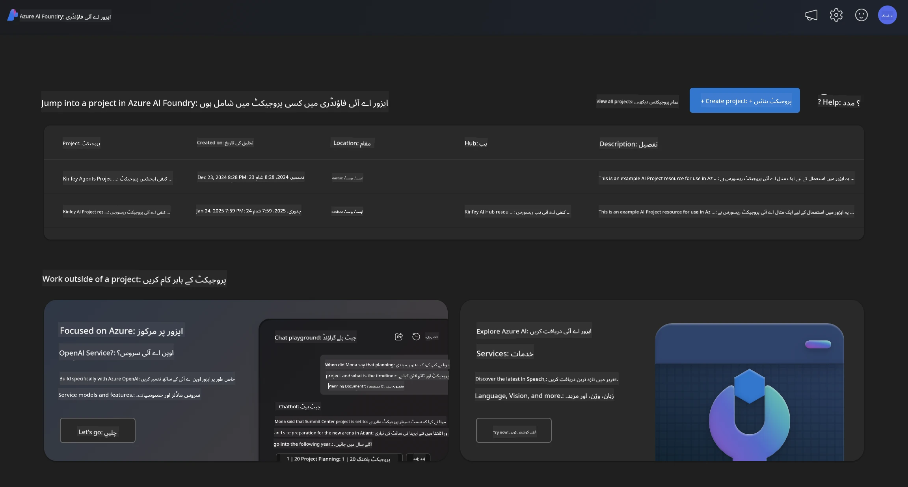
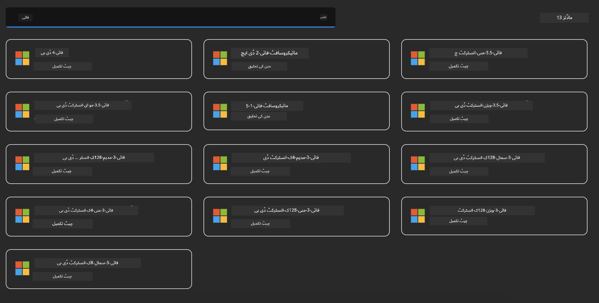
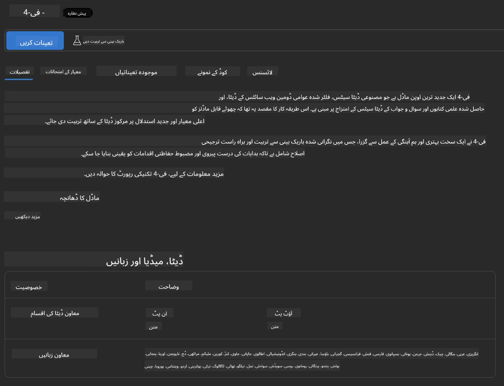
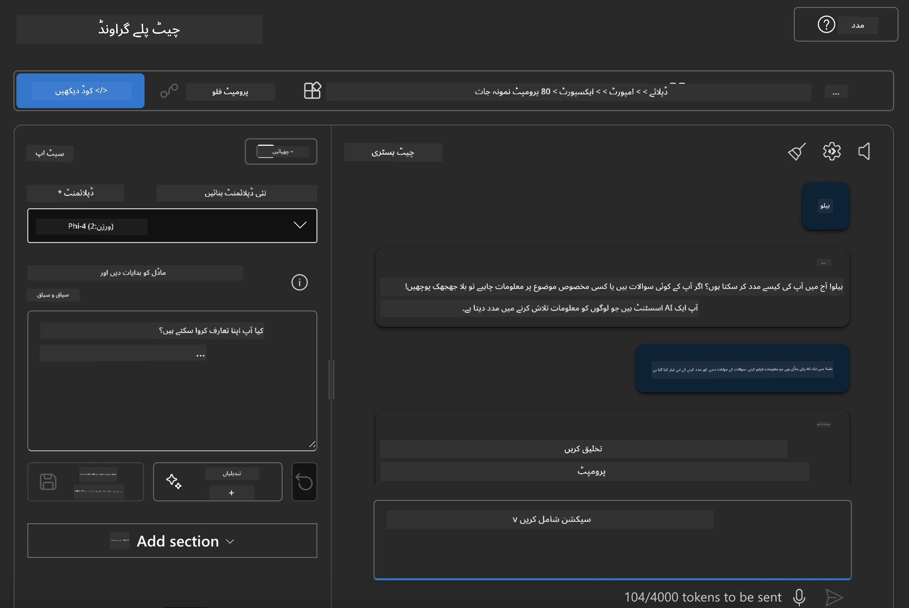

## مائیکروسافٹ فاؤنڈری میں فی فیملی

[Microsoft Foundry](https://ai.azure.com) ایک معتبر پلیٹ فارم ہے جو ڈویلپرز کو محفوظ، محفوظ، اور ذمہ دار طریقے سے AI کے ذریعے جدت پیدا کرنے اور مستقبل کی تشکیل دینے کے قابل بناتا ہے۔

[Microsoft Foundry](https://ai.azure.com) ڈویلپرز کے لیے ڈیزائن کیا گیا ہے تاکہ:

- کاروباری معیار کے پلیٹ فارم پر جنریٹو AI ایپلیکیشنز تیار کی جا سکیں۔
- جدید AI ٹولز اور ML ماڈلز کا استعمال کرتے ہوئے تلاش، تعمیر، ٹیسٹ، اور تعیناتی کریں، جو ذمہ دار AI طریقوں پر مبنی ہوں۔
- ایپلیکیشن کی مکمل ترقی کے دوران ٹیم کے ساتھ تعاون کریں۔

مائیکروسافٹ فاؤنڈری کے ساتھ، آپ ماڈلز، خدمات، اور صلاحیتوں کی وسیع اقسام کو تلاش کر سکتے ہیں، اور AI ایپلیکیشنز بنانے کی جانب بڑھ سکتے ہیں جو آپ کے مقاصد کی بہترین خدمت کرتی ہیں۔ مائیکروسافٹ فاؤنڈری پلیٹ فارم ثبوت کے تصورات کو مکمل پیداواری ایپلیکیشنز میں آسانی سے تبدیل کرنے کے لیے اسکیل ایبلٹی کو سہولت فراہم کرتا ہے۔ مسلسل نگرانی اور بہتری طویل مدتی کامیابی کی حمایت کرتی ہے۔



مائیکروسافٹ فاؤنڈری میں Azure AOAI سروس کے استعمال کے علاوہ، آپ مائیکروسافٹ فاؤنڈری ماڈل کیٹلاگ میں تھرڈ پارٹی ماڈلز بھی استعمال کر سکتے ہیں۔ اگر آپ مائیکروسافٹ فاؤنڈری کو اپنا AI حل پلیٹ فارم بنانا چاہتے ہیں تو یہ ایک اچھا انتخاب ہے۔

ہم مائیکروسافٹ فاؤنڈری میں ماڈل کیٹلاگ کے ذریعے فی فیملی کے ماڈلز کو جلدی سے تعینات کر سکتے ہیں۔

[Microsoft Phi Models in Microsoft Foundry Models](https://ai.azure.com/explore/models/?selectedCollection=phi)



### **مائیکروسافٹ فاؤنڈری میں Phi-4 تعینات کریں**



### **مائیکروسافٹ فاؤنڈری پلے گراؤنڈ میں Phi-4 ٹیسٹ کریں**



### **مائیکروسافٹ فاؤنڈری Phi-4 کو کال کرنے کے لیے پائتھون کوڈ چلانا**

```python

import os  
import base64
from openai import AzureOpenAI  
from azure.identity import DefaultAzureCredential, get_bearer_token_provider  
        
endpoint = os.getenv("ENDPOINT_URL", "Your Azure AOAI Service Endpoint")  
deployment = os.getenv("DEPLOYMENT_NAME", "Phi-4")  
      
token_provider = get_bearer_token_provider(  
    DefaultAzureCredential(),  
    "https://cognitiveservices.azure.com/.default"  
)  
  
client = AzureOpenAI(  
    azure_endpoint=endpoint,  
    azure_ad_token_provider=token_provider,  
    api_version="2024-05-01-preview",  
)  
  

chat_prompt = [
    {
        "role": "system",
        "content": "You are an AI assistant that helps people find information."
    },
    {
        "role": "user",
        "content": "can you introduce yourself"
    }
] 
    
# اگر تقریر فعال ہو تو تقریر کا نتیجہ شامل کریں
messages = chat_prompt 

completion = client.chat.completions.create(  
    model=deployment,  
    messages=messages,
    max_tokens=800,  
    temperature=0.7,  
    top_p=0.95,  
    frequency_penalty=0,  
    presence_penalty=0,
    stop=None,  
    stream=False  
)  
  
print(completion.to_json())  

```

---

<!-- CO-OP TRANSLATOR DISCLAIMER START -->
**دستخطی نوٹ**:
اس دستاویز کا ترجمہ AI ترجمہ خدمات [Co-op Translator](https://github.com/Azure/co-op-translator) کے ذریعے کیا گیا ہے۔ جبکہ ہم درستگی کے لیے کوشاں ہیں، براہ کرم نوٹ کریں کہ خودکار ترجموں میں غلطیاں یا بے ضابطگیاں ہو سکتی ہیں۔ اصل دستاویز اپنی مادری زبان میں معتبر ماخذ سمجھی جانی چاہیے۔ اہم معلومات کے لیے پیشہ ور انسانی ترجمہ کرنے کی سفارش کی جاتی ہے۔ ہم اس ترجمے کے استعمال سے کسی بھی غلط فہمی یا غلط تعبیر کی ذمہ داری قبول نہیں کرتے۔
<!-- CO-OP TRANSLATOR DISCLAIMER END -->