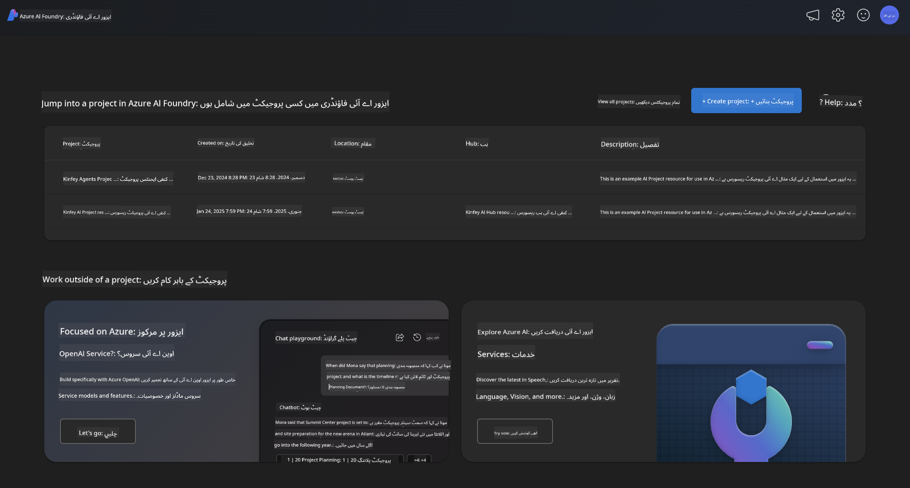
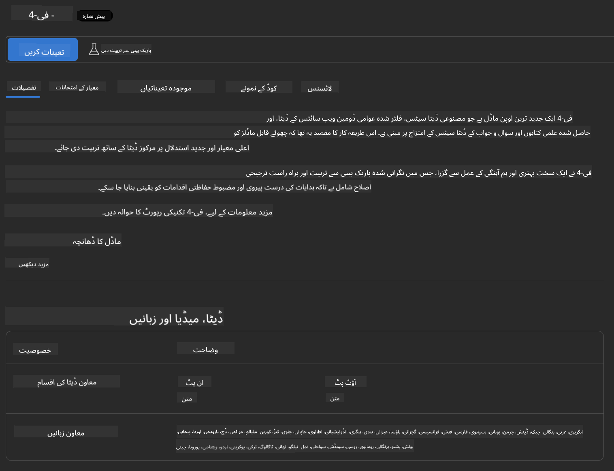

<!--
CO_OP_TRANSLATOR_METADATA:
{
  "original_hash": "3ae21dc5554e888defbe57946ee995ee",
  "translation_date": "2025-05-07T15:07:07+00:00",
  "source_file": "md/01.Introduction/02/03.AzureAIFoundry.md",
  "language_code": "ur"
}
-->
## عیلوہ AI Foundry میں Phi فیملی

[Azure AI Foundry](https://ai.azure.com) ایک معتبر پلیٹ فارم ہے جو ڈویلپرز کو محفوظ، محفوظ اور ذمہ دار طریقے سے AI کے ساتھ جدت طرازی کرنے اور مستقبل کو شکل دینے کا موقع دیتا ہے۔

[Azure AI Foundry](https://ai.azure.com) ڈویلپرز کے لیے ڈیزائن کیا گیا ہے تاکہ:

- انٹرپرائز گریڈ پلیٹ فارم پر جنریٹو AI ایپلیکیشنز بنائیں۔
- جدید AI ٹولز اور ML ماڈلز کے ذریعے دریافت کریں، بنائیں، ٹیسٹ کریں اور تعینات کریں، جو ذمہ دار AI طریقوں پر مبنی ہیں۔
- ایپلیکیشن کی ترقی کے پورے لائف سائیکل کے لیے ٹیم کے ساتھ تعاون کریں۔

Azure AI Foundry کے ساتھ، آپ مختلف ماڈلز، سروسز اور صلاحیتوں کو دریافت کر سکتے ہیں، اور ایسی AI ایپلیکیشنز بنا سکتے ہیں جو آپ کے مقاصد کی بہترین خدمت کریں۔ Azure AI Foundry پلیٹ فارم تصدیق شدہ تصورات کو آسانی سے مکمل پروڈکشن ایپلیکیشنز میں تبدیل کرنے کے لیے اسکیل ایبلٹی فراہم کرتا ہے۔ مسلسل نگرانی اور بہتری طویل مدتی کامیابی کی حمایت کرتی ہے۔



Azure AOAI سروس کے استعمال کے علاوہ، آپ Azure AI Foundry ماڈل کیٹلاگ میں تھرڈ پارٹی ماڈلز بھی استعمال کر سکتے ہیں۔ یہ ایک اچھا انتخاب ہے اگر آپ Azure AI Foundry کو اپنے AI حل کے پلیٹ فارم کے طور پر استعمال کرنا چاہتے ہیں۔

ہم Azure AI Foundry میں ماڈل کیٹلاگ کے ذریعے تیزی سے Phi فیملی ماڈلز کو تعینات کر سکتے ہیں

[Microsoft Phi Models in Azure AI Foundry Models](https://ai.azure.com/explore/models/?selectedCollection=phi)


### **Azure AI Foundry میں Phi-4 کو تعینات کرنا**



### **Azure AI Foundry Playground میں Phi-4 کا ٹیسٹ کرنا**


### **Azure AI Foundry Phi-4 کو کال کرنے کے لیے Python کوڈ چلانا**

```python

import os  
import base64
from openai import AzureOpenAI  
from azure.identity import DefaultAzureCredential, get_bearer_token_provider  
        
endpoint = os.getenv("ENDPOINT_URL", "Your Azure AOAI Service Endpoint")  
deployment = os.getenv("DEPLOYMENT_NAME", "Phi-4")  
      
token_provider = get_bearer_token_provider(  
    DefaultAzureCredential(),  
    "https://cognitiveservices.azure.com/.default"  
)  
  
client = AzureOpenAI(  
    azure_endpoint=endpoint,  
    azure_ad_token_provider=token_provider,  
    api_version="2024-05-01-preview",  
)  
  

chat_prompt = [
    {
        "role": "system",
        "content": "You are an AI assistant that helps people find information."
    },
    {
        "role": "user",
        "content": "can you introduce yourself"
    }
] 
    
# Include speech result if speech is enabled  
messages = chat_prompt 

completion = client.chat.completions.create(  
    model=deployment,  
    messages=messages,
    max_tokens=800,  
    temperature=0.7,  
    top_p=0.95,  
    frequency_penalty=0,  
    presence_penalty=0,
    stop=None,  
    stream=False  
)  
  
print(completion.to_json())  

```

**انتباہ**:  
یہ دستاویز AI ترجمہ سروس [Co-op Translator](https://github.com/Azure/co-op-translator) کے ذریعے ترجمہ کی گئی ہے۔ اگرچہ ہم درستگی کے لیے کوشاں ہیں، براہ کرم نوٹ کریں کہ خودکار ترجموں میں غلطیاں یا بے ضابطگیاں ہو سکتی ہیں۔ اصل دستاویز اپنی مادری زبان میں مستند ماخذ سمجھی جانی چاہیے۔ اہم معلومات کے لیے پیشہ ور انسانی ترجمہ تجویز کیا جاتا ہے۔ ہم اس ترجمے کے استعمال سے پیدا ہونے والی کسی بھی غلط فہمی یا غلط تشریح کے ذمہ دار نہیں ہیں۔