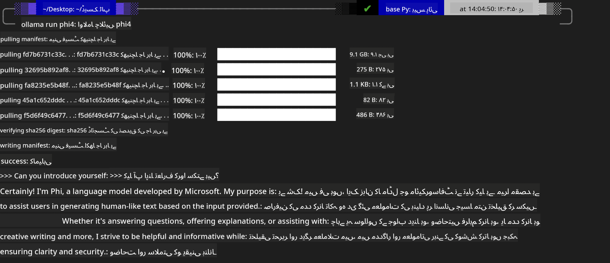
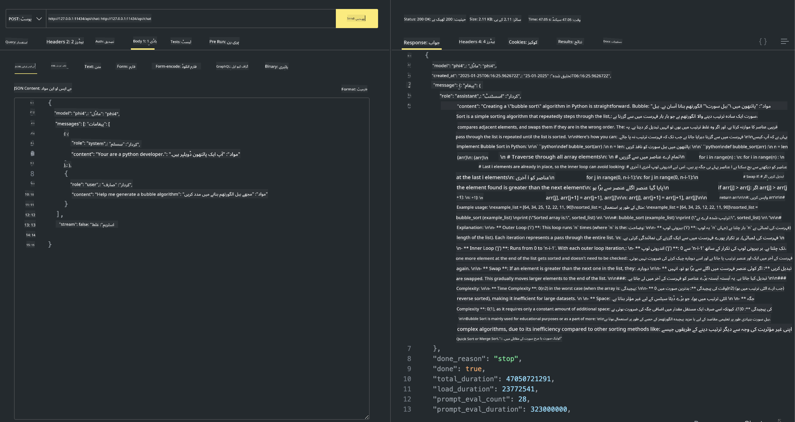

<!--
CO_OP_TRANSLATOR_METADATA:
{
  "original_hash": "0b38834693bb497f96bf53f0d941f9a1",
  "translation_date": "2025-05-07T15:12:09+00:00",
  "source_file": "md/01.Introduction/02/04.Ollama.md",
  "language_code": "ur"
}
-->
## Phi Family in Ollama


[Ollama](https://ollama.com) سادہ اسکرپٹس کے ذریعے زیادہ لوگوں کو براہ راست اوپن سورس LLM یا SLM تعینات کرنے کی اجازت دیتا ہے، اور مقامی Copilot ایپلیکیشن کے منظرناموں میں مدد کے لیے APIs بھی بنا سکتا ہے۔

## **1. تنصیب**

Ollama ونڈوز، macOS، اور لینکس پر چلانے کی حمایت کرتا ہے۔ آپ اس لنک ([https://ollama.com/download](https://ollama.com/download)) کے ذریعے Ollama انسٹال کر سکتے ہیں۔ کامیاب تنصیب کے بعد، آپ ٹرمینل ونڈو کے ذریعے براہ راست Ollama اسکرپٹ استعمال کر کے Phi-3 کو کال کر سکتے ہیں۔ آپ تمام [Ollama میں دستیاب لائبریریاں](https://ollama.com/library) دیکھ سکتے ہیں۔ اگر آپ اس ریپوزیٹری کو Codespace میں کھولتے ہیں، تو اس میں پہلے سے Ollama انسٹال ہوگا۔

```bash

ollama run phi4

```

> [!NOTE]
> ماڈل کو پہلی بار چلانے پر پہلے ڈاؤن لوڈ کیا جائے گا۔ یقیناً، آپ براہ راست ڈاؤن لوڈ شدہ Phi-4 ماڈل بھی مخصوص کر سکتے ہیں۔ ہم WSL کو مثال کے طور پر کمانڈ چلانے کے لیے لیتے ہیں۔ ماڈل کامیابی سے ڈاؤن لوڈ ہونے کے بعد، آپ ٹرمینل پر براہ راست تعامل کر سکتے ہیں۔



## **2. Ollama سے phi-4 API کال کرنا**

اگر آپ Ollama کے ذریعے تیار کردہ Phi-4 API کو کال کرنا چاہتے ہیں، تو آپ ٹرمینل میں یہ کمانڈ استعمال کر کے Ollama سرور شروع کر سکتے ہیں۔

```bash

ollama serve

```

> [!NOTE]
> اگر MacOS یا لینکس پر چل رہے ہیں، تو براہ کرم نوٹ کریں کہ آپ کو یہ غلطی مل سکتی ہے **"Error: listen tcp 127.0.0.1:11434: bind: address already in use"**۔ یہ غلطی کمانڈ چلانے پر آ سکتی ہے۔ آپ اس غلطی کو نظر انداز کر سکتے ہیں کیونکہ یہ عام طور پر ظاہر کرتی ہے کہ سرور پہلے سے چل رہا ہے، یا آپ Ollama کو روک کر دوبارہ شروع کر سکتے ہیں:

**macOS**

```bash

brew services restart ollama

```

**Linux**

```bash

sudo systemctl stop ollama

```

Ollama دو API کی حمایت کرتا ہے: generate اور chat۔ آپ اپنی ضرورت کے مطابق Ollama کی فراہم کردہ ماڈل API کو کال کر سکتے ہیں، جو پورٹ 11434 پر چلنے والی مقامی سروس کو درخواست بھیج کر کام کرتا ہے۔

**Chat**

```bash

curl http://127.0.0.1:11434/api/chat -d '{
  "model": "phi3",
  "messages": [
    {
      "role": "system",
      "content": "Your are a python developer."
    },
    {
      "role": "user",
      "content": "Help me generate a bubble algorithm"
    }
  ],
  "stream": false
  
}'

This is the result in Postman



## Additional Resources

Check the list of available models in Ollama in [their library](https://ollama.com/library).

Pull your model from the Ollama server using this command

```bash
ollama pull phi4
```

Run the model using this command

```bash
ollama run phi4
```

***Note:*** Visit this link [https://github.com/ollama/ollama/blob/main/docs/api.md](https://github.com/ollama/ollama/blob/main/docs/api.md) to learn more

## Calling Ollama from Python

You can use `requests` or `urllib3` to make requests to the local server endpoints used above. However, a popular way to use Ollama in Python is via the [openai](https://pypi.org/project/openai/) SDK, since Ollama provides OpenAI-compatible server endpoints as well.

Here is an example for phi3-mini:

```python
import openai

client = openai.OpenAI(
    base_url="http://localhost:11434/v1",
    api_key="nokeyneeded",
)

response = client.chat.completions.create(
    model="phi4",
    temperature=0.7,
    n=1,
    messages=[
        {"role": "system", "content": "You are a helpful assistant."},
        {"role": "user", "content": "Write a haiku about a hungry cat"},
    ],
)

print("Response:")
print(response.choices[0].message.content)
```

## Calling Ollama from JavaScript 

```javascript
// Phi-4 کے ساتھ فائل کا خلاصہ کرنے کی مثال
script({
    model: "ollama:phi4",
    title: "Phi-4 کے ساتھ خلاصہ",
    system: ["system"],
})

// خلاصہ کرنے کی مثال
const file = def("FILE", env.files)
$`Summarize ${file} in a single paragraph.`
```

## Calling Ollama from C#

Create a new C# Console application and add the following NuGet package:

```bash
dotnet add package Microsoft.SemanticKernel --version 1.34.0
```

Then replace this code in the `Program.cs` file

```csharp
using Microsoft.SemanticKernel;
using Microsoft.SemanticKernel.ChatCompletion;

// مقامی ollama سرور اینڈ پوائنٹ استعمال کرتے ہوئے چیٹ کمپلیشن سروس شامل کریں
#pragma warning disable SKEXP0001, SKEXP0003, SKEXP0010, SKEXP0011, SKEXP0050, SKEXP0052
builder.AddOpenAIChatCompletion(
    modelId: "phi4",
    endpoint: new Uri("http://localhost:11434/"),
    apiKey: "non required");

// چیٹ سروس کو سادہ پرامپٹ کال کریں
string prompt = "Write a joke about kittens";
var response = await kernel.InvokePromptAsync(prompt);
Console.WriteLine(response.GetValue<string>());
```

Run the app with the command:

```bash
dotnet run

**اعلانِ ذمہ داری**:  
یہ دستاویز AI ترجمہ سروس [Co-op Translator](https://github.com/Azure/co-op-translator) کے ذریعے ترجمہ کی گئی ہے۔ اگرچہ ہم درستگی کے لیے کوشاں ہیں، براہِ کرم آگاہ رہیں کہ خودکار ترجموں میں غلطیاں یا کمی بیشی ہو سکتی ہے۔ اصل دستاویز اپنی مادری زبان میں ہی معتبر ماخذ سمجھی جائے گی۔ اہم معلومات کے لیے پیشہ ور انسانی ترجمہ کی سفارش کی جاتی ہے۔ اس ترجمے کے استعمال سے پیدا ہونے والی کسی بھی غلط فہمی یا غلط تشریح کی ذمہ داری ہم پر نہیں ہوگی۔