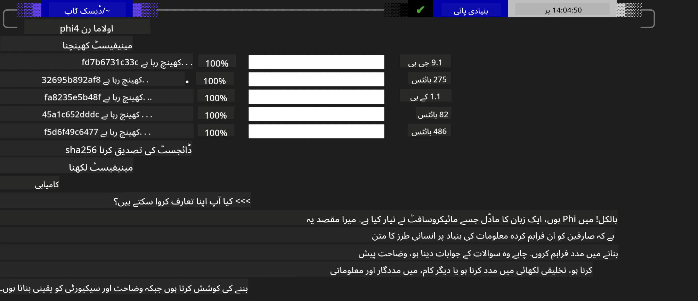
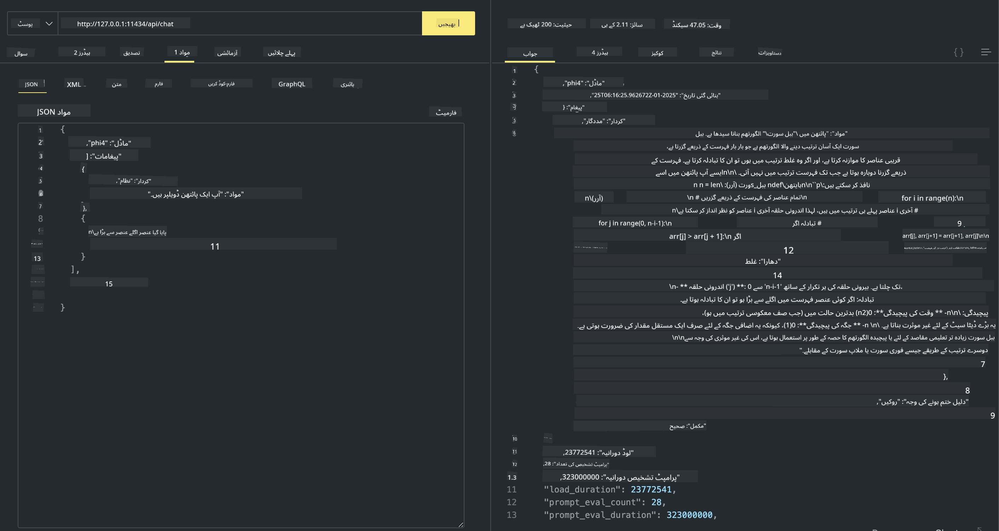

<!--
CO_OP_TRANSLATOR_METADATA:
{
  "original_hash": "ea58f7c3348e894feaeecb90f5bfa98f",
  "translation_date": "2025-04-03T06:43:37+00:00",
  "source_file": "md\\01.Introduction\\02\\04.Ollama.md",
  "language_code": "ur"
}
-->
## Phi فیملی Ollama میں

[Ollama](https://ollama.com) زیادہ لوگوں کو آسان اسکرپٹس کے ذریعے اوپن سورس LLM یا SLM کو براہ راست ڈپلائی کرنے کی سہولت دیتا ہے، اور APIs بنانے کے ذریعے مقامی Copilot ایپلیکیشن سیناریوز میں مدد فراہم کرتا ہے۔

## **1. انسٹالیشن**

Ollama Windows، macOS، اور Linux پر چلانے کی سہولت دیتا ہے۔ آپ Ollama کو اس لنک ([https://ollama.com/download](https://ollama.com/download)) کے ذریعے انسٹال کر سکتے ہیں۔ کامیاب انسٹالیشن کے بعد، آپ ٹرمینل ونڈو کے ذریعے Ollama اسکرپٹ کا استعمال کرکے Phi-3 کو براہ راست کال کر سکتے ہیں۔ آپ Ollama میں موجود [تمام دستیاب لائبریریز](https://ollama.com/library) دیکھ سکتے ہیں۔ اگر آپ اس ریپوزٹری کو Codespace میں کھولتے ہیں، تو Ollama پہلے سے انسٹال ہوگا۔

```bash

ollama run phi4

```

> [!NOTE]
> پہلی بار چلانے پر ماڈل پہلے ڈاؤنلوڈ ہوگا۔ آپ ڈاؤنلوڈ شدہ Phi-4 ماڈل کو براہ راست بھی منتخب کر سکتے ہیں۔ ہم WSL کو کمانڈ چلانے کی مثال کے طور پر لیتے ہیں۔ ماڈل کے کامیابی سے ڈاؤنلوڈ ہونے کے بعد، آپ ٹرمینل پر براہ راست تعامل کر سکتے ہیں۔



## **2. Ollama سے Phi-4 API کو کال کریں**

اگر آپ Ollama کے ذریعے تیار کردہ Phi-4 API کو کال کرنا چاہتے ہیں، تو آپ ٹرمینل میں یہ کمانڈ استعمال کرکے Ollama سرور شروع کر سکتے ہیں۔

```bash

ollama serve

```

> [!NOTE]
> اگر آپ MacOS یا Linux چلا رہے ہیں، تو براہ کرم نوٹ کریں کہ آپ کو یہ خرابی نظر آ سکتی ہے **"Error: listen tcp 127.0.0.1:11434: bind: address already in use"**۔ یہ خرابی کمانڈ چلانے پر ظاہر ہو سکتی ہے۔ آپ یا تو اس خرابی کو نظر انداز کر سکتے ہیں، کیونکہ یہ عام طور پر ظاہر کرتی ہے کہ سرور پہلے ہی چل رہا ہے، یا آپ Ollama کو بند کرکے دوبارہ شروع کر سکتے ہیں:

**macOS**

```bash

brew services restart ollama

```

**Linux**

```bash

sudo systemctl stop ollama

```

Ollama دو APIs کو سپورٹ کرتا ہے: generate اور chat۔ آپ اپنی ضرورت کے مطابق Ollama کے فراہم کردہ ماڈل API کو کال کر سکتے ہیں، جو لوکل سروس پر پورٹ 11434 پر چل رہا ہے۔

**Chat**

```bash

curl http://127.0.0.1:11434/api/chat -d '{
  "model": "phi3",
  "messages": [
    {
      "role": "system",
      "content": "Your are a python developer."
    },
    {
      "role": "user",
      "content": "Help me generate a bubble algorithm"
    }
  ],
  "stream": false
  
}'

This is the result in Postman



## Additional Resources

Check the list of available models in Ollama in [their library](https://ollama.com/library).

Pull your model from the Ollama server using this command

```bash
ollama pull phi4
```

Run the model using this command

```bash
ollama run phi4
```

***Note:*** Visit this link [https://github.com/ollama/ollama/blob/main/docs/api.md](https://github.com/ollama/ollama/blob/main/docs/api.md) to learn more

## Calling Ollama from Python

You can use `requests` or `urllib3` to make requests to the local server endpoints used above. However, a popular way to use Ollama in Python is via the [openai](https://pypi.org/project/openai/) SDK, since Ollama provides OpenAI-compatible server endpoints as well.

Here is an example for phi3-mini:

```python
import openai

client = openai.OpenAI(
    base_url="http://localhost:11434/v1",
    api_key="nokeyneeded",
)

response = client.chat.completions.create(
    model="phi4",
    temperature=0.7,
    n=1,
    messages=[
        {"role": "system", "content": "You are a helpful assistant."},
        {"role": "user", "content": "Write a haiku about a hungry cat"},
    ],
)

print("Response:")
print(response.choices[0].message.content)
```

## Calling Ollama from JavaScript 

```javascript
// Phi-4 کے ساتھ فائل کا خلاصہ کرنے کی مثال
script({
    model: "ollama:phi4",
    title: "Summarize with Phi-4",
    system: ["system"],
})

// خلاصہ کی مثال
const file = def("FILE", env.files)
$`Summarize ${file} in a single paragraph.`
```

## Calling Ollama from C#

Create a new C# Console application and add the following NuGet package:

```bash
dotnet add package Microsoft.SemanticKernel --version 1.34.0
```

Then replace this code in the `Program.cs` file

```csharp
using Microsoft.SemanticKernel;
using Microsoft.SemanticKernel.ChatCompletion;

// لوکل Ollama سرور اینڈپوائنٹ کا استعمال کرکے چیٹ کمپلیشن سروس شامل کریں
#pragma warning disable SKEXP0001, SKEXP0003, SKEXP0010, SKEXP0011, SKEXP0050, SKEXP0052
builder.AddOpenAIChatCompletion(
    modelId: "phi4",
    endpoint: new Uri("http://localhost:11434/"),
    apiKey: "non required");

// چیٹ سروس کو ایک سادہ پرامپٹ بھیجیں
string prompt = "Write a joke about kittens";
var response = await kernel.InvokePromptAsync(prompt);
Console.WriteLine(response.GetValue<string>());
```

Run the app with the command:

```bash
dotnet run
```

**ڈسکلوزر**:  
یہ دستاویز AI ترجمہ سروس [Co-op Translator](https://github.com/Azure/co-op-translator) کا استعمال کرتے ہوئے ترجمہ کی گئی ہے۔ ہم درستگی کے لیے کوشش کرتے ہیں، لیکن براہ کرم یہ جان لیں کہ خودکار ترجمے میں غلطیاں یا غیر درستیاں ہو سکتی ہیں۔ اصل دستاویز کو اس کی اصل زبان میں مستند ذریعہ سمجھا جانا چاہیے۔ اہم معلومات کے لیے، پیشہ ور انسانی ترجمہ کی سفارش کی جاتی ہے۔ ہم اس ترجمے کے استعمال سے پیدا ہونے والی کسی بھی غلط فہمی یا غلط تشریح کے ذمہ دار نہیں ہیں۔