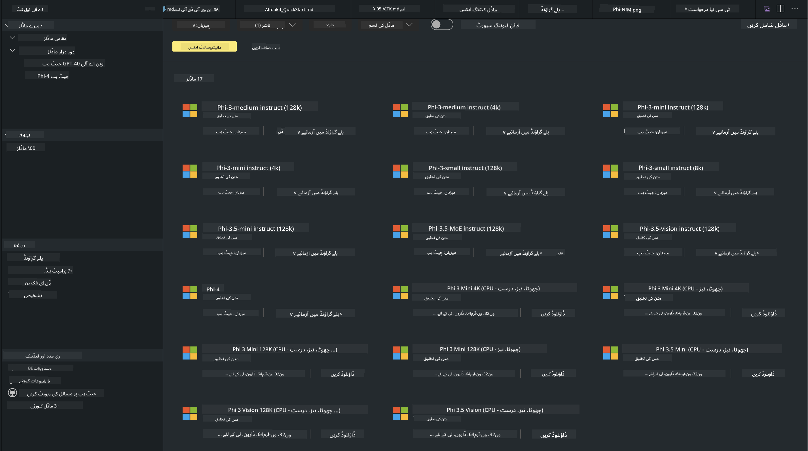
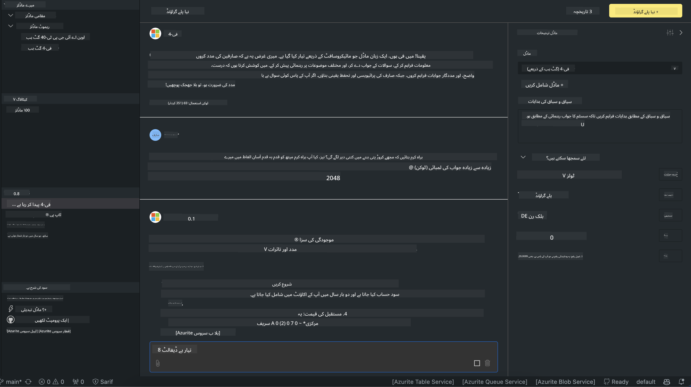

<!--
CO_OP_TRANSLATOR_METADATA:
{
  "original_hash": "9365fb38f5c75c4d7ac9b9a4baa7c9d1",
  "translation_date": "2025-04-03T06:44:37+00:00",
  "source_file": "md\\01.Introduction\\02\\05.AITK.md",
  "language_code": "ur"
}
-->
# اے آئی ٹی کے میں فی فیملی

[ویژول اسٹوڈیو کوڈ کے لیے اے آئی ٹول کٹ](https://marketplace.visualstudio.com/items?itemName=ms-windows-ai-studio.windows-ai-studio) جنریٹیو اے آئی ایپ ڈویلپمنٹ کو آسان بناتا ہے۔ یہ جدید ترین اے آئی ڈویلپمنٹ ٹولز اور ماڈلز کو Azure AI Foundry Catalog اور Hugging Face جیسے دیگر کیٹلاگ کے ذریعے یکجا کرتا ہے۔ آپ GitHub Models اور Azure AI Foundry Model Catalogs سے چلنے والے اے آئی ماڈلز کی کیٹلاگ کو براؤز کرسکتے ہیں، انہیں مقامی یا ریموٹ ڈاؤنلوڈ کرسکتے ہیں، فائن ٹیون کرسکتے ہیں، ٹیسٹ کرسکتے ہیں اور اپنی ایپلیکیشن میں استعمال کرسکتے ہیں۔

اے آئی ٹول کٹ پریویو مقامی طور پر چلے گا۔ مقامی انفرنس یا فائن ٹیوننگ، آپ کے منتخب کردہ ماڈل پر منحصر ہوگا، اور آپ کو NVIDIA CUDA GPU جیسا GPU درکار ہوسکتا ہے۔ آپ GitHub Models کو براہ راست اے آئی ٹی کے کے ساتھ بھی چلا سکتے ہیں۔

## شروعات کریں

[ونڈوز سب سسٹم فار لینکس انسٹال کرنے کا طریقہ سیکھیں](https://learn.microsoft.com/windows/wsl/install?WT.mc_id=aiml-137032-kinfeylo)

اور [ڈیفالٹ ڈسٹری بیوشن تبدیل کریں](https://learn.microsoft.com/windows/wsl/install#change-the-default-linux-distribution-installed)۔

[اے آئی ٹول کٹ GitHub ریپو](https://github.com/microsoft/vscode-ai-toolkit/)

- ونڈوز، لینکس، میک او ایس  

- ونڈوز اور لینکس دونوں پر فائن ٹیوننگ کے لیے، آپ کو Nvidia GPU کی ضرورت ہوگی۔ اضافی طور پر، **ونڈوز** کے لیے Ubuntu ڈسٹریبیوشن 18.4 یا اس سے زیادہ کے ساتھ لینکس سب سسٹم درکار ہے۔ [ونڈوز سب سسٹم فار لینکس انسٹال کرنے کا طریقہ سیکھیں](https://learn.microsoft.com/windows/wsl/install) اور [ڈیفالٹ ڈسٹری بیوشن تبدیل کریں](https://learn.microsoft.com/windows/wsl/install#change-the-default-linux-distribution-installed)۔

### اے آئی ٹول کٹ انسٹال کریں

اے آئی ٹول کٹ ایک [ویژول اسٹوڈیو کوڈ ایکسٹینشن](https://code.visualstudio.com/docs/setup/additional-components#_vs-code-extensions) کے طور پر فراہم کی جاتی ہے، اس لیے آپ کو پہلے [وی ایس کوڈ](https://code.visualstudio.com/docs/setup/windows?WT.mc_id=aiml-137032-kinfeylo) انسٹال کرنا ہوگا، اور پھر اے آئی ٹول کٹ کو [وی ایس مارکیٹ پلیس](https://marketplace.visualstudio.com/items?itemName=ms-windows-ai-studio.windows-ai-studio) سے ڈاؤنلوڈ کرنا ہوگا۔  
[اے آئی ٹول کٹ ویژول اسٹوڈیو مارکیٹ پلیس میں دستیاب ہے](https://marketplace.visualstudio.com/items?itemName=ms-windows-ai-studio.windows-ai-studio) اور اسے کسی بھی دوسرے وی ایس کوڈ ایکسٹینشن کی طرح انسٹال کیا جا سکتا ہے۔

اگر آپ وی ایس کوڈ ایکسٹینشنز انسٹال کرنے سے ناواقف ہیں، تو ان مراحل کی پیروی کریں:

### سائن ان کریں

1. وی ایس کوڈ میں ایکٹیویٹی بار میں **ایکسٹینشنز** کو منتخب کریں  
1. ایکسٹینشنز سرچ بار میں "AI Toolkit" ٹائپ کریں  
1. "AI Toolkit for Visual Studio Code" کو منتخب کریں  
1. **انسٹال** کو منتخب کریں  

اب آپ ایکسٹینشن استعمال کرنے کے لیے تیار ہیں!

آپ سے GitHub میں سائن ان کرنے کو کہا جائے گا، براہ کرم "Allow" پر کلک کریں تاکہ آگے بڑھ سکیں۔ آپ کو GitHub سائن ان پیج پر ری ڈائریکٹ کیا جائے گا۔

براہ کرم سائن ان کریں اور پراسیس کے مراحل کی پیروی کریں۔ کامیاب تکمیل کے بعد، آپ کو وی ایس کوڈ پر ری ڈائریکٹ کر دیا جائے گا۔

ایک بار جب ایکسٹینشن انسٹال ہو جائے تو آپ کو ایکٹیویٹی بار میں اے آئی ٹول کٹ آئیکن نظر آئے گا۔

آئیے دستیاب ایکشنز کو دریافت کریں!

### دستیاب ایکشنز

اے آئی ٹول کٹ کا پرائمری سائیڈ بار ان حصوں میں منظم ہے:  

- **ماڈلز**  
- **وسائل**  
- **پلے گراؤنڈ**  
- **فائن ٹیوننگ**  
- **ایویلوایشن**

وسائل کے سیکشن میں دستیاب ہیں۔ شروعات کے لیے **ماڈل کیٹلاگ** کو منتخب کریں۔

### کیٹلاگ سے ماڈل ڈاؤنلوڈ کریں

وی ایس کوڈ کے سائیڈ بار سے اے آئی ٹول کٹ لانچ کرنے پر، آپ درج ذیل آپشنز میں سے انتخاب کرسکتے ہیں:



- **ماڈل کیٹلاگ** سے ایک سپورٹڈ ماڈل تلاش کریں اور مقامی طور پر ڈاؤنلوڈ کریں  
- **ماڈل پلے گراؤنڈ** میں ماڈل انفرنس کو ٹیسٹ کریں  
- **ماڈل فائن ٹیوننگ** میں مقامی یا ریموٹ ماڈل کو فائن ٹیون کریں  
- فائن ٹیون کیے گئے ماڈلز کو کمانڈ پلیٹ کے ذریعے کلاؤڈ پر ڈیپلائے کریں  
- ماڈلز کا ایویلوایشن کریں  

> [!NOTE]
>
> **GPU بمقابلہ CPU**
>
> آپ نوٹ کریں گے کہ ماڈل کارڈز ماڈل سائز، پلیٹ فارم، اور ایکسیلیریٹر ٹائپ (CPU, GPU) دکھاتے ہیں۔ **ونڈوز ڈیوائسز جن میں کم از کم ایک GPU موجود ہو** پر بہتر پرفارمنس کے لیے، ان ماڈل ورژنز کو منتخب کریں جو صرف ونڈوز کو ٹارگٹ کرتے ہیں۔
>
> یہ یقینی بناتا ہے کہ آپ کے پاس DirectML ایکسیلیریٹر کے لیے ایک بہتر ماڈل موجود ہے۔
>
> ماڈل کے نام درج ذیل فارمیٹ میں ہوتے ہیں:
>
> - `{model_name}-{accelerator}-{quantization}-{format}`.
>
> یہ چیک کرنے کے لیے کہ آیا آپ کے ونڈوز ڈیوائس میں GPU موجود ہے، **ٹاسک مینیجر** کھولیں اور پھر **پرفارمنس** ٹیب کو منتخب کریں۔ اگر آپ کے پاس GPU(s) موجود ہیں، تو وہ "GPU 0" یا "GPU 1" جیسے ناموں کے تحت درج ہوں گے۔

### ماڈل کو پلے گراؤنڈ میں چلائیں

تمام پیرامیٹرز سیٹ کرنے کے بعد، **پروجیکٹ تیار کریں** پر کلک کریں۔

ایک بار جب آپ کا ماڈل ڈاؤنلوڈ ہو جائے، تو کیٹلاگ میں ماڈل کارڈ پر **پلے گراؤنڈ میں لوڈ کریں** کو منتخب کریں:

- ماڈل ڈاؤنلوڈ شروع کریں  
- تمام ضروریات اور ڈیپینڈینسیز انسٹال کریں  
- وی ایس کوڈ ورک اسپیس بنائیں  



### اپنی ایپلیکیشن میں REST API استعمال کریں  

اے آئی ٹول کٹ ایک مقامی REST API ویب سرور **پورٹ 5272 پر** فراہم کرتا ہے جو [OpenAI چیٹ کمپلیشنز فارمیٹ](https://platform.openai.com/docs/api-reference/chat/create) استعمال کرتا ہے۔

یہ آپ کو اپنی ایپلیکیشن کو مقامی طور پر ٹیسٹ کرنے کے قابل بناتا ہے بغیر کسی کلاؤڈ اے آئی ماڈل سروس پر انحصار کیے۔ مثال کے طور پر، درج ذیل JSON فائل دکھاتی ہے کہ درخواست کے باڈی کو کیسے کنفیگر کیا جائے:

```json
{
    "model": "Phi-4",
    "messages": [
        {
            "role": "user",
            "content": "what is the golden ratio?"
        }
    ],
    "temperature": 0.7,
    "top_p": 1,
    "top_k": 10,
    "max_tokens": 100,
    "stream": true
}
```

آپ REST API کو (مثلاً) [Postman](https://www.postman.com/) یا CURL (کلائنٹ یو آر ایل) یوٹیلیٹی کا استعمال کرکے ٹیسٹ کرسکتے ہیں:

```bash
curl -vX POST http://127.0.0.1:5272/v1/chat/completions -H 'Content-Type: application/json' -d @body.json
```

### Python کے لیے OpenAI کلائنٹ لائبریری کا استعمال

```python
from openai import OpenAI

client = OpenAI(
    base_url="http://127.0.0.1:5272/v1/", 
    api_key="x" # required for the API but not used
)

chat_completion = client.chat.completions.create(
    messages=[
        {
            "role": "user",
            "content": "what is the golden ratio?",
        }
    ],
    model="Phi-4",
)

print(chat_completion.choices[0].message.content)
```

### Azure OpenAI کلائنٹ لائبریری کو .NET کے لیے استعمال کریں

اپنے پروجیکٹ میں NuGet کا استعمال کرتے ہوئے [Azure OpenAI کلائنٹ لائبریری برائے .NET](https://www.nuget.org/packages/Azure.AI.OpenAI/) شامل کریں:

```bash
dotnet add {project_name} package Azure.AI.OpenAI --version 1.0.0-beta.17
```

اپنے پروجیکٹ میں ایک C# فائل **OverridePolicy.cs** کے نام سے شامل کریں اور درج ذیل کوڈ پیسٹ کریں:

```csharp
// OverridePolicy.cs
using Azure.Core.Pipeline;
using Azure.Core;

internal partial class OverrideRequestUriPolicy(Uri overrideUri)
    : HttpPipelineSynchronousPolicy
{
    private readonly Uri _overrideUri = overrideUri;

    public override void OnSendingRequest(HttpMessage message)
    {
        message.Request.Uri.Reset(_overrideUri);
    }
}
```

اگلا، درج ذیل کوڈ اپنے **Program.cs** فائل میں پیسٹ کریں:

```csharp
// Program.cs
using Azure.AI.OpenAI;

Uri localhostUri = new("http://localhost:5272/v1/chat/completions");

OpenAIClientOptions clientOptions = new();
clientOptions.AddPolicy(
    new OverrideRequestUriPolicy(localhostUri),
    Azure.Core.HttpPipelinePosition.BeforeTransport);
OpenAIClient client = new(openAIApiKey: "unused", clientOptions);

ChatCompletionsOptions options = new()
{
    DeploymentName = "Phi-4",
    Messages =
    {
        new ChatRequestSystemMessage("You are a helpful assistant. Be brief and succinct."),
        new ChatRequestUserMessage("What is the golden ratio?"),
    }
};

StreamingResponse<StreamingChatCompletionsUpdate> streamingChatResponse
    = await client.GetChatCompletionsStreamingAsync(options);

await foreach (StreamingChatCompletionsUpdate chatChunk in streamingChatResponse)
{
    Console.Write(chatChunk.ContentUpdate);
}
```

## اے آئی ٹول کٹ کے ساتھ فائن ٹیوننگ

- ماڈل ڈسکوری اور پلے گراؤنڈ سے شروعات کریں۔  
- مقامی کمپیوٹنگ وسائل کا استعمال کرتے ہوئے ماڈل فائن ٹیوننگ اور انفرنس۔  
- Azure وسائل کا استعمال کرتے ہوئے ریموٹ فائن ٹیوننگ اور انفرنس۔  

[اے آئی ٹول کٹ کے ساتھ فائن ٹیوننگ](../../03.FineTuning/Finetuning_VSCodeaitoolkit.md)

## اے آئی ٹول کٹ سوال و جواب وسائل

براہ کرم عام مسائل اور ان کے حل کے لیے ہمارے [سوال و جواب صفحہ](https://github.com/microsoft/vscode-ai-toolkit/blob/main/archive/QA.md) کا حوالہ دیں۔  

**ڈسکلوزر**:  
یہ دستاویز AI ترجمہ سروس [Co-op Translator](https://github.com/Azure/co-op-translator) کا استعمال کرتے ہوئے ترجمہ کی گئی ہے۔ ہم درستگی کے لیے کوشش کرتے ہیں، لیکن براہ کرم آگاہ رہیں کہ خودکار ترجمے میں غلطیاں یا غیر درستیاں ہو سکتی ہیں۔ اصل دستاویز، جو اس کی اصل زبان میں ہے، کو مستند ذریعہ سمجھا جانا چاہیے۔ اہم معلومات کے لیے، پیشہ ورانہ انسانی ترجمہ کی سفارش کی جاتی ہے۔ ہم اس ترجمے کے استعمال سے پیدا ہونے والے کسی بھی غلط فہمی یا غلط تشریح کے لیے ذمہ دار نہیں ہیں۔