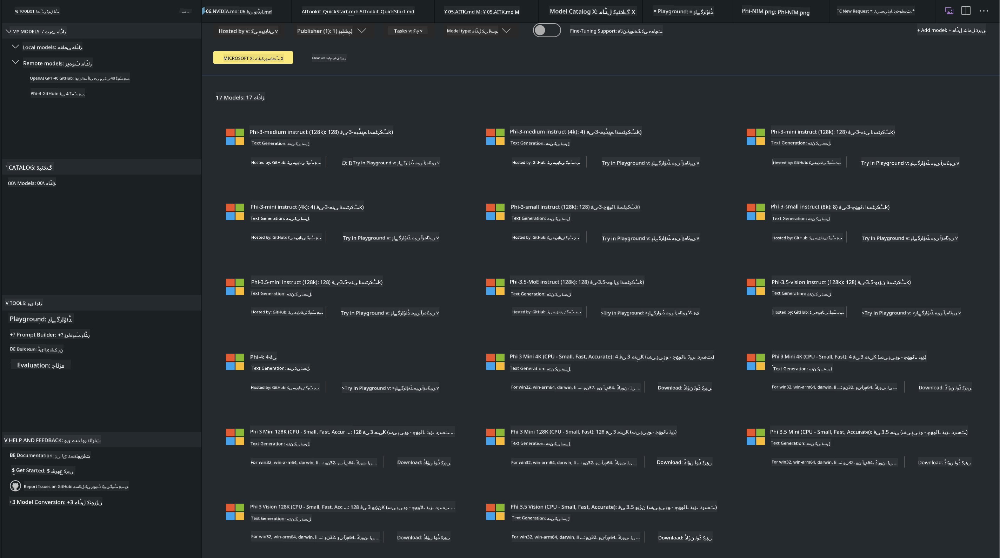
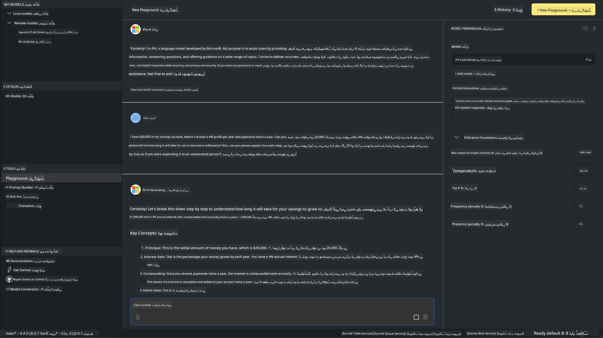

<!--
CO_OP_TRANSLATOR_METADATA:
{
  "original_hash": "4951d458c0b60c02cd1e751b40903877",
  "translation_date": "2025-07-16T19:21:47+00:00",
  "source_file": "md/01.Introduction/02/05.AITK.md",
  "language_code": "ur"
}
-->
# Phi خاندان AITK میں

[AI Toolkit for VS Code](https://marketplace.visualstudio.com/items?itemName=ms-windows-ai-studio.windows-ai-studio) جنریٹو AI ایپ کی ترقی کو آسان بناتا ہے، جدید AI ترقی کے اوزار اور ماڈلز کو Azure AI Foundry Catalog اور دیگر کیٹلاگز جیسے Hugging Face سے یکجا کر کے۔ آپ GitHub Models اور Azure AI Foundry Model Catalogs کی طاقت سے چلنے والے AI ماڈلز کے کیٹلاگ کو براؤز کر سکیں گے، انہیں مقامی یا ریموٹ طور پر ڈاؤن لوڈ کریں گے، فائن ٹیون کریں گے، ٹیسٹ کریں گے اور اپنی ایپلیکیشن میں استعمال کریں گے۔

AI Toolkit Preview مقامی طور پر چلے گا۔ مقامی انفرنس یا فائن ٹیوننگ، منتخب کردہ ماڈل پر منحصر ہے، آپ کو NVIDIA CUDA GPU جیسا GPU درکار ہو سکتا ہے۔ آپ GitHub Models کو بھی براہ راست AITK کے ساتھ چلا سکتے ہیں۔

## شروع کرنے کا طریقہ

[ونڈوز سب سسٹم برائے لینکس انسٹال کرنے کا طریقہ جانیں](https://learn.microsoft.com/windows/wsl/install?WT.mc_id=aiml-137032-kinfeylo)

اور [ڈیفالٹ ڈسٹری بیوشن تبدیل کرنے کا طریقہ](https://learn.microsoft.com/windows/wsl/install#change-the-default-linux-distribution-installed)۔

[AI Toolkit کا GitHub ریپو](https://github.com/microsoft/vscode-ai-toolkit/)

- Windows, Linux, macOS
  
- ونڈوز اور لینکس دونوں پر فائن ٹیوننگ کے لیے، آپ کو Nvidia GPU کی ضرورت ہوگی۔ اس کے علاوہ، **ونڈوز** کے لیے لینکس سب سسٹم اور Ubuntu ڈسٹری بیوشن 18.4 یا اس سے زیادہ ضروری ہے۔ [ونڈوز سب سسٹم برائے لینکس انسٹال کرنے کا طریقہ جانیں](https://learn.microsoft.com/windows/wsl/install) اور [ڈیفالٹ ڈسٹری بیوشن تبدیل کرنے کا طریقہ](https://learn.microsoft.com/windows/wsl/install#change-the-default-linux-distribution-installed)۔

### AI Toolkit انسٹال کریں

AI Toolkit ایک [Visual Studio Code Extension](https://code.visualstudio.com/docs/setup/additional-components#_vs-code-extensions) کے طور پر فراہم کیا جاتا ہے، لہٰذا پہلے آپ کو [VS Code](https://code.visualstudio.com/docs/setup/windows?WT.mc_id=aiml-137032-kinfeylo) انسٹال کرنا ہوگا، اور پھر AI Toolkit کو [VS Marketplace](https://marketplace.visualstudio.com/items?itemName=ms-windows-ai-studio.windows-ai-studio) سے ڈاؤن لوڈ کریں۔  
[AI Toolkit Visual Studio Marketplace میں دستیاب ہے](https://marketplace.visualstudio.com/items?itemName=ms-windows-ai-studio.windows-ai-studio) اور اسے کسی بھی دوسرے VS Code ایکسٹینشن کی طرح انسٹال کیا جا سکتا ہے۔

اگر آپ VS Code ایکسٹینشن انسٹال کرنے سے ناواقف ہیں، تو یہ مراحل فالو کریں:

### سائن ان کریں

1. VS Code کی Activity Bar میں **Extensions** منتخب کریں  
1. Extensions سرچ بار میں "AI Toolkit" ٹائپ کریں  
1. "AI Toolkit for Visual Studio code" منتخب کریں  
1. **Install** پر کلک کریں  

اب آپ ایکسٹینشن استعمال کرنے کے لیے تیار ہیں!

آپ کو GitHub میں سائن ان کرنے کا کہا جائے گا، براہ کرم "Allow" پر کلک کریں تاکہ آگے بڑھ سکیں۔ آپ کو GitHub سائن ان صفحے پر ری ڈائریکٹ کیا جائے گا۔

براہ کرم سائن ان کریں اور عمل کے مراحل پر عمل کریں۔ کامیاب مکمل ہونے کے بعد، آپ کو VS Code پر واپس بھیج دیا جائے گا۔

ایک بار ایکسٹینشن انسٹال ہو جانے کے بعد، آپ کی Activity Bar میں AI Toolkit کا آئیکن نظر آئے گا۔

آئیے دستیاب ایکشنز کو دریافت کرتے ہیں!

### دستیاب ایکشنز

AI Toolkit کا پرائمری سائیڈبار درج ذیل حصوں میں منظم ہے:

- **Models**  
- **Resources**  
- **Playground**  
- **Fine-tuning**  
- **Evaluation**

Resources سیکشن میں دستیاب ہیں۔ شروع کرنے کے لیے **Model Catalog** منتخب کریں۔

### کیٹلاگ سے ماڈل ڈاؤن لوڈ کریں

جب آپ VS Code سائیڈ بار سے AI Toolkit لانچ کریں گے، تو آپ درج ذیل آپشنز میں سے انتخاب کر سکتے ہیں:



- **Model Catalog** سے سپورٹڈ ماڈل تلاش کریں اور مقامی طور پر ڈاؤن لوڈ کریں  
- **Model Playground** میں ماڈل انفرنس ٹیسٹ کریں  
- **Model Fine-tuning** میں ماڈل کو مقامی یا ریموٹ طور پر فائن ٹیون کریں  
- AI Toolkit کے کمانڈ پیلیٹ کے ذریعے فائن ٹیون کیے گئے ماڈلز کو کلاؤڈ پر تعینات کریں  
- ماڈلز کی جانچ کریں  

> [!NOTE]  
>  
> **GPU بمقابلہ CPU**  
>  
> آپ دیکھیں گے کہ ماڈل کارڈز ماڈل کا سائز، پلیٹ فارم اور ایکسیلیریٹر کی قسم (CPU, GPU) دکھاتے ہیں۔ **ونڈوز ڈیوائسز جن میں کم از کم ایک GPU موجود ہو** کے لیے بہتر کارکردگی کے لیے، ایسے ماڈل ورژنز منتخب کریں جو صرف ونڈوز کو ہدف بناتے ہوں۔  
>  
> اس سے یہ یقینی بنتا ہے کہ آپ کے پاس DirectML ایکسیلیریٹر کے لیے بہتر بنایا گیا ماڈل ہے۔  
>  
> ماڈل کے نام اس فارمیٹ میں ہوتے ہیں:  
>  
> - `{model_name}-{accelerator}-{quantization}-{format}`۔  
>  
> یہ چیک کرنے کے لیے کہ آپ کے ونڈوز ڈیوائس میں GPU ہے یا نہیں، **Task Manager** کھولیں اور پھر **Performance** ٹیب منتخب کریں۔ اگر GPU موجود ہیں، تو وہ "GPU 0" یا "GPU 1" جیسے ناموں کے تحت دکھائی دیں گے۔

### ماڈل کو playground میں چلائیں

تمام پیرامیٹرز سیٹ کرنے کے بعد، **Generate Project** پر کلک کریں۔

جب آپ کا ماڈل ڈاؤن لوڈ ہو جائے، تو کیٹلاگ میں ماڈل کارڈ پر **Load in Playground** منتخب کریں:

- ماڈل ڈاؤن لوڈ شروع کریں  
- تمام prerequisites اور dependencies انسٹال کریں  
- VS Code ورک اسپیس بنائیں  



### اپنی ایپلیکیشن میں REST API استعمال کریں

AI Toolkit ایک مقامی REST API ویب سرور کے ساتھ آتا ہے **پورٹ 5272 پر** جو [OpenAI chat completions format](https://platform.openai.com/docs/api-reference/chat/create) استعمال کرتا ہے۔

یہ آپ کو اپنی ایپلیکیشن کو مقامی طور پر ٹیسٹ کرنے کی سہولت دیتا ہے بغیر کلاؤڈ AI ماڈل سروس پر انحصار کیے۔ مثال کے طور پر، درج ذیل JSON فائل درخواست کے باڈی کو کنفیگر کرنے کا طریقہ دکھاتی ہے:

```json
{
    "model": "Phi-4",
    "messages": [
        {
            "role": "user",
            "content": "what is the golden ratio?"
        }
    ],
    "temperature": 0.7,
    "top_p": 1,
    "top_k": 10,
    "max_tokens": 100,
    "stream": true
}
```

آپ REST API کو (مثلاً) [Postman](https://www.postman.com/) یا CURL (Client URL) یوٹیلٹی کے ذریعے ٹیسٹ کر سکتے ہیں:

```bash
curl -vX POST http://127.0.0.1:5272/v1/chat/completions -H 'Content-Type: application/json' -d @body.json
```

### Python کے لیے OpenAI کلائنٹ لائبریری کا استعمال

```python
from openai import OpenAI

client = OpenAI(
    base_url="http://127.0.0.1:5272/v1/", 
    api_key="x" # required for the API but not used
)

chat_completion = client.chat.completions.create(
    messages=[
        {
            "role": "user",
            "content": "what is the golden ratio?",
        }
    ],
    model="Phi-4",
)

print(chat_completion.choices[0].message.content)
```

### .NET کے لیے Azure OpenAI کلائنٹ لائبریری کا استعمال

اپنے پروجیکٹ میں NuGet کے ذریعے [Azure OpenAI کلائنٹ لائبریری برائے .NET](https://www.nuget.org/packages/Azure.AI.OpenAI/) شامل کریں:

```bash
dotnet add {project_name} package Azure.AI.OpenAI --version 1.0.0-beta.17
```

اپنے پروجیکٹ میں **OverridePolicy.cs** نامی C# فائل شامل کریں اور درج ذیل کوڈ پیسٹ کریں:

```csharp
// OverridePolicy.cs
using Azure.Core.Pipeline;
using Azure.Core;

internal partial class OverrideRequestUriPolicy(Uri overrideUri)
    : HttpPipelineSynchronousPolicy
{
    private readonly Uri _overrideUri = overrideUri;

    public override void OnSendingRequest(HttpMessage message)
    {
        message.Request.Uri.Reset(_overrideUri);
    }
}
```

اس کے بعد، اپنے **Program.cs** فائل میں درج ذیل کوڈ پیسٹ کریں:

```csharp
// Program.cs
using Azure.AI.OpenAI;

Uri localhostUri = new("http://localhost:5272/v1/chat/completions");

OpenAIClientOptions clientOptions = new();
clientOptions.AddPolicy(
    new OverrideRequestUriPolicy(localhostUri),
    Azure.Core.HttpPipelinePosition.BeforeTransport);
OpenAIClient client = new(openAIApiKey: "unused", clientOptions);

ChatCompletionsOptions options = new()
{
    DeploymentName = "Phi-4",
    Messages =
    {
        new ChatRequestSystemMessage("You are a helpful assistant. Be brief and succinct."),
        new ChatRequestUserMessage("What is the golden ratio?"),
    }
};

StreamingResponse<StreamingChatCompletionsUpdate> streamingChatResponse
    = await client.GetChatCompletionsStreamingAsync(options);

await foreach (StreamingChatCompletionsUpdate chatChunk in streamingChatResponse)
{
    Console.Write(chatChunk.ContentUpdate);
}
```

## AI Toolkit کے ساتھ Fine Tuning

- ماڈل کی دریافت اور playground سے شروع کریں۔  
- مقامی کمپیوٹنگ وسائل کا استعمال کرتے ہوئے ماڈل کی فائن ٹیوننگ اور انفرنس۔  
- Azure وسائل کا استعمال کرتے ہوئے ریموٹ فائن ٹیوننگ اور انفرنس۔

[AI Toolkit کے ساتھ Fine Tuning](../../03.FineTuning/Finetuning_VSCodeaitoolkit.md)

## AI Toolkit سوال و جواب کے وسائل

زیادہ تر عام مسائل اور ان کے حل کے لیے ہماری [Q&A صفحہ](https://github.com/microsoft/vscode-ai-toolkit/blob/main/archive/QA.md) ملاحظہ کریں۔

**دستخطی نوٹ**:  
یہ دستاویز AI ترجمہ سروس [Co-op Translator](https://github.com/Azure/co-op-translator) کے ذریعے ترجمہ کی گئی ہے۔ اگرچہ ہم درستگی کے لیے کوشاں ہیں، براہ کرم اس بات سے آگاہ رہیں کہ خودکار ترجمے میں غلطیاں یا عدم درستیاں ہو سکتی ہیں۔ اصل دستاویز اپنی مادری زبان میں ہی معتبر ماخذ سمجھی جانی چاہیے۔ اہم معلومات کے لیے پیشہ ور انسانی ترجمہ کی سفارش کی جاتی ہے۔ اس ترجمے کے استعمال سے پیدا ہونے والی کسی بھی غلط فہمی یا غلط تشریح کی ذمہ داری ہم پر عائد نہیں ہوتی۔