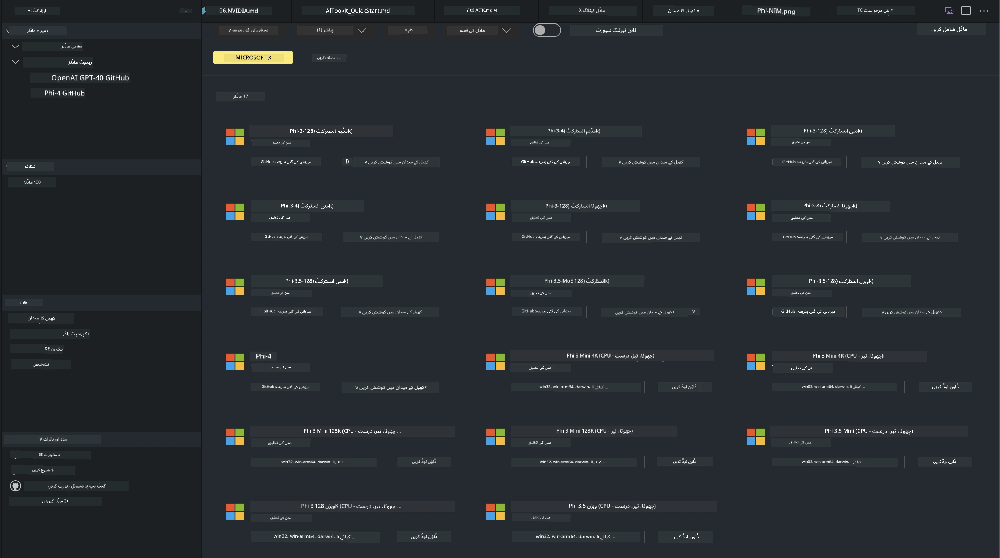
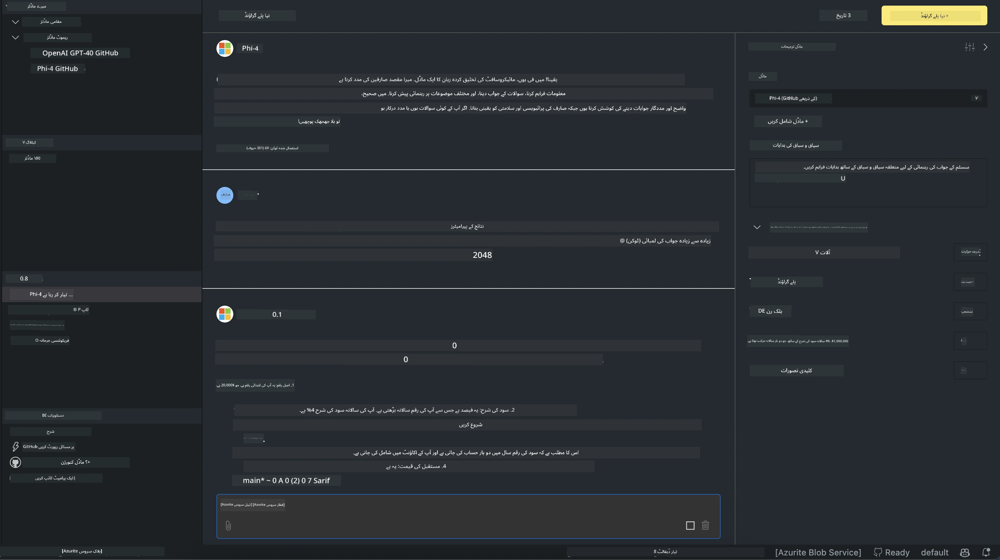

# AITK میں Phi فیملی

[AI Toolkit for VS Code](https://marketplace.visualstudio.com/items?itemName=ms-windows-ai-studio.windows-ai-studio) تخلیقی AI ایپ کی ترقی کو آسان بناتا ہے جس میں Microsoft Foundry Catalog اور دیگر کیٹلاگز جیسے Hugging Face سے جدید ترین AI ترقی کے آلات اور ماڈلز کو ایک جگہ لایا گیا ہے۔ آپ GitHub Models اور Microsoft Foundry Model Catalogs سے چلنے والا AI ماڈلز کا کیٹلاگ براؤز کر سکیں گے، انہیں لوکل یا ریموٹ پر ڈاؤن لوڈ کریں، فائن ٹیوننگ، ٹیسٹ اور اپنے ایپلیکیشن میں استعمال کریں گے۔

AI Toolkit کا پریویو لوکل چلایا جائے گا۔ لوکل انفرنس یا فائن ٹیوننگ، آپ کے منتخب کردہ ماڈل پر منحصر ہے، آپ کو NVIDIA CUDA GPU جیسے GPU کی ضرورت ہو سکتی ہے۔ آپ GitHub Models کو بھی براہ راست AITK کے ساتھ چلا سکتے ہیں۔

## شروع کرنے کا طریقہ

[ونڈوز سب سسٹم برائے لینکس انسٹال کرنے کا مزید جانیں](https://learn.microsoft.com/windows/wsl/install?WT.mc_id=aiml-137032-kinfeylo)

اور [ڈیفالٹ ڈسٹری بیوشن کو تبدیل کرنے کا طریقہ](https://learn.microsoft.com/windows/wsl/install#change-the-default-linux-distribution-installed)۔

[AI Toolkit کا GitHub ریپو](https://github.com/microsoft/vscode-ai-toolkit/)

- Windows, Linux, macOS

- ونڈوز اور لینکس دونوں پر فائن ٹیوننگ کے لیے، آپ کو Nvidia GPU کی ضرورت ہوگی۔ اس کے علاوہ، **ونڈوز** کے لیے Ubuntu ڈسٹری بیوشن 18.4 یا اس سے زیادہ کے ساتھ لینکس سب سسٹم درکار ہے۔ [ونڈوز سب سسٹم برائے لینکس انسٹال کرنے کا مزید جانیں](https://learn.microsoft.com/windows/wsl/install) اور [ڈیفالٹ ڈسٹری بیوشن تبدیل کرنے کا طریقہ](https://learn.microsoft.com/windows/wsl/install#change-the-default-linux-distribution-installed)۔

### AI Toolkit انسٹال کریں

AI Toolkit ایک [Visual Studio Code ایکسٹینشن](https://code.visualstudio.com/docs/setup/additional-components#_vs-code-extensions) کے طور پر فراہم کیا جاتا ہے، لہٰذا آپ کو پہلے [VS Code](https://code.visualstudio.com/docs/setup/windows?WT.mc_id=aiml-137032-kinfeylo) انسٹال کرنا ہوگا، اور پھر AI Toolkit کو [VS Marketplace](https://marketplace.visualstudio.com/items?itemName=ms-windows-ai-studio.windows-ai-studio) سے ڈاؤن لوڈ کریں۔
[AI Toolkit Visual Studio Marketplace میں دستیاب ہے](https://marketplace.visualstudio.com/items?itemName=ms-windows-ai-studio.windows-ai-studio) اور اسے کسی بھی دوسرے VS Code ایکسٹینشن کی طرح انسٹال کیا جا سکتا ہے۔

اگر آپ VS Code ایکسٹینشنز انسٹال کرنے سے واقف نہیں ہیں، تو درج ذیل اقدامات پر عمل کریں:

### سائن ان کریں

1. VS Code میں فعالیت بار میں **Extensions** منتخب کریں  
1. Extensions تلاش کے بار میں "AI Toolkit" ٹائپ کریں  
1. "AI Toolkit for Visual Studio code" منتخب کریں  
1. **Install** منتخب کریں  

اب، آپ ایکسٹینشن استعمال کرنے کے لئے تیار ہیں!

آپ کو GitHub میں سائن ان کرنے کے لیے کہا جائے گا، براہ کرم "Allow" پر کلک کریں تاکہ آگے بڑھ سکیں۔ آپ کو GitHub سائن ان صفحہ پر ری ڈائریکٹ کیا جائے گا۔

براہ کرم سائن ان کریں اور مرحلہ وار عمل کریں۔ کامیاب مکمل ہونے کے بعد، آپ VS Code پر واپس آ جائیں گے۔

جب ایکسٹینشن انسٹال ہو جائے گا تو آپ کی فعالیت بار میں AI Toolkit کا آئیکن ظاہر ہوگا۔

آئیے دستیاب اقدامات کو دریافت کریں!

### دستیاب اقدامات

AI Toolkit کا مرکزی سائڈبار درج ذیل میں منظم ہے  

- **Models**  
- **Resources**  
- **Playground**  
- **Fine-tuning**  
- **Evaluation**  

Resources سیکشن میں دستیاب ہیں۔ شروع کرنے کے لیے **Model Catalog** منتخب کریں۔

### کیٹلاگ سے ایک ماڈل ڈاؤن لوڈ کریں

جب آپ VS Code سائڈ بار سے AI Toolkit لانچ کریں گے، تو آپ مندرجہ ذیل اختیارات میں سے انتخاب کر سکتے ہیں:



- **Model Catalog** میں سے ایک سپورٹڈ ماڈل تلاش کریں اور لوکل ڈاؤن لوڈ کریں  
- ماڈل انفرنس کو **Model Playground** میں ٹیسٹ کریں  
- ماڈل کو مقامی یا ریموٹ پر **Model Fine-tuning** میں فائن ٹیون کریں  
- فائن ٹیون شدہ ماڈلز کو AI Toolkit کے کمانڈ پیلیٹ کے ذریعے کلاؤڈ میں تعینات کریں  
- ماڈلز کی جانچ کریں  

> [!NOTE]  
>  
> **GPU بمقابلہ CPU**  
>  
> آپ کو ماڈل کارڈز پر ماڈل کا سائز، پلیٹ فارم، اور ایکسلریٹر کی قسم (CPU, GPU) دکھائی دے گی۔ **ونڈوز ڈیوائسز جن میں کم از کم ایک GPU ہو** اُسی کے لیے بہتر کارکردگی کے لیے، ایسے ماڈل ورژنز منتخب کریں جو صرف ونڈوز کی حمایت کرتے ہوں۔  
>  
> اس کا مطلب ہے کہ آپ کے پاس DirectML ایکسلریٹر کے لیے بہتر بنایا گیا ماڈل ہو گا۔  
>  
> ماڈل نام کی شکل ہے  
>  
> - `{model_name}-{accelerator}-{quantization}-{format}`۔  
>  
> یہ جاننے کے لیے کہ آپ کے ونڈوز ڈیوائس پر GPU موجود ہے یا نہیں، **Task Manager** کھولیں اور پھر **Performance** ٹیب منتخب کریں۔ اگر آپ کے پاس GPU ہو گا، تو وہ "GPU 0" یا "GPU 1" جیسے ناموں کے تحت نظر آ جائیں گے۔

### ماڈل کو playground میں چلائیں

تمام پیرامیٹرز سیٹ ہونے کے بعد، **Generate Project** پر کلک کریں۔

جب ماڈل ڈاؤن لوڈ ہو جائے، کیٹلاگ میں ماڈل کارڈ پر **Load in Playground** منتخب کریں:

- ماڈل ڈاؤن لوڈ شروع کریں  
- تمام پری ریکوئزٹ اور ڈیپنڈنسیز انسٹال کریں  
- VS Code ورک اسپیس بنائیں  



### اپنی ایپ میں REST API استعمال کریں

AI Toolkit کے ساتھ ایک لوکل REST API ویب سرور **پورٹ 5272 پر** دستیاب ہے جو [OpenAI چیٹ کمپلیشنز فارمیٹ](https://platform.openai.com/docs/api-reference/chat/create) استعمال کرتا ہے۔

یہ آپ کو بغیر کسی کلاؤڈ AI ماڈل سروس پر انحصار کیے اپنی ایپلیکیشن کو لوکل ٹیسٹ کرنے کی سہولت دیتا ہے۔ مثال کے طور پر، درج ذیل JSON فائل دکھاتی ہے کہ درخواست کے باڈی کو کیسے کنفیگر کیا جائے:

```json
{
    "model": "Phi-4",
    "messages": [
        {
            "role": "user",
            "content": "what is the golden ratio?"
        }
    ],
    "temperature": 0.7,
    "top_p": 1,
    "top_k": 10,
    "max_tokens": 100,
    "stream": true
}
```
  
آپ REST API کو (مثلاً) [Postman](https://www.postman.com/) یا CURL (Client URL) یوٹیلیٹی کے ذریعے ٹیسٹ کر سکتے ہیں:

```bash
curl -vX POST http://127.0.0.1:5272/v1/chat/completions -H 'Content-Type: application/json' -d @body.json
```
  
### Python کے لیے OpenAI کلائنٹ لائبریری کا استعمال

```python
from openai import OpenAI

client = OpenAI(
    base_url="http://127.0.0.1:5272/v1/", 
    api_key="x" # API کے لیے ضروری ہے لیکن استعمال نہیں ہوا
)

chat_completion = client.chat.completions.create(
    messages=[
        {
            "role": "user",
            "content": "what is the golden ratio?",
        }
    ],
    model="Phi-4",
)

print(chat_completion.choices[0].message.content)
```
  
### .NET کے لیے Azure OpenAI کلائنٹ لائبریری کا استعمال

اپنے پراجیکٹ میں NuGet کے ذریعے [Azure OpenAI کلائنٹ لائبریری برائے .NET](https://www.nuget.org/packages/Azure.AI.OpenAI/) شامل کریں:

```bash
dotnet add {project_name} package Azure.AI.OpenAI --version 1.0.0-beta.17
```
  
اپنے پراجیکٹ میں **OverridePolicy.cs** نام کا ایک C# فائل شامل کریں اور درج ذیل کوڈ پیسٹ کریں:

```csharp
// OverridePolicy.cs
using Azure.Core.Pipeline;
using Azure.Core;

internal partial class OverrideRequestUriPolicy(Uri overrideUri)
    : HttpPipelineSynchronousPolicy
{
    private readonly Uri _overrideUri = overrideUri;

    public override void OnSendingRequest(HttpMessage message)
    {
        message.Request.Uri.Reset(_overrideUri);
    }
}
```
  
پھر درج ذیل کوڈ اپنی **Program.cs** فائل میں پیسٹ کریں:

```csharp
// Program.cs
using Azure.AI.OpenAI;

Uri localhostUri = new("http://localhost:5272/v1/chat/completions");

OpenAIClientOptions clientOptions = new();
clientOptions.AddPolicy(
    new OverrideRequestUriPolicy(localhostUri),
    Azure.Core.HttpPipelinePosition.BeforeTransport);
OpenAIClient client = new(openAIApiKey: "unused", clientOptions);

ChatCompletionsOptions options = new()
{
    DeploymentName = "Phi-4",
    Messages =
    {
        new ChatRequestSystemMessage("You are a helpful assistant. Be brief and succinct."),
        new ChatRequestUserMessage("What is the golden ratio?"),
    }
};

StreamingResponse<StreamingChatCompletionsUpdate> streamingChatResponse
    = await client.GetChatCompletionsStreamingAsync(options);

await foreach (StreamingChatCompletionsUpdate chatChunk in streamingChatResponse)
{
    Console.Write(chatChunk.ContentUpdate);
}
```


## AI Toolkit کے ساتھ فائن ٹیوننگ

- ماڈل کی دریافت اور playground سے شروع کریں۔  
- لوکل کمپیوٹنگ وسائل استعمال کرتے ہوئے ماڈل کی فائن ٹیوننگ اور انفرنس۔  
- Azure وسائل استعمال کرتے ہوئے ریموٹ فائن ٹیوننگ اور انفرنس۔

[AI Toolkit کے ساتھ فائن ٹیوننگ](../../03.FineTuning/Finetuning_VSCodeaitoolkit.md)

## AI Toolkit سوال و جواب وسائل

براہ کرم ہمارے [Q&A صفحہ](https://github.com/microsoft/vscode-ai-toolkit/blob/main/archive/QA.md) کا حوالہ دیں جس میں سب سے عام مسائل اور ان کے حل موجود ہیں۔

---

<!-- CO-OP TRANSLATOR DISCLAIMER START -->
**انتباہ**:
یہ دستاویز AI ترجمہ سروس [Co-op Translator](https://github.com/Azure/co-op-translator) کے ذریعے ترجمہ کی گئی ہے۔ اگرچہ ہم درستگی کے لیے کوشاں ہیں، براہ کرم نوٹ کریں کہ خودکار تراجم میں غلطیاں یا غیر یقینی باتیں ہوسکتی ہیں۔ اصلی دستاویز اس کی مادری زبان میں مستند ماخذ سمجھی جانی چاہیے۔ اہم معلومات کے لیے پیشہ ور انسانی ترجمہ کی سفارش کی جاتی ہے۔ اس ترجمے کے استعمال سے پیدا ہونے والی کسی بھی غلط فہمی یا غلط تشریح کی ذمہ داری ہم پر عائد نہیں ہوگی۔
<!-- CO-OP TRANSLATOR DISCLAIMER END -->