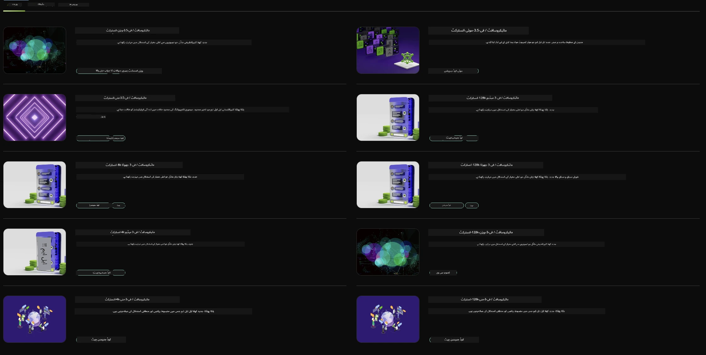

## NVIDIA NIM میں Phi فیملی

NVIDIA NIM ایک آسان استعمال کے لیے مائیکرو سروسز کا مجموعہ ہے جو کلاؤڈ، ڈیٹا سینٹر، اور ورک سٹیشنز میں جنریٹو AI ماڈلز کی تعیناتی کو تیز کرتا ہے۔ NIMs کو ماڈل فیملی اور ہر ماڈل کی بنیاد پر درجہ بندی کیا جاتا ہے۔ مثال کے طور پر، بڑے زبان کے ماڈلز (LLMs) کے لیے NVIDIA NIM جدید ترین LLMs کی طاقت کو انٹرپرائز ایپلیکیشنز تک پہنچاتا ہے، جو بے مثال قدرتی زبان کی پروسیسنگ اور سمجھ بوجھ کی صلاحیتیں فراہم کرتا ہے۔

NIM IT اور DevOps ٹیموں کے لیے اپنے منظم ماحول میں بڑے زبان کے ماڈلز (LLMs) کو خود ہوسٹ کرنا آسان بناتا ہے، جبکہ ڈویلپرز کو انڈسٹری اسٹینڈرڈ APIs فراہم کرتا ہے جو انہیں طاقتور کوپائلٹس، چیٹ بوٹس، اور AI اسسٹنٹس بنانے کی اجازت دیتے ہیں جو ان کے کاروبار کو تبدیل کر سکتے ہیں۔ NVIDIA کی جدید GPU ایکسیلیریشن اور اسکیل ایبل تعیناتی کا فائدہ اٹھاتے ہوئے، NIM بہترین کارکردگی کے ساتھ تیز ترین انفرنس کا راستہ فراہم کرتا ہے۔

آپ NVIDIA NIM کو Phi فیملی ماڈلز کی انفرنس کے لیے استعمال کر سکتے ہیں



### **نمونے - NVIDIA NIM میں Phi-3-Vision**

تصور کریں کہ آپ کے پاس ایک تصویر (`demo.png`) ہے اور آپ ایسا Python کوڈ بنانا چاہتے ہیں جو اس تصویر کو پروسیس کرے اور اس کی ایک نئی ورژن (`phi-3-vision.jpg`) محفوظ کرے۔

اوپر دیا گیا کوڈ اس عمل کو خودکار بناتا ہے:

1. ماحول اور ضروری ترتیبات کو سیٹ اپ کرنا۔
2. ایک پرامپٹ بنانا جو ماڈل کو مطلوبہ Python کوڈ بنانے کی ہدایت دیتا ہے۔
3. پرامپٹ کو ماڈل کو بھیجنا اور تیار شدہ کوڈ جمع کرنا۔
4. تیار شدہ کوڈ کو نکالنا اور چلانا۔
5. اصل اور پروسیس شدہ تصاویر دکھانا۔

یہ طریقہ AI کی طاقت کو استعمال کرتے ہوئے تصویر پروسیسنگ کے کاموں کو خودکار بناتا ہے، جس سے آپ کے مقاصد کو حاصل کرنا آسان اور تیز ہو جاتا ہے۔

[نمونہ کوڈ حل](../../../../../code/06.E2E/E2E_Nvidia_NIM_Phi3_Vision.ipynb)

آئیے پورے کوڈ کو مرحلہ وار سمجھتے ہیں:

1. **ضروری پیکیج انسٹال کریں**:
    ```python
    !pip install langchain_nvidia_ai_endpoints -U
    ```
    یہ کمانڈ `langchain_nvidia_ai_endpoints` پیکیج کو انسٹال کرتی ہے، اور یقینی بناتی ہے کہ یہ تازہ ترین ورژن ہو۔

2. **ضروری ماڈیولز امپورٹ کریں**:
    ```python
    from langchain_nvidia_ai_endpoints import ChatNVIDIA
    import getpass
    import os
    import base64
    ```
    یہ امپورٹس NVIDIA AI اینڈپوائنٹس کے ساتھ تعامل، پاس ورڈز کو محفوظ طریقے سے ہینڈل کرنے، آپریٹنگ سسٹم کے ساتھ کام کرنے، اور base64 فارمیٹ میں ڈیٹا انکوڈ/ڈیکوڈ کرنے کے لیے ضروری ماڈیولز لاتے ہیں۔

3. **API کی سیٹ اپ کریں**:
    ```python
    if not os.getenv("NVIDIA_API_KEY"):
        os.environ["NVIDIA_API_KEY"] = getpass.getpass("Enter your NVIDIA API key: ")
    ```
    یہ کوڈ چیک کرتا ہے کہ `NVIDIA_API_KEY` ماحول متغیر سیٹ ہے یا نہیں۔ اگر نہیں، تو یہ صارف سے محفوظ طریقے سے API کی مانگتا ہے۔

4. **ماڈل اور تصویر کا راستہ متعین کریں**:
    ```python
    model = 'microsoft/phi-3-vision-128k-instruct'
    chat = ChatNVIDIA(model=model)
    img_path = './imgs/demo.png'
    ```
    یہ ماڈل کو سیٹ کرتا ہے، `ChatNVIDIA` کی ایک مثال بناتا ہے جس میں مخصوص ماڈل استعمال ہوتا ہے، اور تصویر کی فائل کا راستہ متعین کرتا ہے۔

5. **ٹیکسٹ پرامپٹ بنائیں**:
    ```python
    text = "Please create Python code for image, and use plt to save the new picture under imgs/ and name it phi-3-vision.jpg."
    ```
    یہ ایک ٹیکسٹ پرامپٹ ڈیفائن کرتا ہے جو ماڈل کو تصویر پروسیسنگ کے لیے Python کوڈ بنانے کی ہدایت دیتا ہے۔

6. **تصویر کو base64 میں انکوڈ کریں**:
    ```python
    with open(img_path, "rb") as f:
        image_b64 = base64.b64encode(f.read()).decode()
    image = f''
    ```
    یہ کوڈ تصویر کی فائل پڑھتا ہے، اسے base64 میں انکوڈ کرتا ہے، اور انکوڈڈ ڈیٹا کے ساتھ ایک HTML امیج ٹیگ بناتا ہے۔

7. **ٹیکسٹ اور تصویر کو پرامپٹ میں یکجا کریں**:
    ```python
    prompt = f"{text} {image}"
    ```
    یہ ٹیکسٹ پرامپٹ اور HTML امیج ٹیگ کو ایک سٹرنگ میں جوڑتا ہے۔

8. **ChatNVIDIA کے ذریعے کوڈ جنریٹ کریں**:
    ```python
    code = ""
    for chunk in chat.stream(prompt):
        print(chunk.content, end="")
        code += chunk.content
    ```
    یہ کوڈ پرامپٹ کو `ChatNVIDIA` ماڈل کو بھیجتا ہے اور تیار شدہ کوڈ کو ٹکڑوں میں جمع کرتا ہے، ہر ٹکڑا پرنٹ اور `code` سٹرنگ میں شامل کرتا ہے۔

9. **تیار شدہ مواد سے Python کوڈ نکالیں**:
    ```python
    begin = code.index('```python') + 9
    code = code[begin:]
    end = code.index('```')
    code = code[:end]
    ```
    یہ مارک ڈاؤن فارمیٹنگ کو ہٹا کر اصل Python کوڈ نکالتا ہے۔

10. **تیار شدہ کوڈ چلائیں**:
    ```python
    import subprocess
    result = subprocess.run(["python", "-c", code], capture_output=True)
    ```
    یہ نکالا گیا Python کوڈ ایک سب پروسیس کے طور پر چلاتا ہے اور اس کا آؤٹ پٹ حاصل کرتا ہے۔

11. **تصاویر دکھائیں**:
    ```python
    from IPython.display import Image, display
    display(Image(filename='./imgs/phi-3-vision.jpg'))
    display(Image(filename='./imgs/demo.png'))
    ```
    یہ لائنز `IPython.display` ماڈیول کا استعمال کرتے ہوئے تصاویر دکھاتی ہیں۔

**دستخطی دستبرداری**:  
یہ دستاویز AI ترجمہ سروس [Co-op Translator](https://github.com/Azure/co-op-translator) کے ذریعے ترجمہ کی گئی ہے۔ اگرچہ ہم درستگی کے لیے کوشاں ہیں، براہ کرم آگاہ رہیں کہ خودکار ترجمے میں غلطیاں یا عدم درستیاں ہو سکتی ہیں۔ اصل دستاویز اپنی مادری زبان میں ہی معتبر ماخذ سمجھی جانی چاہیے۔ اہم معلومات کے لیے پیشہ ور انسانی ترجمہ کی سفارش کی جاتی ہے۔ اس ترجمے کے استعمال سے پیدا ہونے والی کسی بھی غلط فہمی یا غلط تشریح کی ذمہ داری ہم پر عائد نہیں ہوتی۔