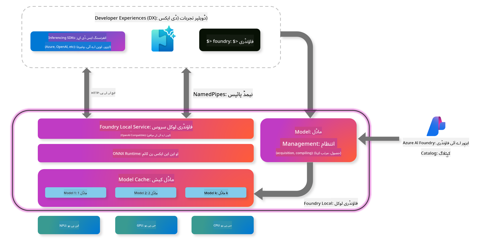

<!--
CO_OP_TRANSLATOR_METADATA:
{
  "original_hash": "52973a5680a65a810aa80b7036afd31f",
  "translation_date": "2025-07-16T19:42:40+00:00",
  "source_file": "md/01.Introduction/02/07.FoundryLocal.md",
  "language_code": "ur"
}
-->
## Foundry Local میں Phi-Family ماڈلز کے ساتھ شروعات

### Foundry Local کا تعارف

Foundry Local ایک طاقتور آن-ڈیوائس AI انفرنس حل ہے جو انٹرپرائز گریڈ AI صلاحیتیں براہ راست آپ کے مقامی ہارڈویئر پر فراہم کرتا ہے۔ یہ ٹیوٹوریل آپ کو Foundry Local کے ساتھ Phi-Family ماڈلز کو سیٹ اپ اور استعمال کرنے کا طریقہ سکھائے گا، جس سے آپ کو اپنے AI ورک لوڈز پر مکمل کنٹرول حاصل ہوگا، ساتھ ہی پرائیویسی برقرار رہے گی اور لاگت کم ہوگی۔

Foundry Local آپ کے ڈیوائس پر AI ماڈلز کو مقامی طور پر چلانے کے ذریعے کارکردگی، پرائیویسی، تخصیص اور لاگت کے فوائد فراہم کرتا ہے۔ یہ ایک آسان CLI، SDK، اور REST API کے ذریعے آپ کے موجودہ ورک فلو اور ایپلیکیشنز میں بغیر کسی رکاوٹ کے ضم ہو جاتا ہے۔



### Foundry Local کیوں منتخب کریں؟

Foundry Local کے فوائد کو سمجھنا آپ کو اپنے AI تعیناتی حکمت عملی کے بارے میں بہتر فیصلے کرنے میں مدد دے گا:

- **آن-ڈیوائس انفرنس:** ماڈلز کو اپنے ہارڈویئر پر مقامی طور پر چلائیں، اپنی لاگت کم کریں اور تمام ڈیٹا اپنے ڈیوائس پر رکھیں۔

- **ماڈل تخصیص:** پری سیٹ ماڈلز میں سے انتخاب کریں یا اپنی ضروریات اور استعمال کے کیسز کے مطابق اپنا ماڈل استعمال کریں۔

- **لاگت کی بچت:** موجودہ ہارڈویئر استعمال کر کے بار بار کلاؤڈ سروسز کی فیس سے بچیں، جس سے AI زیادہ قابل رسائی ہو جاتا ہے۔

- **بغیر رکاوٹ انضمام:** SDK، API اینڈ پوائنٹس، یا CLI کے ذریعے اپنی ایپلیکیشنز سے جڑیں، اور جیسے جیسے آپ کی ضروریات بڑھیں Azure AI Foundry پر آسانی سے اسکیل کریں۔

> **Getting Started Note:** یہ ٹیوٹوریل Foundry Local کو CLI اور SDK انٹرفیسز کے ذریعے استعمال کرنے پر مرکوز ہے۔ آپ دونوں طریقے سیکھیں گے تاکہ اپنے استعمال کے کیس کے لیے بہترین طریقہ منتخب کر سکیں۔

## حصہ 1: Foundry Local CLI کی سیٹ اپ

### مرحلہ 1: انسٹالیشن

Foundry Local CLI آپ کا ذریعہ ہے AI ماڈلز کو مقامی طور پر منظم اور چلانے کے لیے۔ آئیے اسے اپنے سسٹم پر انسٹال کرتے ہیں۔

**موافق پلیٹ فارمز:** Windows اور macOS

تفصیلی انسٹالیشن ہدایات کے لیے براہ کرم [official Foundry Local documentation](https://github.com/microsoft/Foundry-Local/blob/main/README.md) ملاحظہ کریں۔

### مرحلہ 2: دستیاب ماڈلز کی دریافت

ایک بار Foundry Local CLI انسٹال ہو جائے، آپ اپنے استعمال کے کیس کے لیے دستیاب ماڈلز دریافت کر سکتے ہیں۔ یہ کمانڈ آپ کو تمام سپورٹڈ ماڈلز دکھائے گی:

```bash
foundry model list
```

### مرحلہ 3: Phi Family ماڈلز کو سمجھنا

Phi Family مختلف استعمال کے کیسز اور ہارڈویئر کنفیگریشنز کے لیے بہتر بنائے گئے ماڈلز کی ایک رینج پیش کرتی ہے۔ یہاں Foundry Local میں دستیاب Phi ماڈلز ہیں:

**دستیاب Phi ماڈلز:** 

- **phi-3.5-mini** - بنیادی کاموں کے لیے کمپیکٹ ماڈل
- **phi-3-mini-128k** - طویل گفتگو کے لیے توسیع شدہ کانٹیکسٹ ورژن
- **phi-3-mini-4k** - عمومی استعمال کے لیے معیاری کانٹیکسٹ ماڈل
- **phi-4** - بہتر صلاحیتوں کے ساتھ جدید ماڈل
- **phi-4-mini** - Phi-4 کا ہلکا ورژن
- **phi-4-mini-reasoning** - پیچیدہ استدلال کے کاموں کے لیے خاص

> **ہارڈویئر مطابقت:** ہر ماڈل کو آپ کے سسٹم کی صلاحیتوں کے مطابق مختلف ہارڈویئر ایکسیلیریشن (CPU، GPU) کے لیے کنفیگر کیا جا سکتا ہے۔

### مرحلہ 4: اپنا پہلا Phi ماڈل چلانا

آئیے ایک عملی مثال سے شروع کرتے ہیں۔ ہم `phi-4-mini-reasoning` ماڈل چلائیں گے، جو پیچیدہ مسائل کو مرحلہ وار حل کرنے میں ماہر ہے۔

**ماڈل چلانے کا کمانڈ:**

```bash
foundry model run Phi-4-mini-reasoning-generic-cpu
```

> **پہلی بار سیٹ اپ:** جب آپ ماڈل پہلی بار چلائیں گے، Foundry Local خود بخود اسے آپ کے مقامی ڈیوائس پر ڈاؤن لوڈ کرے گا۔ ڈاؤن لوڈ کا وقت آپ کے نیٹ ورک کی رفتار پر منحصر ہوتا ہے، لہٰذا ابتدائی سیٹ اپ کے دوران صبر کریں۔

### مرحلہ 5: ماڈل کو حقیقی مسئلے کے ساتھ ٹیسٹ کرنا

اب آئیے اپنے ماڈل کو ایک کلاسک لاجک مسئلے کے ساتھ ٹیسٹ کریں تاکہ دیکھیں کہ یہ مرحلہ وار استدلال کیسے کرتا ہے:

**مثال مسئلہ:**

```txt
Please calculate the following step by step: Now there are pheasants and rabbits in the same cage, there are thirty-five heads on top and ninety-four legs on the bottom, how many pheasants and rabbits are there?
```

**متوقع رویہ:** ماڈل اس مسئلے کو منطقی مراحل میں تقسیم کرے گا، اس بات کو استعمال کرتے ہوئے کہ فیزنٹس کے 2 پیر ہوتے ہیں اور خرگوشوں کے 4 پیر، تاکہ مساوات کا نظام حل کیا جا سکے۔

**نتائج:**


## حصہ 2: Foundry Local SDK کے ساتھ ایپلیکیشنز بنانا

### SDK کیوں استعمال کریں؟

جبکہ CLI ٹیسٹنگ اور فوری تعاملات کے لیے بہترین ہے، SDK آپ کو Foundry Local کو پروگراماتی طور پر اپنی ایپلیکیشنز میں ضم کرنے کی سہولت دیتا ہے۔ اس سے آپ کو یہ امکانات حاصل ہوتے ہیں:

- اپنی مرضی کی AI سے چلنے والی ایپلیکیشنز بنانا
- خودکار ورک فلو تیار کرنا
- موجودہ سسٹمز میں AI صلاحیتوں کو ضم کرنا
- چیٹ بوٹس اور انٹرایکٹو ٹولز تیار کرنا

### سپورٹڈ پروگرامنگ زبانیں

Foundry Local متعدد پروگرامنگ زبانوں کے لیے SDK سپورٹ فراہم کرتا ہے تاکہ آپ کی ترقی کی ترجیحات کے مطابق ہو:

**📦 دستیاب SDKs:**

- **C# (.NET):** [SDK Documentation & Examples](https://github.com/microsoft/Foundry-Local/tree/main/sdk/cs)
- **Python:** [SDK Documentation & Examples](https://github.com/microsoft/Foundry-Local/tree/main/sdk/python)
- **JavaScript:** [SDK Documentation & Examples](https://github.com/microsoft/Foundry-Local/tree/main/sdk/js)
- **Rust:** [SDK Documentation & Examples](https://github.com/microsoft/Foundry-Local/tree/main/sdk/rust)

### اگلے اقدامات

1. **اپنے ترقیاتی ماحول کے مطابق پسندیدہ SDK منتخب کریں**
2. **SDK مخصوص دستاویزات پر عمل کریں** تاکہ تفصیلی نفاذ کی رہنمائی حاصل ہو
3. **سادہ مثالوں سے شروع کریں** اس سے پہلے کہ پیچیدہ ایپلیکیشنز بنائیں
4. **ہر SDK ریپوزیٹری میں فراہم کردہ نمونہ کوڈ کو دریافت کریں**

## نتیجہ

اب آپ نے سیکھ لیا ہے کہ کیسے:
- ✅ Foundry Local CLI انسٹال اور سیٹ اپ کریں
- ✅ Phi Family ماڈلز دریافت اور چلائیں
- ✅ حقیقی دنیا کے مسائل کے ساتھ ماڈلز کو ٹیسٹ کریں
- ✅ ایپلیکیشن ڈیولپمنٹ کے لیے SDK کے اختیارات کو سمجھیں

Foundry Local آپ کے مقامی ماحول میں AI صلاحیتیں لانے کے لیے ایک مضبوط بنیاد فراہم کرتا ہے، جس سے آپ کو کارکردگی، پرائیویسی، اور لاگت پر کنٹرول حاصل ہوتا ہے، اور جب ضرورت ہو تو کلاؤڈ حل کی طرف اسکیل کرنے کی لچک بھی ملتی ہے۔

**دستخطی نوٹ**:  
یہ دستاویز AI ترجمہ سروس [Co-op Translator](https://github.com/Azure/co-op-translator) کے ذریعے ترجمہ کی گئی ہے۔ اگرچہ ہم درستگی کے لیے کوشاں ہیں، براہ کرم آگاہ رہیں کہ خودکار ترجمے میں غلطیاں یا عدم درستیاں ہو سکتی ہیں۔ اصل دستاویز اپنی مادری زبان میں ہی معتبر ماخذ سمجھی جانی چاہیے۔ اہم معلومات کے لیے پیشہ ور انسانی ترجمہ کی سفارش کی جاتی ہے۔ اس ترجمے کے استعمال سے پیدا ہونے والی کسی بھی غلط فہمی یا غلط تشریح کی ذمہ داری ہم پر عائد نہیں ہوتی۔