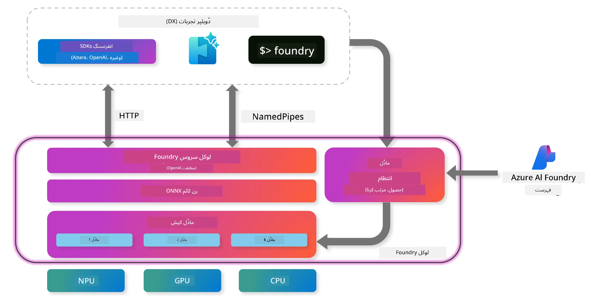
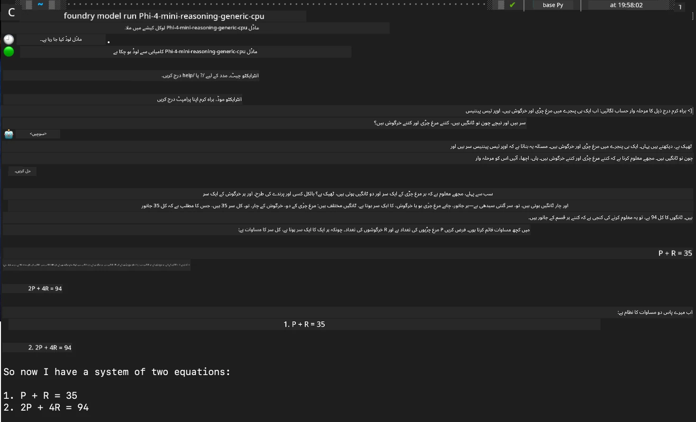

## فاؤنڈری لوکل میں فی-فیملی ماڈلز کے ساتھ شروعات

### فاؤنڈری لوکل کا تعارف

فاؤنڈری لوکل ایک طاقتور آن ڈیوائس AI انفرنس حل ہے جو ادارہ جاتی معیار کی AI صلاحیتیں براہِ راست آپ کے مقامی ہارڈویئر پر فراہم کرتا ہے۔ یہ ٹیوٹوریل آپ کو فاؤنڈری لوکل کے ساتھ فی-فیملی ماڈلز کو سیٹ اپ اور استعمال کرنے میں رہنمائی کرے گا، جس سے آپ کو اپنے AI ورکلوڈز پر مکمل کنٹرول ملے گا جبکہ رازداری برقرار رہے گی اور اخراجات کم ہوں گے۔

فاؤنڈری لوکل آپ کے ڈیوائس پر AI ماڈلز کو لوکل طور پر چلا کر کارکردگی، رازداری، تخصیص اور لاگت کے فوائد فراہم کرتا ہے۔ یہ آپ کے موجودہ ورک فلو اور ایپلیکیشنز میں CLI، SDK، اور REST API کے ذریعے بغیر کسی رکاوٹ کے ضم ہو جاتا ہے۔




### فاؤنڈری لوکل کیوں منتخب کریں؟

فاؤنڈری لوکل کے فوائد کو سمجھنا آپ کو اپنے AI تعیناتی کی حکمت عملی کے بارے میں باخبر فیصلے کرنے میں مدد دے گا:

- **آن ڈیوائس انفرنس:** ماڈلز کو اپنی ہی ہارڈویئر پر لوکل چلائیں، اپنے اخراجات کم کریں اور تمام ڈیٹا اپنے ڈیوائس پر ہی رکھیں۔

- **ماڈل تخصیص:** پری سیٹ ماڈلز میں سے انتخاب کریں یا مخصوص ضروریات اور استعمال کے معاملات کے لیے اپنا ماڈل استعمال کریں۔

- **لاگت کی بچت:** موجودہ ہارڈویئر استعمال کرکے بار بار کلاؤڈ سروس کے اخراجات ختم کریں، AI کو زیادہ قابل رسائی بنائیں۔

- **بغیر رکاوٹ ضم:** SDK، API اینڈ پوائنٹس، یا CLI کے ذریعے اپنی درخواستوں سے منسلک کریں، اور جیسے جیسے ضروریات بڑھیں مائیکروسافٹ فاؤنڈری تک آسان اسکیلنگ کریں۔

> **شروع کرنے کا نوٹ:** یہ ٹیوٹوریل CLI اور SDK انٹرفیس کے ذریعے فاؤنڈری لوکل کے استعمال پر مرکوز ہے۔ آپ دونوں طریقے سیکھیں گے تاکہ اپنی استعمال کی صورتحال کے لئے بہترین طریقہ منتخب کر سکیں۔

## حصہ ۱: فاؤنڈری لوکل CLI سیٹ اپ کرنا

### مرحلہ 1: تنصیب

فاؤنڈری لوکل CLI آپ کے لئے AI ماڈلز کو لوکل مینیج اور چلانے کا دروازہ ہے۔ آئیے اسے اپنے سسٹم پر انسٹال کریں۔

**معاون پلیٹ فارمز:** ونڈوز اور میک او ایس

تفصیلی تنصیب کی ہدایات کے لئے، براہ کرم [سرکاری فاؤنڈری لوکل دستاویزات](https://github.com/microsoft/Foundry-Local/blob/main/README.md) کا حوالہ دیں۔

### مرحلہ 2: دستیاب ماڈلز کا جائزہ لینا

جب آپ نے فاؤنڈری لوکل CLI انسٹال کر لیا، تو آپ دیکھ سکتے ہیں کہ آپ کے استعمال کے لئے کون سے ماڈلز دستیاب ہیں۔ یہ کمانڈ آپ کو تمام معاون ماڈلز دکھائے گا:


```bash
foundry model list
```

### مرحلہ 3: فی فیملی ماڈلز کو سمجھنا

فی فیملی مختلف استعمالات اور ہارڈویئر کنفیگریشنز کے لئے بہتر کردہ کئی ماڈلز پیش کرتی ہے۔ فاؤنڈری لوکل میں دستیاب فی ماڈلز یہ ہیں:

**دستیاب فی ماڈلز:** 

- **phi-3.5-mini** - بنیادی کاموں کے لئے کمپیکٹ ماڈل
- **phi-3-mini-128k** - طویل بات چیت کے لئے توسیع شدہ کانٹیکسٹ ورژن
- **phi-3-mini-4k** - عمومی استعمال کا معیاری کانٹیکسٹ ماڈل
- **phi-4** - بہتر صلاحیتوں کے ساتھ جدید ماڈل
- **phi-4-mini** - فی-4 کا ہلکا ورژن
- **phi-4-mini-reasoning** - پیچیدہ استدلالی کاموں کے لیے خصوصی ماڈل

> **ہارڈویئر مطابقت:** ہر ماڈل کو آپ کے سسٹم کی صلاحیتوں کے مطابق مختلف ہارڈویئر ایکسیلیریشن (CPU, GPU) کے لئے ترتیب دیا جا سکتا ہے۔

### مرحلہ 4: اپنا پہلا فی ماڈل چلانا

آئیے ایک عملی مثال سے شروع کریں۔ ہم `phi-4-mini-reasoning` ماڈل چلائیں گے، جو مرحلہ وار پیچیدہ مسائل حل کرنے میں ماہر ہے۔


**ماڈل چلانے کا کمانڈ:**

```bash
foundry model run Phi-4-mini-reasoning-generic-cpu
```

> **پہلی بار سیٹ اپ:** جب آپ ماڈل کو پہلی بار چلائیں گے، تو فاؤنڈری لوکل خود بخود اسے آپ کے مقامی آلے پر ڈاؤن لوڈ کرے گا۔ نیٹ ورک سپیڈ کے مطابق ڈاؤن لوڈ کا وقت مختلف ہو سکتا ہے، لہٰذا ابتدائی سیٹ اپ کے دوران صبر کریں۔

### مرحلہ 5: حقیقی مسئلے کے ساتھ ماڈل کی جانچ

اب ہم اپنے ماڈل کو ایک کلاسیکی منطقی مسئلے کے ساتھ ٹیسٹ کرتے ہیں تاکہ دیکھیں یہ مرحلہ وار استدلال کیسے کرتا ہے:

**مثال مسئلہ:**

```txt
Please calculate the following step by step: Now there are pheasants and rabbits in the same cage, there are thirty-five heads on top and ninety-four legs on the bottom, how many pheasants and rabbits are there?
```

**متوقع رویہ:** ماڈل کو اس مسئلے کو منطقی مراحل میں توڑنا چاہیے، یہ استعمال کرتے ہوئے کہ فیزنٹس کے 2 پیر ہوتے ہیں اور خرگوش کے 4 پیر ہوتے ہیں تاکہ مساوات کے نظام کو حل کیا جا سکے۔

**نتائج:**



## حصہ ۲: فاؤنڈری لوکل SDK کے ساتھ ایپلیکیشنز بنانا

### SDK کیوں استعمال کریں؟

جبکہ CLI ٹیسٹنگ اور فوری تعامل کے لئے بہترین ہے، SDK آپ کو فاؤنڈری لوکل کو پروگرامنگ کے ذریعے اپنی ایپلیکیشنز میں ضم کرنے کی اجازت دیتا ہے۔ اس سے مندرجہ ذیل امکانات کھلتے ہیں:

- اپنی مرضی کی AI سے چلنے والی ایپلیکیشنز بنانا
- خودکار ورک فلو تیار کرنا
- موجودہ سسٹمز میں AI صلاحیتوں کو ضم کرنا
- چیٹ بوٹس اور انٹرایکٹو ٹولز تیار کرنا

### معاون پروگرامنگ زبانیں

فاؤنڈری لوکل مختلف پروگرامنگ زبانوں کے لئے SDK سپورٹ فراہم کرتا ہے تاکہ آپ کی ترقی کی ترجیحات کے مطابق ہو:

**📦 دستیاب SDKs:**

- **C# (.NET):** [SDK دستاویزات اور مثالیں](https://github.com/microsoft/Foundry-Local/tree/main/sdk/cs)
- **Python:** [SDK دستاویزات اور مثالیں](https://github.com/microsoft/Foundry-Local/tree/main/sdk/python)
- **JavaScript:** [SDK دستاویزات اور مثالیں](https://github.com/microsoft/Foundry-Local/tree/main/sdk/js)
- **Rust:** [SDK دستاویزات اور مثالیں](https://github.com/microsoft/Foundry-Local/tree/main/sdk/rust)

### اگلے مراحل

1. اپنے ترقیاتی ماحول کی بنیاد پر مطلوبہ SDK منتخب کریں  
2. تفصیلی عمل درآمد کے لئے SDK مخصوص دستاویزات پر عمل کریں  
3. پیچیدہ ایپلیکیشنز بنانے سے پہلے سادہ مثالوں سے شروع کریں  
4. ہر SDK ریپوزیٹری میں فراہم کردہ نمونہ کوڈ کو دریافت کریں

## نتیجہ

آپ نے اب سیکھ لیا ہے کہ:
- ✅ فاؤنڈری لوکل CLI کو انسٹال اور سیٹ اپ کیسے کریں  
- ✅ فی فیملی ماڈلز کو دریافت اور چلائیں  
- ✅ حقیقی دنیا کے مسائل کے ساتھ ماڈلز کو ٹیسٹ کریں  
- ✅ ایپلیکیشن ڈویلپمنٹ کے لیے SDK کے اختیارات کو سمجھیں

فاؤنڈری لوکل آپ کے مقامی ماحول میں براہِ راست AI صلاحیتیں لانے کے لیے ایک طاقتور بنیاد فراہم کرتا ہے، جس سے آپ کو کارکردگی، رازداری، اور لاگت پر قابو ملتا ہے جبکہ ضرورت پڑنے پر کلاؤڈ حل کی طرف لچکدار اسکیلنگ کی سہولت بھی دیتا ہے۔

---

<!-- CO-OP TRANSLATOR DISCLAIMER START -->
**دستخطی دستبرداری**:  
یہ دستاویز AI ترجمہ سروس [Co-op Translator](https://github.com/Azure/co-op-translator) کے ذریعے ترجمہ کی گئی ہے۔ اگرچہ ہم درستگی کی کوشش کرتے ہیں، براہ کرم آگاہ رہیں کہ خودکار تراجم میں غلطیاں یا غیر دقیقیاں ہو سکتی ہیں۔ اصل دستاویز اپنی مادری زبان میں ہی معتبر ماخذ سمجھی جانی چاہیے۔ اہم معلومات کے لیے پیشہ ورانہ انسانی ترجمہ تجویز کیا جاتا ہے۔ ہم اس ترجمے کے استعمال سے پیدا ہونے والی کسی بھی غلط فہمی یا بدفہمی کے ذمہ دار نہیں ہیں۔
<!-- CO-OP TRANSLATOR DISCLAIMER END -->