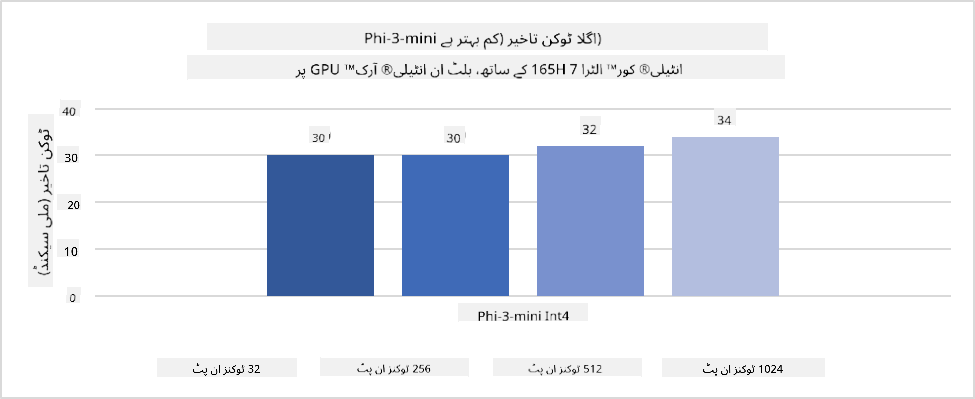
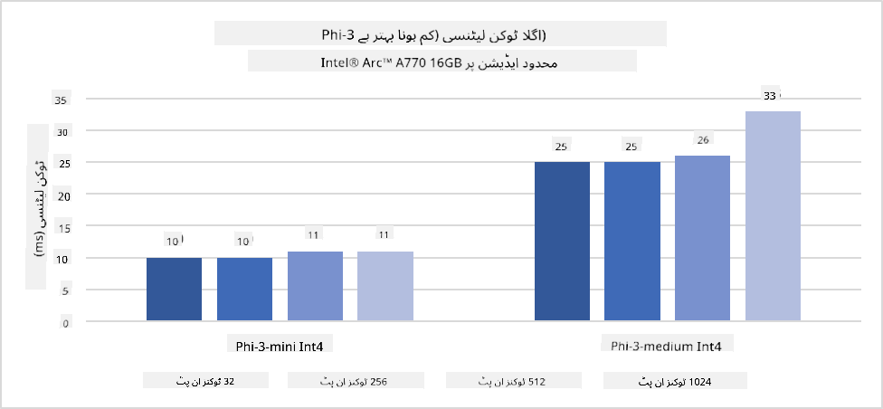
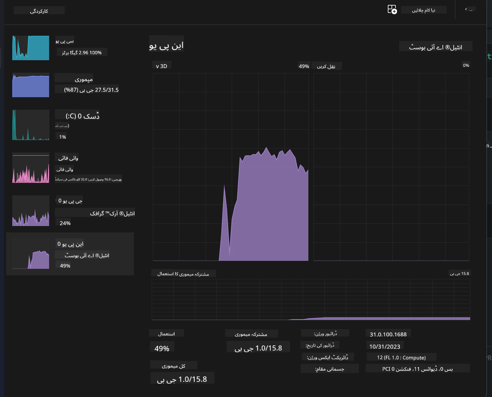
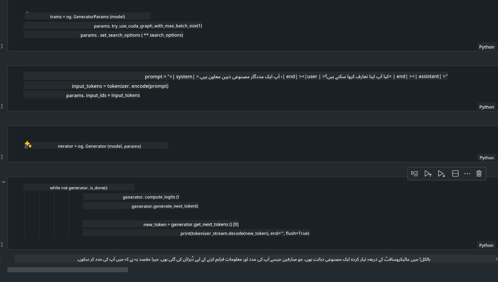
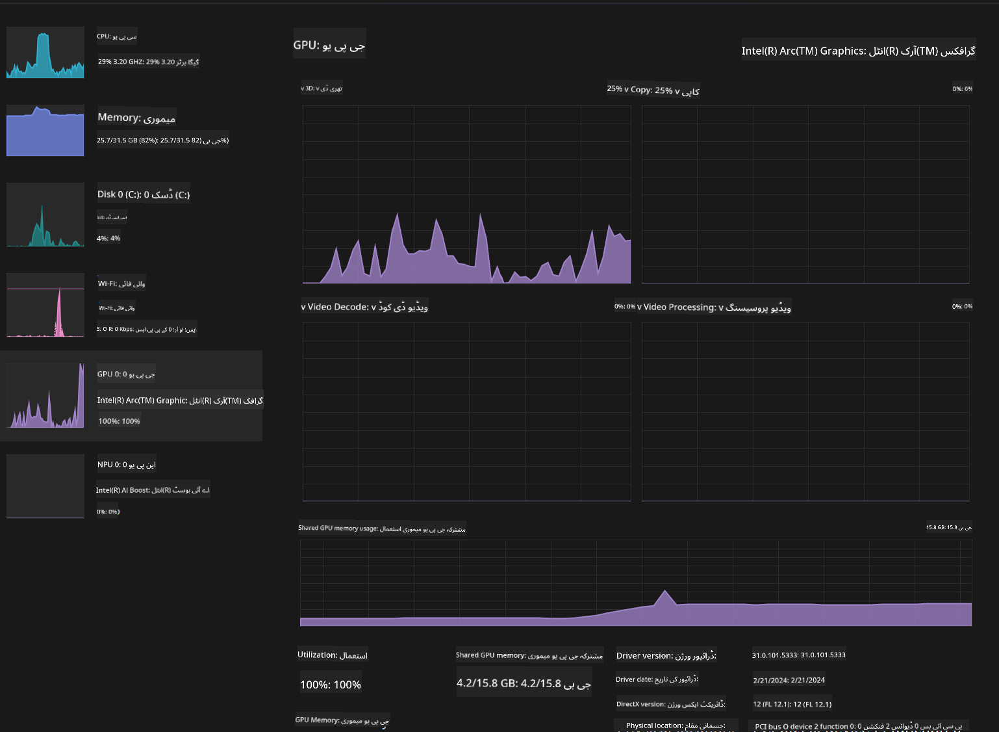

<!--
CO_OP_TRANSLATOR_METADATA:
{
  "original_hash": "5ca6ea8da7aa1335ef287124462b2833",
  "translation_date": "2025-04-03T06:47:07+00:00",
  "source_file": "md\\01.Introduction\\03\\AIPC_Inference.md",
  "language_code": "ur"
}
-->
# **AI PC میں Phi-3 انفرینس**

جنریٹو AI کی ترقی اور ایج ڈیوائسز کی ہارڈویئر صلاحیتوں میں بہتری کے ساتھ، اب زیادہ سے زیادہ جنریٹو AI ماڈلز کو صارفین کے BYOD (اپنا ڈیوائس لائیں) ڈیوائسز میں شامل کیا جا سکتا ہے۔ AI PCs ان ماڈلز میں شامل ہیں۔ 2024 سے شروع کرتے ہوئے، Intel، AMD، اور Qualcomm نے PC مینوفیکچررز کے ساتھ تعاون کیا ہے تاکہ ہارڈویئر میں تبدیلی کے ذریعے لوکلائزڈ جنریٹو AI ماڈلز کی تعیناتی کو آسان بنایا جا سکے۔ اس بحث میں، ہم Intel AI PCs پر توجہ مرکوز کریں گے اور دیکھیں گے کہ Intel AI PC پر Phi-3 کو کیسے تعینات کیا جا سکتا ہے۔

### NPU کیا ہے؟

NPU (نیورل پروسیسنگ یونٹ) ایک مخصوص پروسیسر یا پروسیسنگ یونٹ ہے جو بڑے SoC پر AI اور نیورل نیٹ ورک کے آپریشنز کو تیز کرنے کے لیے بنایا گیا ہے۔ عام CPUs اور GPUs کے برعکس، NPUs ڈیٹا پر مبنی متوازی کمپیوٹنگ کے لیے بہتر ہوتے ہیں، جو ویڈیوز اور تصاویر جیسے بڑے ملٹی میڈیا ڈیٹا کو پروسیس کرنے اور نیورل نیٹ ورک کے ڈیٹا کو پروسیس کرنے میں انتہائی مؤثر ہوتے ہیں۔ یہ AI سے متعلقہ کاموں میں خاص طور پر مہارت رکھتے ہیں، جیسے کہ آواز کی شناخت، ویڈیو کالز میں پس منظر دھندلا کرنا، اور تصاویر یا ویڈیوز کی ایڈیٹنگ جیسے آبجیکٹ کی شناخت۔

## NPU بمقابلہ GPU

اگرچہ بہت سے AI اور مشین لرننگ کے کام GPUs پر چلتے ہیں، GPUs اور NPUs کے درمیان ایک اہم فرق موجود ہے۔
GPUs اپنی متوازی کمپیوٹنگ صلاحیتوں کے لیے جانے جاتے ہیں، لیکن تمام GPUs گرافکس پروسیسنگ کے علاوہ اتنے مؤثر نہیں ہوتے۔ دوسری طرف، NPUs خاص طور پر نیورل نیٹ ورک آپریشنز میں شامل پیچیدہ حسابات کے لیے بنائے گئے ہیں، جو انہیں AI کے کاموں کے لیے انتہائی مؤثر بناتے ہیں۔

خلاصہ میں، NPUs وہ ریاضی کے ماہر ہیں جو AI کمپیوٹیشنز کو تیز کرتے ہیں، اور وہ AI PCs کے ابھرتے ہوئے دور میں اہم کردار ادا کرتے ہیں!

***یہ مثال Intel کے جدید Intel Core Ultra پروسیسر پر مبنی ہے***

## **1. NPU کے ذریعے Phi-3 ماڈل چلائیں**

Intel® NPU ڈیوائس ایک AI انفرینس ایکسیلیریٹر ہے جو Intel کلائنٹ CPUs کے ساتھ مربوط ہے، جو Intel® Core™ Ultra جنریشن CPUs (جسے پہلے Meteor Lake کہا جاتا تھا) سے شروع ہوتا ہے۔ یہ مصنوعی نیورل نیٹ ورک کے کاموں کو توانائی کے لحاظ سے مؤثر طریقے سے انجام دینے کی سہولت فراہم کرتا ہے۔





**Intel NPU Acceleration Library**

Intel NPU Acceleration Library [https://github.com/intel/intel-npu-acceleration-library](https://github.com/intel/intel-npu-acceleration-library) ایک Python لائبریری ہے جو Intel Neural Processing Unit (NPU) کی طاقت کو استعمال کرتے ہوئے آپ کی ایپلیکیشنز کی کارکردگی کو بہتر بنانے کے لیے ڈیزائن کی گئی ہے، تاکہ ہم آہنگ ہارڈویئر پر تیز رفتار کمپیوٹیشنز انجام دی جا سکیں۔

Intel® Core™ Ultra پروسیسرز پر مبنی AI PC پر Phi-3-mini کی مثال۔


Python لائبریری کو pip کے ذریعے انسٹال کریں

```bash

   pip install intel-npu-acceleration-library

```

***نوٹ*** یہ پروجیکٹ ابھی ترقی کے مراحل میں ہے، لیکن حوالہ ماڈل پہلے ہی کافی مکمل ہے۔

### **Intel NPU Acceleration Library کے ذریعے Phi-3 چلانا**

Intel NPU ایکسیلیریشن کا استعمال کرتے ہوئے، یہ لائبریری روایتی انکوڈنگ عمل کو متاثر نہیں کرتی۔ آپ کو صرف اس لائبریری کو استعمال کرنا ہوگا تاکہ اصل Phi-3 ماڈل کو مقدار میں تبدیل کیا جا سکے، جیسے FP16، INT8، INT4، وغیرہ۔

```python
from transformers import AutoTokenizer, pipeline,TextStreamer
from intel_npu_acceleration_library import NPUModelForCausalLM, int4
from intel_npu_acceleration_library.compiler import CompilerConfig
import warnings

model_id = "microsoft/Phi-3-mini-4k-instruct"

compiler_conf = CompilerConfig(dtype=int4)
model = NPUModelForCausalLM.from_pretrained(
    model_id, use_cache=True, config=compiler_conf, attn_implementation="sdpa"
).eval()

tokenizer = AutoTokenizer.from_pretrained(model_id)

text_streamer = TextStreamer(tokenizer, skip_prompt=True)
```

جب مقدار کامیابی سے مکمل ہو جائے، تو NPU کو کال کرنے کے لیے عمل جاری رکھیں تاکہ Phi-3 ماڈل چلایا جا سکے۔

```python
generation_args = {
   "max_new_tokens": 1024,
   "return_full_text": False,
   "temperature": 0.3,
   "do_sample": False,
   "streamer": text_streamer,
}

pipe = pipeline(
   "text-generation",
   model=model,
   tokenizer=tokenizer,
)

query = "<|system|>You are a helpful AI assistant.<|end|><|user|>Can you introduce yourself?<|end|><|assistant|>"

with warnings.catch_warnings():
    warnings.simplefilter("ignore")
    pipe(query, **generation_args)
```

کوڈ چلاتے وقت، ہم ٹاسک مینیجر کے ذریعے NPU کے چلنے کی حالت دیکھ سکتے ہیں۔



***نمونے*** : [AIPC_NPU_DEMO.ipynb](../../../../../code/03.Inference/AIPC/AIPC_NPU_DEMO.ipynb)

## **2. DirectML + ONNX Runtime کے ذریعے Phi-3 ماڈل چلائیں**

### **DirectML کیا ہے؟**

[DirectML](https://github.com/microsoft/DirectML) ایک ہائی پرفارمنس، ہارڈویئر-ایکسلیریٹڈ DirectX 12 لائبریری ہے جو مشین لرننگ کے لیے ہے۔ DirectML عام مشین لرننگ کے کاموں کے لیے GPU ایکسیلیریشن فراہم کرتا ہے، جو وسیع پیمانے پر سپورٹ شدہ ہارڈویئر اور ڈرائیورز پر کام کرتا ہے، جن میں AMD، Intel، NVIDIA، اور Qualcomm کے تمام DirectX 12-قابل GPUs شامل ہیں۔

جب standalone استعمال کیا جائے، DirectML API ایک low-level DirectX 12 لائبریری ہے اور فریم ورکس، گیمز، اور دیگر real-time ایپلیکیشنز جیسے high-performance، low-latency ایپلیکیشنز کے لیے موزوں ہے۔ DirectML کی Direct3D 12 کے ساتھ seamless interoperability اور اس کا کم overhead اسے مشین لرننگ کے لیے مثالی بناتا ہے، خاص طور پر جب اعلیٰ کارکردگی اور ہارڈویئر کے درمیان نتائج کی پیش گوئی اور اعتماد ضروری ہو۔

***نوٹ*** : جدید DirectML پہلے ہی NPU کو سپورٹ کرتا ہے (https://devblogs.microsoft.com/directx/introducing-neural-processor-unit-npu-support-in-directml-developer-preview/)

### DirectML اور CUDA کی صلاحیتوں اور کارکردگی کے لحاظ سے موازنہ:

**DirectML** مائیکروسافٹ کے ذریعہ تیار کردہ ایک مشین لرننگ لائبریری ہے۔ یہ ونڈوز ڈیوائسز پر مشین لرننگ کے کاموں کو تیز کرنے کے لیے ڈیزائن کیا گیا ہے، جن میں ڈیسک ٹاپ، لیپ ٹاپ، اور ایج ڈیوائسز شامل ہیں۔
- DX12-Based: DirectML DirectX 12 (DX12) پر مبنی ہے، جو GPUs کے وسیع رینج پر ہارڈویئر سپورٹ فراہم کرتا ہے، جن میں NVIDIA اور AMD دونوں شامل ہیں۔
- وسیع سپورٹ: DX12 کا فائدہ اٹھانے کی وجہ سے، DirectML کسی بھی GPU کے ساتھ کام کر سکتا ہے جو DX12 کو سپورٹ کرتا ہے، یہاں تک کہ integrated GPUs۔
- امیج پروسیسنگ: DirectML نیورل نیٹ ورکس کا استعمال کرتے ہوئے تصاویر اور دیگر ڈیٹا کو پروسیس کرتا ہے، جو امیج ریکگنیشن، آبجیکٹ ڈیٹیکشن، اور دیگر کاموں کے لیے موزوں ہے۔
- آسان سیٹ اپ: DirectML کا سیٹ اپ آسان ہے، اور یہ GPU مینوفیکچررز سے مخصوص SDKs یا لائبریریز کی ضرورت نہیں رکھتا۔
- کارکردگی: بعض صورتوں میں، DirectML اچھا کام کرتا ہے اور کچھ کاموں کے لیے CUDA سے زیادہ تیز ہو سکتا ہے۔
- حدود: تاہم، کچھ مواقع پر DirectML سست ہو سکتا ہے، خاص طور پر float16 کے بڑے batch sizes کے لیے۔

**CUDA** NVIDIA کا parallel computing پلیٹ فارم اور پروگرامنگ ماڈل ہے۔ یہ ڈویلپرز کو NVIDIA GPUs کی طاقت کو عام مقصدی کمپیوٹنگ کے لیے استعمال کرنے کی اجازت دیتا ہے، جن میں مشین لرننگ اور سائنسی سیمولیشنز شامل ہیں۔
- NVIDIA-Specific: CUDA NVIDIA GPUs کے ساتھ مضبوطی سے مربوط ہے اور خاص طور پر ان کے لیے ڈیزائن کیا گیا ہے۔
- انتہائی بہتر: یہ GPU-accelerated کاموں کے لیے بہترین کارکردگی فراہم کرتا ہے، خاص طور پر NVIDIA GPUs کے ساتھ۔
- وسیع پیمانے پر استعمال: بہت سے مشین لرننگ فریم ورکس اور لائبریریز (جیسے TensorFlow اور PyTorch) میں CUDA سپورٹ موجود ہے۔
- تخصیص: ڈویلپرز CUDA کی ترتیبات کو مخصوص کاموں کے لیے fine-tune کر سکتے ہیں، جو بہترین کارکردگی فراہم کر سکتی ہے۔
- حدود: تاہم، CUDA کی NVIDIA ہارڈویئر پر انحصار محدود ہو سکتا ہے اگر آپ مختلف GPUs پر وسیع compatibility چاہتے ہیں۔

### DirectML اور CUDA میں انتخاب

DirectML اور CUDA کے درمیان انتخاب آپ کے مخصوص استعمال، ہارڈویئر کی دستیابی، اور ترجیحات پر منحصر ہے۔
اگر آپ وسیع compatibility اور آسان سیٹ اپ چاہتے ہیں، تو DirectML ایک اچھا انتخاب ہو سکتا ہے۔ تاہم، اگر آپ کے پاس NVIDIA GPUs ہیں اور آپ کو انتہائی بہتر کارکردگی کی ضرورت ہے، تو CUDA ایک مضبوط انتخاب ہے۔ خلاصہ میں، DirectML اور CUDA دونوں کی اپنی طاقتیں اور کمزوریاں ہیں، لہذا فیصلہ کرتے وقت اپنے تقاضے اور دستیاب ہارڈویئر کو مدنظر رکھیں۔

### **Generative AI کے ساتھ ONNX Runtime**

AI کے دور میں، AI ماڈلز کی portability بہت اہم ہے۔ ONNX Runtime آسانی سے تربیت یافتہ ماڈلز کو مختلف ڈیوائسز پر تعینات کر سکتا ہے۔ ڈویلپرز کو انفرینس فریم ورک پر توجہ دینے کی ضرورت نہیں ہے اور ایک متحد API کا استعمال کرتے ہوئے ماڈل انفرینس مکمل کر سکتے ہیں۔ جنریٹو AI کے دور میں، ONNX Runtime نے کوڈ کو بہتر بنایا ہے (https://onnxruntime.ai/docs/genai/)۔ بہتر ONNX Runtime کے ذریعے، مقدار شدہ جنریٹو AI ماڈل کو مختلف ٹرمینلز پر inferred کیا جا سکتا ہے۔ Generative AI کے ساتھ ONNX Runtime میں، آپ Python، C#, C / C++ کے ذریعے AI ماڈل API کو infer کر سکتے ہیں۔ یقینا، iPhone پر تعیناتی C++ کے Generative AI with ONNX Runtime API کا فائدہ اٹھا سکتی ہے۔

[نمونہ کوڈ](https://github.com/Azure-Samples/Phi-3MiniSamples/tree/main/onnx)

***Generative AI کو ONNX Runtime لائبریری کے ساتھ compile کریں***

```bash

winget install --id=Kitware.CMake  -e

git clone https://github.com/microsoft/onnxruntime.git

cd .\onnxruntime\

./build.bat --build_shared_lib --skip_tests --parallel --use_dml --config Release

cd ../

git clone https://github.com/microsoft/onnxruntime-genai.git

cd .\onnxruntime-genai\

mkdir ort

cd ort

mkdir include

mkdir lib

copy ..\onnxruntime\include\onnxruntime\core\providers\dml\dml_provider_factory.h ort\include

copy ..\onnxruntime\include\onnxruntime\core\session\onnxruntime_c_api.h ort\include

copy ..\onnxruntime\build\Windows\Release\Release\*.dll ort\lib

copy ..\onnxruntime\build\Windows\Release\Release\onnxruntime.lib ort\lib

python build.py --use_dml


```

**لائبریری انسٹال کریں**

```bash

pip install .\onnxruntime_genai_directml-0.3.0.dev0-cp310-cp310-win_amd64.whl

```

یہ چلانے کا نتیجہ ہے



***نمونے*** : [AIPC_DirectML_DEMO.ipynb](../../../../../code/03.Inference/AIPC/AIPC_DirectML_DEMO.ipynb)

## **3. Intel OpenVino کے ذریعے Phi-3 ماڈل چلائیں**

### **OpenVINO کیا ہے؟**

[OpenVINO](https://github.com/openvinotoolkit/openvino) ایک اوپن سورس ٹول کٹ ہے جو ڈیپ لرننگ ماڈلز کو بہتر اور تعینات کرنے کے لیے ہے۔ یہ TensorFlow، PyTorch، اور دیگر مقبول فریم ورکس کے ویژن، آڈیو، اور لینگویج ماڈلز کے لیے ڈیپ لرننگ کارکردگی کو بہتر بناتا ہے۔ OpenVINO کو CPU اور GPU کے ساتھ مل کر Phi-3 ماڈل چلانے کے لیے بھی استعمال کیا جا سکتا ہے۔

***نوٹ***: فی الحال، OpenVINO NPU کو سپورٹ نہیں کرتا۔

### **OpenVINO لائبریری انسٹال کریں**

```bash

 pip install git+https://github.com/huggingface/optimum-intel.git

 pip install git+https://github.com/openvinotoolkit/nncf.git

 pip install openvino-nightly

```

### **OpenVINO کے ساتھ Phi-3 چلانا**

NPU کی طرح، OpenVINO مقدار شدہ ماڈلز کو چلانے کے ذریعے جنریٹو AI ماڈلز کی کال مکمل کرتا ہے۔ ہمیں پہلے Phi-3 ماڈل کو مقدار میں تبدیل کرنا ہوگا اور کمانڈ لائن کے ذریعے optimum-cli کا استعمال کرتے ہوئے ماڈل کی مقدار مکمل کرنی ہوگی۔

**INT4**

```bash

optimum-cli export openvino --model "microsoft/Phi-3-mini-4k-instruct" --task text-generation-with-past --weight-format int4 --group-size 128 --ratio 0.6  --sym  --trust-remote-code ./openvinomodel/phi3/int4

```

**FP16**

```bash

optimum-cli export openvino --model "microsoft/Phi-3-mini-4k-instruct" --task text-generation-with-past --weight-format fp16 --trust-remote-code ./openvinomodel/phi3/fp16

```

تبدیل شدہ فارمیٹ، اس طرح:


OVModelForCausalLM کے ذریعے ماڈل کے راستے (model_dir)، متعلقہ کنفیگریشنز (ov_config = {"PERFORMANCE_HINT": "LATENCY", "NUM_STREAMS": "1", "CACHE_DIR": ""})، اور ہارڈویئر-ایکسلیریٹڈ ڈیوائسز (GPU.0) کو لوڈ کریں۔

```python

ov_model = OVModelForCausalLM.from_pretrained(
     model_dir,
     device='GPU.0',
     ov_config=ov_config,
     config=AutoConfig.from_pretrained(model_dir, trust_remote_code=True),
     trust_remote_code=True,
)

```

کوڈ چلاتے وقت، ہم ٹاسک مینیجر کے ذریعے GPU کے چلنے کی حالت دیکھ سکتے ہیں۔



***نمونے*** : [AIPC_OpenVino_Demo.ipynb](../../../../../code/03.Inference/AIPC/AIPC_OpenVino_Demo.ipynb)

### ***نوٹ***: اوپر بیان کردہ تین طریقے اپنی اپنی خوبیوں کے حامل ہیں، لیکن AI PC انفرینس کے لیے NPU ایکسیلیریشن استعمال کرنے کی سفارش کی جاتی ہے۔

**ڈسکلیمر**:  
یہ دستاویز AI ترجمہ سروس [Co-op Translator](https://github.com/Azure/co-op-translator) کا استعمال کرتے ہوئے ترجمہ کی گئی ہے۔ ہم درستگی کے لیے کوشش کرتے ہیں، لیکن براہ کرم آگاہ رہیں کہ خودکار ترجمے میں غلطیاں یا عدم درستگی ہو سکتی ہے۔ اصل دستاویز، جو اس کی اصل زبان میں ہے، کو مستند ذریعہ سمجھا جانا چاہیے۔ اہم معلومات کے لیے، پیشہ ور انسانی ترجمہ کی سفارش کی جاتی ہے۔ اس ترجمے کے استعمال سے پیدا ہونے والی کسی بھی غلط فہمی یا غلط تشریح کے لیے ہم ذمہ دار نہیں ہیں۔