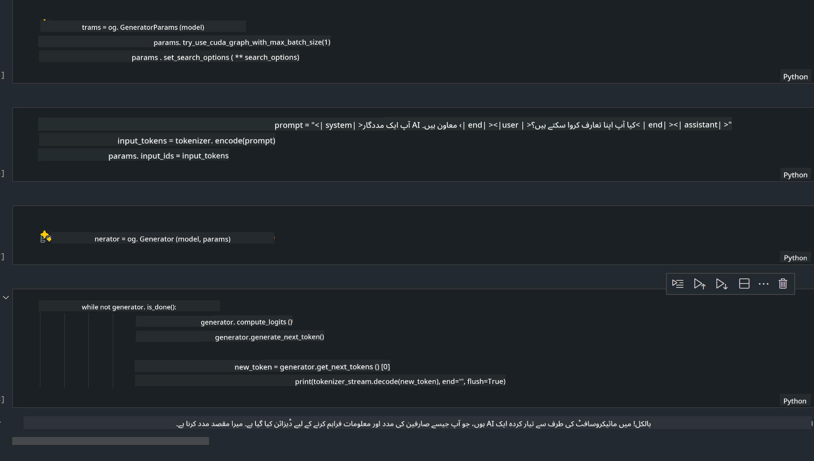

<!--
CO_OP_TRANSLATOR_METADATA:
{
  "original_hash": "e08ce816e23ad813244a09ca34ebb8ac",
  "translation_date": "2025-05-07T14:35:27+00:00",
  "source_file": "md/01.Introduction/03/AIPC_Inference.md",
  "language_code": "ur"
}
-->
# **انفرنس Phi-3 برائے AI پی سی**

جنریٹو AI کی ترقی اور ایج ڈیوائسز کی ہارڈویئر صلاحیتوں میں بہتری کے ساتھ، اب زیادہ تر جنریٹو AI ماڈلز صارفین کے Bring Your Own Device (BYOD) ڈیوائسز میں شامل کیے جا سکتے ہیں۔ AI پی سیز انہی ماڈلز میں شامل ہیں۔ 2024 سے، Intel، AMD، اور Qualcomm نے پی سی مینوفیکچررز کے ساتھ مل کر AI پی سیز متعارف کروائے ہیں جو ہارڈویئر میں تبدیلی کے ذریعے لوکل جنریٹو AI ماڈلز کی تعیناتی کو آسان بناتے ہیں۔ اس گفتگو میں، ہم Intel AI پی سیز پر توجہ مرکوز کریں گے اور دیکھیں گے کہ Intel AI پی سی پر Phi-3 کو کیسے تعینات کیا جائے۔

### NPU کیا ہے

NPU (Neural Processing Unit) ایک مخصوص پروسیسر یا پروسیسنگ یونٹ ہوتا ہے جو بڑے SoC میں شامل ہوتا ہے اور خاص طور پر نیورل نیٹ ورک آپریشنز اور AI کاموں کو تیز کرنے کے لیے ڈیزائن کیا گیا ہے۔ عمومی CPUs اور GPUs کے برعکس، NPUs ڈیٹا پر مبنی متوازی کمپیوٹنگ کے لیے بہتر ہوتے ہیں، جس کی وجہ سے وہ ویڈیوز اور تصاویر جیسے بڑے ملٹی میڈیا ڈیٹا کو پروسیس کرنے اور نیورل نیٹ ورک کے لیے ڈیٹا پراسیسنگ میں بہت مؤثر ہوتے ہیں۔ یہ خاص طور پر AI سے متعلق کاموں جیسے تقریر کی پہچان، ویڈیو کالز میں پس منظر دھندلا کرنے، اور آبجیکٹ ڈیٹیکشن جیسے فوٹو یا ویڈیو ایڈیٹنگ کے عمل میں ماہر ہیں۔

## NPU بمقابلہ GPU

اگرچہ بہت سے AI اور مشین لرننگ کے کام GPUs پر چلتے ہیں، GPUs اور NPUs کے درمیان ایک اہم فرق ہے۔  
GPUs اپنی متوازی کمپیوٹنگ صلاحیتوں کے لیے مشہور ہیں، لیکن تمام GPUs گرافکس کے علاوہ کاموں میں برابر مؤثر نہیں ہوتے۔ دوسری طرف، NPUs خاص طور پر نیورل نیٹ ورک آپریشنز میں پیچیدہ حساب کتاب کے لیے بنائے گئے ہیں، جو انہیں AI کاموں کے لیے انتہائی مؤثر بناتا ہے۔

خلاصہ یہ کہ NPUs وہ ریاضی دان ہیں جو AI کمپیوٹیشنز کو تیز کرتے ہیں اور AI پی سیز کے ابھرتے ہوئے دور میں ان کا ایک اہم کردار ہے!

***یہ مثال Intel کے جدید Intel Core Ultra Processor پر مبنی ہے***

## **1. Phi-3 ماڈل چلانے کے لیے NPU کا استعمال**

Intel® NPU ڈیوائس ایک AI انفرنس ایکسلریٹر ہے جو Intel کلائنٹ CPUs کے ساتھ انٹیگریٹڈ ہے، خاص طور پر Intel® Core™ Ultra نسل کے CPUs (جسے پہلے Meteor Lake کہا جاتا تھا) سے شروع ہو کر۔ یہ مصنوعی نیورل نیٹ ورک کے کاموں کو توانائی کی بچت کے ساتھ انجام دینے کے قابل بناتا ہے۔


**Intel NPU Acceleration Library**

Intel NPU Acceleration Library [https://github.com/intel/intel-npu-acceleration-library](https://github.com/intel/intel-npu-acceleration-library) ایک Python لائبریری ہے جو Intel Neural Processing Unit (NPU) کی طاقت کو استعمال کرتے ہوئے آپ کی ایپلیکیشنز کی کارکردگی کو بڑھانے کے لیے ڈیزائن کی گئی ہے تاکہ مطابقت رکھنے والے ہارڈویئر پر تیز رفتار کمپیوٹیشنز کی جا سکیں۔

Intel® Core™ Ultra پروسیسرز سے چلنے والے AI PC پر Phi-3-mini کی مثال۔


Python لائبریری کو pip کے ذریعے انسٹال کریں

```bash

   pip install intel-npu-acceleration-library

```

***نوٹ*** یہ پروجیکٹ ابھی ترقی کے مراحل میں ہے، لیکن ریفرنس ماڈل پہلے ہی کافی مکمل ہے۔

### **Intel NPU Acceleration Library کے ساتھ Phi-3 چلانا**

Intel NPU ایکسلریشن کے استعمال سے، یہ لائبریری روایتی انکوڈنگ کے عمل کو متاثر نہیں کرتی۔ آپ کو صرف اس لائبریری کا استعمال کرتے ہوئے اصل Phi-3 ماڈل کو کوانٹائز کرنا ہوتا ہے، جیسے FP16، INT8، INT4، جیسا کہ

```python
from transformers import AutoTokenizer, pipeline,TextStreamer
from intel_npu_acceleration_library import NPUModelForCausalLM, int4
from intel_npu_acceleration_library.compiler import CompilerConfig
import warnings

model_id = "microsoft/Phi-3-mini-4k-instruct"

compiler_conf = CompilerConfig(dtype=int4)
model = NPUModelForCausalLM.from_pretrained(
    model_id, use_cache=True, config=compiler_conf, attn_implementation="sdpa"
).eval()

tokenizer = AutoTokenizer.from_pretrained(model_id)

text_streamer = TextStreamer(tokenizer, skip_prompt=True)
```

کوانٹائزیشن کامیاب ہونے کے بعد، NPU کو کال کر کے Phi-3 ماڈل چلائیں۔

```python
generation_args = {
   "max_new_tokens": 1024,
   "return_full_text": False,
   "temperature": 0.3,
   "do_sample": False,
   "streamer": text_streamer,
}

pipe = pipeline(
   "text-generation",
   model=model,
   tokenizer=tokenizer,
)

query = "<|system|>You are a helpful AI assistant.<|end|><|user|>Can you introduce yourself?<|end|><|assistant|>"

with warnings.catch_warnings():
    warnings.simplefilter("ignore")
    pipe(query, **generation_args)
```

کوڈ چلانے کے دوران، ہم ٹاسک مینیجر کے ذریعے NPU کی چلنے کی حالت دیکھ سکتے ہیں۔


***نمونے*** : [AIPC_NPU_DEMO.ipynb](../../../../../code/03.Inference/AIPC/AIPC_NPU_DEMO.ipynb)

## **2. Phi-3 ماڈل چلانے کے لیے DirectML + ONNX Runtime کا استعمال**

### **DirectML کیا ہے**

[DirectML](https://github.com/microsoft/DirectML) ایک ہائی پرفارمنس، ہارڈویئر ایکسلریٹڈ DirectX 12 لائبریری ہے جو مشین لرننگ کے لیے بنائی گئی ہے۔ DirectML عام مشین لرننگ کے کاموں کے لیے GPUs کو ایکسلریٹ کرتا ہے اور AMD، Intel، NVIDIA، اور Qualcomm جیسے وینڈرز کے تمام DirectX 12 قابل GPUs پر کام کرتا ہے۔

اکیلا استعمال کرنے پر، DirectML API ایک لو لیول DirectX 12 لائبریری ہے اور ہائی پرفارمنس، کم تاخیر والی ایپلیکیشنز جیسے فریم ورکس، گیمز، اور دیگر ریئل ٹائم ایپلیکیشنز کے لیے موزوں ہے۔ DirectML کی Direct3D 12 کے ساتھ بغیر رکاوٹ کام کرنے کی صلاحیت، کم اوورہیڈ، اور ہارڈویئر پر مطابقت اسے مشین لرننگ کو تیز کرنے کے لیے مثالی بناتی ہے جہاں اعلی کارکردگی کے ساتھ ساتھ ہارڈویئر پر نتائج کی قابل اعتماد اور پیش گوئی کی جا سکنے والی نوعیت ضروری ہو۔

***نوٹ*** : تازہ ترین DirectML NPU کو سپورٹ کرتا ہے (https://devblogs.microsoft.com/directx/introducing-neural-processor-unit-npu-support-in-directml-developer-preview/)

### DirectML اور CUDA کی صلاحیتوں اور کارکردگی کے حوالے سے:

**DirectML** مائیکروسافٹ کی بنائی ہوئی مشین لرننگ لائبریری ہے جو Windows ڈیوائسز پر مشین لرننگ کے کاموں کو تیز کرتی ہے، جن میں ڈیسک ٹاپ، لیپ ٹاپ، اور ایج ڈیوائسز شامل ہیں۔  
- DX12 پر مبنی: DirectML DirectX 12 (DX12) پر بنایا گیا ہے، جو GPUs کی وسیع رینج کو سپورٹ کرتا ہے، بشمول NVIDIA اور AMD۔  
- وسیع سپورٹ: چونکہ یہ DX12 استعمال کرتا ہے، اس لیے یہ کسی بھی GPU کے ساتھ کام کر سکتا ہے جو DX12 کو سپورٹ کرتا ہو، حتیٰ کہ انٹیگریٹڈ GPUs کے ساتھ بھی۔  
- امیج پروسیسنگ: DirectML نیورل نیٹ ورکس کے ذریعے تصاویر اور دیگر ڈیٹا کو پروسیس کرتا ہے، جو اسے امیج ریکگنیشن، آبجیکٹ ڈیٹیکشن، اور دیگر کاموں کے لیے موزوں بناتا ہے۔  
- آسان سیٹ اپ: DirectML کی سیٹ اپ آسان ہے اور اسے GPU مینوفیکچررز کے مخصوص SDKs یا لائبریریز کی ضرورت نہیں ہوتی۔  
- کارکردگی: بعض صورتوں میں، DirectML اچھی کارکردگی دکھاتا ہے اور کچھ ورک لوڈز میں CUDA سے تیز بھی ہو سکتا ہے۔  
- محدودیتیں: تاہم، کچھ معاملات میں DirectML خاص طور پر float16 بڑے بیچ سائز کے لیے سست ہو سکتا ہے۔

**CUDA** NVIDIA کا متوازی کمپیوٹنگ پلیٹ فارم اور پروگرامنگ ماڈل ہے جو NVIDIA GPUs کی طاقت کو عام کمپیوٹنگ، مشین لرننگ، اور سائنسی سیمولیشنز کے لیے استعمال کرنے دیتا ہے۔  
- NVIDIA مخصوص: CUDA خاص طور پر NVIDIA GPUs کے لیے ڈیزائن کیا گیا ہے۔  
- انتہائی بہتر: یہ GPU ایکسلریٹڈ کاموں کے لیے بہترین کارکردگی فراہم کرتا ہے، خاص طور پر NVIDIA GPUs پر۔  
- وسیع استعمال: بہت سے مشین لرننگ فریم ورکس اور لائبریریز (جیسے TensorFlow اور PyTorch) میں CUDA سپورٹ موجود ہے۔  
- تخصیص: ڈویلپرز مخصوص کاموں کے لیے CUDA سیٹنگز کو بہتر بنا سکتے ہیں، جو مثالی کارکردگی دے سکتا ہے۔  
- محدودیتیں: تاہم، CUDA کی NVIDIA ہارڈویئر پر انحصار مختلف GPUs کے ساتھ وسیع مطابقت کو محدود کر سکتا ہے۔

### DirectML اور CUDA کے درمیان انتخاب

DirectML اور CUDA کے درمیان انتخاب آپ کے مخصوص استعمال، ہارڈویئر کی دستیابی، اور ترجیحات پر منحصر ہے۔ اگر آپ وسیع مطابقت اور آسان سیٹ اپ چاہتے ہیں تو DirectML اچھا انتخاب ہو سکتا ہے۔ لیکن اگر آپ کے پاس NVIDIA GPUs ہیں اور آپ کو انتہائی بہتر کارکردگی چاہیے تو CUDA مضبوط انتخاب ہے۔ خلاصہ یہ کہ دونوں کے اپنے فائدے اور نقصانات ہیں، اس لیے فیصلہ کرتے وقت اپنی ضروریات اور دستیاب ہارڈویئر کو مدنظر رکھیں۔

### **ONNX Runtime کے ساتھ جنریٹو AI**

AI کے دور میں، AI ماڈلز کی پورٹیبلٹی بہت اہم ہے۔ ONNX Runtime تربیت یافتہ ماڈلز کو آسانی سے مختلف ڈیوائسز پر تعینات کر سکتا ہے۔ ڈویلپرز کو انفرنس فریم ورک کی پرواہ کیے بغیر ایک متحد API کے ذریعے ماڈل انفرنس مکمل کرنے کی سہولت ملتی ہے۔ جنریٹو AI کے دور میں، ONNX Runtime نے کوڈ کی اصلاح بھی کی ہے (https://onnxruntime.ai/docs/genai/). اس بہتر شدہ ONNX Runtime کے ذریعے، کوانٹائزڈ جنریٹو AI ماڈل مختلف ٹرمینلز پر انفرنس کر سکتے ہیں۔ ONNX Runtime کے ساتھ جنریٹو AI میں، آپ Python، C#، C / C++ کے ذریعے AI ماڈل API کو انفرنس کر سکتے ہیں۔ آئی فون پر تعیناتی میں C++ کی ONNX Runtime API کا فائدہ اٹھایا جا سکتا ہے۔

[Sample Code](https://github.com/Azure-Samples/Phi-3MiniSamples/tree/main/onnx)

***جنریٹو AI کو ONNX Runtime لائبریری کے ساتھ کمپائل کریں***

```bash

winget install --id=Kitware.CMake  -e

git clone https://github.com/microsoft/onnxruntime.git

cd .\onnxruntime\

./build.bat --build_shared_lib --skip_tests --parallel --use_dml --config Release

cd ../

git clone https://github.com/microsoft/onnxruntime-genai.git

cd .\onnxruntime-genai\

mkdir ort

cd ort

mkdir include

mkdir lib

copy ..\onnxruntime\include\onnxruntime\core\providers\dml\dml_provider_factory.h ort\include

copy ..\onnxruntime\include\onnxruntime\core\session\onnxruntime_c_api.h ort\include

copy ..\onnxruntime\build\Windows\Release\Release\*.dll ort\lib

copy ..\onnxruntime\build\Windows\Release\Release\onnxruntime.lib ort\lib

python build.py --use_dml


```

**لائبریری انسٹال کریں**

```bash

pip install .\onnxruntime_genai_directml-0.3.0.dev0-cp310-cp310-win_amd64.whl

```

یہ چلانے کا نتیجہ ہے



***نمونے*** : [AIPC_DirectML_DEMO.ipynb](../../../../../code/03.Inference/AIPC/AIPC_DirectML_DEMO.ipynb)

## **3. Phi-3 ماڈل چلانے کے لیے Intel OpenVino کا استعمال**

### **OpenVINO کیا ہے**

[OpenVINO](https://github.com/openvinotoolkit/openvino) ایک اوپن سورس ٹول کٹ ہے جو ڈیپ لرننگ ماڈلز کی اصلاح اور تعیناتی کے لیے بنایا گیا ہے۔ یہ TensorFlow، PyTorch، اور دیگر مشہور فریم ورکس کے ویژن، آڈیو، اور زبان کے ماڈلز کی کارکردگی کو بہتر بناتا ہے۔ OpenVINO کے ساتھ شروعات کریں۔ OpenVINO CPU اور GPU کے ساتھ مل کر Phi-3 ماڈل چلانے کے لیے بھی استعمال کیا جا سکتا ہے۔

***نوٹ***: اس وقت OpenVINO NPU کو سپورٹ نہیں کرتا۔

### **OpenVINO لائبریری انسٹال کریں**

```bash

 pip install git+https://github.com/huggingface/optimum-intel.git

 pip install git+https://github.com/openvinotoolkit/nncf.git

 pip install openvino-nightly

```

### **OpenVINO کے ساتھ Phi-3 چلانا**

NPU کی طرح، OpenVINO بھی جنریٹو AI ماڈلز کو کوانٹائزڈ ماڈلز چلا کر کال مکمل کرتا ہے۔ پہلے ہمیں Phi-3 ماڈل کو کوانٹائز کرنا ہوگا اور optimum-cli کے ذریعے کمانڈ لائن پر ماڈل کی کوانٹائزیشن مکمل کرنی ہوگی۔

**INT4**

```bash

optimum-cli export openvino --model "microsoft/Phi-3-mini-4k-instruct" --task text-generation-with-past --weight-format int4 --group-size 128 --ratio 0.6  --sym  --trust-remote-code ./openvinomodel/phi3/int4

```

**FP16**

```bash

optimum-cli export openvino --model "microsoft/Phi-3-mini-4k-instruct" --task text-generation-with-past --weight-format fp16 --trust-remote-code ./openvinomodel/phi3/fp16

```

تبدیل شدہ فارمیٹ کچھ اس طرح ہوگا


ماڈل کے راستے (model_dir)، متعلقہ کنفیگریشنز (ov_config = {"PERFORMANCE_HINT": "LATENCY", "NUM_STREAMS": "1", "CACHE_DIR": ""})، اور ہارڈویئر ایکسلریٹڈ ڈیوائسز (GPU.0) کو OVModelForCausalLM کے ذریعے لوڈ کریں۔

```python

ov_model = OVModelForCausalLM.from_pretrained(
     model_dir,
     device='GPU.0',
     ov_config=ov_config,
     config=AutoConfig.from_pretrained(model_dir, trust_remote_code=True),
     trust_remote_code=True,
)

```

کوڈ چلانے کے دوران، ہم ٹاسک مینیجر کے ذریعے GPU کی چلنے کی حالت دیکھ سکتے ہیں۔


***نمونے*** : [AIPC_OpenVino_Demo.ipynb](../../../../../code/03.Inference/AIPC/AIPC_OpenVino_Demo.ipynb)

### ***نوٹ*** : مذکورہ تینوں طریقوں کے اپنے اپنے فائدے ہیں، لیکن AI PC انفرنس کے لیے NPU ایکسلریشن استعمال کرنے کی سفارش کی جاتی ہے۔

**ڈسکلیمر**:  
یہ دستاویز AI ترجمہ سروس [Co-op Translator](https://github.com/Azure/co-op-translator) کے ذریعے ترجمہ کی گئی ہے۔ اگرچہ ہم درستگی کی کوشش کرتے ہیں، براہ کرم نوٹ کریں کہ خودکار ترجمے میں غلطیاں یا عدم صحت ہو سکتی ہے۔ اصل دستاویز اپنی مادری زبان میں معتبر ذریعہ سمجھی جانی چاہیے۔ اہم معلومات کے لیے پیشہ ور انسانی ترجمہ کی سفارش کی جاتی ہے۔ اس ترجمے کے استعمال سے پیدا ہونے والے کسی بھی غلط فہمی یا غلط تشریح کے لیے ہم ذمہ دار نہیں ہیں۔