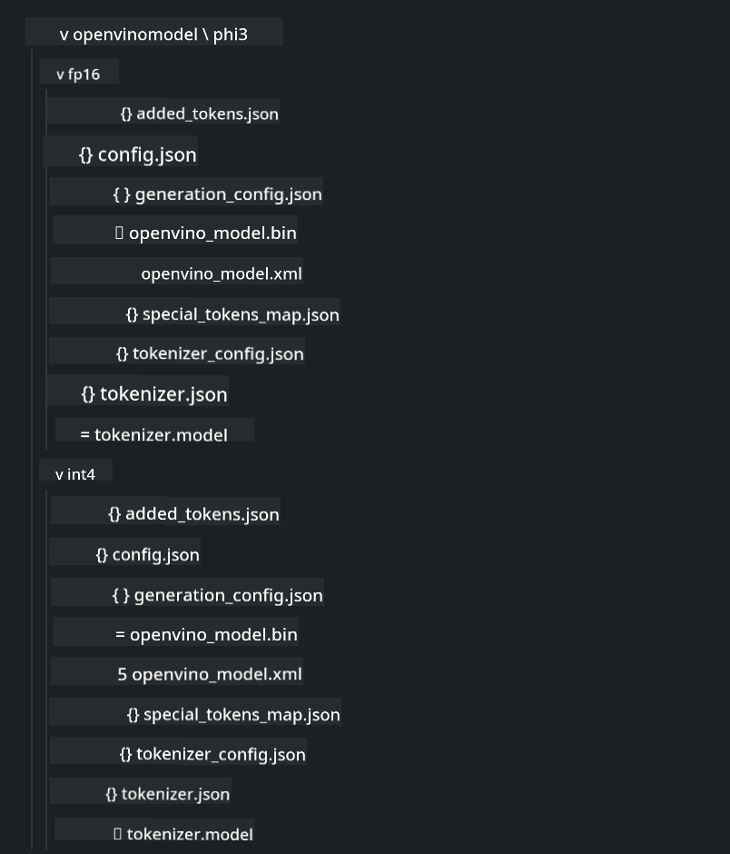

<!--
CO_OP_TRANSLATOR_METADATA:
{
  "original_hash": "e08ce816e23ad813244a09ca34ebb8ac",
  "translation_date": "2025-07-16T19:55:04+00:00",
  "source_file": "md/01.Introduction/03/AIPC_Inference.md",
  "language_code": "ur"
}
-->
# **AI PC میں Inference Phi-3**

جنریٹو AI کی ترقی اور ایج ڈیوائسز کی ہارڈویئر صلاحیتوں میں بہتری کے ساتھ، اب زیادہ سے زیادہ جنریٹو AI ماڈلز صارفین کے Bring Your Own Device (BYOD) ڈیوائسز میں شامل کیے جا سکتے ہیں۔ AI PCs ان ماڈلز میں شامل ہیں۔ 2024 سے، Intel، AMD، اور Qualcomm نے PC بنانے والوں کے ساتھ مل کر AI PCs متعارف کروائے ہیں جو ہارڈویئر میں تبدیلیوں کے ذریعے مقامی جنریٹو AI ماڈلز کی تعیناتی کو آسان بناتے ہیں۔ اس گفتگو میں، ہم Intel AI PCs پر توجہ مرکوز کریں گے اور دیکھیں گے کہ Intel AI PC پر Phi-3 کو کیسے تعینات کیا جائے۔

### NPU کیا ہے

NPU (Neural Processing Unit) ایک مخصوص پروسیسر یا پروسیسنگ یونٹ ہوتا ہے جو بڑے SoC میں شامل ہوتا ہے اور خاص طور پر نیورل نیٹ ورک آپریشنز اور AI کاموں کو تیز کرنے کے لیے ڈیزائن کیا گیا ہوتا ہے۔ عام مقصد کے CPUs اور GPUs کے برعکس، NPUs ڈیٹا پر مبنی متوازی کمپیوٹنگ کے لیے بہتر بنائے گئے ہیں، جو انہیں ویڈیوز اور تصاویر جیسے بڑے ملٹی میڈیا ڈیٹا کو پروسیس کرنے اور نیورل نیٹ ورکس کے لیے ڈیٹا پراسیسنگ میں انتہائی مؤثر بناتے ہیں۔ یہ خاص طور پر AI سے متعلق کاموں جیسے کہ تقریر کی شناخت، ویڈیو کالز میں پس منظر کو دھندلا کرنا، اور تصویر یا ویڈیو ایڈیٹنگ جیسے آبجیکٹ ڈیٹیکشن کے عمل میں ماہر ہوتے ہیں۔

## NPU بمقابلہ GPU

اگرچہ بہت سے AI اور مشین لرننگ کے کام GPUs پر چلتے ہیں، GPUs اور NPUs کے درمیان ایک اہم فرق ہے۔  
GPUs اپنی متوازی کمپیوٹنگ صلاحیتوں کے لیے جانے جاتے ہیں، لیکن تمام GPUs گرافکس کے علاوہ کاموں میں یکساں مؤثر نہیں ہوتے۔ دوسری طرف، NPUs خاص طور پر نیورل نیٹ ورک آپریشنز میں شامل پیچیدہ حسابات کے لیے بنائے گئے ہیں، جو انہیں AI کاموں کے لیے انتہائی مؤثر بناتے ہیں۔

خلاصہ یہ کہ، NPUs وہ ماہر ریاضی دان ہیں جو AI کمپیوٹیشنز کو تیز کرتے ہیں، اور AI PCs کے ابھرتے ہوئے دور میں ان کا اہم کردار ہے!

***یہ مثال Intel کے جدید Intel Core Ultra Processor پر مبنی ہے***

## **1. Phi-3 ماڈل چلانے کے لیے NPU کا استعمال**

Intel® NPU ڈیوائس ایک AI inference accelerator ہے جو Intel کلائنٹ CPUs کے ساتھ مربوط ہوتا ہے، خاص طور پر Intel® Core™ Ultra جنریشن کے CPUs (جو پہلے Meteor Lake کے نام سے جانے جاتے تھے) سے شروع۔ یہ مصنوعی نیورل نیٹ ورک کے کاموں کو توانائی کی بچت کے ساتھ انجام دینے کی سہولت دیتا ہے۔


**Intel NPU Acceleration Library**

Intel NPU Acceleration Library [https://github.com/intel/intel-npu-acceleration-library](https://github.com/intel/intel-npu-acceleration-library) ایک Python لائبریری ہے جو آپ کی ایپلیکیشنز کی کارکردگی کو بڑھانے کے لیے Intel Neural Processing Unit (NPU) کی طاقت کا استعمال کرتی ہے تاکہ مطابقت رکھنے والے ہارڈویئر پر تیز رفتار کمپیوٹیشنز کی جا سکیں۔

Intel® Core™ Ultra پروسیسرز سے چلنے والے AI PC پر Phi-3-mini کی مثال۔


Python لائبریری کو pip کے ذریعے انسٹال کریں

```bash

   pip install intel-npu-acceleration-library

```

***نوٹ*** یہ پروجیکٹ ابھی ترقی کے مراحل میں ہے، لیکن حوالہ ماڈل پہلے ہی کافی مکمل ہے۔

### **Intel NPU Acceleration Library کے ساتھ Phi-3 چلانا**

Intel NPU acceleration کا استعمال کرتے ہوئے، یہ لائبریری روایتی انکوڈنگ کے عمل کو متاثر نہیں کرتی۔ آپ کو صرف اس لائبریری کا استعمال کرتے ہوئے اصل Phi-3 ماڈل کو quantize کرنا ہوتا ہے، جیسے FP16، INT8، INT4، جیسا کہ

```python
from transformers import AutoTokenizer, pipeline,TextStreamer
from intel_npu_acceleration_library import NPUModelForCausalLM, int4
from intel_npu_acceleration_library.compiler import CompilerConfig
import warnings

model_id = "microsoft/Phi-3-mini-4k-instruct"

compiler_conf = CompilerConfig(dtype=int4)
model = NPUModelForCausalLM.from_pretrained(
    model_id, use_cache=True, config=compiler_conf, attn_implementation="sdpa"
).eval()

tokenizer = AutoTokenizer.from_pretrained(model_id)

text_streamer = TextStreamer(tokenizer, skip_prompt=True)
```

quantification کامیاب ہونے کے بعد، اگلے مرحلے میں NPU کو کال کر کے Phi-3 ماڈل چلائیں۔

```python
generation_args = {
   "max_new_tokens": 1024,
   "return_full_text": False,
   "temperature": 0.3,
   "do_sample": False,
   "streamer": text_streamer,
}

pipe = pipeline(
   "text-generation",
   model=model,
   tokenizer=tokenizer,
)

query = "<|system|>You are a helpful AI assistant.<|end|><|user|>Can you introduce yourself?<|end|><|assistant|>"

with warnings.catch_warnings():
    warnings.simplefilter("ignore")
    pipe(query, **generation_args)
```

کوڈ چلانے کے دوران، ہم Task Manager کے ذریعے NPU کی چلتی ہوئی حالت دیکھ سکتے ہیں۔


***نمونے*** : [AIPC_NPU_DEMO.ipynb](../../../../../code/03.Inference/AIPC/AIPC_NPU_DEMO.ipynb)

## **2. Phi-3 ماڈل چلانے کے لیے DirectML + ONNX Runtime کا استعمال**

### **DirectML کیا ہے**

[DirectML](https://github.com/microsoft/DirectML) ایک ہائی پرفارمنس، ہارڈویئر-accelerated DirectX 12 لائبریری ہے جو مشین لرننگ کے لیے بنائی گئی ہے۔ DirectML عام مشین لرننگ کے کاموں کے لیے GPU acceleration فراہم کرتا ہے، اور یہ AMD، Intel، NVIDIA، اور Qualcomm جیسے وینڈرز کے تمام DirectX 12-قابل GPUs کو سپورٹ کرتا ہے۔

جب الگ سے استعمال کیا جائے، تو DirectML API ایک کم سطحی DirectX 12 لائبریری ہے اور ہائی پرفارمنس، کم تاخیر والی ایپلیکیشنز جیسے فریم ورکس، گیمز، اور دیگر ریئل ٹائم ایپلیکیشنز کے لیے موزوں ہے۔ DirectML کی Direct3D 12 کے ساتھ بے جوڑ انٹرآپریبلٹی، کم اوور ہیڈ، اور ہارڈویئر پر یکساں کارکردگی اسے مشین لرننگ کو تیز کرنے کے لیے مثالی بناتی ہے، خاص طور پر جب اعلیٰ کارکردگی اور ہارڈویئر پر نتائج کی قابل اعتماد اور پیش گوئی کی صلاحیت ضروری ہو۔

***نوٹ*** : جدید DirectML پہلے ہی NPU کو سپورٹ کرتا ہے (https://devblogs.microsoft.com/directx/introducing-neural-processor-unit-npu-support-in-directml-developer-preview/)

### DirectML اور CUDA کی صلاحیتوں اور کارکردگی کے لحاظ سے موازنہ:

**DirectML** مائیکروسافٹ کی تیار کردہ مشین لرننگ لائبریری ہے۔ یہ Windows ڈیوائسز، بشمول ڈیسک ٹاپ، لیپ ٹاپ، اور ایج ڈیوائسز پر مشین لرننگ کے کاموں کو تیز کرنے کے لیے بنائی گئی ہے۔  
- DX12 پر مبنی: DirectML DirectX 12 (DX12) پر بنایا گیا ہے، جو GPUs کی وسیع رینج کو سپورٹ کرتا ہے، بشمول NVIDIA اور AMD دونوں۔  
- وسیع سپورٹ: چونکہ یہ DX12 کا استعمال کرتا ہے، اس لیے DirectML کسی بھی GPU کے ساتھ کام کر سکتا ہے جو DX12 کو سپورٹ کرتا ہو، یہاں تک کہ انٹیگریٹڈ GPUs کے ساتھ بھی۔  
- امیج پروسیسنگ: DirectML نیورل نیٹ ورکس کے ذریعے تصاویر اور دیگر ڈیٹا کو پروسیس کرتا ہے، جو اسے امیج ریکگنیشن، آبجیکٹ ڈیٹیکشن، اور دیگر کاموں کے لیے موزوں بناتا ہے۔  
- آسان سیٹ اپ: DirectML کا سیٹ اپ آسان ہے اور اسے GPU بنانے والوں کی مخصوص SDKs یا لائبریریز کی ضرورت نہیں ہوتی۔  
- کارکردگی: بعض صورتوں میں، DirectML اچھی کارکردگی دکھاتا ہے اور کچھ کاموں میں CUDA سے تیز بھی ہو سکتا ہے۔  
- حدود: تاہم، کچھ معاملات میں، خاص طور پر float16 بڑے بیچ سائز کے لیے، DirectML سست ہو سکتا ہے۔

**CUDA** NVIDIA کا parallel computing پلیٹ فارم اور پروگرامنگ ماڈل ہے۔ یہ ڈویلپرز کو NVIDIA GPUs کی طاقت کو عام مقصد کے کمپیوٹنگ، بشمول مشین لرننگ اور سائنسی سیمولیشنز کے لیے استعمال کرنے کی اجازت دیتا ہے۔  
- NVIDIA مخصوص: CUDA خاص طور پر NVIDIA GPUs کے لیے ڈیزائن کیا گیا ہے۔  
- انتہائی بہتر: یہ GPU-accelerated کاموں کے لیے بہترین کارکردگی فراہم کرتا ہے، خاص طور پر NVIDIA GPUs کے ساتھ۔  
- وسیع استعمال: بہت سے مشین لرننگ فریم ورکس اور لائبریریز (جیسے TensorFlow اور PyTorch) میں CUDA سپورٹ موجود ہے۔  
- تخصیص: ڈویلپرز مخصوص کاموں کے لیے CUDA سیٹنگز کو بہتر بنا سکتے ہیں، جو بہترین کارکردگی کا باعث بنتا ہے۔  
- حدود: تاہم، CUDA کی NVIDIA ہارڈویئر پر انحصار وسیع مطابقت کے لیے رکاوٹ بن سکتا ہے۔

### DirectML اور CUDA کے درمیان انتخاب

DirectML اور CUDA کے درمیان انتخاب آپ کے مخصوص استعمال، ہارڈویئر کی دستیابی، اور ترجیحات پر منحصر ہے۔  
اگر آپ وسیع مطابقت اور آسان سیٹ اپ چاہتے ہیں تو DirectML اچھا انتخاب ہو سکتا ہے۔ لیکن اگر آپ کے پاس NVIDIA GPUs ہیں اور آپ کو انتہائی بہتر کارکردگی کی ضرورت ہے تو CUDA ایک مضبوط انتخاب ہے۔ خلاصہ یہ کہ دونوں کے اپنے فوائد اور نقصانات ہیں، اس لیے فیصلہ کرتے وقت اپنی ضروریات اور دستیاب ہارڈویئر کو مدنظر رکھیں۔

### **ONNX Runtime کے ساتھ جنریٹو AI**

AI کے دور میں، AI ماڈلز کی پورٹیبلٹی بہت اہم ہے۔ ONNX Runtime تربیت یافتہ ماڈلز کو مختلف ڈیوائسز پر آسانی سے تعینات کر سکتا ہے۔ ڈویلپرز کو inference فریم ورک کی پرواہ کیے بغیر ایک متحد API کے ذریعے ماڈل inference مکمل کرنے کی سہولت ملتی ہے۔ جنریٹو AI کے دور میں، ONNX Runtime نے کوڈ کی اصلاح بھی کی ہے (https://onnxruntime.ai/docs/genai/)۔ بہتر شدہ ONNX Runtime کے ذریعے، quantized جنریٹو AI ماڈل مختلف ٹرمینلز پر inference کر سکتا ہے۔ ONNX Runtime کے ساتھ جنریٹو AI میں، آپ Python، C#، C / C++ کے ذریعے AI ماڈل API کو infer کر سکتے ہیں۔ یقیناً، iPhone پر تعیناتی C++ کی ONNX Runtime API کی مدد سے کی جا سکتی ہے۔

[نمونہ کوڈ](https://github.com/Azure-Samples/Phi-3MiniSamples/tree/main/onnx)

***جنریٹو AI کو ONNX Runtime لائبریری کے ساتھ مرتب کریں***

```bash

winget install --id=Kitware.CMake  -e

git clone https://github.com/microsoft/onnxruntime.git

cd .\onnxruntime\

./build.bat --build_shared_lib --skip_tests --parallel --use_dml --config Release

cd ../

git clone https://github.com/microsoft/onnxruntime-genai.git

cd .\onnxruntime-genai\

mkdir ort

cd ort

mkdir include

mkdir lib

copy ..\onnxruntime\include\onnxruntime\core\providers\dml\dml_provider_factory.h ort\include

copy ..\onnxruntime\include\onnxruntime\core\session\onnxruntime_c_api.h ort\include

copy ..\onnxruntime\build\Windows\Release\Release\*.dll ort\lib

copy ..\onnxruntime\build\Windows\Release\Release\onnxruntime.lib ort\lib

python build.py --use_dml


```

**لائبریری انسٹال کریں**

```bash

pip install .\onnxruntime_genai_directml-0.3.0.dev0-cp310-cp310-win_amd64.whl

```

یہ چلنے کا نتیجہ ہے


***نمونے*** : [AIPC_DirectML_DEMO.ipynb](../../../../../code/03.Inference/AIPC/AIPC_DirectML_DEMO.ipynb)

## **3. Phi-3 ماڈل چلانے کے لیے Intel OpenVino کا استعمال**

### **OpenVINO کیا ہے**

[OpenVINO](https://github.com/openvinotoolkit/openvino) ایک اوپن سورس ٹول کٹ ہے جو ڈیپ لرننگ ماڈلز کو بہتر بنانے اور تعینات کرنے کے لیے استعمال ہوتا ہے۔ یہ TensorFlow، PyTorch، اور دیگر مشہور فریم ورکس کے وژن، آڈیو، اور زبان کے ماڈلز کے لیے ڈیپ لرننگ کی کارکردگی کو بڑھاتا ہے۔ OpenVINO کے ساتھ شروع کریں۔ OpenVINO کو CPU اور GPU کے ساتھ مل کر Phi-3 ماڈل چلانے کے لیے بھی استعمال کیا جا سکتا ہے۔

***نوٹ***: فی الحال، OpenVINO NPU کو سپورٹ نہیں کرتا۔

### **OpenVINO لائبریری انسٹال کریں**

```bash

 pip install git+https://github.com/huggingface/optimum-intel.git

 pip install git+https://github.com/openvinotoolkit/nncf.git

 pip install openvino-nightly

```

### **OpenVINO کے ساتھ Phi-3 چلانا**

NPU کی طرح، OpenVINO بھی quantized ماڈلز کو چلانے کے ذریعے جنریٹو AI ماڈلز کو کال کرتا ہے۔ ہمیں پہلے Phi-3 ماڈل کو quantize کرنا ہوگا اور optimum-cli کے ذریعے کمانڈ لائن پر ماڈل کی quantization مکمل کرنی ہوگی۔

**INT4**

```bash

optimum-cli export openvino --model "microsoft/Phi-3-mini-4k-instruct" --task text-generation-with-past --weight-format int4 --group-size 128 --ratio 0.6  --sym  --trust-remote-code ./openvinomodel/phi3/int4

```

**FP16**

```bash

optimum-cli export openvino --model "microsoft/Phi-3-mini-4k-instruct" --task text-generation-with-past --weight-format fp16 --trust-remote-code ./openvinomodel/phi3/fp16

```

تبدیل شدہ فارمیٹ، جیسا کہ یہ ہے



ماڈل کے راستے (model_dir)، متعلقہ کنفیگریشنز (ov_config = {"PERFORMANCE_HINT": "LATENCY", "NUM_STREAMS": "1", "CACHE_DIR": ""})، اور ہارڈویئر-accelerated ڈیوائسز (GPU.0) کو OVModelForCausalLM کے ذریعے لوڈ کریں۔

```python

ov_model = OVModelForCausalLM.from_pretrained(
     model_dir,
     device='GPU.0',
     ov_config=ov_config,
     config=AutoConfig.from_pretrained(model_dir, trust_remote_code=True),
     trust_remote_code=True,
)

```

کوڈ چلانے کے دوران، ہم Task Manager کے ذریعے GPU کی چلتی ہوئی حالت دیکھ سکتے ہیں۔


***نمونے*** : [AIPC_OpenVino_Demo.ipynb](../../../../../code/03.Inference/AIPC/AIPC_OpenVino_Demo.ipynb)

### ***نوٹ*** : مذکورہ تینوں طریقوں کے اپنے فوائد ہیں، لیکن AI PC inference کے لیے NPU acceleration کا استعمال تجویز کیا جاتا ہے۔

**دستخطی نوٹ**:  
یہ دستاویز AI ترجمہ سروس [Co-op Translator](https://github.com/Azure/co-op-translator) کے ذریعے ترجمہ کی گئی ہے۔ اگرچہ ہم درستگی کے لیے کوشاں ہیں، براہ کرم آگاہ رہیں کہ خودکار ترجمے میں غلطیاں یا عدم درستیاں ہو سکتی ہیں۔ اصل دستاویز اپنی مادری زبان میں معتبر ماخذ سمجھی جانی چاہیے۔ اہم معلومات کے لیے پیشہ ور انسانی ترجمہ کی سفارش کی جاتی ہے۔ اس ترجمے کے استعمال سے پیدا ہونے والی کسی بھی غلط فہمی یا غلط تشریح کی ذمہ داری ہم پر عائد نہیں ہوتی۔