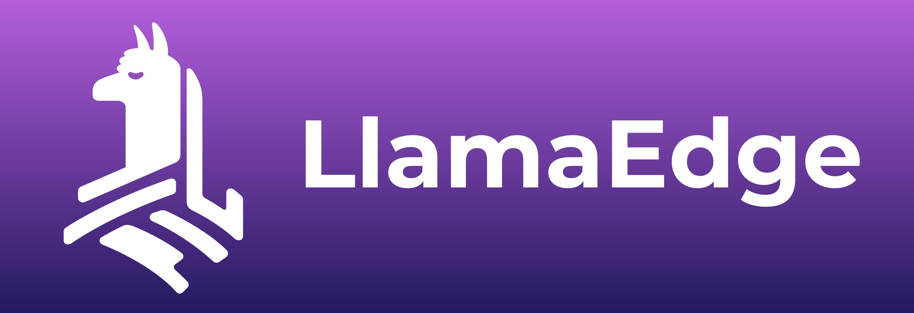

<!--
CO_OP_TRANSLATOR_METADATA:
{
  "original_hash": "5b3df6e1a9927e93cda92801eec65d33",
  "translation_date": "2025-04-03T06:52:35+00:00",
  "source_file": "md\\01.Introduction\\03\\Jetson_Inference.md",
  "language_code": "ur"
}
-->
# **Nvidia Jetson میں Inference Phi-3**

Nvidia Jetson Nvidia کی جانب سے ایک سیریز ہے جو ایمبیڈڈ کمپیوٹنگ بورڈز پر مشتمل ہے۔ Jetson TK1، TX1 اور TX2 ماڈلز میں Tegra پروسیسر (یا SoC) شامل ہے، جو Nvidia کے ARM آرکیٹیکچر مرکزی پروسیسنگ یونٹ (CPU) کو یکجا کرتا ہے۔ Jetson ایک کم پاور سسٹم ہے اور مشین لرننگ ایپلیکیشنز کو تیز کرنے کے لیے ڈیزائن کیا گیا ہے۔ Nvidia Jetson کو پیشہ ور ڈویلپرز صنعتوں میں انقلابی AI مصنوعات بنانے کے لیے استعمال کرتے ہیں، اور طلبہ و شوقین افراد AI کے عملی تجربے اور حیرت انگیز پروجیکٹس بنانے کے لیے استعمال کرتے ہیں۔ SLM کو ایسے edge devices پر تعینات کیا جاتا ہے جیسے Jetson، جو صنعتی جنریٹو AI ایپلیکیشن کے منظرنامے کو بہتر طور پر نافذ کرنے میں مدد دیتا ہے۔

## NVIDIA Jetson پر Deployment:
خود مختار روبوٹکس اور ایمبیڈڈ ڈیوائسز پر کام کرنے والے ڈویلپرز Phi-3 Mini کا فائدہ اٹھا سکتے ہیں۔ Phi-3 کا نسبتا چھوٹا سائز اسے edge deployment کے لیے موزوں بناتا ہے۔ تربیت کے دوران پیرامیٹرز کو احتیاط سے ٹیون کیا گیا ہے، جو جوابات میں اعلیٰ درستگی کو یقینی بناتے ہیں۔

### TensorRT-LLM Optimization:
NVIDIA کی [TensorRT-LLM لائبریری](https://github.com/NVIDIA/TensorRT-LLM?WT.mc_id=aiml-138114-kinfeylo) بڑے زبان ماڈل کے inference کو بہتر بناتی ہے۔ یہ Phi-3 Mini کے طویل context window کو سپورٹ کرتی ہے، جس سے throughput اور latency دونوں میں اضافہ ہوتا ہے۔ ان میں LongRoPE، FP8، اور inflight batching جیسی تکنیکیں شامل ہیں۔

### دستیابی اور Deployment:
ڈویلپرز [NVIDIA کے AI](https://www.nvidia.com/en-us/ai-data-science/generative-ai/) پر 128K context window کے ساتھ Phi-3 Mini کو دریافت کر سکتے ہیں۔ یہ NVIDIA NIM کے طور پر پیک کیا گیا ہے، ایک مائیکرو سروس جس کا ایک standard API ہے جو کہیں بھی تعینات کیا جا سکتا ہے۔ اس کے علاوہ، [TensorRT-LLM implementations on GitHub](https://github.com/NVIDIA/TensorRT-LLM) بھی دستیاب ہیں۔

## **1. تیاری**

a. Jetson Orin NX / Jetson NX

b. JetPack 5.1.2+
   
c. Cuda 11.8
   
d. Python 3.8+

## **2. Jetson میں Phi-3 چلانا**

ہم [Ollama](https://ollama.com) یا [LlamaEdge](https://llamaedge.com) کا انتخاب کر سکتے ہیں۔

اگر آپ gguf کو بیک وقت cloud اور edge devices پر استعمال کرنا چاہتے ہیں، تو LlamaEdge کو WasmEdge کے طور پر سمجھا جا سکتا ہے۔ (WasmEdge ایک ہلکا، اعلی کارکردگی والا، قابل توسیع WebAssembly runtime ہے جو cloud native، edge اور decentralized ایپلیکیشنز کے لیے موزوں ہے۔ یہ serverless ایپلیکیشنز، ایمبیڈڈ فنکشنز، مائیکرو سروسز، سمارٹ کنٹریکٹس اور IoT ڈیوائسز کو سپورٹ کرتا ہے۔ آپ gguf کے quantitative ماڈل کو LlamaEdge کے ذریعے edge devices اور cloud پر تعینات کر سکتے ہیں۔)



یہاں steps ہیں:

1. متعلقہ libraries اور files انسٹال کریں اور ڈاؤن لوڈ کریں

```bash

curl -sSf https://raw.githubusercontent.com/WasmEdge/WasmEdge/master/utils/install.sh | bash -s -- --plugin wasi_nn-ggml

curl -LO https://github.com/LlamaEdge/LlamaEdge/releases/latest/download/llama-api-server.wasm

curl -LO https://github.com/LlamaEdge/chatbot-ui/releases/latest/download/chatbot-ui.tar.gz

tar xzf chatbot-ui.tar.gz

```

**نوٹ**: llama-api-server.wasm اور chatbot-ui کو ایک ہی directory میں ہونا چاہیے

2. scripts کو terminal میں چلائیں

```bash

wasmedge --dir .:. --nn-preload default:GGML:AUTO:{Your gguf path} llama-api-server.wasm -p phi-3-chat

```

یہ رہا چلانے کا نتیجہ:


***نمونہ کوڈ*** [Phi-3 mini WASM Notebook Sample](https://github.com/Azure-Samples/Phi-3MiniSamples/tree/main/wasm)

خلاصہ یہ ہے کہ Phi-3 Mini زبان ماڈلنگ میں ایک بڑی پیش رفت کی نمائندگی کرتا ہے، جو کارکردگی، context awareness، اور NVIDIA کی optimization کی مہارت کو یکجا کرتا ہے۔ چاہے آپ روبوٹ بنا رہے ہوں یا edge applications، Phi-3 Mini ایک طاقتور ٹول ہے جس سے آگاہ ہونا ضروری ہے۔

**ڈسکلیمر**:  
یہ دستاویز AI ترجمہ سروس [Co-op Translator](https://github.com/Azure/co-op-translator) کا استعمال کرتے ہوئے ترجمہ کی گئی ہے۔ ہم درستگی کے لیے کوشش کرتے ہیں، لیکن براہ کرم آگاہ رہیں کہ خودکار ترجمے میں غلطیاں یا غیر درستیاں ہوسکتی ہیں۔ اصل دستاویز، جو اپنی اصل زبان میں ہے، مستند ذریعہ سمجھا جانا چاہیے۔ اہم معلومات کے لیے، پیشہ ور انسانی ترجمہ کی سفارش کی جاتی ہے۔ اس ترجمے کے استعمال سے پیدا ہونے والے کسی بھی غلط فہمی یا غلط تشریح کے لیے ہم ذمہ دار نہیں ہیں۔