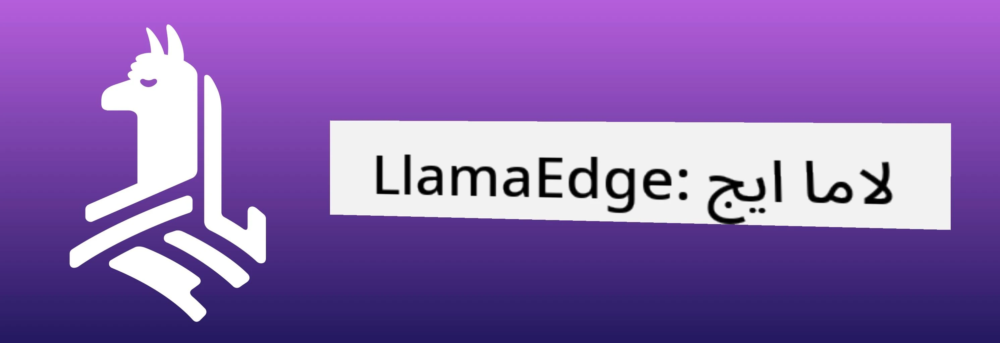
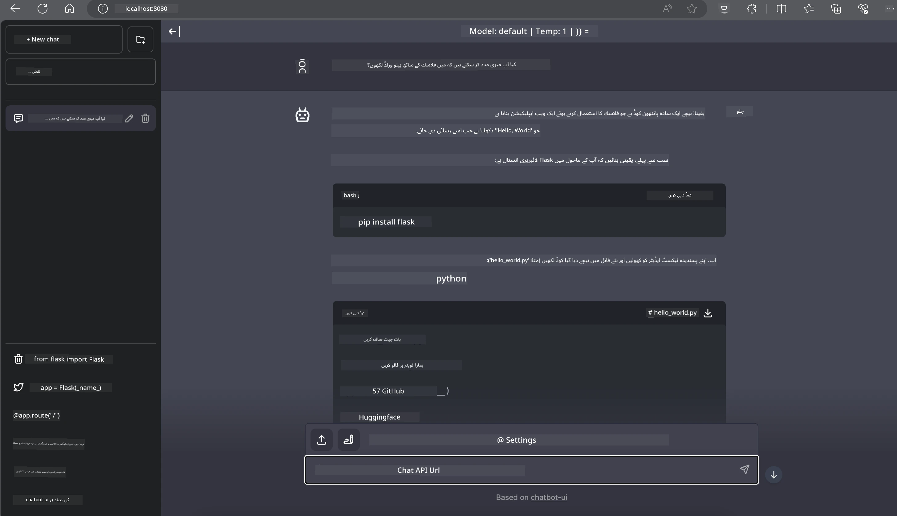

<!--
CO_OP_TRANSLATOR_METADATA:
{
  "original_hash": "be4101a30d98e95a71d42c276e8bcd37",
  "translation_date": "2025-07-16T20:39:35+00:00",
  "source_file": "md/01.Introduction/03/Jetson_Inference.md",
  "language_code": "ur"
}
-->
# **Nvidia Jetson میں Inference Phi-3**

Nvidia Jetson Nvidia کی طرف سے ایک سلسلہ ہے جو ایمبیڈڈ کمپیوٹنگ بورڈز پر مشتمل ہے۔ Jetson TK1، TX1 اور TX2 ماڈلز میں Nvidia کا Tegra پروسیسر (یا SoC) شامل ہوتا ہے جو ARM آرکیٹیکچر پر مبنی مرکزی پروسیسنگ یونٹ (CPU) کو یکجا کرتا ہے۔ Jetson ایک کم پاور والا نظام ہے اور مشین لرننگ ایپلیکیشنز کو تیز کرنے کے لیے ڈیزائن کیا گیا ہے۔ Nvidia Jetson پیشہ ورانہ ڈویلپرز کی طرف سے تمام صنعتوں میں جدید AI مصنوعات بنانے کے لیے استعمال ہوتا ہے، اور طلباء اور شوقین افراد کے لیے عملی AI سیکھنے اور شاندار پروجیکٹس بنانے کا ذریعہ ہے۔ SLM کو ایج ڈیوائسز جیسے Jetson میں تعینات کیا جاتا ہے، جو صنعتی جنریٹو AI ایپلیکیشن کے منظرناموں کو بہتر طریقے سے نافذ کرنے میں مدد دے گا۔

## NVIDIA Jetson پر تعیناتی:
خودکار روبوٹکس اور ایمبیڈڈ ڈیوائسز پر کام کرنے والے ڈویلپرز Phi-3 Mini سے فائدہ اٹھا سکتے ہیں۔ Phi-3 کا نسبتاً چھوٹا سائز اسے ایج پر تعیناتی کے لیے مثالی بناتا ہے۔ تربیت کے دوران پیرامیٹرز کو باریکی سے ایڈجسٹ کیا گیا ہے، جس سے جوابات میں اعلیٰ درستگی یقینی بنتی ہے۔

### TensorRT-LLM کی اصلاح:
NVIDIA کی [TensorRT-LLM لائبریری](https://github.com/NVIDIA/TensorRT-LLM?WT.mc_id=aiml-138114-kinfeylo) بڑے زبان کے ماڈل کی inference کو بہتر بناتی ہے۔ یہ Phi-3 Mini کی طویل کانٹیکسٹ ونڈو کو سپورٹ کرتی ہے، جس سے تھروپٹ اور لیٹنسی دونوں میں بہتری آتی ہے۔ اصلاحات میں LongRoPE، FP8، اور inflight batching جیسی تکنیکیں شامل ہیں۔

### دستیابی اور تعیناتی:
ڈویلپرز Phi-3 Mini کو 128K کانٹیکسٹ ونڈو کے ساتھ [NVIDIA کے AI](https://www.nvidia.com/en-us/ai-data-science/generative-ai/) پر دریافت کر سکتے ہیں۔ یہ NVIDIA NIM کے طور پر پیک کیا گیا ہے، جو ایک مائیکرو سروس ہے جس کا ایک معیاری API ہوتا ہے اور اسے کہیں بھی تعینات کیا جا سکتا ہے۔ اس کے علاوہ، [TensorRT-LLM کے GitHub پر موجود implementations](https://github.com/NVIDIA/TensorRT-LLM) بھی دستیاب ہیں۔

## **1. تیاری**

a. Jetson Orin NX / Jetson NX

b. JetPack 5.1.2+

c. Cuda 11.8

d. Python 3.8+

## **2. Jetson میں Phi-3 چلانا**

ہم [Ollama](https://ollama.com) یا [LlamaEdge](https://llamaedge.com) کا انتخاب کر سکتے ہیں۔

اگر آپ بیک وقت کلاؤڈ اور ایج ڈیوائسز میں gguf استعمال کرنا چاہتے ہیں، تو LlamaEdge کو WasmEdge کے طور پر سمجھا جا سکتا ہے (WasmEdge ایک ہلکا پھلکا، اعلیٰ کارکردگی والا، اسکیل ایبل WebAssembly رن ٹائم ہے جو کلاؤڈ نیٹو، ایج اور غیر مرکزی ایپلیکیشنز کے لیے موزوں ہے۔ یہ سرور لیس ایپلیکیشنز، ایمبیڈڈ فنکشنز، مائیکرو سروسز، اسمارٹ کنٹریکٹس اور IoT ڈیوائسز کو سپورٹ کرتا ہے۔ آپ gguf کے مقداری ماڈل کو LlamaEdge کے ذریعے ایج ڈیوائسز اور کلاؤڈ دونوں پر تعینات کر سکتے ہیں۔



استعمال کے لیے اقدامات درج ذیل ہیں:

1. متعلقہ لائبریریز اور فائلیں انسٹال اور ڈاؤن لوڈ کریں

```bash

curl -sSf https://raw.githubusercontent.com/WasmEdge/WasmEdge/master/utils/install.sh | bash -s -- --plugin wasi_nn-ggml

curl -LO https://github.com/LlamaEdge/LlamaEdge/releases/latest/download/llama-api-server.wasm

curl -LO https://github.com/LlamaEdge/chatbot-ui/releases/latest/download/chatbot-ui.tar.gz

tar xzf chatbot-ui.tar.gz

```

**نوٹ**: llama-api-server.wasm اور chatbot-ui کو ایک ہی ڈائریکٹری میں ہونا ضروری ہے

2. ٹرمینل میں اسکرپٹس چلائیں

```bash

wasmedge --dir .:. --nn-preload default:GGML:AUTO:{Your gguf path} llama-api-server.wasm -p phi-3-chat

```

یہاں چلانے کا نتیجہ ہے



***نمونہ کوڈ*** [Phi-3 mini WASM Notebook Sample](https://github.com/Azure-Samples/Phi-3MiniSamples/tree/main/wasm)

خلاصہ یہ کہ، Phi-3 Mini زبان کے ماڈلنگ میں ایک نمایاں پیش رفت کی نمائندگی کرتا ہے، جو کارکردگی، کانٹیکسٹ کی سمجھ بوجھ، اور NVIDIA کی اصلاحات کو یکجا کرتا ہے۔ چاہے آپ روبوٹ بنا رہے ہوں یا ایج ایپلیکیشنز، Phi-3 Mini ایک طاقتور ٹول ہے جس سے واقف ہونا ضروری ہے۔

**دستخطی نوٹ**:  
یہ دستاویز AI ترجمہ سروس [Co-op Translator](https://github.com/Azure/co-op-translator) کے ذریعے ترجمہ کی گئی ہے۔ اگرچہ ہم درستگی کے لیے کوشاں ہیں، براہ کرم آگاہ رہیں کہ خودکار ترجمے میں غلطیاں یا عدم درستیاں ہو سکتی ہیں۔ اصل دستاویز اپنی مادری زبان میں معتبر ماخذ سمجھی جانی چاہیے۔ اہم معلومات کے لیے پیشہ ور انسانی ترجمہ کی سفارش کی جاتی ہے۔ اس ترجمے کے استعمال سے پیدا ہونے والی کسی بھی غلط فہمی یا غلط تشریح کی ذمہ داری ہم پر عائد نہیں ہوتی۔