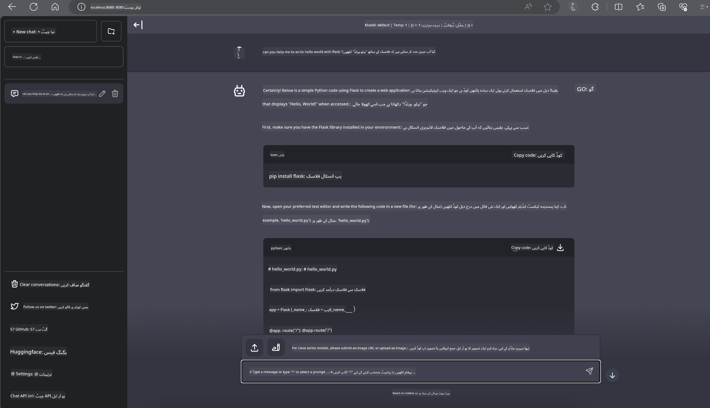

<!--
CO_OP_TRANSLATOR_METADATA:
{
  "original_hash": "be4101a30d98e95a71d42c276e8bcd37",
  "translation_date": "2025-05-07T14:28:31+00:00",
  "source_file": "md/01.Introduction/03/Jetson_Inference.md",
  "language_code": "ur"
}
-->
# **Nvidia Jetson میں Inference Phi-3**

Nvidia Jetson Nvidia کی ایک سیریز ہے جو ایمبیڈڈ کمپیوٹنگ بورڈز پر مشتمل ہے۔ Jetson TK1, TX1 اور TX2 ماڈلز میں Nvidia کا Tegra پروسیسر (یا SoC) شامل ہوتا ہے جو ARM آرکیٹیکچر پر مبنی سینٹرل پروسیسنگ یونٹ (CPU) کو یکجا کرتا ہے۔ Jetson کم پاور والا سسٹم ہے اور مشین لرننگ ایپلیکیشنز کو تیز کرنے کے لیے ڈیزائن کیا گیا ہے۔ Nvidia Jetson پیشہ ور ڈویلپرز کے ذریعہ صنعتوں میں جدید AI مصنوعات بنانے کے لیے استعمال ہوتا ہے، اور طلبہ و شوقین افراد کے لیے عملی AI سیکھنے اور شاندار پروجیکٹس بنانے کا ذریعہ ہے۔ SLM کو ایج ڈیوائسز جیسے Jetson میں تعینات کیا جاتا ہے، جو صنعتی جنریٹو AI ایپلیکیشن کے منظرناموں کی بہتر عملدرآمد کو ممکن بنائے گا۔

## NVIDIA Jetson پر تعیناتی:
خود مختار روبوٹکس اور ایمبیڈڈ ڈیوائسز پر کام کرنے والے ڈویلپرز Phi-3 Mini کا فائدہ اٹھا سکتے ہیں۔ Phi-3 کا نسبتا چھوٹا سائز اسے ایج تعیناتی کے لیے مثالی بناتا ہے۔ تربیت کے دوران پیرامیٹرز کو بڑی محنت سے ترتیب دیا گیا ہے تاکہ جوابات میں اعلیٰ درستگی یقینی بنائی جا سکے۔

### TensorRT-LLM کی اصلاح:
NVIDIA کی [TensorRT-LLM لائبریری](https://github.com/NVIDIA/TensorRT-LLM?WT.mc_id=aiml-138114-kinfeylo) بڑے زبان کے ماڈل کے انفرنس کو بہتر بناتی ہے۔ یہ Phi-3 Mini کی لمبی کانٹیکسٹ ونڈو کو سپورٹ کرتی ہے، جو تھروپٹ اور لیٹینسی دونوں کو بڑھاتی ہے۔ اصلاحات میں LongRoPE, FP8، اور inflight batching جیسی تکنیکیں شامل ہیں۔

### دستیابی اور تعیناتی:
ڈویلپرز Phi-3 Mini کو 128K کانٹیکسٹ ونڈو کے ساتھ [NVIDIA کے AI](https://www.nvidia.com/en-us/ai-data-science/generative-ai/) پر دریافت کر سکتے ہیں۔ اسے NVIDIA NIM کے طور پر پیک کیا گیا ہے، جو ایک مائیکرو سروس ہے جس کا ایک معیاری API ہے اور اسے کہیں بھی تعینات کیا جا سکتا ہے۔ مزید برآں، [TensorRT-LLM کے GitHub پر امپلیمینٹیشنز](https://github.com/NVIDIA/TensorRT-LLM) بھی دستیاب ہیں۔

## **1. تیاری**

a. Jetson Orin NX / Jetson NX

b. JetPack 5.1.2+

c. Cuda 11.8

d. Python 3.8+

## **2. Jetson میں Phi-3 چلانا**

ہم [Ollama](https://ollama.com) یا [LlamaEdge](https://llamaedge.com) کا انتخاب کر سکتے ہیں۔

اگر آپ بادل اور ایج ڈیوائسز دونوں میں بیک وقت gguf استعمال کرنا چاہتے ہیں، تو LlamaEdge کو WasmEdge کے طور پر سمجھا جا سکتا ہے (WasmEdge ایک ہلکا پھلکا، اعلیٰ کارکردگی والا، اسکیل ایبل WebAssembly رن ٹائم ہے جو کلاؤڈ نیٹو، ایج اور غیر مرکزیت شدہ ایپلیکیشنز کے لیے موزوں ہے۔ یہ سرور لیس ایپلیکیشنز، ایمبیڈڈ فنکشنز، مائیکرو سروسز، اسمارٹ کانٹریکٹس اور IoT ڈیوائسز کو سپورٹ کرتا ہے۔ آپ gguf کے مقداری ماڈل کو LlamaEdge کے ذریعے ایج ڈیوائسز اور بادل دونوں میں تعینات کر سکتے ہیں۔


استعمال کے لیے اقدامات درج ذیل ہیں:

1. متعلقہ لائبریریز اور فائلیں انسٹال اور ڈاؤن لوڈ کریں

```bash

curl -sSf https://raw.githubusercontent.com/WasmEdge/WasmEdge/master/utils/install.sh | bash -s -- --plugin wasi_nn-ggml

curl -LO https://github.com/LlamaEdge/LlamaEdge/releases/latest/download/llama-api-server.wasm

curl -LO https://github.com/LlamaEdge/chatbot-ui/releases/latest/download/chatbot-ui.tar.gz

tar xzf chatbot-ui.tar.gz

```

**نوٹ**: llama-api-server.wasm اور chatbot-ui کو ایک ہی ڈائریکٹری میں ہونا ضروری ہے

2. ٹرمینل میں اسکرپٹس چلائیں

```bash

wasmedge --dir .:. --nn-preload default:GGML:AUTO:{Your gguf path} llama-api-server.wasm -p phi-3-chat

```

یہاں چلانے کا نتیجہ ہے



***نمونہ کوڈ*** [Phi-3 mini WASM Notebook Sample](https://github.com/Azure-Samples/Phi-3MiniSamples/tree/main/wasm)

خلاصہ کے طور پر، Phi-3 Mini زبان کے ماڈلنگ میں ایک اہم پیش رفت کی نمائندگی کرتا ہے، جو کارکردگی، کانٹیکسٹ کی آگاہی، اور NVIDIA کی اصلاحی مہارت کو یکجا کرتا ہے۔ چاہے آپ روبوٹ بنا رہے ہوں یا ایج ایپلیکیشنز، Phi-3 Mini ایک طاقتور ٹول ہے جس سے واقف ہونا ضروری ہے۔

**دستخطی**:  
یہ دستاویز AI ترجمہ سروس [Co-op Translator](https://github.com/Azure/co-op-translator) کے ذریعے ترجمہ کی گئی ہے۔ اگرچہ ہم درستگی کی کوشش کرتے ہیں، براہ کرم نوٹ کریں کہ خودکار ترجمے میں غلطیاں یا بے ضابطگیاں ہو سکتی ہیں۔ اصل دستاویز اپنی مادری زبان میں معتبر ماخذ سمجھی جانی چاہیے۔ اہم معلومات کے لیے پیشہ ور انسانی ترجمہ کی سفارش کی جاتی ہے۔ ہم اس ترجمے کے استعمال سے پیدا ہونے والی کسی بھی غلط فہمی یا غلط تشریح کے ذمہ دار نہیں ہیں۔