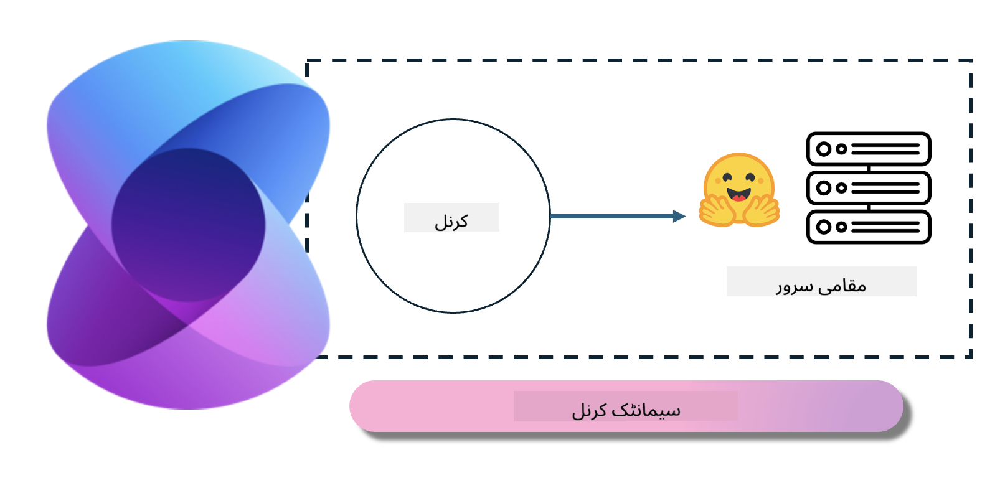
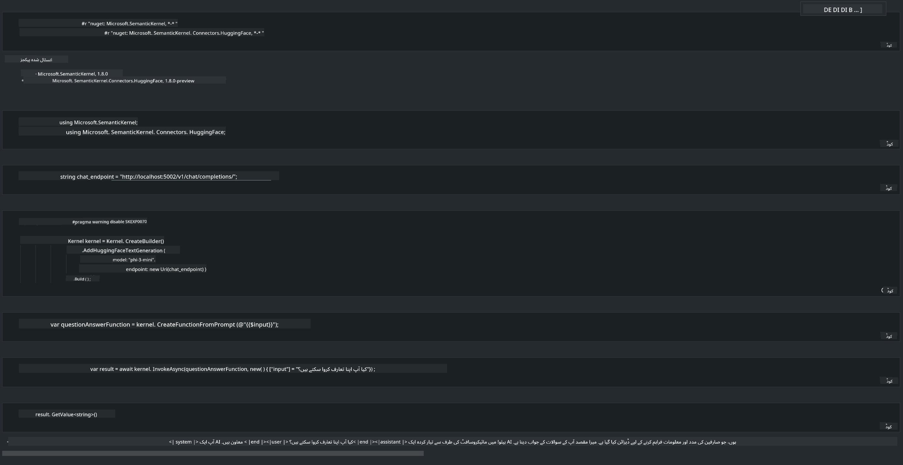

<!--
CO_OP_TRANSLATOR_METADATA:
{
  "original_hash": "bcf5dd7031db0031abdb9dd0c05ba118",
  "translation_date": "2025-05-07T14:30:41+00:00",
  "source_file": "md/01.Introduction/03/Local_Server_Inference.md",
  "language_code": "ur"
}
-->
# **لوکل سرور میں Inference Phi-3**

ہم Phi-3 کو لوکل سرور پر تعینات کر سکتے ہیں۔ صارفین [Ollama](https://ollama.com) یا [LM Studio](https://llamaedge.com) حل منتخب کر سکتے ہیں، یا وہ اپنا کوڈ خود لکھ سکتے ہیں۔ آپ Phi-3 کی لوکل سروسز کو [Semantic Kernel](https://github.com/microsoft/semantic-kernel?WT.mc_id=aiml-138114-kinfeylo) یا [Langchain](https://www.langchain.com/) کے ذریعے جوڑ کر Copilot ایپلیکیشنز بنا سکتے ہیں۔

## **Phi-3-mini تک رسائی کے لیے Semantic Kernel کا استعمال**

Copilot ایپلیکیشن میں، ہم Semantic Kernel / LangChain کے ذریعے ایپلیکیشنز بناتے ہیں۔ اس قسم کا ایپلیکیشن فریم ورک عام طور پر Azure OpenAI Service / OpenAI ماڈلز کے ساتھ مطابقت رکھتا ہے، اور Hugging Face پر اوپن سورس ماڈلز اور لوکل ماڈلز کی بھی حمایت کر سکتا ہے۔ اگر ہم Semantic Kernel کے ذریعے Phi-3-mini تک رسائی چاہتے ہیں تو کیا کرنا چاہیے؟ .NET کو مثال کے طور پر لیتے ہوئے، ہم اسے Semantic Kernel میں Hugging Face Connector کے ساتھ ملا سکتے ہیں۔ ڈیفالٹ کے طور پر، یہ Hugging Face پر ماڈل آئی ڈی کے مطابق ہوتا ہے (پہلی بار استعمال کرنے پر ماڈل Hugging Face سے ڈاؤن لوڈ ہوگا، جس میں وقت لگتا ہے)۔ آپ لوکل بنائی گئی سروس سے بھی کنیکٹ کر سکتے ہیں۔ ان دونوں کے مقابلے میں، ہم آخری طریقہ استعمال کرنے کی سفارش کرتے ہیں کیونکہ اس میں خود مختاری زیادہ ہوتی ہے، خاص طور پر انٹرپرائز ایپلیکیشنز میں۔

تصویر سے ظاہر ہے کہ Semantic Kernel کے ذریعے لوکل سروسز تک رسائی آسانی سے خود ساختہ Phi-3-mini ماڈل سرور سے جڑ سکتی ہے۔ یہاں چلانے کا نتیجہ ہے۔

***Sample Code*** https://github.com/kinfey/Phi3MiniSamples/tree/main/semantickernel

**دستخطی**:  
یہ دستاویز AI ترجمہ سروس [Co-op Translator](https://github.com/Azure/co-op-translator) کے ذریعے ترجمہ کی گئی ہے۔ اگرچہ ہم درستگی کے لیے کوشاں ہیں، براہ کرم اس بات سے آگاہ رہیں کہ خودکار ترجموں میں غلطیاں یا عدم صحت ہو سکتی ہے۔ اصل دستاویز اپنی مادری زبان میں ہی معتبر ماخذ سمجھی جانی چاہیے۔ اہم معلومات کے لیے پیشہ ورانہ انسانی ترجمہ تجویز کیا جاتا ہے۔ ہم اس ترجمے کے استعمال سے پیدا ہونے والی کسی بھی غلط فہمی یا غلط تشریح کے لیے ذمہ دار نہیں ہیں۔