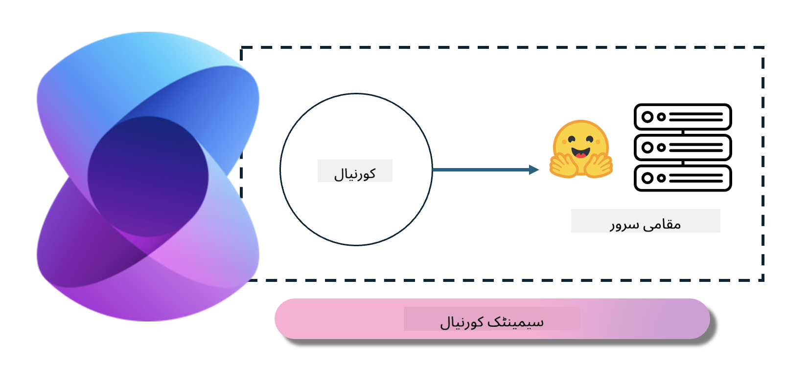
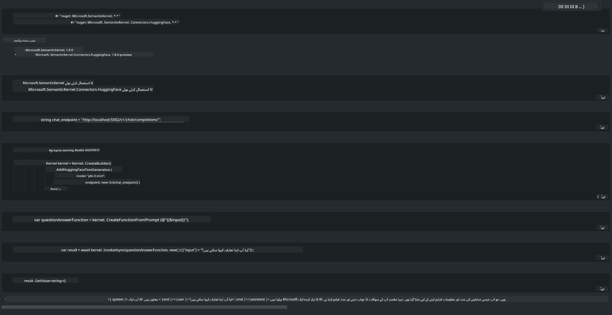

<!--
CO_OP_TRANSLATOR_METADATA:
{
  "original_hash": "12c0d9afaa23861ad5be655fcff4f71d",
  "translation_date": "2025-04-03T06:54:36+00:00",
  "source_file": "md\\01.Introduction\\03\\Local_Server_Inference.md",
  "language_code": "ur"
}
-->
# **لوکل سرور پر انفیرینس Phi-3**

ہم Phi-3 کو لوکل سرور پر ڈپلائے کر سکتے ہیں۔ صارفین [Ollama](https://ollama.com) یا [LM Studio](https://llamaedge.com) کے حل منتخب کر سکتے ہیں، یا اپنا کوڈ لکھ سکتے ہیں۔ آپ [Semantic Kernel](https://github.com/microsoft/semantic-kernel?WT.mc_id=aiml-138114-kinfeylo) یا [Langchain](https://www.langchain.com/) کے ذریعے Phi-3 کی لوکل سروسز سے جڑ کر کوپائلٹ ایپلیکیشنز بنا سکتے ہیں۔

## **Phi-3-mini تک رسائی کے لیے Semantic Kernel استعمال کریں**

کوپائلٹ ایپلیکیشن میں، ہم Semantic Kernel / LangChain کے ذریعے ایپلیکیشنز تخلیق کرتے ہیں۔ اس قسم کا ایپلیکیشن فریم ورک عام طور پر Azure OpenAI Service / OpenAI ماڈلز کے ساتھ مطابقت رکھتا ہے، اور Hugging Face پر موجود اوپن سورس ماڈلز اور لوکل ماڈلز کو بھی سپورٹ کر سکتا ہے۔ اگر ہم Semantic Kernel کو Phi-3-mini تک رسائی کے لیے استعمال کرنا چاہیں تو ہمیں کیا کرنا ہوگا؟ .NET کی مثال کے طور پر، ہم اسے Semantic Kernel میں Hugging Face Connector کے ساتھ ملا سکتے ہیں۔ ڈیفالٹ طور پر، یہ Hugging Face پر موجود ماڈل آئی ڈی سے مطابقت رکھتا ہے (پہلی بار استعمال کرتے وقت، ماڈل Hugging Face سے ڈاؤنلوڈ ہوگا، جس میں زیادہ وقت لگتا ہے)۔ آپ اسے بنائی گئی لوکل سروس سے بھی جوڑ سکتے ہیں۔ دونوں کے موازنے میں، ہم دوسرا طریقہ تجویز کرتے ہیں کیونکہ یہ زیادہ خودمختاری فراہم کرتا ہے، خاص طور پر انٹرپرائز ایپلیکیشنز میں۔

تصویر میں دکھایا گیا ہے کہ Semantic Kernel کے ذریعے لوکل سروسز تک رسائی آسانی سے خود بنائے گئے Phi-3-mini ماڈل سرور سے جڑ سکتی ہے۔ یہاں چلنے والے نتائج ہیں۔

***نمونہ کوڈ*** https://github.com/kinfey/Phi3MiniSamples/tree/main/semantickernel

**ڈسکلیمر**:  
یہ دستاویز AI ترجمہ سروس [Co-op Translator](https://github.com/Azure/co-op-translator) کے ذریعے ترجمہ کی گئی ہے۔ ہم درستگی کی پوری کوشش کرتے ہیں، لیکن براہ کرم یہ ذہن میں رکھیں کہ خودکار ترجمے میں غلطیاں یا غیر درستیاں ہوسکتی ہیں۔ اصل دستاویز، جو اس کی اصل زبان میں ہے، کو مستند ذریعہ سمجھا جانا چاہیے۔ اہم معلومات کے لیے، پیشہ ور انسانی ترجمے کی سفارش کی جاتی ہے۔ ہم اس ترجمے کے استعمال سے پیدا ہونے والے کسی بھی غلط فہمی یا غلط تشریح کے ذمہ دار نہیں ہیں۔