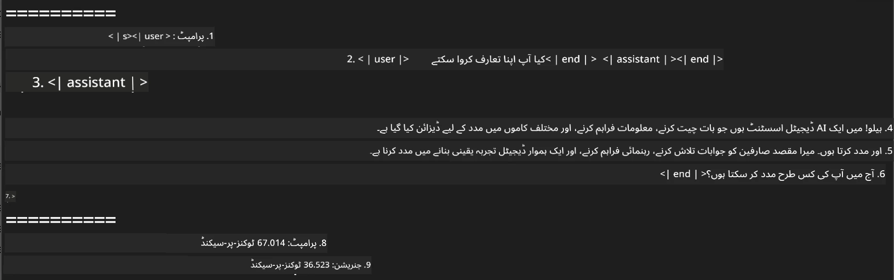
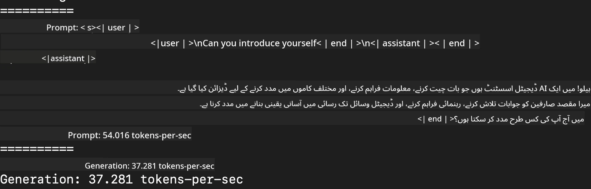
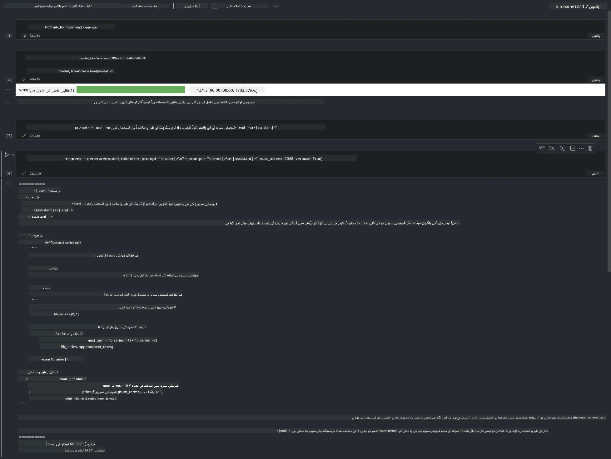

<!--
CO_OP_TRANSLATOR_METADATA:
{
  "original_hash": "dcb656f3d206fc4968e236deec5d4384",
  "translation_date": "2025-07-16T21:00:55+00:00",
  "source_file": "md/01.Introduction/03/MLX_Inference.md",
  "language_code": "ur"
}
-->
# **Inference Phi-3 ایپل MLX فریم ورک کے ساتھ**

## **MLX فریم ورک کیا ہے**

MLX ایپل سلیکن پر مشین لرننگ ریسرچ کے لیے ایک ارے فریم ورک ہے، جو ایپل مشین لرننگ ریسرچ کی جانب سے پیش کیا گیا ہے۔

MLX مشین لرننگ محققین کے لیے، مشین لرننگ محققین نے ڈیزائن کیا ہے۔ یہ فریم ورک صارف دوست ہونے کے ساتھ ساتھ ماڈلز کو تربیت دینے اور تعینات کرنے میں مؤثر بھی ہے۔ فریم ورک کا ڈیزائن خود بھی تصوراتی طور پر سادہ ہے۔ ہمارا مقصد محققین کے لیے MLX کو بڑھانا اور بہتر بنانا آسان بنانا ہے تاکہ وہ جلدی سے نئے خیالات کو دریافت کر سکیں۔

ایپل سلیکن ڈیوائسز میں MLX کے ذریعے LLMs کو تیز کیا جا سکتا ہے، اور ماڈلز کو مقامی طور پر بہت آسانی سے چلایا جا سکتا ہے۔

## **Phi-3-mini کی inference کے لیے MLX کا استعمال**

### **1. اپنا MLX ماحول سیٹ کریں**

1. Python 3.11.x  
2. MLX لائبریری انسٹال کریں

```bash

pip install mlx-lm

```

### **2. MLX کے ساتھ ٹرمینل میں Phi-3-mini چلانا**

```bash

python -m mlx_lm.generate --model microsoft/Phi-3-mini-4k-instruct --max-token 2048 --prompt  "<|user|>\nCan you introduce yourself<|end|>\n<|assistant|>"

```

نتیجہ (میرا ماحول Apple M1 Max, 64GB ہے) یہ ہے



### **3. ٹرمینل میں MLX کے ذریعے Phi-3-mini کو Quantize کرنا**

```bash

python -m mlx_lm.convert --hf-path microsoft/Phi-3-mini-4k-instruct

```

***Note：*** ماڈل کو mlx_lm.convert کے ذریعے quantize کیا جا سکتا ہے، اور ڈیفالٹ quantization INT4 ہے۔ اس مثال میں Phi-3-mini کو INT4 میں quantize کیا گیا ہے۔

ماڈل کو mlx_lm.convert کے ذریعے quantize کیا جا سکتا ہے، اور ڈیفالٹ quantization INT4 ہے۔ اس مثال میں Phi-3-mini کو INT4 میں quantize کیا گیا ہے۔ quantization کے بعد، یہ ماڈل ڈیفالٹ ڈائریکٹری ./mlx_model میں محفوظ ہو جائے گا۔

ہم ٹرمینل سے MLX کے ذریعے quantize کیے گئے ماڈل کو ٹیسٹ کر سکتے ہیں۔

```bash

python -m mlx_lm.generate --model ./mlx_model/ --max-token 2048 --prompt  "<|user|>\nCan you introduce yourself<|end|>\n<|assistant|>"

```

نتیجہ یہ ہے



### **4. Jupyter Notebook میں MLX کے ساتھ Phi-3-mini چلانا**



***Note:*** براہ کرم اس نمونے کو پڑھیں [اس لنک پر کلک کریں](../../../../../code/03.Inference/MLX/MLX_DEMO.ipynb)

## **وسائل**

1. ایپل MLX فریم ورک کے بارے میں جانیں [https://ml-explore.github.io](https://ml-explore.github.io/mlx/build/html/index.html)

2. ایپل MLX GitHub ریپو [https://github.com/ml-explore](https://github.com/ml-explore)

**دستخطی نوٹ**:  
یہ دستاویز AI ترجمہ سروس [Co-op Translator](https://github.com/Azure/co-op-translator) کے ذریعے ترجمہ کی گئی ہے۔ اگرچہ ہم درستگی کے لیے کوشاں ہیں، براہ کرم آگاہ رہیں کہ خودکار ترجمے میں غلطیاں یا عدم درستیاں ہو سکتی ہیں۔ اصل دستاویز اپنی مادری زبان میں ہی معتبر ماخذ سمجھی جانی چاہیے۔ اہم معلومات کے لیے پیشہ ور انسانی ترجمہ کی سفارش کی جاتی ہے۔ اس ترجمے کے استعمال سے پیدا ہونے والی کسی بھی غلط فہمی یا غلط تشریح کی ذمہ داری ہم پر عائد نہیں ہوتی۔