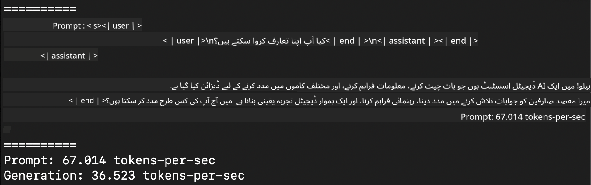
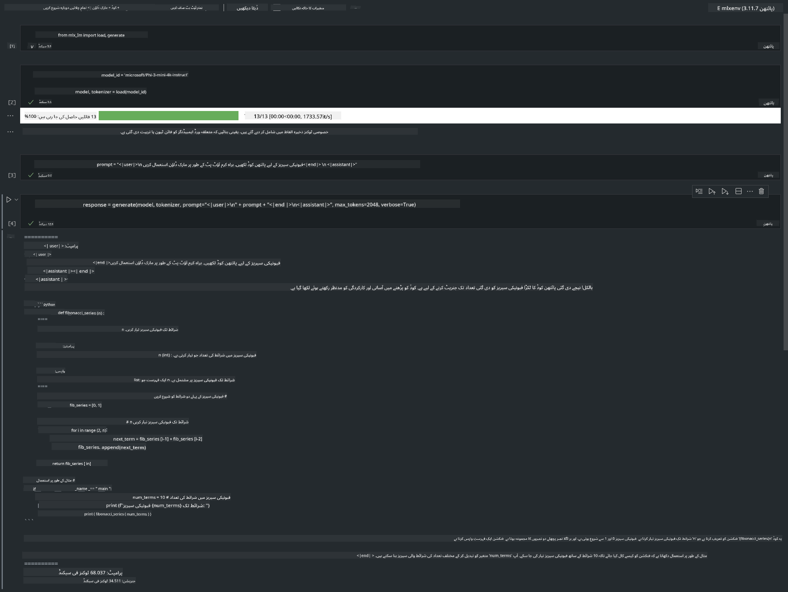

<!--
CO_OP_TRANSLATOR_METADATA:
{
  "original_hash": "dcb656f3d206fc4968e236deec5d4384",
  "translation_date": "2025-05-07T14:37:17+00:00",
  "source_file": "md/01.Introduction/03/MLX_Inference.md",
  "language_code": "ur"
}
-->
# **Inference Phi-3 with Apple MLX Framework**

## **MLX Framework کیا ہے**

MLX ایک ارے فریم ورک ہے جو Apple silicon پر مشین لرننگ تحقیق کے لیے بنایا گیا ہے، جسے Apple مشین لرننگ ریسرچ نے تیار کیا ہے۔

MLX کو مشین لرننگ محققین نے خاص طور پر مشین لرننگ محققین کے لیے ڈیزائن کیا ہے۔ یہ فریم ورک صارف دوست ہونے کے ساتھ ساتھ ماڈلز کو تربیت دینے اور چلانے میں بھی مؤثر ہے۔ فریم ورک کا ڈیزائن خود بھی تصوراتی طور پر سادہ ہے۔ ہمارا مقصد ہے کہ محققین کے لیے MLX کو آسانی سے بڑھایا اور بہتر بنایا جا سکے تاکہ نئے خیالات کو تیزی سے دریافت کیا جا سکے۔

Apple Silicon ڈیوائسز میں LLMs کو MLX کے ذریعے تیز کیا جا سکتا ہے، اور ماڈلز کو مقامی طور پر بہت آسانی سے چلایا جا سکتا ہے۔

## **Phi-3-mini کی inference کے لیے MLX کا استعمال**

### **1. اپنا MLX ماحول سیٹ کریں**

1. Python 3.11.x  
2. MLX لائبریری انسٹال کریں

```bash

pip install mlx-lm

```

### **2. MLX کے ساتھ Terminal میں Phi-3-mini چلانا**

```bash

python -m mlx_lm.generate --model microsoft/Phi-3-mini-4k-instruct --max-token 2048 --prompt  "<|user|>\nCan you introduce yourself<|end|>\n<|assistant|>"

```

نتیجہ (میرا ماحول Apple M1 Max, 64GB ہے) یہ ہے



### **3. Terminal میں MLX کے ساتھ Phi-3-mini کو Quantize کرنا**

```bash

python -m mlx_lm.convert --hf-path microsoft/Phi-3-mini-4k-instruct

```

***Note：*** ماڈل کو mlx_lm.convert کے ذریعے quantize کیا جا سکتا ہے، اور ڈیفالٹ quantization INT4 ہے۔ اس مثال میں Phi-3-mini کو INT4 میں quantize کیا گیا ہے۔

ماڈل کو mlx_lm.convert کے ذریعے quantize کیا جا سکتا ہے، اور ڈیفالٹ quantization INT4 ہے۔ اس مثال میں Phi-3-mini کو INT4 میں quantize کیا گیا ہے۔ Quantization کے بعد، ماڈل ڈیفالٹ ڈائریکٹری ./mlx_model میں محفوظ ہوگا۔

ہم Terminal سے MLX کے ذریعے quantize کیا ہوا ماڈل ٹیسٹ کر سکتے ہیں۔

```bash

python -m mlx_lm.generate --model ./mlx_model/ --max-token 2048 --prompt  "<|user|>\nCan you introduce yourself<|end|>\n<|assistant|>"

```

نتیجہ یہ ہے


### **4. Jupyter Notebook میں MLX کے ساتھ Phi-3-mini چلانا**



***Note:*** براہ کرم اس نمونے کو پڑھیں [click this link](../../../../../code/03.Inference/MLX/MLX_DEMO.ipynb)

## **وسائل**

1. Apple MLX Framework کے بارے میں جانیں [https://ml-explore.github.io](https://ml-explore.github.io/mlx/build/html/index.html)

2. Apple MLX GitHub ریپو [https://github.com/ml-explore](https://github.com/ml-explore)

**دستخطی بیان**:  
یہ دستاویز AI ترجمہ سروس [Co-op Translator](https://github.com/Azure/co-op-translator) کے ذریعے ترجمہ کی گئی ہے۔ اگرچہ ہم درستگی کے لیے کوشاں ہیں، براہ کرم آگاہ رہیں کہ خودکار ترجمے میں غلطیاں یا عدم صحت ہو سکتی ہے۔ اصل دستاویز اپنی مادری زبان میں ہی معتبر ماخذ سمجھی جانی چاہیے۔ اہم معلومات کے لیے پیشہ ورانہ انسانی ترجمہ تجویز کیا جاتا ہے۔ ہم اس ترجمے کے استعمال سے پیدا ہونے والی کسی بھی غلط فہمی یا غلط تشریح کے ذمہ دار نہیں ہیں۔