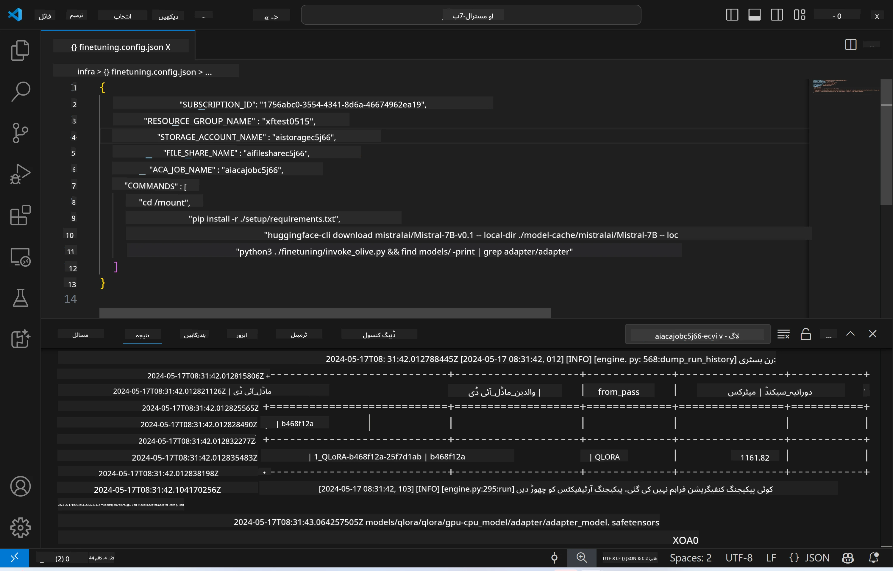
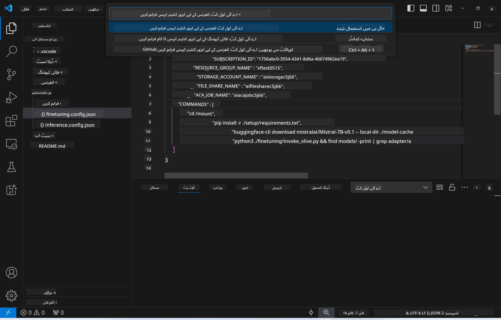
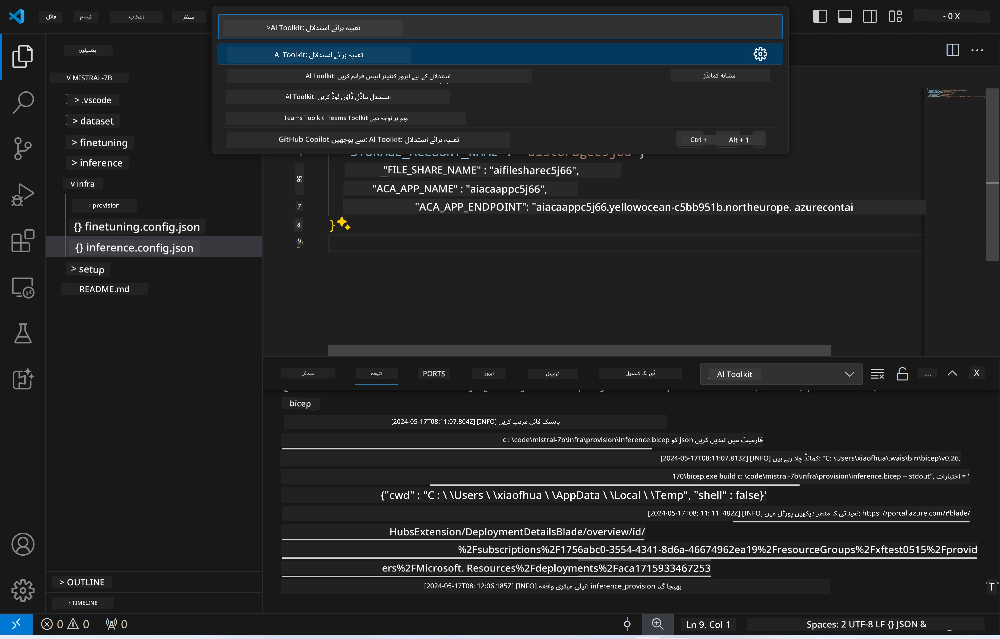
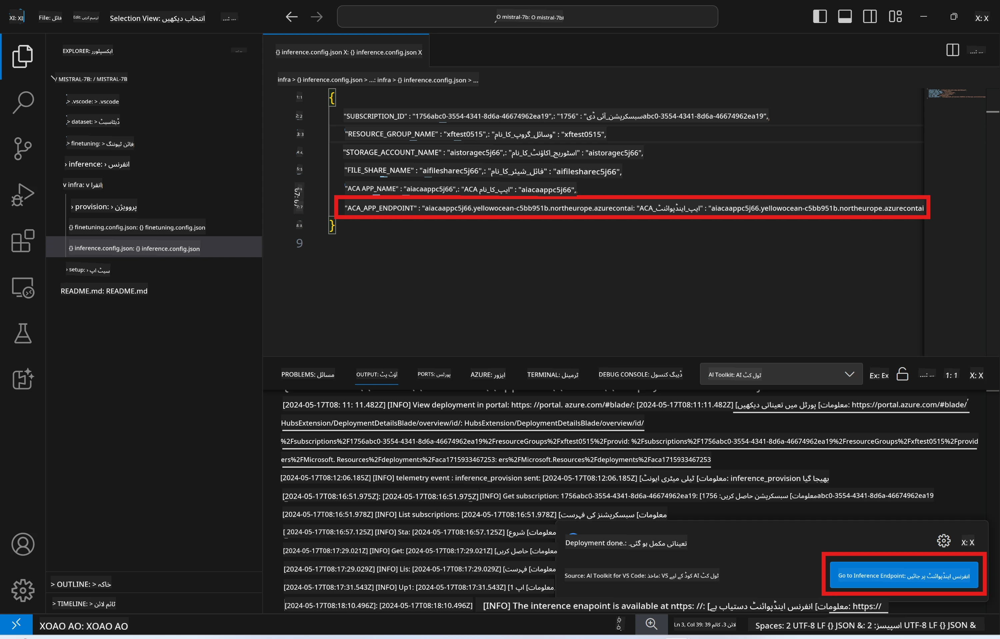

<!--
CO_OP_TRANSLATOR_METADATA:
{
  "original_hash": "a54cd3d65b6963e4e8ce21e143c3ab04",
  "translation_date": "2025-07-16T21:15:30+00:00",
  "source_file": "md/01.Introduction/03/Remote_Interence.md",
  "language_code": "ur"
}
-->
# ریموٹ انفیرنسنگ فائن ٹیون شدہ ماڈل کے ساتھ

جب ایڈاپٹرز ریموٹ ماحول میں تربیت پا جائیں، تو ماڈل کے ساتھ بات چیت کے لیے ایک سادہ Gradio ایپلیکیشن استعمال کریں۔



### Azure وسائل کی فراہمی  
ریمورٹ انفیرنس کے لیے Azure وسائل سیٹ اپ کرنے کے لیے کمانڈ پیلیٹ سے `AI Toolkit: Provision Azure Container Apps for inference` کمانڈ چلائیں۔ اس سیٹ اپ کے دوران آپ سے آپ کی Azure سبسکرپشن اور ریسورس گروپ منتخب کرنے کو کہا جائے گا۔  


عام طور پر، انفیرنس کے لیے سبسکرپشن اور ریسورس گروپ وہی ہونے چاہئیں جو فائن ٹیوننگ کے لیے استعمال ہوئے تھے۔ انفیرنس اسی Azure Container App Environment کو استعمال کرے گا اور ماڈل اور ماڈل ایڈاپٹر تک رسائی حاصل کرے گا جو Azure Files میں محفوظ ہیں، جو فائن ٹیوننگ کے دوران بنائے گئے تھے۔

## AI Toolkit کا استعمال

### انفیرنس کے لیے تعیناتی  
اگر آپ انفیرنس کوڈ میں ترمیم کرنا چاہتے ہیں یا انفیرنس ماڈل کو دوبارہ لوڈ کرنا چاہتے ہیں، تو `AI Toolkit: Deploy for inference` کمانڈ چلائیں۔ یہ آپ کے تازہ ترین کوڈ کو ACA کے ساتھ ہم آہنگ کرے گا اور ریپلیکا کو دوبارہ شروع کرے گا۔



تعیناتی کامیابی سے مکمل ہونے کے بعد، ماڈل اب اس اینڈ پوائنٹ کے ذریعے جانچ کے لیے تیار ہے۔

### انفیرنس API تک رسائی

آپ VSCode کی نوٹیفیکیشن میں دکھائے گئے "*Go to Inference Endpoint*" بٹن پر کلک کر کے انفیرنس API تک رسائی حاصل کر سکتے ہیں۔ متبادل طور پر، ویب API اینڈ پوائنٹ `ACA_APP_ENDPOINT` کے تحت `./infra/inference.config.json` میں اور آؤٹ پٹ پینل میں بھی مل سکتا ہے۔



> **نوٹ:** انفیرنس اینڈ پوائنٹ کو مکمل طور پر فعال ہونے میں چند منٹ لگ سکتے ہیں۔

## ٹیمپلیٹ میں شامل انفیرنس کے اجزاء

| فولڈر | مواد |
| ------ |--------- |
| `infra` | ریموٹ آپریشنز کے لیے تمام ضروری کنفیگریشنز پر مشتمل ہے۔ |
| `infra/provision/inference.parameters.json` | بائسک ٹیمپلیٹس کے لیے پیرامیٹرز رکھتا ہے، جو انفیرنس کے لیے Azure وسائل کی فراہمی میں استعمال ہوتے ہیں۔ |
| `infra/provision/inference.bicep` | انفیرنس کے لیے Azure وسائل کی فراہمی کے ٹیمپلیٹس پر مشتمل ہے۔ |
| `infra/inference.config.json` | کنفیگریشن فائل، جو `AI Toolkit: Provision Azure Container Apps for inference` کمانڈ کے ذریعے بنائی جاتی ہے۔ یہ دیگر ریموٹ کمانڈ پیلیٹس کے لیے ان پٹ کے طور پر استعمال ہوتی ہے۔ |

### AI Toolkit کا استعمال کرتے ہوئے Azure وسائل کی فراہمی کی ترتیب  
[AI Toolkit](https://marketplace.visualstudio.com/items?itemName=ms-windows-ai-studio.windows-ai-studio) کو ترتیب دیں۔

`Provision Azure Container Apps for inference` کمانڈ چلائیں۔

آپ کنفیگریشن پیرامیٹرز `./infra/provision/inference.parameters.json` فائل میں دیکھ سکتے ہیں۔ تفصیلات درج ذیل ہیں:

| پیرامیٹر | وضاحت |
| --------- |------------ |
| `defaultCommands` | یہ ویب API شروع کرنے کے لیے کمانڈز ہیں۔ |
| `maximumInstanceCount` | یہ پیرامیٹر GPU انسٹینسز کی زیادہ سے زیادہ گنجائش مقرر کرتا ہے۔ |
| `location` | یہ وہ جگہ ہے جہاں Azure وسائل فراہم کیے جاتے ہیں۔ ڈیفالٹ ویلیو منتخب کردہ ریسورس گروپ کی جگہ کے برابر ہوتی ہے۔ |
| `storageAccountName`, `fileShareName`, `acaEnvironmentName`, `acaEnvironmentStorageName`, `acaAppName`, `acaLogAnalyticsName` | یہ پیرامیٹرز Azure وسائل کے نام رکھنے کے لیے استعمال ہوتے ہیں۔ ڈیفالٹ طور پر یہ فائن ٹیوننگ کے وسائل کے نام کے برابر ہوں گے۔ آپ اپنی مرضی کے نئے، غیر استعمال شدہ نام دے کر اپنی مرضی کے وسائل بنا سکتے ہیں، یا پہلے سے موجود Azure وسائل کے نام دے کر انہیں استعمال کر سکتے ہیں۔ تفصیلات کے لیے سیکشن [Using existing Azure Resources](../../../../../md/01.Introduction/03) دیکھیں۔ |

### موجودہ Azure وسائل کا استعمال

عام طور پر، انفیرنس فراہمی وہی Azure Container App Environment، Storage Account، Azure File Share، اور Azure Log Analytics استعمال کرتی ہے جو فائن ٹیوننگ کے لیے استعمال ہوئے تھے۔ انفیرنس API کے لیے ایک الگ Azure Container App بنایا جاتا ہے۔

اگر آپ نے فائن ٹیوننگ کے دوران Azure وسائل کو حسب ضرورت بنایا ہے یا انفیرنس کے لیے اپنے موجودہ Azure وسائل استعمال کرنا چاہتے ہیں، تو ان کے نام `./infra/inference.parameters.json` فائل میں درج کریں۔ پھر کمانڈ پیلیٹ سے `AI Toolkit: Provision Azure Container Apps for inference` کمانڈ چلائیں۔ یہ مخصوص کردہ وسائل کو اپ ڈیٹ کرے گا اور جو وسائل موجود نہیں ہیں انہیں بنائے گا۔

مثال کے طور پر، اگر آپ کے پاس پہلے سے موجود Azure container environment ہے، تو آپ کی `./infra/finetuning.parameters.json` کچھ اس طرح نظر آنی چاہیے:

```json
{
    "$schema": "https://schema.management.azure.com/schemas/2019-04-01/deploymentParameters.json#",
    "contentVersion": "1.0.0.0",
    "parameters": {
      ...
      "acaEnvironmentName": {
        "value": "<your-aca-env-name>"
      },
      "acaEnvironmentStorageName": {
        "value": null
      },
      ...
    }
  }
```

### دستی فراہمی  
اگر آپ Azure وسائل کو دستی طور پر ترتیب دینا چاہتے ہیں، تو آپ `./infra/provision` فولڈرز میں موجود بائسک فائلز استعمال کر سکتے ہیں۔ اگر آپ نے AI Toolkit کمانڈ پیلیٹ استعمال کیے بغیر تمام Azure وسائل پہلے ہی سیٹ اپ اور کنفیگر کر لیے ہیں، تو آپ بس `inference.config.json` فائل میں وسائل کے نام درج کر سکتے ہیں۔

مثال کے طور پر:

```json
{
  "SUBSCRIPTION_ID": "<your-subscription-id>",
  "RESOURCE_GROUP_NAME": "<your-resource-group-name>",
  "STORAGE_ACCOUNT_NAME": "<your-storage-account-name>",
  "FILE_SHARE_NAME": "<your-file-share-name>",
  "ACA_APP_NAME": "<your-aca-name>",
  "ACA_APP_ENDPOINT": "<your-aca-endpoint>"
}
```

**دستخطی نوٹ**:  
یہ دستاویز AI ترجمہ سروس [Co-op Translator](https://github.com/Azure/co-op-translator) کے ذریعے ترجمہ کی گئی ہے۔ اگرچہ ہم درستگی کے لیے کوشاں ہیں، براہ کرم آگاہ رہیں کہ خودکار ترجمے میں غلطیاں یا عدم درستیاں ہو سکتی ہیں۔ اصل دستاویز اپنی مادری زبان میں ہی معتبر ماخذ سمجھی جانی چاہیے۔ اہم معلومات کے لیے پیشہ ور انسانی ترجمہ کی سفارش کی جاتی ہے۔ اس ترجمے کے استعمال سے پیدا ہونے والی کسی بھی غلط فہمی یا غلط تشریح کی ذمہ داری ہم پر عائد نہیں ہوتی۔