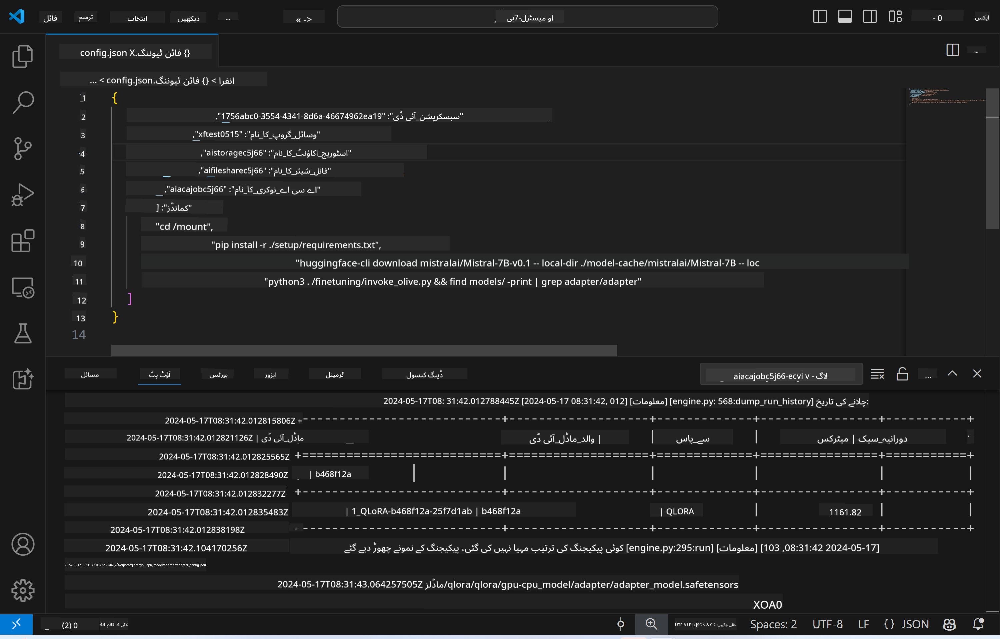
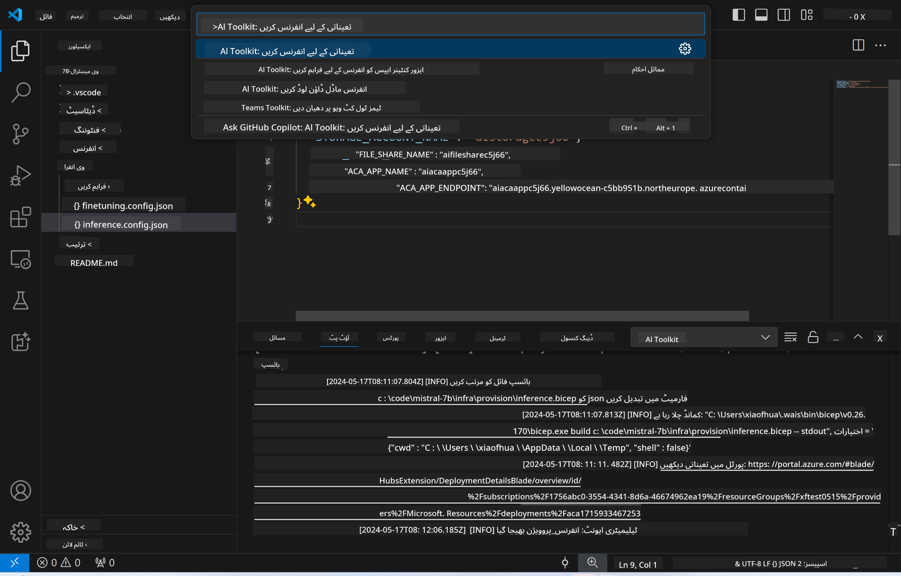
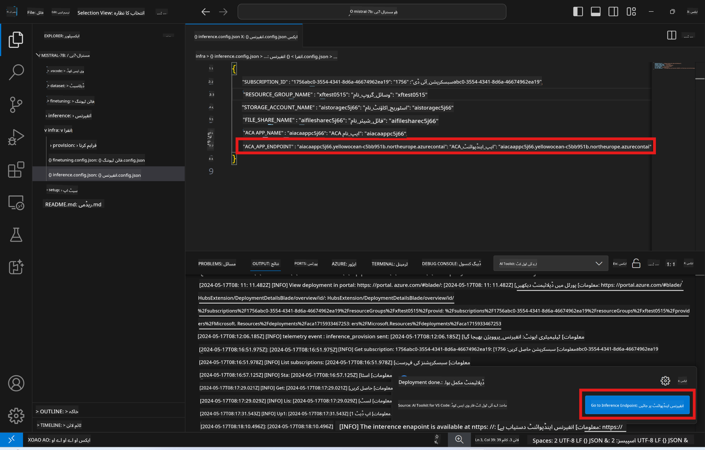

<!--
CO_OP_TRANSLATOR_METADATA:
{
  "original_hash": "8782d16f62bc2bdae1f0b38f39a2417c",
  "translation_date": "2025-04-03T06:57:38+00:00",
  "source_file": "md\\01.Introduction\\03\\Remote_Interence.md",
  "language_code": "ur"
}
-->
# ریموٹ ماڈل کے ساتھ انفرنسنگ

جب ایڈاپٹرز کو ریموٹ ماحول میں ٹرین کر لیا جائے تو ماڈل کے ساتھ تعامل کے لیے ایک سادہ Gradio ایپلیکیشن استعمال کریں۔



### Azure وسائل کی تیاری
ریموٹ انفرنسنگ کے لیے Azure وسائل کو سیٹ اپ کرنے کے لیے، کمانڈ پیلیٹ سے `AI Toolkit: Provision Azure Container Apps for inference` کو چلائیں۔ اس سیٹ اپ کے دوران، آپ کو اپنی Azure سبسکرپشن اور ریسورس گروپ منتخب کرنے کے لیے کہا جائے گا۔  

   
ڈیفالٹ طور پر، انفرنس کے لیے سبسکرپشن اور ریسورس گروپ وہی ہونا چاہیے جو فائن ٹیوننگ کے لیے استعمال ہوا تھا۔ انفرنسنگ وہی Azure Container App Environment استعمال کرے گی اور Azure Files میں محفوظ ماڈل اور ماڈل ایڈاپٹر تک رسائی حاصل کرے گی، جو فائن ٹیوننگ مرحلے کے دوران تیار کیے گئے تھے۔

## AI ٹول کٹ کا استعمال 

### انفرنس کے لیے ڈپلائمنٹ  
اگر آپ انفرنس کوڈ میں ترمیم کرنا چاہتے ہیں یا انفرنس ماڈل کو دوبارہ لوڈ کرنا چاہتے ہیں، تو براہ کرم `AI Toolkit: Deploy for inference` کمانڈ چلائیں۔ یہ آپ کے تازہ ترین کوڈ کو ACA کے ساتھ ہم آہنگ کرے گا اور ریپلیکا کو دوبارہ شروع کرے گا۔  



ڈپلائمنٹ کامیابی سے مکمل ہونے کے بعد، ماڈل اب اس اینڈ پوائنٹ کے ذریعے ایویلیویشن کے لیے تیار ہے۔

### انفرنس API تک رسائی

آپ انفرنس API تک رسائی حاصل کرنے کے لیے VSCode نوٹیفکیشن میں دکھائے گئے "*Go to Inference Endpoint*" بٹن پر کلک کر سکتے ہیں۔ متبادل طور پر، ویب API اینڈ پوائنٹ `ACA_APP_ENDPOINT` میں `./infra/inference.config.json` اور آؤٹ پٹ پینل میں پایا جا سکتا ہے۔



> **نوٹ:** انفرنس اینڈ پوائنٹ کو مکمل طور پر فعال ہونے میں چند منٹ لگ سکتے ہیں۔

## ٹیمپلیٹ میں شامل انفرنس کے اجزاء
 
| فولڈر | مواد |
| ------ |--------- |
| `infra` | ریموٹ آپریشنز کے لیے تمام ضروری کنفیگریشنز شامل ہیں۔ |
| `infra/provision/inference.parameters.json` | بائسپس ٹیمپلیٹس کے لیے پیرامیٹرز رکھتا ہے، جو انفرنس کے لیے Azure وسائل کی تیاری کے لیے استعمال ہوتے ہیں۔ |
| `infra/provision/inference.bicep` | انفرنس کے لیے Azure وسائل کی تیاری کے ٹیمپلیٹس پر مشتمل ہے۔ |
| `infra/inference.config.json` | کنفیگریشن فائل، جو `AI Toolkit: Provision Azure Container Apps for inference` کمانڈ کے ذریعے تیار کی گئی ہے۔ یہ دیگر ریموٹ کمانڈ پیلیٹس کے لیے ان پٹ کے طور پر استعمال ہوتی ہے۔ |

### AI ٹول کٹ کا استعمال کرتے ہوئے Azure وسائل کی تیاری
[AI ٹول کٹ](https://marketplace.visualstudio.com/items?itemName=ms-windows-ai-studio.windows-ai-studio) کو کنفیگر کریں۔

انفرنس کے لیے Azure Container Apps تیار کریں ` command.

You can find configuration parameters in `./infra/provision/inference.parameters.json` file. Here are the details:
| Parameter | Description |
| --------- |------------ |
| `defaultCommands` | This is the commands to initiate a web API. |
| `maximumInstanceCount` | This parameter sets the maximum capacity of GPU instances. |
| `location` | This is the location where Azure resources are provisioned. The default value is the same as the chosen resource group's location. |
| `storageAccountName`, `fileShareName` `acaEnvironmentName`, `acaEnvironmentStorageName`, `acaAppName`,  `acaLogAnalyticsName` | These parameters are used to name the Azure resources for provision. By default, they will be same to the fine-tuning resource name. You can input a new, unused resource name to create your own custom-named resources, or you can input the name of an already existing Azure resource if you'd prefer to use that. For details, refer to the section [Using existing Azure Resources](../../../../../md/01.Introduction/03). |

### Using Existing Azure Resources

By default, the inference provision use the same Azure Container App Environment, Storage Account, Azure File Share, and Azure Log Analytics that were used for fine-tuning. A separate Azure Container App is created solely for the inference API. 

If you have customized the Azure resources during the fine-tuning step or want to use your own existing Azure resources for inference, specify their names in the `./infra/inference.parameters.json` فائل میں۔ پھر کمانڈ پیلیٹ سے `AI Toolkit: Provision Azure Container Apps for inference` کمانڈ چلائیں۔ یہ کسی بھی مخصوص وسائل کو اپ ڈیٹ کرے گا اور کسی بھی گمشدہ وسائل کو تیار کرے گا۔

مثال کے طور پر، اگر آپ کے پاس ایک موجودہ Azure کنٹینر ماحول ہے، تو آپ کی `./infra/finetuning.parameters.json` اس طرح نظر آنی چاہیے:

```json
{
    "$schema": "https://schema.management.azure.com/schemas/2019-04-01/deploymentParameters.json#",
    "contentVersion": "1.0.0.0",
    "parameters": {
      ...
      "acaEnvironmentName": {
        "value": "<your-aca-env-name>"
      },
      "acaEnvironmentStorageName": {
        "value": null
      },
      ...
    }
  }
```

### دستی تیاری  
اگر آپ Azure وسائل کو دستی طور پر کنفیگر کرنا پسند کرتے ہیں، تو آپ `./infra/provision` folders. If you have already set up and configured all the Azure resources without using the AI Toolkit command palette, you can simply enter the resource names in the `inference.config.json` فائل میں فراہم کردہ بائسپس فائلز استعمال کر سکتے ہیں۔

مثال کے طور پر:

```json
{
  "SUBSCRIPTION_ID": "<your-subscription-id>",
  "RESOURCE_GROUP_NAME": "<your-resource-group-name>",
  "STORAGE_ACCOUNT_NAME": "<your-storage-account-name>",
  "FILE_SHARE_NAME": "<your-file-share-name>",
  "ACA_APP_NAME": "<your-aca-name>",
  "ACA_APP_ENDPOINT": "<your-aca-endpoint>"
}
```

**ڈسکلیمر**:  
یہ دستاویز AI ترجمہ سروس [Co-op Translator](https://github.com/Azure/co-op-translator) کا استعمال کرتے ہوئے ترجمہ کی گئی ہے۔ ہم درستگی کے لئے بھرپور کوشش کرتے ہیں، لیکن براہ کرم آگاہ رہیں کہ خودکار ترجمے میں غلطیاں یا عدم درستگی ہو سکتی ہیں۔ اصل دستاویز، جو اس کی اصل زبان میں ہے، کو مستند ذریعہ سمجھا جانا چاہئے۔ اہم معلومات کے لئے، پیشہ ور انسانی ترجمہ کی سفارش کی جاتی ہے۔ اس ترجمے کے استعمال سے پیدا ہونے والی کسی بھی غلط فہمی یا غلط تشریح کے لئے ہم ذمہ دار نہیں ہیں۔