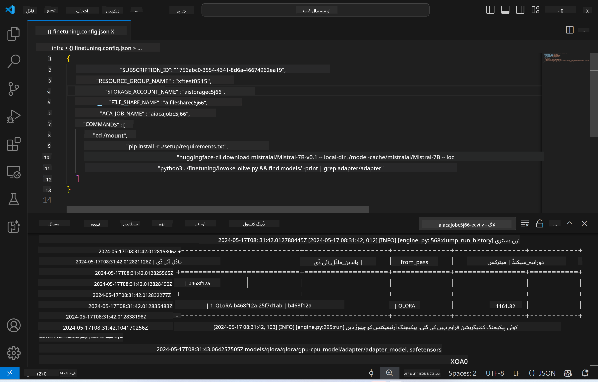
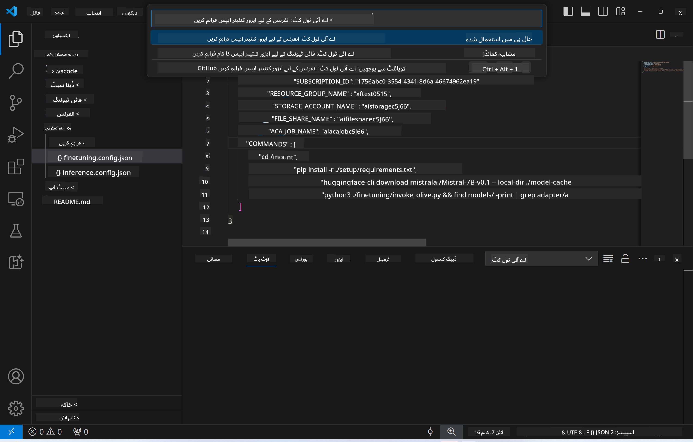
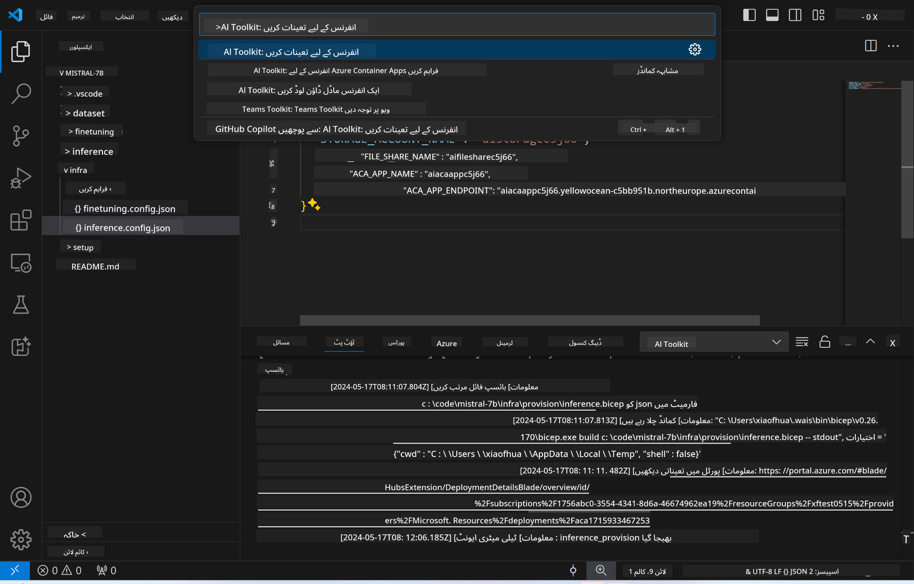

<!--
CO_OP_TRANSLATOR_METADATA:
{
  "original_hash": "a54cd3d65b6963e4e8ce21e143c3ab04",
  "translation_date": "2025-05-07T14:32:34+00:00",
  "source_file": "md/01.Introduction/03/Remote_Interence.md",
  "language_code": "ur"
}
-->
# ریموٹ انفیرنسنگ فائن ٹیون کیے گئے ماڈل کے ساتھ

جب ایڈاپٹرز ریموٹ ماحول میں ٹرین ہو جائیں، تو ماڈل کے ساتھ انٹریکٹ کرنے کے لیے ایک سادہ Gradio ایپلیکیشن استعمال کریں۔



### Azure وسائل کا قیام  
ریمورٹ انفیرنس کے لیے Azure وسائل قائم کرنے کے لیے `AI Toolkit: Provision Azure Container Apps for inference` کمانڈ کو کمانڈ پیلیٹ سے چلائیں۔ اس سیٹ اپ کے دوران آپ سے آپ کی Azure سبسکرپشن اور ریسورس گروپ منتخب کرنے کو کہا جائے گا۔  


عام طور پر، انفیرنس کے لیے سبسکرپشن اور ریسورس گروپ وہی ہونا چاہیے جو فائن ٹیوننگ کے لیے استعمال ہوئے تھے۔ انفیرنس اسی Azure Container App Environment کو استعمال کرے گا اور ماڈل اور ماڈل ایڈاپٹر تک رسائی حاصل کرے گا جو Azure Files میں محفوظ ہیں، جو فائن ٹیوننگ کے دوران بنائے گئے تھے۔

## AI Toolkit کا استعمال

### انفیرنس کے لیے ڈیپلائمنٹ  
اگر آپ انفیرنس کوڈ کو دوبارہ دیکھنا یا انفیرنس ماڈل کو دوبارہ لوڈ کرنا چاہتے ہیں، تو براہ کرم `AI Toolkit: Deploy for inference` کمانڈ چلائیں۔ یہ آپ کے تازہ ترین کوڈ کو ACA کے ساتھ ہم آہنگ کرے گا اور ریپلیکا کو ری اسٹارٹ کرے گا۔



ڈیپلائمنٹ کی کامیاب تکمیل کے بعد، ماڈل اب اس اینڈ پوائنٹ کے ذریعے تشخیص کے لیے تیار ہے۔

### انفیرنس API تک رسائی

آپ VSCode کی نوٹیفیکیشن میں دکھائے گئے "*Go to Inference Endpoint*" بٹن پر کلک کر کے انفیرنس API تک رسائی حاصل کر سکتے ہیں۔ متبادل طور پر، ویب API اینڈ پوائنٹ `ACA_APP_ENDPOINT` میں `./infra/inference.config.json` اور آؤٹ پٹ پینل میں بھی مل سکتا ہے۔


> **Note:** انفیرنس اینڈ پوائنٹ کو مکمل طور پر فعال ہونے میں چند منٹ لگ سکتے ہیں۔

## ٹیمپلیٹ میں شامل انفیرنس اجزاء

| فولڈر | مواد |
| ------ |--------- |
| `infra` | ریموٹ آپریشنز کے لیے تمام ضروری کنفیگریشنز شامل ہیں۔ |
| `infra/provision/inference.parameters.json` | بائسِپ ٹیمپلیٹس کے لیے پیرامیٹرز رکھتا ہے، جو انفیرنس کے لیے Azure وسائل کے قیام میں استعمال ہوتے ہیں۔ |
| `infra/provision/inference.bicep` | انفیرنس کے لیے Azure وسائل کے قیام کے ٹیمپلیٹس شامل ہیں۔ |
| `infra/inference.config.json` | کنفیگریشن فائل، جو `AI Toolkit: Provision Azure Container Apps for inference` کمانڈ سے جنریٹ ہوتی ہے۔ اسے دیگر ریموٹ کمانڈ پیلیٹس کے ان پٹ کے طور پر استعمال کیا جاتا ہے۔ |

### AI Toolkit کے ذریعے Azure Resource Provision کی کنفیگریشن  
[AI Toolkit](https://marketplace.visualstudio.com/items?itemName=ms-windows-ai-studio.windows-ai-studio) کو کنفیگر کریں

انفیرنس کے لیے Azure Container Apps کا قیام کریں` command.

You can find configuration parameters in `./infra/provision/inference.parameters.json` file. Here are the details:
| Parameter | Description |
| --------- |------------ |
| `defaultCommands` | This is the commands to initiate a web API. |
| `maximumInstanceCount` | This parameter sets the maximum capacity of GPU instances. |
| `location` | This is the location where Azure resources are provisioned. The default value is the same as the chosen resource group's location. |
| `storageAccountName`, `fileShareName` `acaEnvironmentName`, `acaEnvironmentStorageName`, `acaAppName`,  `acaLogAnalyticsName` | These parameters are used to name the Azure resources for provision. By default, they will be same to the fine-tuning resource name. You can input a new, unused resource name to create your own custom-named resources, or you can input the name of an already existing Azure resource if you'd prefer to use that. For details, refer to the section [Using existing Azure Resources](../../../../../md/01.Introduction/03). |

### Using Existing Azure Resources

By default, the inference provision use the same Azure Container App Environment, Storage Account, Azure File Share, and Azure Log Analytics that were used for fine-tuning. A separate Azure Container App is created solely for the inference API. 

If you have customized the Azure resources during the fine-tuning step or want to use your own existing Azure resources for inference, specify their names in the `./infra/inference.parameters.json` فائل میں۔ پھر، کمانڈ پیلیٹ سے `AI Toolkit: Provision Azure Container Apps for inference` کمانڈ چلائیں۔ یہ کسی بھی مخصوص وسائل کو اپ ڈیٹ کرے گا اور جو وسائل موجود نہیں ہیں انہیں بنائے گا۔

مثال کے طور پر، اگر آپ کے پاس پہلے سے کوئی Azure container environment موجود ہے، تو آپ کی `./infra/finetuning.parameters.json` کچھ یوں ہونی چاہیے:

```json
{
    "$schema": "https://schema.management.azure.com/schemas/2019-04-01/deploymentParameters.json#",
    "contentVersion": "1.0.0.0",
    "parameters": {
      ...
      "acaEnvironmentName": {
        "value": "<your-aca-env-name>"
      },
      "acaEnvironmentStorageName": {
        "value": null
      },
      ...
    }
  }
```

### دستی قیام  
اگر آپ Azure وسائل کو دستی طور پر کنفیگر کرنا چاہتے ہیں، تو آپ فراہم کردہ بائسِپ فائلز کو `./infra/provision` folders. If you have already set up and configured all the Azure resources without using the AI Toolkit command palette, you can simply enter the resource names in the `inference.config.json` فائل میں استعمال کر سکتے ہیں۔

مثال کے طور پر:

```json
{
  "SUBSCRIPTION_ID": "<your-subscription-id>",
  "RESOURCE_GROUP_NAME": "<your-resource-group-name>",
  "STORAGE_ACCOUNT_NAME": "<your-storage-account-name>",
  "FILE_SHARE_NAME": "<your-file-share-name>",
  "ACA_APP_NAME": "<your-aca-name>",
  "ACA_APP_ENDPOINT": "<your-aca-endpoint>"
}
```

**دستخطی**:  
یہ دستاویز AI ترجمہ سروس [Co-op Translator](https://github.com/Azure/co-op-translator) کے ذریعے ترجمہ کی گئی ہے۔ اگرچہ ہم درستگی کی کوشش کرتے ہیں، براہ کرم آگاہ رہیں کہ خودکار ترجمے میں غلطیاں یا عدم درستیاں ہو سکتی ہیں۔ اصل دستاویز اپنی مادری زبان میں معتبر ماخذ سمجھی جانی چاہیے۔ اہم معلومات کے لیے پیشہ ور انسانی ترجمہ کی سفارش کی جاتی ہے۔ اس ترجمے کے استعمال سے پیدا ہونے والی کسی بھی غلط فہمی یا غلط تشریح کی ذمہ داری ہم پر عائد نہیں ہوتی۔