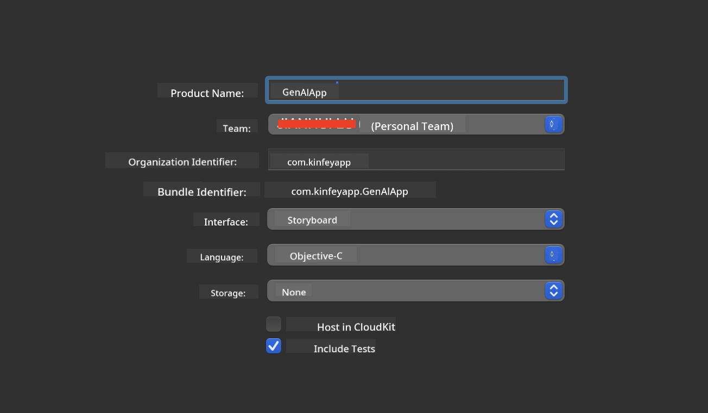
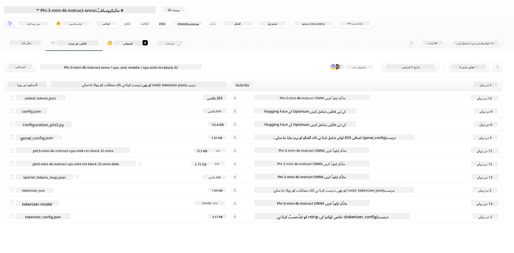
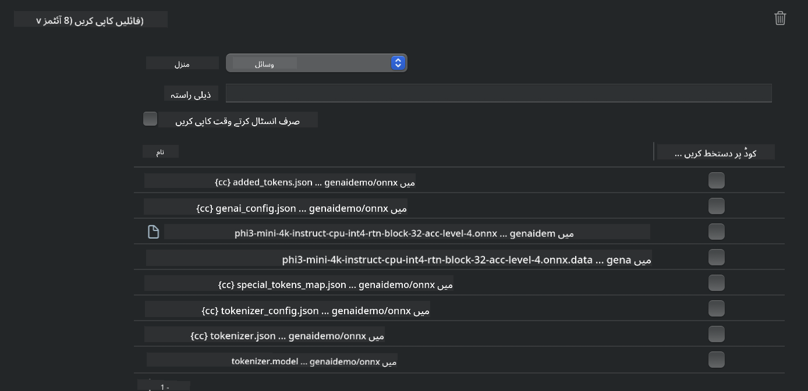
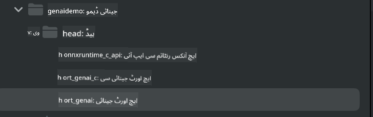
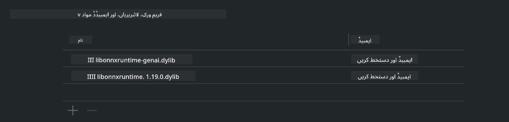
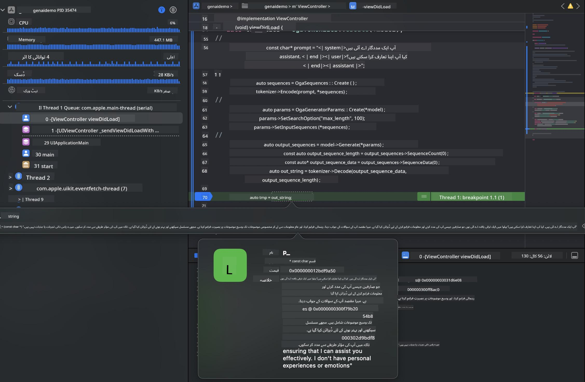

<!--
CO_OP_TRANSLATOR_METADATA:
{
  "original_hash": "ffeb840575ff03dea81d2b2214f2e000",
  "translation_date": "2025-04-03T06:49:59+00:00",
  "source_file": "md\\01.Introduction\\03\\iOS_Inference.md",
  "language_code": "ur"
}
-->
# **iOS میں Phi-3 کی پیش گوئی**

Phi-3-mini مائیکروسافٹ کے نئے ماڈلز کی سیریز ہے جو بڑے زبان کے ماڈلز (LLMs) کو ایج ڈیوائسز اور IoT ڈیوائسز پر تعینات کرنے کے قابل بناتی ہے۔ Phi-3-mini iOS، اینڈرائیڈ، اور ایج ڈیوائس کی تعیناتی کے لیے دستیاب ہے، جس سے BYOD ماحول میں جنریٹو AI کو تعینات کرنا ممکن ہوتا ہے۔ ذیل میں دیے گئے مثال Phi-3-mini کو iOS پر تعینات کرنے کا طریقہ دکھاتی ہے۔

## **1. تیاری**

- **a.** macOS 14 یا اس سے زیادہ
- **b.** Xcode 15 یا اس سے زیادہ
- **c.** iOS SDK 17.x (iPhone 14 A16 یا اس سے زیادہ)
- **d.** Python 3.10+ انسٹال کریں (Conda تجویز کی جاتی ہے)
- **e.** Python لائبریری انسٹال کریں: `python-flatbuffers`
- **f.** CMake انسٹال کریں

### Semantic Kernel اور پیش گوئی

Semantic Kernel ایک ایپلیکیشن فریم ورک ہے جو آپ کو Azure OpenAI Service، OpenAI ماڈلز، اور یہاں تک کہ مقامی ماڈلز کے ساتھ مطابقت رکھنے والی ایپلیکیشنز بنانے کی اجازت دیتا ہے۔ Semantic Kernel کے ذریعے مقامی سروسز تک رسائی آپ کے خود میزبان Phi-3-mini ماڈل سرور کے ساتھ آسان انضمام کو ممکن بناتی ہے۔

### Ollama یا LlamaEdge کے ساتھ Quantized ماڈلز کو کال کرنا

بہت سے صارفین مقامی طور پر ماڈلز چلانے کے لیے Quantized ماڈلز کا استعمال ترجیح دیتے ہیں۔ [Ollama](https://ollama.com) اور [LlamaEdge](https://llamaedge.com) صارفین کو مختلف Quantized ماڈلز کال کرنے کی اجازت دیتے ہیں:

#### **Ollama**

آپ `ollama run phi3` کو براہ راست چلا سکتے ہیں یا اسے آف لائن کنفیگر کر سکتے ہیں۔ اپنے `gguf` فائل کے راستے کے ساتھ ایک Modelfile بنائیں۔ Phi-3-mini Quantized ماڈل چلانے کے لیے نمونہ کوڈ:

```gguf
FROM {Add your gguf file path}
TEMPLATE \"\"\"<|user|> .Prompt<|end|> <|assistant|>\"\"\"
PARAMETER stop <|end|>
PARAMETER num_ctx 4096
```

#### **LlamaEdge**

اگر آپ `gguf` کو بیک وقت کلاؤڈ اور ایج ڈیوائسز پر استعمال کرنا چاہتے ہیں، تو LlamaEdge ایک بہترین انتخاب ہے۔

## **2. iOS کے لیے ONNX Runtime کو مرتب کرنا**

```bash

git clone https://github.com/microsoft/onnxruntime.git

cd onnxruntime

./build.sh --build_shared_lib --ios --skip_tests --parallel --build_dir ./build_ios --ios --apple_sysroot iphoneos --osx_arch arm64 --apple_deploy_target 17.5 --cmake_generator Xcode --config Release

cd ../

```

### **نوٹ کریں**

- **a.** مرتب کرنے سے پہلے، یقینی بنائیں کہ Xcode صحیح طریقے سے کنفیگر ہے اور اسے ٹرمینل میں فعال ڈویلپر ڈائریکٹری کے طور پر سیٹ کریں:

    ```bash
    sudo xcode-select -switch /Applications/Xcode.app/Contents/Developer
    ```

- **b.** ONNX Runtime کو مختلف پلیٹ فارمز کے لیے مرتب کرنے کی ضرورت ہے۔ iOS کے لیے، آپ اسے `arm64` or `x86_64` کے لیے مرتب کر سکتے ہیں۔

- **c.** مرتب کرنے کے لیے جدید ترین iOS SDK استعمال کرنے کی سفارش کی جاتی ہے۔ تاہم، اگر آپ کو پچھلے SDKs کے ساتھ مطابقت کی ضرورت ہو تو آپ پرانا ورژن بھی استعمال کر سکتے ہیں۔

## **3. iOS کے لیے ONNX Runtime کے ساتھ Generative AI کو مرتب کرنا**

> **نوٹ:** چونکہ ONNX Runtime کے ساتھ Generative AI ابھی پیش نظارہ میں ہے، براہ کرم ممکنہ تبدیلیوں سے آگاہ رہیں۔

```bash

git clone https://github.com/microsoft/onnxruntime-genai
 
cd onnxruntime-genai
 
mkdir ort
 
cd ort
 
mkdir include
 
mkdir lib
 
cd ../
 
cp ../onnxruntime/include/onnxruntime/core/session/onnxruntime_c_api.h ort/include
 
cp ../onnxruntime/build_ios/Release/Release-iphoneos/libonnxruntime*.dylib* ort/lib
 
export OPENCV_SKIP_XCODEBUILD_FORCE_TRYCOMPILE_DEBUG=1
 
python3 build.py --parallel --build_dir ./build_ios --ios --ios_sysroot iphoneos --ios_arch arm64 --ios_deployment_target 17.5 --cmake_generator Xcode --cmake_extra_defines CMAKE_XCODE_ATTRIBUTE_CODE_SIGNING_ALLOWED=NO

```

## **4. Xcode میں ایک ایپ ایپلیکیشن بنائیں**

میں نے Objective-C کو ایپلیکیشن ڈویلپمنٹ کے طریقہ کے طور پر منتخب کیا کیونکہ ONNX Runtime C++ API کے ساتھ Generative AI استعمال کرتے وقت Objective-C زیادہ مطابقت رکھتا ہے۔ ظاہر ہے، آپ متعلقہ کالز Swift bridging کے ذریعے بھی مکمل کر سکتے ہیں۔



## **5. ONNX Quantized INT4 ماڈل کو ایپلیکیشن پروجیکٹ میں کاپی کریں**

ہمیں ONNX فارمیٹ میں INT4 Quantization ماڈل درآمد کرنے کی ضرورت ہے، جسے پہلے ڈاؤن لوڈ کرنا ہوگا۔



ڈاؤن لوڈ کرنے کے بعد، آپ کو اسے Xcode میں پروجیکٹ کے Resources ڈائریکٹری میں شامل کرنا ہوگا۔



## **6. ViewControllers میں C++ API شامل کریں**

> **نوٹ کریں:**

- **a.** متعلقہ C++ ہیڈر فائلز کو پروجیکٹ میں شامل کریں۔

  

- **b.** `onnxruntime-genai` dynamic library in Xcode.

  

- **c.** Use the C Samples code for testing. You can also add additional features like ChatUI for more functionality.

- **d.** Since you need to use C++ in your project, rename `ViewController.m` to `ViewController.mm` شامل کریں تاکہ Objective-C++ سپورٹ کو فعال کیا جا سکے۔

```objc

    NSString *llmPath = [[NSBundle mainBundle] resourcePath];
    char const *modelPath = llmPath.cString;

    auto model =  OgaModel::Create(modelPath);

    auto tokenizer = OgaTokenizer::Create(*model);

    const char* prompt = "<|system|>You are a helpful AI assistant.<|end|><|user|>Can you introduce yourself?<|end|><|assistant|>";

    auto sequences = OgaSequences::Create();
    tokenizer->Encode(prompt, *sequences);

    auto params = OgaGeneratorParams::Create(*model);
    params->SetSearchOption("max_length", 100);
    params->SetInputSequences(*sequences);

    auto output_sequences = model->Generate(*params);
    const auto output_sequence_length = output_sequences->SequenceCount(0);
    const auto* output_sequence_data = output_sequences->SequenceData(0);
    auto out_string = tokenizer->Decode(output_sequence_data, output_sequence_length);
    
    auto tmp = out_string;

```

## **7. ایپلیکیشن چلائیں**

ایک بار سیٹ اپ مکمل ہو جانے کے بعد، آپ ایپلیکیشن چلا سکتے ہیں تاکہ Phi-3-mini ماڈل کی پیش گوئی کے نتائج دیکھ سکیں۔



مزید نمونہ کوڈ اور تفصیلی ہدایات کے لیے، [Phi-3 Mini Samples repository](https://github.com/Azure-Samples/Phi-3MiniSamples/tree/main/ios) ملاحظہ کریں۔

**ڈسکلیمر**:  
یہ دستاویز AI ترجمہ سروس [Co-op Translator](https://github.com/Azure/co-op-translator) کا استعمال کرتے ہوئے ترجمہ کی گئی ہے۔ ہم درستگی کے لیے بھرپور کوشش کرتے ہیں، لیکن براہ کرم آگاہ رہیں کہ خودکار ترجمے میں غلطیاں یا خامیاں ہو سکتی ہیں۔ اصل دستاویز کو اس کی اصل زبان میں مستند ماخذ سمجھا جانا چاہیے۔ اہم معلومات کے لیے، پیشہ ور انسانی ترجمے کی سفارش کی جاتی ہے۔ ہم اس ترجمے کے استعمال سے پیدا ہونے والی کسی بھی غلط فہمی یا غلط تشریح کے ذمہ دار نہیں ہیں۔