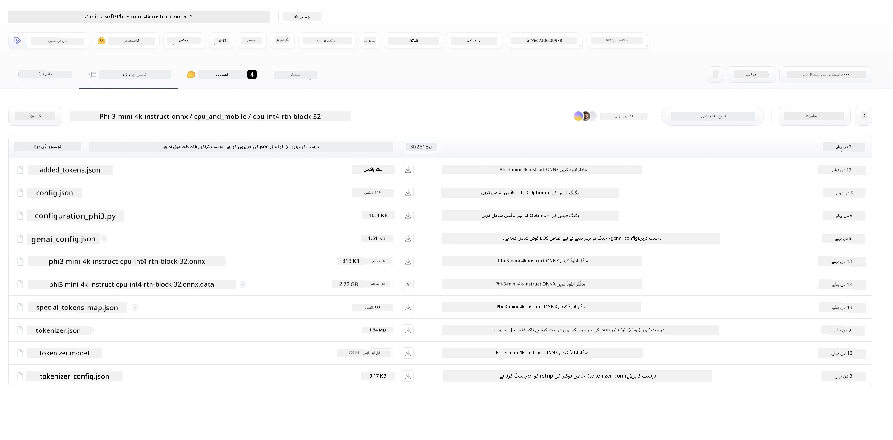
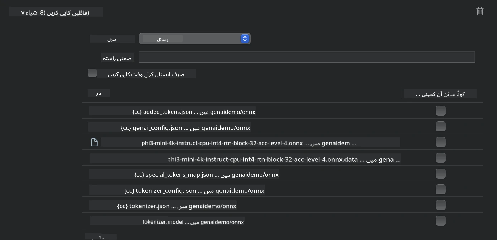
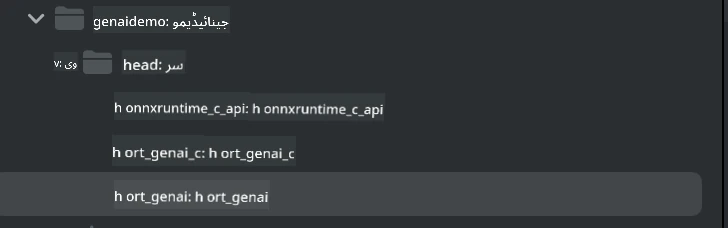
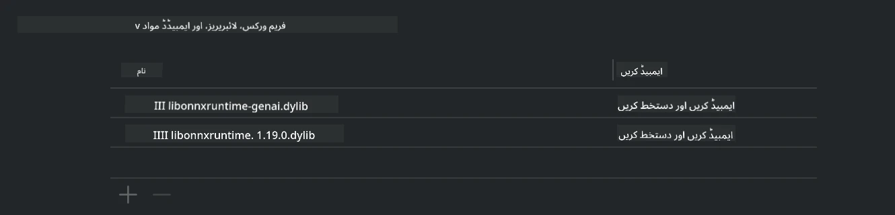
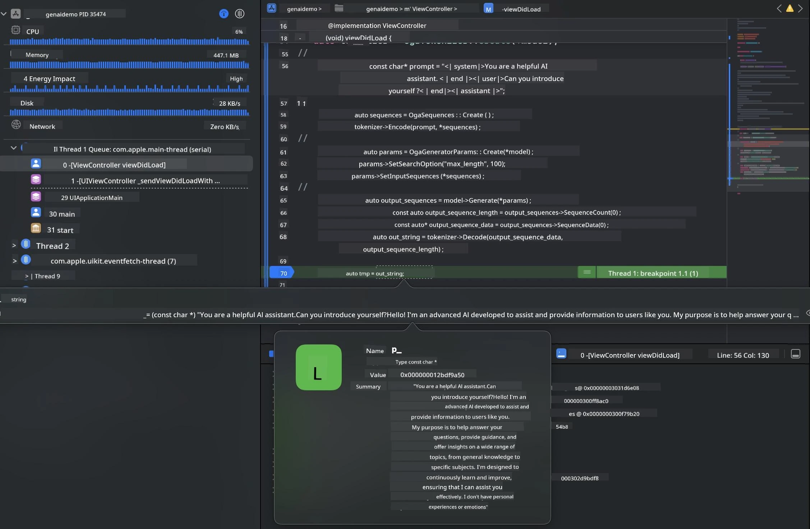

# **iOS میں Inference Phi-3**

Phi-3-mini مائیکروسافٹ کی نئی ماڈلز کی سیریز ہے جو ایج ڈیوائسز اور IoT ڈیوائسز پر Large Language Models (LLMs) کی تعیناتی ممکن بناتی ہے۔ Phi-3-mini iOS، Android، اور Edge Device تعیناتیوں کے لیے دستیاب ہے، جس سے generative AI کو BYOD ماحول میں تعینات کیا جا سکتا ہے۔ ذیل میں ایک مثال دی گئی ہے کہ iOS پر Phi-3-mini کو کیسے تعینات کیا جائے۔

## **1. تیاری**

- **a.** macOS 14+
- **b.** Xcode 15+
- **c.** iOS SDK 17.x (iPhone 14 A16 یا اس سے زیادہ)
- **d.** Python 3.10+ انسٹال کریں (Conda کی سفارش کی جاتی ہے)
- **e.** Python لائبریری انسٹال کریں: `python-flatbuffers`
- **f.** CMake انسٹال کریں

### Semantic Kernel اور Inference

Semantic Kernel ایک ایپلیکیشن فریم ورک ہے جو آپ کو Azure OpenAI Service، OpenAI ماڈلز، اور یہاں تک کہ لوکل ماڈلز کے ساتھ مطابقت رکھنے والی ایپلیکیشنز بنانے کی اجازت دیتا ہے۔ Semantic Kernel کے ذریعے لوکل سروسز تک رسائی آپ کے خود میزبانی کردہ Phi-3-mini ماڈل سرور کے ساتھ آسان انضمام ممکن بناتی ہے۔

### Ollama یا LlamaEdge کے ساتھ Quantized ماڈلز کو کال کرنا

بہت سے صارفین quantized ماڈلز کو لوکل چلانے کے لیے ترجیح دیتے ہیں۔ [Ollama](https://ollama.com) اور [LlamaEdge](https://llamaedge.com) صارفین کو مختلف quantized ماڈلز کو کال کرنے کی سہولت دیتے ہیں:

#### **Ollama**

آپ `ollama run phi3` کو براہ راست چلا سکتے ہیں یا اسے آف لائن ترتیب دے سکتے ہیں۔ اپنے `gguf` فائل کے راستے کے ساتھ ایک Modelfile بنائیں۔ Phi-3-mini quantized ماڈل چلانے کے لیے نمونہ کوڈ:

```gguf
FROM {Add your gguf file path}
TEMPLATE \"\"\"<|user|> .Prompt<|end|> <|assistant|>\"\"\"
PARAMETER stop <|end|>
PARAMETER num_ctx 4096
```

#### **LlamaEdge**

اگر آپ `gguf` کو بیک وقت کلاؤڈ اور ایج ڈیوائسز پر استعمال کرنا چاہتے ہیں، تو LlamaEdge ایک بہترین انتخاب ہے۔

## **2. iOS کے لیے ONNX Runtime کو کمپائل کرنا**

```bash

git clone https://github.com/microsoft/onnxruntime.git

cd onnxruntime

./build.sh --build_shared_lib --ios --skip_tests --parallel --build_dir ./build_ios --ios --apple_sysroot iphoneos --osx_arch arm64 --apple_deploy_target 17.5 --cmake_generator Xcode --config Release

cd ../

```

### **نوٹس**

- **a.** کمپائل کرنے سے پہلے، یقینی بنائیں کہ Xcode صحیح طریقے سے ترتیب دیا گیا ہے اور اسے ٹرمینل میں فعال ڈویلپر ڈائریکٹری کے طور پر سیٹ کریں:

    ```bash
    sudo xcode-select -switch /Applications/Xcode.app/Contents/Developer
    ```

- **b.** ONNX Runtime کو مختلف پلیٹ فارمز کے لیے کمپائل کرنا ضروری ہے۔ iOS کے لیے، آپ `arm64` یا `x86_64` کے لیے کمپائل کر سکتے ہیں۔

- **c.** کمپائل کرنے کے لیے تازہ ترین iOS SDK استعمال کرنے کی سفارش کی جاتی ہے۔ تاہم، اگر آپ کو پچھلے SDKs کے ساتھ مطابقت کی ضرورت ہو تو پرانا ورژن بھی استعمال کیا جا سکتا ہے۔

## **3. iOS کے لیے ONNX Runtime کے ساتھ Generative AI کو کمپائل کرنا**

> **Note:** چونکہ ONNX Runtime کے ساتھ Generative AI ابھی پریویو میں ہے، ممکنہ تبدیلیوں سے آگاہ رہیں۔

```bash

git clone https://github.com/microsoft/onnxruntime-genai
 
cd onnxruntime-genai
 
mkdir ort
 
cd ort
 
mkdir include
 
mkdir lib
 
cd ../
 
cp ../onnxruntime/include/onnxruntime/core/session/onnxruntime_c_api.h ort/include
 
cp ../onnxruntime/build_ios/Release/Release-iphoneos/libonnxruntime*.dylib* ort/lib
 
export OPENCV_SKIP_XCODEBUILD_FORCE_TRYCOMPILE_DEBUG=1
 
python3 build.py --parallel --build_dir ./build_ios --ios --ios_sysroot iphoneos --ios_arch arm64 --ios_deployment_target 17.5 --cmake_generator Xcode --cmake_extra_defines CMAKE_XCODE_ATTRIBUTE_CODE_SIGNING_ALLOWED=NO

```

## **4. Xcode میں ایک App ایپلیکیشن بنائیں**

میں نے App کی ترقی کے لیے Objective-C کو منتخب کیا، کیونکہ ONNX Runtime C++ API کے ساتھ Generative AI استعمال کرتے ہوئے، Objective-C بہتر مطابقت رکھتا ہے۔ ظاہر ہے، آپ Swift bridging کے ذریعے متعلقہ کالز بھی مکمل کر سکتے ہیں۔


## **5. ONNX quantized INT4 ماڈل کو App ایپلیکیشن پروجیکٹ میں کاپی کریں**

ہمیں ONNX فارمیٹ میں INT4 quantization ماڈل درآمد کرنا ہوگا، جسے پہلے ڈاؤن لوڈ کرنا ضروری ہے۔



ڈاؤن لوڈ کرنے کے بعد، اسے Xcode میں پروجیکٹ کے Resources ڈائریکٹری میں شامل کریں۔



## **6. ViewControllers میں C++ API شامل کرنا**

> **نوٹس:**

- **a.** متعلقہ C++ ہیڈر فائلز کو پروجیکٹ میں شامل کریں۔

  

- **b.** Xcode میں `onnxruntime-genai` ڈائنامک لائبریری کو شامل کریں۔

  

- **c.** ٹیسٹنگ کے لیے C Samples کوڈ استعمال کریں۔ آپ مزید فعالیت کے لیے ChatUI جیسی اضافی خصوصیات بھی شامل کر سکتے ہیں۔

- **d.** چونکہ آپ کو اپنے پروجیکٹ میں C++ استعمال کرنا ہے، `ViewController.m` کا نام تبدیل کر کے `ViewController.mm` کریں تاکہ Objective-C++ کی حمایت فعال ہو جائے۔

```objc

    NSString *llmPath = [[NSBundle mainBundle] resourcePath];
    char const *modelPath = llmPath.cString;

    auto model =  OgaModel::Create(modelPath);

    auto tokenizer = OgaTokenizer::Create(*model);

    const char* prompt = "<|system|>You are a helpful AI assistant.<|end|><|user|>Can you introduce yourself?<|end|><|assistant|>";

    auto sequences = OgaSequences::Create();
    tokenizer->Encode(prompt, *sequences);

    auto params = OgaGeneratorParams::Create(*model);
    params->SetSearchOption("max_length", 100);
    params->SetInputSequences(*sequences);

    auto output_sequences = model->Generate(*params);
    const auto output_sequence_length = output_sequences->SequenceCount(0);
    const auto* output_sequence_data = output_sequences->SequenceData(0);
    auto out_string = tokenizer->Decode(output_sequence_data, output_sequence_length);
    
    auto tmp = out_string;

```

## **7. ایپلیکیشن چلانا**

ایک بار سیٹ اپ مکمل ہونے کے بعد، آپ ایپلیکیشن چلا کر Phi-3-mini ماڈل inference کے نتائج دیکھ سکتے ہیں۔



مزید نمونہ کوڈ اور تفصیلی ہدایات کے لیے، [Phi-3 Mini Samples repository](https://github.com/Azure-Samples/Phi-3MiniSamples/tree/main/ios) ملاحظہ کریں۔

**دستخطی دستبرداری**:  
یہ دستاویز AI ترجمہ سروس [Co-op Translator](https://github.com/Azure/co-op-translator) کے ذریعے ترجمہ کی گئی ہے۔ اگرچہ ہم درستگی کے لیے کوشاں ہیں، براہ کرم آگاہ رہیں کہ خودکار ترجمے میں غلطیاں یا عدم درستیاں ہو سکتی ہیں۔ اصل دستاویز اپنی مادری زبان میں ہی معتبر ماخذ سمجھی جانی چاہیے۔ اہم معلومات کے لیے پیشہ ور انسانی ترجمہ کی سفارش کی جاتی ہے۔ اس ترجمے کے استعمال سے پیدا ہونے والی کسی بھی غلط فہمی یا غلط تشریح کی ذمہ داری ہم پر عائد نہیں ہوتی۔