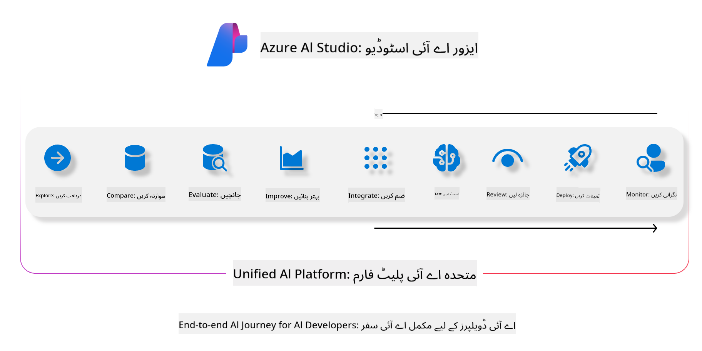
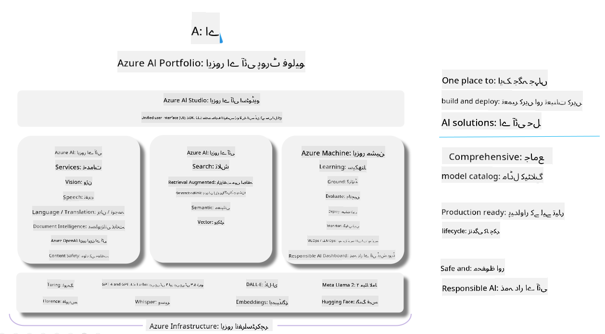

<!--
CO_OP_TRANSLATOR_METADATA:
{
  "original_hash": "7b4235159486df4000e16b7b46ddfec3",
  "translation_date": "2025-05-07T14:42:52+00:00",
  "source_file": "md/01.Introduction/05/AIFoundry.md",
  "language_code": "ur"
}
-->
# **Azure AI Foundry کا استعمال کرتے ہوئے جائزہ لینا**

[Azure AI Foundry](https://ai.azure.com?WT.mc_id=aiml-138114-kinfeylo) کا استعمال کرتے ہوئے اپنی generative AI ایپلیکیشن کا جائزہ کیسے لیں۔ چاہے آپ single-turn یا multi-turn گفتگو کا جائزہ لے رہے ہوں، Azure AI Foundry ماڈل کی کارکردگی اور حفاظت کا جائزہ لینے کے لیے اوزار فراہم کرتا ہے۔

## Azure AI Foundry کے ساتھ generative AI ایپس کا جائزہ کیسے لیں
مزید تفصیلی ہدایات کے لیے [Azure AI Foundry Documentation](https://learn.microsoft.com/azure/ai-studio/how-to/evaluate-generative-ai-app?WT.mc_id=aiml-138114-kinfeylo) دیکھیں۔

شروع کرنے کے لیے یہ مراحل ہیں:

## Azure AI Foundry میں Generative AI ماڈلز کا جائزہ لینا

**ضروریات**

- CSV یا JSON فارمیٹ میں ایک ٹیسٹ ڈیٹاسیٹ۔
- ایک تعینات کردہ generative AI ماڈل (جیسے Phi-3، GPT 3.5، GPT 4، یا Davinci ماڈلز)۔
- ایک runtime جس میں evaluation چلانے کے لیے compute instance موجود ہو۔

## بلٹ ان جائزہ میٹرکس

Azure AI Foundry آپ کو single-turn اور پیچیدہ، multi-turn گفتگو دونوں کا جائزہ لینے کی اجازت دیتا ہے۔  
Retrieval Augmented Generation (RAG) کے منظرناموں کے لیے، جہاں ماڈل مخصوص ڈیٹا پر مبنی ہوتا ہے، آپ بلٹ ان جائزہ میٹرکس کے ذریعے کارکردگی کا اندازہ لگا سکتے ہیں۔  
مزید برآں، آپ عام single-turn سوال جواب کے منظرناموں (non-RAG) کا بھی جائزہ لے سکتے ہیں۔

## جائزہ رن بنانا

Azure AI Foundry UI سے، Evaluate صفحہ یا Prompt Flow صفحہ پر جائیں۔  
جائزہ بنانے والے وزرڈ کی پیروی کریں تاکہ جائزہ رن سیٹ اپ کیا جا سکے۔ آپ اپنی evaluation کے لیے ایک اختیاری نام فراہم کر سکتے ہیں۔  
اپنی ایپلیکیشن کے مقاصد کے مطابق منظرنامہ منتخب کریں۔  
ماڈل کے نتائج کا جائزہ لینے کے لیے ایک یا زیادہ evaluation میٹرکس منتخب کریں۔

## حسب ضرورت جائزہ فلو (اختیاری)

زیادہ لچک کے لیے، آپ ایک custom evaluation flow قائم کر سکتے ہیں۔ اپنی مخصوص ضروریات کے مطابق evaluation کے عمل کو حسب ضرورت بنائیں۔

## نتائج دیکھنا

جائزہ چلانے کے بعد، Azure AI Foundry میں تفصیلی evaluation میٹرکس لاگ ان کریں، دیکھیں، اور تجزیہ کریں۔ اپنی ایپلیکیشن کی صلاحیتوں اور حدود کے بارے میں بصیرت حاصل کریں۔

**Note** Azure AI Foundry اس وقت public preview میں ہے، لہٰذا اسے تجربات اور ترقی کے مقاصد کے لیے استعمال کریں۔ production کے کاموں کے لیے دیگر آپشنز پر غور کریں۔ مزید تفصیلات اور مرحلہ وار ہدایات کے لیے سرکاری [AI Foundry documentation](https://learn.microsoft.com/azure/ai-studio/?WT.mc_id=aiml-138114-kinfeylo) دیکھیں۔

**ڈس کلیمر**:  
یہ دستاویز AI ترجمہ سروس [Co-op Translator](https://github.com/Azure/co-op-translator) کا استعمال کرتے ہوئے ترجمہ کی گئی ہے۔ اگرچہ ہم درستگی کی کوشش کرتے ہیں، براہ کرم اس بات سے آگاہ رہیں کہ خودکار ترجموں میں غلطیاں یا بے ضابطگیاں ہو سکتی ہیں۔ اصل دستاویز اپنی مادری زبان میں ہی مستند ماخذ سمجھی جانی چاہیے۔ اہم معلومات کے لیے پیشہ ور انسانی ترجمہ کی سفارش کی جاتی ہے۔ ہم اس ترجمے کے استعمال سے پیدا ہونے والی کسی بھی غلط فہمی یا غلط تشریح کے لیے ذمہ دار نہیں ہیں۔