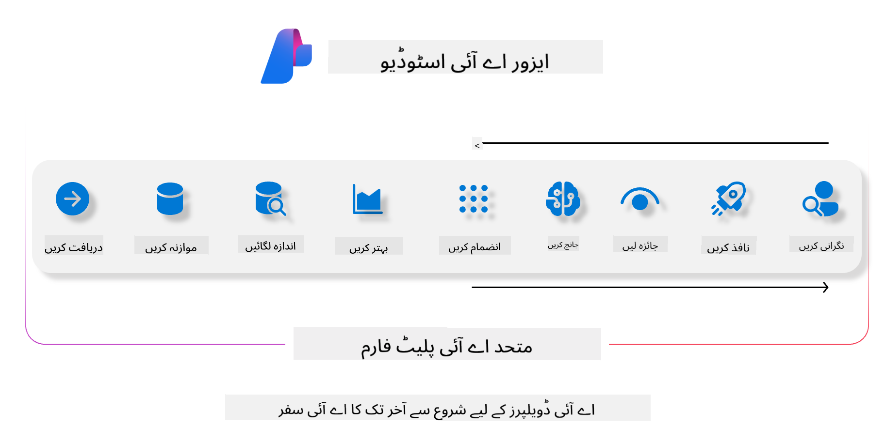
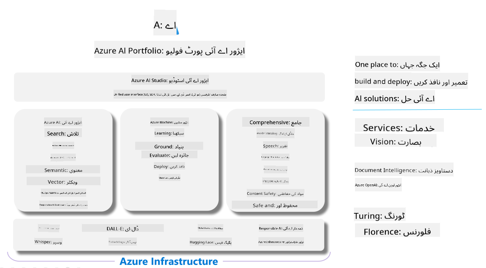

<!--
CO_OP_TRANSLATOR_METADATA:
{
  "original_hash": "5dfb4983a2e74e4b5e8317eb16fc2154",
  "translation_date": "2025-04-03T07:06:31+00:00",
  "source_file": "md\\01.Introduction\\05\\AIFoundry.md",
  "language_code": "ur"
}
-->
# **ایزور اے آئی فاؤنڈری کے ذریعے جانچ کرنا**

اپنے جنریٹو اے آئی ایپلیکیشن کو [Azure AI Foundry](https://ai.azure.com?WT.mc_id=aiml-138114-kinfeylo) کے ذریعے جانچنے کا طریقہ۔ چاہے آپ سنگل ٹرن یا ملٹی ٹرن گفتگو کا جائزہ لے رہے ہوں، ایزور اے آئی فاؤنڈری ماڈل کی کارکردگی اور حفاظت کا جائزہ لینے کے لیے ٹولز فراہم کرتا ہے۔

## ایزور اے آئی فاؤنڈری کے ساتھ جنریٹو اے آئی ایپس کا جائزہ لینے کا طریقہ
مزید تفصیلات کے لیے [Azure AI Foundry Documentation](https://learn.microsoft.com/azure/ai-studio/how-to/evaluate-generative-ai-app?WT.mc_id=aiml-138114-kinfeylo) دیکھیں۔

یہاں شروع کرنے کے اقدامات ہیں:

## ایزور اے آئی فاؤنڈری میں جنریٹو اے آئی ماڈلز کا جائزہ لینا

**ضروریات**

- ایک ٹیسٹ ڈیٹا سیٹ، CSV یا JSON فارمیٹ میں۔
- ایک ڈیپلائیڈ جنریٹو اے آئی ماڈل (جیسے Phi-3، GPT 3.5، GPT 4، یا Davinci ماڈلز)۔
- ایک رن ٹائم جس میں کمپیوٹ انسٹینس موجود ہو تاکہ جانچ چلائی جا سکے۔

## بلٹ ان جانچ کے میٹرکس

ایزور اے آئی فاؤنڈری آپ کو سنگل ٹرن اور پیچیدہ، ملٹی ٹرن گفتگو کا جائزہ لینے کی سہولت دیتا ہے۔  
ریٹریول اگمینٹڈ جنریشن (RAG) کے منظرنامے میں، جہاں ماڈل مخصوص ڈیٹا پر مبنی ہوتا ہے، آپ کارکردگی کا جائزہ بلٹ ان میٹرکس کے ذریعے لے سکتے ہیں۔  
اس کے علاوہ، آپ عام سنگل ٹرن سوال جواب کے منظرنامے (غیر RAG) کا جائزہ لے سکتے ہیں۔

## جانچ چلانے کا طریقہ

ایزور اے آئی فاؤنڈری کے UI سے، Evaluate یا Prompt Flow صفحے پر جائیں۔  
جانچ کی تخلیق کے وزرڈ کے ذریعے جانچ کا سیٹ اپ کریں۔ اپنی جانچ کے لیے ایک اختیاری نام فراہم کریں۔  
ایسا منظرنامہ منتخب کریں جو آپ کی ایپلیکیشن کے مقاصد سے مطابقت رکھتا ہو۔  
ماڈل کے آؤٹ پٹ کا جائزہ لینے کے لیے ایک یا زیادہ جانچ کے میٹرکس منتخب کریں۔

## کسٹم جانچ کا طریقہ (اختیاری)

زیادہ لچک کے لیے، آپ کسٹم جانچ کا طریقہ ترتیب دے سکتے ہیں۔ اپنے مخصوص ضروریات کے مطابق جانچ کے عمل کو حسب ضرورت بنائیں۔

## نتائج دیکھنا

جانچ چلانے کے بعد، ایزور اے آئی فاؤنڈری میں تفصیلی جانچ کے میٹرکس کو لاگ کریں، دیکھیں، اور تجزیہ کریں۔ اپنی ایپلیکیشن کی صلاحیتوں اور خامیوں کے بارے میں بصیرت حاصل کریں۔

**نوٹ** ایزور اے آئی فاؤنڈری فی الحال پبلک پریویو میں ہے، لہذا اسے تجربات اور ترقیاتی مقاصد کے لیے استعمال کریں۔ پروڈکشن ورک لوڈز کے لیے دیگر آپشنز پر غور کریں۔ مزید تفصیلات اور قدم بہ قدم ہدایات کے لیے آفیشل [AI Foundry documentation](https://learn.microsoft.com/azure/ai-studio/?WT.mc_id=aiml-138114-kinfeylo) کو دیکھیں۔

**ڈسکلیمر**:  
یہ دستاویز AI ترجمہ سروس [Co-op Translator](https://github.com/Azure/co-op-translator) کا استعمال کرتے ہوئے ترجمہ کی گئی ہے۔ ہم درستگی کے لیے کوشش کرتے ہیں، لیکن براہ کرم یہ بات ذہن میں رکھیں کہ خودکار ترجمے میں غلطیاں یا عدم درستگیاں ہو سکتی ہیں۔ اصل دستاویز، جو اپنی اصل زبان میں ہے، کو مستند ذریعہ سمجھا جانا چاہیے۔ اہم معلومات کے لیے، پیشہ ور انسانی ترجمہ کی سفارش کی جاتی ہے۔ اس ترجمے کے استعمال سے پیدا ہونے والی کسی بھی غلط فہمی یا غلط تشریح کے لیے ہم ذمہ دار نہیں ہیں۔