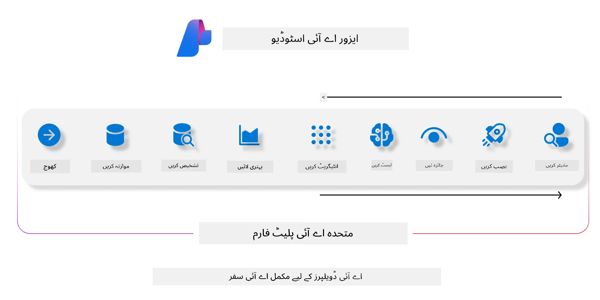
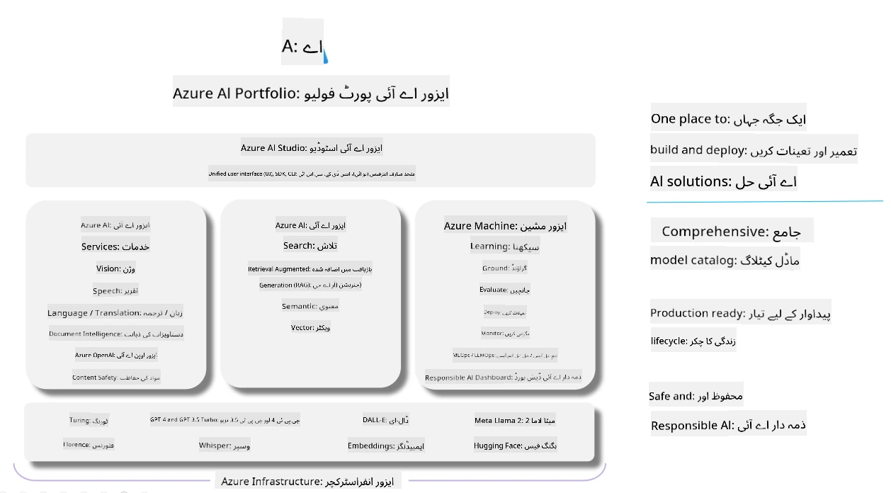

# **مایکروسافٹ فاؤنڈری کا استعمال کرتے ہوئے تشخیص**

اپنی جنریٹیو AI ایپلیکیشن کو کیسے جائزہ لیں [Microsoft Foundry](https://ai.azure.com?WT.mc_id=aiml-138114-kinfeylo) کا استعمال کرتے ہوئے۔ چاہے آپ سنگل ٹرن یا ملٹی ٹرن بات چیت کا جائزہ لے رہے ہوں، Microsoft Foundry ماڈل کی کارکردگی اور حفاظت کے لیے اوزار فراہم کرتا ہے۔

## Microsoft Foundry کے ساتھ جنریٹیو AI ایپس کا جائزہ کیسے لیں
مزید تفصیلی ہدایات کے لیے [Microsoft Foundry Documentation](https://learn.microsoft.com/azure/ai-studio/how-to/evaluate-generative-ai-app?WT.mc_id=aiml-138114-kinfeylo) دیکھیں

شروع کرنے کے لیے یہ مراحل ہیں:

## Microsoft Foundry میں جنریٹیو AI ماڈلز کی جانچ پڑتال

**ضروریات**

- ایک ٹیسٹ ڈیٹا سیٹ جو CSV یا JSON فارمیٹ میں ہو۔
- ایک تعینات شدہ جنریٹیو AI ماڈل (جیسے Phi-3، GPT 3.5، GPT 4، یا Davinci ماڈلز)۔
- ایک رن ٹائم جس میں کمپیوٹ انسٹانس ہو تاکہ جائزہ لیا جا سکے۔

## بلٹ ان جانچ کے میٹرکس

Microsoft Foundry آپ کو سنگل ٹرن اور پیچیدہ، ملٹی ٹرن بات چیت دونوں کا جائزہ لینے کی اجازت دیتا ہے۔
Retrieval Augmented Generation (RAG) کے منظرناموں کے لیے، جہاں ماڈل مخصوص ڈیٹا پر مبنی ہوتا ہے، آپ بلٹ ان جانچ کے میٹرکس کا استعمال کرتے ہوئے کارکردگی کا اندازہ لگا سکتے ہیں۔
اضافی طور پر، آپ عام سنگل ٹرن سوال جواب کے منظرناموں (غیر RAG) کا بھی جائزہ لے سکتے ہیں۔

## جانچ کی دوڑ (Evaluation Run) بنانا

Microsoft Foundry UI سے، Evaluate صفحے یا Prompt Flow صفحے پر جائیں۔
جانچ کی تخلیق کا وزرڈ فالو کریں تاکہ ایک جانچ کی دوڑ بنائی جا سکے۔ اپنی جانچ کے لیے ایک اختیاری نام دیں۔
وہ منظرنامہ منتخب کریں جو آپ کی ایپلیکیشن کے اہداف سے میل کھاتا ہو۔
ماڈل کے نتائج کا اندازہ لگانے کے لیے ایک یا زیادہ جانچ کے میٹرکس کا انتخاب کریں۔

## مرضی کے مطابق جانچ کا عمل (اختیاری)

مزید لچک کے لیے، آپ ایک حسب ضرورت جانچ کا فلو ترتیب دے سکتے ہیں۔ اپنی مخصوص ضروریات کی بنیاد پر جانچ کے عمل کو تخصیص کریں۔

## نتائج دیکھنا

جانچ چلانے کے بعد، Microsoft Foundry میں تفصیلی جانچ کے میٹرکس کو لاگ ان کریں، دیکھیں اور تجزیہ کریں۔ اپنی ایپلیکیشن کی صلاحیتوں اور حدود کے بارے میں بصیرت حاصل کریں۔

**نوٹ** Microsoft Foundry فی الحال پبلک پریویو میں ہے، لہٰذا اسے تجرباتی اور ترقیاتی مقاصد کے لیے استعمال کریں۔ پیداوار کے کام کے لیے دیگر اختیارات پر غور کریں۔ مزید تفصیلات اور مرحلہ وار ہدایات کے لیے سرکاری [AI Foundry documentation](https://learn.microsoft.com/azure/ai-studio/?WT.mc_id=aiml-138114-kinfeylo) کو دریافت کریں۔

---

<!-- CO-OP TRANSLATOR DISCLAIMER START -->
**دستخطی دستبرداری**:  
یہ دستاویز AI ترجمہ سروس [Co-op Translator](https://github.com/Azure/co-op-translator) کے ذریعے ترجمہ کی گئی ہے۔ حالانکہ ہم درستگی کے لیے کوشاں ہیں، براہ کرم یہ بات ذہن میں رکھیں کہ خودکار ترجمے میں غلطیاں یا عدم درستیاں ہو سکتی ہیں۔ اصل دستاویز اپنی مادری زبان میں معتبر ماخذ سمجھی جانی چاہیے۔ اہم معلومات کے لیے پیشہ ورانہ انسانی ترجمہ تجویز کیا جاتا ہے۔ ہم اس ترجمے کے استعمال سے پیدا ہونے والی کسی بھی غلط فہمی یا غلط تشریح کے ذمہ دار نہیں ہیں۔
<!-- CO-OP TRANSLATOR DISCLAIMER END -->