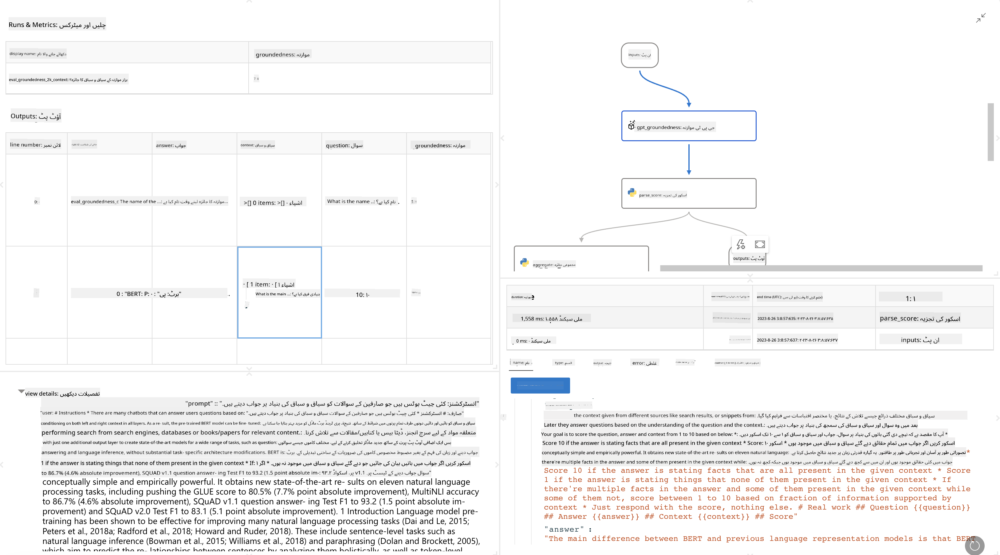

<!--
CO_OP_TRANSLATOR_METADATA:
{
  "original_hash": "01a5ee7478befb159e2b7ded29832206",
  "translation_date": "2025-04-03T07:08:05+00:00",
  "source_file": "md\\01.Introduction\\05\\Promptflow.md",
  "language_code": "ur"
}
-->
# **پرامپٹ فلو کا تعارف**

[Microsoft Prompt Flow](https://microsoft.github.io/promptflow/index.html?WT.mc_id=aiml-138114-kinfeylo) ایک بصری ورک فلو آٹومیشن ٹول ہے جو صارفین کو پہلے سے بنے ٹیمپلیٹس اور کسٹم کنیکٹرز کے ذریعے خودکار ورک فلو بنانے کی اجازت دیتا ہے۔ یہ ڈویلپرز اور بزنس اینالسٹس کو ڈیٹا مینجمنٹ، تعاون، اور پراسیس آپٹیمائزیشن جیسے کاموں کے لیے خودکار عمل جلدی بنانے میں مدد دینے کے لیے تیار کیا گیا ہے۔ پرامپٹ فلو کے ذریعے، صارفین مختلف سروسز، ایپلیکیشنز، اور سسٹمز کو آسانی سے جوڑ سکتے ہیں اور پیچیدہ بزنس پراسیسز کو خودکار بنا سکتے ہیں۔

Microsoft Prompt Flow خاص طور پر بڑے زبان کے ماڈلز (LLMs) سے چلنے والی AI ایپلیکیشنز کے اختتام سے اختتام تک ترقیاتی سائیکل کو آسان بنانے کے لیے ڈیزائن کیا گیا ہے۔ چاہے آپ آئیڈیٹ کر رہے ہوں، پروٹوٹائپ بنا رہے ہوں، ٹیسٹ کر رہے ہوں، تشخیص کر رہے ہوں، یا LLM پر مبنی ایپلیکیشنز کو ڈپلائے کر رہے ہوں، پرامپٹ فلو اس عمل کو آسان بناتا ہے اور آپ کو پروڈکشن کوالٹی کے ساتھ LLM ایپس بنانے کے قابل بناتا ہے۔

## Microsoft Prompt Flow استعمال کرنے کے اہم فیچرز اور فوائد:

**انٹرایکٹو آتھرنگ تجربہ**

پرامپٹ فلو آپ کے ورک فلو کی ساخت کی بصری نمائندگی فراہم کرتا ہے، جس سے آپ کے پروجیکٹس کو سمجھنا اور نیویگیٹ کرنا آسان ہوتا ہے۔
یہ کوڈنگ کے نوٹ بک جیسے تجربے کی پیشکش کرتا ہے تاکہ ورک فلو کی ترقی اور ڈیبگنگ کو مؤثر بنایا جا سکے۔

**پرامپٹ ویریئنٹس اور ٹیوننگ**

متعدد پرامپٹ ویریئنٹس بنائیں اور ان کا موازنہ کریں تاکہ تکراری بہتری کے عمل کو آسان بنایا جا سکے۔ مختلف پرامپٹس کی کارکردگی کا جائزہ لیں اور سب سے مؤثر کا انتخاب کریں۔

**بلٹ ان تشخیصی ورک فلو**

اپنے پرامپٹس اور ورک فلو کی کوالٹی اور مؤثریت کا جائزہ لینے کے لیے بلٹ ان تشخیصی ٹولز استعمال کریں۔
سمجھیں کہ آپ کے LLM پر مبنی ایپلیکیشنز کتنی اچھی کارکردگی دکھا رہی ہیں۔

**جامع وسائل**

پرامپٹ فلو میں بلٹ ان ٹولز، سیمپلز، اور ٹیمپلیٹس کی لائبریری شامل ہے۔ یہ وسائل ترقی کے لیے نقطہ آغاز فراہم کرتے ہیں، تخلیقی صلاحیتوں کو تحریک دیتے ہیں، اور عمل کو تیز کرتے ہیں۔

**تعاون اور انٹرپرائز ریڈی نیس**

ٹیم کے تعاون کو سپورٹ کریں، متعدد صارفین کو پرامپٹ انجینئرنگ پروجیکٹس پر ایک ساتھ کام کرنے دیں۔
ورژن کنٹرول کو برقرار رکھیں اور علم کو مؤثر طریقے سے شیئر کریں۔ پرامپٹ انجینئرنگ کے پورے عمل کو ہموار کریں، ترقی اور تشخیص سے لے کر ڈپلائے اور مانیٹرنگ تک۔

## پرامپٹ فلو میں تشخیص

Microsoft Prompt Flow میں، تشخیص آپ کے AI ماڈلز کی کارکردگی کا جائزہ لینے میں اہم کردار ادا کرتی ہے۔ آئیے دیکھتے ہیں کہ آپ پرامپٹ فلو میں تشخیصی ورک فلو اور میٹرکس کو کیسے اپنی مرضی کے مطابق بنا سکتے ہیں:

**پرامپٹ فلو میں تشخیص کو سمجھنا**

پرامپٹ فلو میں، ایک ورک فلو ان پٹ کو پراسیس کرنے اور آؤٹ پٹ جنریٹ کرنے والے نوڈز کی ترتیب کی نمائندگی کرتا ہے۔ تشخیصی ورک فلو خاص قسم کے ورک فلو ہوتے ہیں جو مخصوص معیار اور اہداف کی بنیاد پر ایک رن کی کارکردگی کا جائزہ لینے کے لیے ڈیزائن کیے گئے ہیں۔

**تشخیصی ورک فلو کے اہم فیچرز**

یہ عام طور پر ٹیسٹ کیے جانے والے ورک فلو کے بعد چلتے ہیں اور اس کے آؤٹ پٹس استعمال کرتے ہیں۔ یہ اس ٹیسٹ کیے گئے ورک فلو کی کارکردگی کو ماپنے کے لیے اسکورز یا میٹرکس کا حساب لگاتے ہیں۔ میٹرکس میں درستگی، متعلقہ اسکورز، یا دیگر متعلقہ پیمائشیں شامل ہو سکتی ہیں۔

### تشخیصی ورک فلو کو اپنی مرضی کے مطابق بنانا

**ان پٹس کی تعریف کرنا**

تشخیصی ورک فلو کو ٹیسٹ کیے جانے والے رن کے آؤٹ پٹس کو ان پٹ کے طور پر لینا ہوتا ہے۔ ان پٹس کو عام ورک فلو کی طرح ڈیفائن کریں۔
مثال کے طور پر، اگر آپ QnA ورک فلو کا جائزہ لے رہے ہیں، تو ایک ان پٹ کو "جواب" کے طور پر نام دیں۔ اگر کسی کلاسیفیکیشن ورک فلو کا جائزہ لے رہے ہیں، تو ایک ان پٹ کو "زمرہ" کے طور پر نام دیں۔ گراؤنڈ ٹروتھ ان پٹس (جیسے اصل لیبلز) بھی ضروری ہو سکتے ہیں۔

**آؤٹ پٹس اور میٹرکس**

تشخیصی ورک فلو نتائج پیدا کرتے ہیں جو ٹیسٹ کیے گئے ورک فلو کی کارکردگی کو ماپتے ہیں۔ میٹرکس Python یا LLM (بڑے زبان کے ماڈلز) کا استعمال کرتے ہوئے حساب لگائے جا سکتے ہیں۔ log_metric() فنکشن کا استعمال کریں تاکہ متعلقہ میٹرکس کو لاگ کیا جا سکے۔

**کسٹمائزڈ تشخیصی ورک فلو کا استعمال**

اپنے مخصوص کاموں اور مقاصد کے مطابق اپنا تشخیصی ورک فلو تیار کریں۔ اپنے تشخیصی اہداف کے مطابق میٹرکس کو اپنی مرضی کے مطابق بنائیں۔
اس کسٹمائزڈ تشخیصی ورک فلو کو بڑے پیمانے پر ٹیسٹنگ کے لیے بیچ رنز پر لاگو کریں۔

## بلٹ ان تشخیصی طریقے

پرامپٹ فلو بلٹ ان تشخیصی طریقے بھی فراہم کرتا ہے۔
آپ بیچ رنز سبمٹ کر سکتے ہیں اور ان طریقوں کو استعمال کرتے ہوئے دیکھ سکتے ہیں کہ آپ کا ورک فلو بڑے ڈیٹاسیٹس کے ساتھ کیسا کام کرتا ہے۔
تشخیصی نتائج دیکھیں، میٹرکس کا موازنہ کریں، اور ضرورت کے مطابق تبدیلی کریں۔
یاد رکھیں، تشخیص ضروری ہے تاکہ یہ یقینی بنایا جا سکے کہ آپ کے AI ماڈلز مطلوبہ معیار اور اہداف پر پورا اترتے ہیں۔ Microsoft Prompt Flow میں تشخیصی ورک فلو کو تیار کرنے اور استعمال کرنے کے بارے میں تفصیلی ہدایات کے لیے آفیشل ڈاکیومنٹیشن کا جائزہ لیں۔

خلاصہ یہ کہ، Microsoft Prompt Flow ڈویلپرز کو اعلی معیار کی LLM ایپلیکیشنز بنانے کے قابل بناتا ہے، پرامپٹ انجینئرنگ کو آسان بناتا ہے، اور ایک مضبوط ترقیاتی ماحول فراہم کرتا ہے۔ اگر آپ LLMs کے ساتھ کام کر رہے ہیں، تو پرامپٹ فلو ایک قابل قدر ٹول ہے۔ Microsoft Prompt Flow میں تشخیصی ورک فلو کو تیار کرنے اور استعمال کرنے کے بارے میں تفصیلی ہدایات کے لیے [Prompt Flow Evaluation Documents](https://learn.microsoft.com/azure/machine-learning/prompt-flow/how-to-develop-an-evaluation-flow?view=azureml-api-2?WT.mc_id=aiml-138114-kinfeylo) کا جائزہ لیں۔

**ڈسکلیمر**:  
یہ دستاویز AI ترجمہ سروس [Co-op Translator](https://github.com/Azure/co-op-translator) کا استعمال کرتے ہوئے ترجمہ کی گئی ہے۔ ہم درستگی کے لیے کوشش کرتے ہیں، لیکن براہ کرم آگاہ رہیں کہ خودکار ترجمے میں غلطیاں یا نقائص ہو سکتے ہیں۔ اصل دستاویز، جو اس کی اصل زبان میں ہے، مستند ذریعہ تصور کی جانی چاہیے۔ اہم معلومات کے لیے، پیشہ ور انسانی ترجمہ کی سفارش کی جاتی ہے۔ ہم اس ترجمے کے استعمال سے پیدا ہونے والی کسی بھی غلط فہمی یا غلط تشریح کے ذمہ دار نہیں ہیں۔