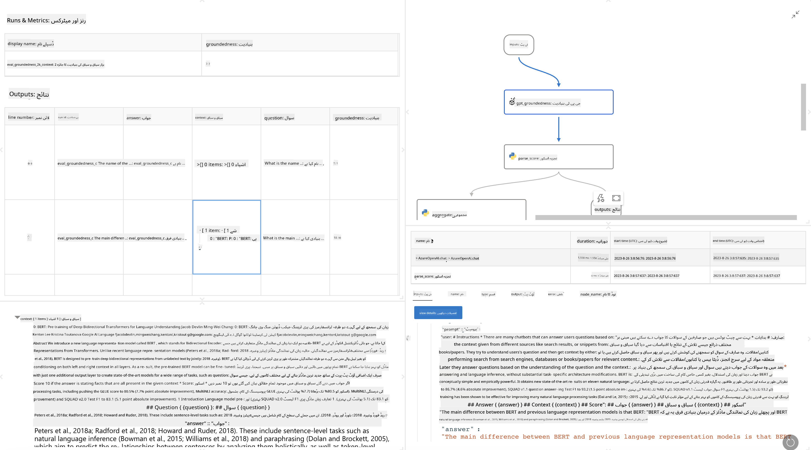

<!--
CO_OP_TRANSLATOR_METADATA:
{
  "original_hash": "3cbe7629d254f1043193b7fe22524d55",
  "translation_date": "2025-05-07T14:45:58+00:00",
  "source_file": "md/01.Introduction/05/Promptflow.md",
  "language_code": "ur"
}
-->
# **Promptflow کا تعارف**

[Microsoft Prompt Flow](https://microsoft.github.io/promptflow/index.html?WT.mc_id=aiml-138114-kinfeylo) ایک بصری ورک فلو آٹومیشن ٹول ہے جو صارفین کو پہلے سے بنائے گئے ٹیمپلیٹس اور کسٹم کنیکٹرز کے ذریعے خودکار ورک فلو بنانے کی سہولت دیتا ہے۔ یہ ڈویلپرز اور بزنس اینالسٹس کو ڈیٹا مینجمنٹ، تعاون، اور عمل کی بہتری جیسے کاموں کے لیے تیز رفتار خودکار عمل بنانے کے لیے ڈیزائن کیا گیا ہے۔ Prompt Flow کے ذریعے صارفین مختلف سروسز، ایپلیکیشنز، اور سسٹمز کو آسانی سے جوڑ سکتے ہیں اور پیچیدہ کاروباری عمل کو خودکار بنا سکتے ہیں۔

Microsoft Prompt Flow کو بڑے زبان کے ماڈلز (LLMs) سے چلنے والی AI ایپلیکیشنز کی مکمل ترقیاتی سائیکل کو آسان بنانے کے لیے تیار کیا گیا ہے۔ چاہے آپ آئیڈیا بنا رہے ہوں، پروٹوٹائپ تیار کر رہے ہوں، ٹیسٹ کر رہے ہوں، جانچ کر رہے ہوں یا LLM پر مبنی ایپلیکیشنز کو تعینات کر رہے ہوں، Prompt Flow عمل کو آسان بناتا ہے اور آپ کو پروڈکشن معیار کے LLM ایپس بنانے کی اجازت دیتا ہے۔

## Microsoft Prompt Flow کے استعمال کی اہم خصوصیات اور فوائد:

**انٹرایکٹو آتھرنگ تجربہ**

Prompt Flow آپ کے فلو کی ساخت کی بصری نمائندگی فراہم کرتا ہے، جس سے آپ کے پروجیکٹس کو سمجھنا اور نیویگیٹ کرنا آسان ہوتا ہے۔  
یہ موثر فلو کی ترقی اور ڈیبگنگ کے لیے نوٹ بک نما کوڈنگ تجربہ فراہم کرتا ہے۔

**پرومپٹ کی اقسام اور ٹیوننگ**

کئی پرومپٹ کی اقسام بنائیں اور موازنہ کریں تاکہ بار بار بہتری کے عمل کو آسان بنایا جا سکے۔ مختلف پرومپٹس کی کارکردگی کا جائزہ لیں اور سب سے مؤثر کا انتخاب کریں۔

**بلٹ ان ایویلیوایشن فلو**

اپنے پرومپٹس اور فلو کی کوالٹی اور مؤثریت کو بلٹ ان ایویلیوایشن ٹولز کے ذریعے جانچیں۔  
سمجھیں کہ آپ کی LLM پر مبنی ایپلیکیشنز کتنی اچھی کارکردگی دکھا رہی ہیں۔

**جامع وسائل**

Prompt Flow میں بلٹ ان ٹولز، نمونے، اور ٹیمپلیٹس کی لائبریری شامل ہے۔ یہ وسائل ترقی کے لیے نقطہ آغاز فراہم کرتے ہیں، تخلیقی صلاحیت کو بڑھاتے ہیں، اور عمل کو تیز کرتے ہیں۔

**تعاون اور انٹرپرائز کی تیاری**

ٹیم کے تعاون کی حمایت کریں تاکہ متعدد صارفین پرومپٹ انجینئرنگ پروجیکٹس پر ایک ساتھ کام کر سکیں۔  
ورژن کنٹرول کو برقرار رکھیں اور علم کو مؤثر طریقے سے شیئر کریں۔ پورے پرومپٹ انجینئرنگ عمل کو ترقی، جانچ، تعیناتی اور نگرانی تک آسان بنائیں۔

## Prompt Flow میں ایویلیوایشن

Microsoft Prompt Flow میں، ایویلیوایشن آپ کے AI ماڈلز کی کارکردگی کو جانچنے میں اہم کردار ادا کرتی ہے۔ آئیے دیکھتے ہیں کہ آپ Prompt Flow میں ایویلیوایشن فلو اور میٹرکس کو کیسے حسب ضرورت بنا سکتے ہیں:

**Prompt Flow میں ایویلیوایشن کو سمجھنا**

Prompt Flow میں، ایک فلو نوڈز کی ایک ترتیب ہوتی ہے جو ان پٹ کو پروسیس کرتی ہے اور آؤٹ پٹ تیار کرتی ہے۔ ایویلیوایشن فلو خاص قسم کے فلو ہوتے ہیں جو مخصوص معیار اور مقاصد کی بنیاد پر رن کی کارکردگی کا جائزہ لینے کے لیے بنائے جاتے ہیں۔

**ایویلیوایشن فلو کی اہم خصوصیات**

یہ عام طور پر ٹیسٹ کیے جانے والے فلو کے بعد چلتے ہیں، اس کے آؤٹ پٹس کا استعمال کرتے ہوئے۔ یہ ٹیسٹ کیے گئے فلو کی کارکردگی ناپنے کے لیے سکورز یا میٹرکس کا حساب لگاتے ہیں۔ میٹرکس میں درستگی، مطابقت کے اسکورز، یا کوئی اور متعلقہ پیمائش شامل ہو سکتی ہے۔

### ایویلیوایشن فلو کو حسب ضرورت بنانا

**ان پٹس کی تعریف**

ایویلیوایشن فلو کو ٹیسٹ کیے جانے والے رن کے آؤٹ پٹس لینے کی ضرورت ہوتی ہے۔ ان پٹس کو معیاری فلو کی طرح ڈیفائن کریں۔  
مثال کے طور پر، اگر آپ QnA فلو کی جانچ کر رہے ہیں تو ایک ان پٹ کو "answer" نام دیں۔ اگر کلاسفیکیشن فلو کی جانچ کر رہے ہیں تو ان پٹ کو "category" کہیں۔ گراؤنڈ ٹروتھ ان پٹس (مثلاً اصل لیبلز) بھی درکار ہو سکتے ہیں۔

**آؤٹ پٹس اور میٹرکس**

ایویلیوایشن فلو ایسے نتائج پیدا کرتے ہیں جو ٹیسٹ کیے گئے فلو کی کارکردگی کو ناپتے ہیں۔ میٹرکس کو Python یا LLM (بڑے زبان کے ماڈلز) کے ذریعے حساب کیا جا سکتا ہے۔ متعلقہ میٹرکس کو لاگ کرنے کے لیے log_metric() فنکشن استعمال کریں۔

**حسب ضرورت ایویلیوایشن فلو کا استعمال**

اپنے مخصوص کاموں اور مقاصد کے مطابق اپنا ایویلیوایشن فلو تیار کریں۔ اپنے ایویلیوایشن کے اہداف کی بنیاد پر میٹرکس کو حسب ضرورت بنائیں۔  
بڑے پیمانے پر جانچ کے لیے اس حسب ضرورت ایویلیوایشن فلو کو بیچ رنز پر لاگو کریں۔

## بلٹ ان ایویلیوایشن طریقے

Prompt Flow بلٹ ان ایویلیوایشن طریقے بھی فراہم کرتا ہے۔  
آپ بیچ رنز جمع کروا سکتے ہیں اور بڑے ڈیٹا سیٹس کے ساتھ اپنے فلو کی کارکردگی جانچنے کے لیے ان طریقوں کا استعمال کر سکتے ہیں۔  
ایویلیوایشن کے نتائج دیکھیں، میٹرکس کا موازنہ کریں، اور ضرورت کے مطابق عمل کو دہرائیں۔  
یاد رکھیں، ایویلیوایشن اس بات کو یقینی بنانے کے لیے ضروری ہے کہ آپ کے AI ماڈلز مطلوبہ معیار اور اہداف پر پورا اتر رہے ہیں۔ Microsoft Prompt Flow میں ایویلیوایشن فلو بنانے اور استعمال کرنے کے لیے تفصیلی ہدایات کے لیے سرکاری دستاویزات کا مطالعہ کریں۔

خلاصہ یہ کہ، Microsoft Prompt Flow ڈویلپرز کو اعلیٰ معیار کی LLM ایپلیکیشنز بنانے کے قابل بناتا ہے، پرومپٹ انجینئرنگ کو آسان بناتے ہوئے اور ایک مضبوط ترقیاتی ماحول فراہم کرتا ہے۔ اگر آپ LLMs کے ساتھ کام کر رہے ہیں تو Prompt Flow ایک قیمتی ٹول ہے جسے آپ کو آزمانا چاہیے۔ Microsoft Prompt Flow میں ایویلیوایشن فلو بنانے اور استعمال کرنے کے بارے میں تفصیلی ہدایات کے لیے [Prompt Flow Evaluation Documents](https://learn.microsoft.com/azure/machine-learning/prompt-flow/how-to-develop-an-evaluation-flow?view=azureml-api-2?WT.mc_id=aiml-138114-kinfeylo) کا جائزہ لیں۔

**ڈس کلیمر**:  
یہ دستاویز AI ترجمہ سروس [Co-op Translator](https://github.com/Azure/co-op-translator) کے ذریعے ترجمہ کی گئی ہے۔ اگرچہ ہم درستگی کی کوشش کرتے ہیں، براہ کرم آگاہ رہیں کہ خودکار ترجموں میں غلطیاں یا عدم درستیاں ہو سکتی ہیں۔ اصل دستاویز اپنی مادری زبان میں معتبر ماخذ سمجھی جانی چاہیے۔ اہم معلومات کے لیے پیشہ ورانہ انسانی ترجمہ کی سفارش کی جاتی ہے۔ ہم اس ترجمے کے استعمال سے پیدا ہونے والی کسی بھی غلط فہمی یا غلط تعبیر کے ذمہ دار نہیں ہیں۔