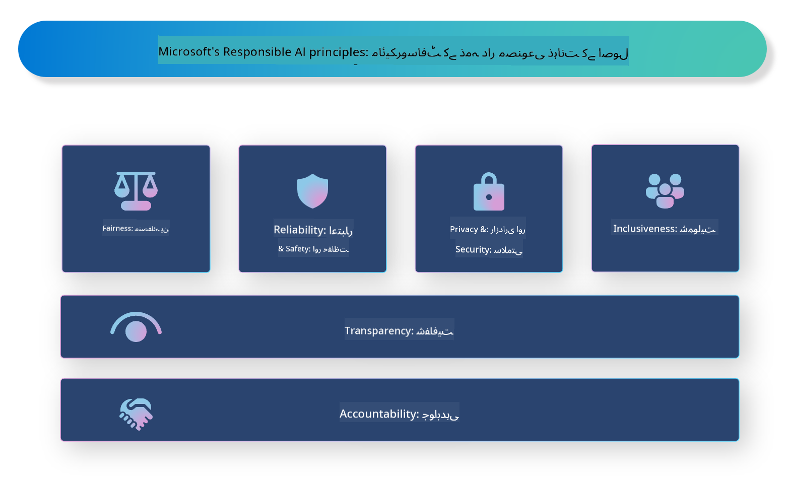

<!--
CO_OP_TRANSLATOR_METADATA:
{
  "original_hash": "805b96b20152936d8f4c587d90d6e06e",
  "translation_date": "2025-05-07T14:44:22+00:00",
  "source_file": "md/01.Introduction/05/ResponsibleAI.md",
  "language_code": "ur"
}
-->
# **ذمہ دار AI کا تعارف**

[Microsoft Responsible AI](https://www.microsoft.com/ai/responsible-ai?WT.mc_id=aiml-138114-kinfeylo) ایک ایسا اقدام ہے جس کا مقصد ڈویلپرز اور تنظیموں کی مدد کرنا ہے تاکہ وہ شفاف، قابل اعتماد، اور جوابدہ AI سسٹمز تیار کر سکیں۔ یہ اقدام ذمہ دار AI حل تیار کرنے کے لیے رہنمائی اور وسائل فراہم کرتا ہے جو اخلاقی اصولوں جیسے پرائیویسی، انصاف، اور شفافیت کے مطابق ہوں۔ ہم ذمہ دار AI سسٹمز بنانے کے دوران پیش آنے والے چیلنجز اور بہترین طریقے بھی دریافت کریں گے۔

## Microsoft Responsible AI کا جائزہ

**اخلاقی اصول**

Microsoft Responsible AI ایک سیٹ اخلاقی اصولوں پر مبنی ہے، جیسے پرائیویسی، انصاف، شفافیت، جوابدہی، اور حفاظت۔ یہ اصول اس بات کو یقینی بنانے کے لیے بنائے گئے ہیں کہ AI سسٹمز اخلاقی اور ذمہ دار طریقے سے تیار کیے جائیں۔

**شفاف AI**

Microsoft Responsible AI AI سسٹمز میں شفافیت کی اہمیت پر زور دیتا ہے۔ اس میں یہ شامل ہے کہ AI ماڈلز کے کام کرنے کے طریقے کی واضح وضاحت فراہم کی جائے، اور یہ کہ ڈیٹا کے ذرائع اور الگورتھمز عوام کے لیے دستیاب ہوں۔

**جوابدہ AI**

[Microsoft Responsible AI](https://www.microsoft.com/ai/responsible-ai?WT.mc_id=aiml-138114-kinfeylo) جوابدہ AI سسٹمز کی ترقی کو فروغ دیتا ہے جو یہ سمجھنے میں مدد دیتے ہیں کہ AI ماڈلز کیسے فیصلے کرتے ہیں۔ اس سے صارفین کو AI سسٹمز کے نتائج پر اعتماد حاصل ہوتا ہے۔

**شمولیت**

AI سسٹمز کو اس طرح ڈیزائن کیا جانا چاہیے کہ وہ سب کے فائدے کے لیے ہوں۔ Microsoft کا مقصد ایک ایسا شمولیتی AI تیار کرنا ہے جو مختلف نقطہ نظر کو مدنظر رکھے اور تعصب یا امتیاز سے بچے۔

**قابلِ اعتماد اور محفوظ**

AI سسٹمز کا قابلِ اعتماد اور محفوظ ہونا بہت ضروری ہے۔ Microsoft مضبوط ماڈلز بنانے پر توجہ دیتا ہے جو مستقل کارکردگی دکھائیں اور نقصان دہ نتائج سے بچیں۔

**AI میں انصاف**

Microsoft Responsible AI اس بات کو تسلیم کرتا ہے کہ اگر AI سسٹمز تعصبی ڈیٹا یا الگورتھمز پر تربیت پاتے ہیں تو وہ تعصبات کو بڑھا سکتے ہیں۔ یہ اقدام ایسے منصفانہ AI سسٹمز تیار کرنے کے لیے رہنمائی فراہم کرتا ہے جو نسل، جنس، یا عمر جیسے عوامل کی بنیاد پر امتیاز نہ کریں۔

**پرائیویسی اور سیکیورٹی**

Microsoft Responsible AI AI سسٹمز میں صارف کی پرائیویسی اور ڈیٹا کی حفاظت کی اہمیت پر زور دیتا ہے۔ اس میں مضبوط ڈیٹا انکرپشن اور رسائی کنٹرولز کا نفاذ شامل ہے، نیز AI سسٹمز کی کمزوریوں کے لیے باقاعدہ آڈٹ کرنا بھی ضروری ہے۔

**جوابدہی اور ذمہ داری**

Microsoft Responsible AI AI کی ترقی اور تعیناتی میں جوابدہی اور ذمہ داری کو فروغ دیتا ہے۔ اس کا مطلب ہے کہ ڈویلپرز اور تنظیمیں AI سسٹمز سے منسلک ممکنہ خطرات سے آگاہ ہوں اور ان خطرات کو کم کرنے کے اقدامات کریں۔

## ذمہ دار AI سسٹمز بنانے کے بہترین طریقے

**متنوع ڈیٹا سیٹس کے ساتھ AI ماڈلز تیار کریں**

AI سسٹمز میں تعصب سے بچنے کے لیے ضروری ہے کہ مختلف نقطہ نظر اور تجربات کی نمائندگی کرنے والے متنوع ڈیٹا سیٹس استعمال کیے جائیں۔

**وضاحتی AI تکنیک استعمال کریں**

وضاحتی AI تکنیک صارفین کو یہ سمجھنے میں مدد دیتی ہیں کہ AI ماڈلز کیسے فیصلے کرتے ہیں، جس سے نظام پر اعتماد بڑھتا ہے۔

**AI سسٹمز کا باقاعدگی سے آڈٹ کریں**

AI سسٹمز کے باقاعدہ آڈٹ ممکنہ خطرات اور کمزوریوں کی نشاندہی میں مدد دیتے ہیں جنہیں دور کرنے کی ضرورت ہوتی ہے۔

**مضبوط ڈیٹا انکرپشن اور رسائی کنٹرولز نافذ کریں**

ڈیٹا انکرپشن اور رسائی کنٹرولز AI سسٹمز میں صارف کی پرائیویسی اور سیکیورٹی کی حفاظت میں مدد دیتے ہیں۔

**AI کی ترقی میں اخلاقی اصولوں کی پیروی کریں**

انصاف، شفافیت، اور جوابدہی جیسے اخلاقی اصولوں پر عمل کرنا AI سسٹمز میں اعتماد پیدا کرنے اور انہیں ذمہ دارانہ طریقے سے تیار کرنے کو یقینی بناتا ہے۔

## ذمہ دار AI کے لیے AI Foundry کا استعمال

[Azure AI Foundry](https://ai.azure.com?WT.mc_id=aiml-138114-kinfeylo) ایک طاقتور پلیٹ فارم ہے جو ڈویلپرز اور تنظیموں کو ذہین، جدید، مارکیٹ کے لیے تیار، اور ذمہ دار ایپلیکیشنز تیزی سے بنانے کی سہولت دیتا ہے۔ Azure AI Foundry کی کچھ اہم خصوصیات اور صلاحیتیں درج ذیل ہیں:

**پہلے سے تیار شدہ اور حسب ضرورت APIs اور ماڈلز**

Azure AI Foundry مختلف AI کاموں کے لیے پہلے سے تیار شدہ اور حسب ضرورت APIs اور ماڈلز فراہم کرتا ہے، جن میں جنریٹو AI، قدرتی زبان کی پروسیسنگ، تلاش، مانیٹرنگ، ترجمہ، تقریر، وژن، اور فیصلہ سازی شامل ہیں۔

**Prompt Flow**

Azure AI Foundry میں Prompt flow آپ کو بات چیت پر مبنی AI تجربات بنانے کی اجازت دیتا ہے۔ اس سے آپ بات چیت کے بہاؤ کو ڈیزائن اور منظم کر سکتے ہیں، جو چیٹ بوٹس، ورچوئل اسسٹنٹس، اور دیگر انٹرایکٹو ایپلیکیشنز بنانے کو آسان بناتا ہے۔

**Retrieval Augmented Generation (RAG)**

RAG ایک تکنیک ہے جو رٹریول اور جنریٹو دونوں طریقوں کو ملا کر بہتر جوابات پیدا کرتی ہے۔ یہ پہلے سے موجود معلومات (retrieval) اور تخلیقی جنریشن (generation) دونوں کا فائدہ اٹھاتی ہے۔

**جنریٹو AI کے لیے جائزہ اور مانیٹرنگ کے میٹرکس**

Azure AI Foundry جنریٹو AI ماڈلز کی کارکردگی، انصاف، اور دیگر اہم میٹرکس کی جانچ اور نگرانی کے آلات فراہم کرتا ہے تاکہ ذمہ دار تعیناتی کو یقینی بنایا جا سکے۔ اگر آپ نے کوئی ڈیش بورڈ بنایا ہے، تو آپ Azure Machine Learning Studio کے نو-کوڈ UI کا استعمال کرتے ہوئے [Repsonsible AI Toolbox](https://responsibleaitoolbox.ai/?WT.mc_id=aiml-138114-kinfeylo) پائتھن لائبریریز کی بنیاد پر ایک Responsible AI Dashboard اور اسکور کارڈ تیار کر سکتے ہیں۔ یہ اسکور کارڈ تکنیکی اور غیر تکنیکی اسٹیک ہولڈرز کے ساتھ انصاف، فیچر کی اہمیت، اور دیگر ذمہ دار تعیناتی کے اہم نکات شیئر کرنے میں مدد دیتا ہے۔

ذمہ دار AI کے ساتھ AI Foundry استعمال کرنے کے لیے آپ ان بہترین طریقوں پر عمل کر سکتے ہیں:

**اپنے AI سسٹم کے مسئلے اور مقاصد کی وضاحت کریں**

ترقیاتی عمل شروع کرنے سے پہلے ضروری ہے کہ آپ اپنے AI سسٹم کے حل کرنے والے مسئلے یا مقصد کو واضح طور پر بیان کریں۔ اس سے آپ کو مطلوبہ ڈیٹا، الگورتھمز، اور وسائل کی شناخت میں مدد ملے گی۔

**متعلقہ ڈیٹا جمع کریں اور پری پروسیس کریں**

AI سسٹم کی تربیت میں استعمال ہونے والے ڈیٹا کی معیار اور مقدار اس کی کارکردگی پر بڑا اثر ڈالتی ہے۔ لہٰذا، متعلقہ ڈیٹا جمع کرنا، صاف کرنا، پری پروسیس کرنا، اور یہ یقینی بنانا ضروری ہے کہ ڈیٹا آبادی یا مسئلے کی نمائندگی کرتا ہو۔

**مناسب جائزہ الگورتھم منتخب کریں**

مختلف جائزہ الگورتھمز دستیاب ہیں۔ اپنے ڈیٹا اور مسئلے کی بنیاد پر سب سے مناسب الگورتھم کا انتخاب ضروری ہے۔

**ماڈل کا جائزہ لیں اور نتائج کی تشریح کریں**

AI ماڈل بنانے کے بعد اس کی کارکردگی مناسب میٹرکس کے ذریعے جانچیں اور نتائج کی شفاف انداز میں تشریح کریں۔ اس سے ماڈل میں ممکنہ تعصبات یا حدود کی شناخت اور بہتری میں مدد ملے گی۔

**شفافیت اور وضاحت کو یقینی بنائیں**

AI سسٹمز کو شفاف اور وضاحتی ہونا چاہیے تاکہ صارفین سمجھ سکیں کہ یہ کیسے کام کرتے ہیں اور فیصلے کیسے کیے جاتے ہیں۔ یہ خصوصاً ان ایپلیکیشنز کے لیے اہم ہے جن کے انسانی زندگیوں پر گہرے اثرات ہوتے ہیں، جیسے صحت، مالیات، اور قانونی نظام۔

**ماڈل کی نگرانی اور اپ ڈیٹ کریں**

AI سسٹمز کی مسلسل نگرانی اور اپ ڈیٹ ضروری ہے تاکہ وہ وقت کے ساتھ درست اور مؤثر رہیں۔ اس میں ماڈل کی دیکھ بھال، جانچ، اور دوبارہ تربیت شامل ہے۔

آخر میں، Microsoft Responsible AI ایک ایسا اقدام ہے جو ڈویلپرز اور تنظیموں کی مدد کرتا ہے کہ وہ شفاف، قابل اعتماد، اور جوابدہ AI سسٹمز تیار کریں۔ یاد رکھیں کہ ذمہ دار AI کا نفاذ بہت اہم ہے، اور Azure AI Foundry اسے تنظیموں کے لیے عملی بناتا ہے۔ اخلاقی اصولوں اور بہترین طریقوں کی پیروی کرکے ہم اس بات کو یقینی بنا سکتے ہیں کہ AI سسٹمز ذمہ داری کے ساتھ تیار اور تعینات کیے جائیں جو پورے معاشرے کے لیے فائدہ مند ہوں۔

**ڈسکلیمر**:  
یہ دستاویز AI ترجمہ سروس [Co-op Translator](https://github.com/Azure/co-op-translator) کے ذریعے ترجمہ کی گئی ہے۔ اگرچہ ہم درستگی کے لیے کوشاں ہیں، براہ کرم آگاہ رہیں کہ خودکار ترجموں میں غلطیاں یا عدم درستیاں ہو سکتی ہیں۔ اصل دستاویز اپنی مادری زبان میں ہی معتبر ماخذ سمجھی جانی چاہیے۔ اہم معلومات کے لیے پیشہ ور انسانی ترجمہ کی سفارش کی جاتی ہے۔ اس ترجمے کے استعمال سے پیدا ہونے والی کسی بھی غلط فہمی یا غلط تعبیر کی ذمہ داری ہم پر عائد نہیں ہوتی۔