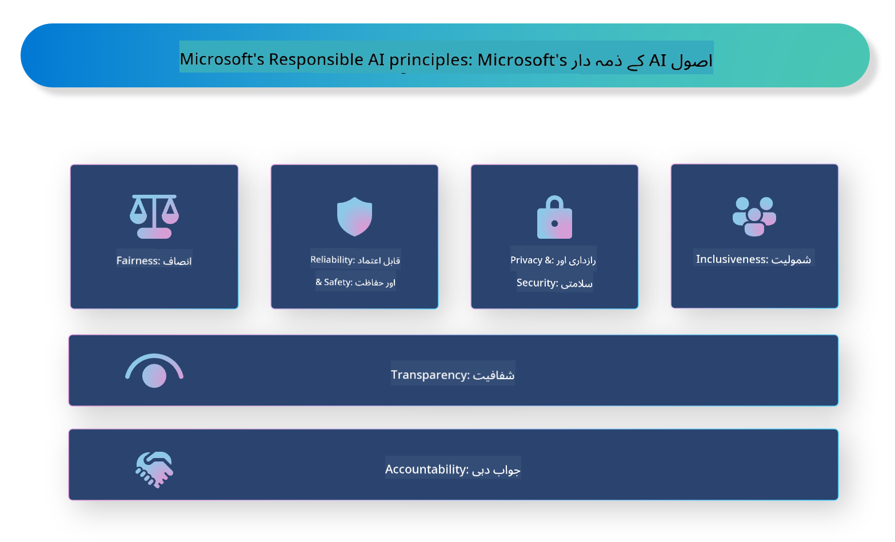

<!--
CO_OP_TRANSLATOR_METADATA:
{
  "original_hash": "3b3107c2477241058ef506743188f399",
  "translation_date": "2025-04-03T07:09:06+00:00",
  "source_file": "md\\01.Introduction\\05\\ResponsibleAI.md",
  "language_code": "ur"
}
-->
# **ذمہ دار AI کا تعارف**

[Microsoft Responsible AI](https://www.microsoft.com/ai/responsible-ai?WT.mc_id=aiml-138114-kinfeylo) ایک اقدام ہے جو ڈویلپرز اور تنظیموں کو شفاف، قابل اعتماد، اور جوابدہ AI سسٹمز بنانے میں مدد دینے کا مقصد رکھتا ہے۔ یہ اقدام اخلاقی اصولوں جیسے کہ پرائیویسی، انصاف، اور شفافیت کے مطابق ذمہ دار AI حل تیار کرنے کے لیے رہنمائی اور وسائل فراہم کرتا ہے۔ ہم ذمہ دار AI سسٹمز بنانے سے متعلق چیلنجز اور بہترین طریقوں پر بھی غور کریں گے۔

## Microsoft Responsible AI کا جائزہ

**اخلاقی اصول**

Microsoft Responsible AI اخلاقی اصولوں جیسے کہ پرائیویسی، انصاف، شفافیت، جوابدہی، اور تحفظ کے تحت کام کرتا ہے۔ یہ اصول اس بات کو یقینی بنانے کے لیے بنائے گئے ہیں کہ AI سسٹمز اخلاقی اور ذمہ دارانہ طریقے سے تیار کیے جائیں۔

**شفاف AI**

Microsoft Responsible AI AI سسٹمز میں شفافیت کی اہمیت پر زور دیتا ہے۔ اس میں یہ شامل ہے کہ AI ماڈلز کیسے کام کرتے ہیں، اس کی واضح وضاحت فراہم کرنا، اور یہ یقینی بنانا کہ ڈیٹا کے ذرائع اور الگورتھمز عوامی طور پر دستیاب ہوں۔

**جوابدہ AI**

[Microsoft Responsible AI](https://www.microsoft.com/ai/responsible-ai?WT.mc_id=aiml-138114-kinfeylo) جوابدہ AI سسٹمز کی ترقی کو فروغ دیتا ہے، جو یہ وضاحت فراہم کرسکتے ہیں کہ AI ماڈلز فیصلے کیسے کرتے ہیں۔ یہ صارفین کو AI سسٹمز کے نتائج کو سمجھنے اور ان پر اعتماد کرنے میں مدد دے سکتا ہے۔

**شمولیت**

AI سسٹمز سب کے فائدے کے لیے ڈیزائن کیے جانے چاہئیں۔ Microsoft کا مقصد ایسا شامل AI بنانا ہے جو مختلف نقطہ نظر کو مدنظر رکھے اور تعصب یا امتیاز سے بچائے۔

**قابلیت اور تحفظ**

AI سسٹمز کی قابلیت اور تحفظ کو یقینی بنانا ضروری ہے۔ Microsoft مضبوط ماڈلز بنانے پر توجہ دیتا ہے جو مستقل طور پر کام کرتے ہیں اور نقصان دہ نتائج سے بچاتے ہیں۔

**AI میں انصاف**

Microsoft Responsible AI تسلیم کرتا ہے کہ AI سسٹمز تعصب کو بڑھا سکتے ہیں اگر وہ متعصب ڈیٹا یا الگورتھمز پر تربیت پائیں۔ یہ اقدام ایسے منصفانہ AI سسٹمز تیار کرنے کے لیے رہنمائی فراہم کرتا ہے جو نسل، جنس، یا عمر جیسے عوامل کی بنیاد پر امتیاز نہ کریں۔

**پرائیویسی اور سیکیورٹی**

Microsoft Responsible AI AI سسٹمز میں صارف کی پرائیویسی اور ڈیٹا سیکیورٹی کے تحفظ کی اہمیت پر زور دیتا ہے۔ اس میں مضبوط ڈیٹا انکرپشن اور رسائی کنٹرولز کا نفاذ شامل ہے، نیز AI سسٹمز کو باقاعدگی سے خطرات کے لیے آڈٹ کرنا۔

**جوابدہی اور ذمہ داری**

Microsoft Responsible AI AI کی ترقی اور نفاذ میں جوابدہی اور ذمہ داری کو فروغ دیتا ہے۔ اس میں یہ یقینی بنانا شامل ہے کہ ڈویلپرز اور تنظیمیں AI سسٹمز سے وابستہ ممکنہ خطرات سے آگاہ ہوں اور ان خطرات کو کم کرنے کے اقدامات کریں۔

## ذمہ دار AI سسٹمز بنانے کے بہترین طریقے

**متنوع ڈیٹا سیٹس کے ذریعے AI ماڈلز تیار کریں**

AI سسٹمز میں تعصب سے بچنے کے لیے ضروری ہے کہ متنوع ڈیٹا سیٹس استعمال کیے جائیں جو مختلف نقطہ نظر اور تجربات کی نمائندگی کریں۔

**قابل وضاحت AI تکنیک استعمال کریں**

قابل وضاحت AI تکنیک صارفین کو یہ سمجھنے میں مدد دے سکتی ہیں کہ AI ماڈلز فیصلے کیسے کرتے ہیں، جو نظام پر اعتماد کو بڑھا سکتی ہیں۔

**AI سسٹمز کو باقاعدگی سے خطرات کے لیے آڈٹ کریں**

AI سسٹمز کا باقاعدہ آڈٹ ممکنہ خطرات اور کمزوریوں کی نشاندہی کرنے میں مدد دے سکتا ہے جنہیں حل کرنے کی ضرورت ہے۔

**مضبوط ڈیٹا انکرپشن اور رسائی کنٹرولز نافذ کریں**

ڈیٹا انکرپشن اور رسائی کنٹرولز AI سسٹمز میں صارف کی پرائیویسی اور سیکیورٹی کے تحفظ میں مدد دے سکتے ہیں۔

**AI کی ترقی میں اخلاقی اصولوں کی پیروی کریں**

ایسے اخلاقی اصولوں کی پیروی، جیسے کہ انصاف، شفافیت، اور جوابدہی، AI سسٹمز پر اعتماد قائم کرنے میں مدد دے سکتی ہے اور اس بات کو یقینی بنا سکتی ہے کہ وہ ذمہ دارانہ طریقے سے تیار کیے جائیں۔

## ذمہ دار AI کے لیے AI Foundry کا استعمال

[Azure AI Foundry](https://ai.azure.com?WT.mc_id=aiml-138114-kinfeylo) ایک طاقتور پلیٹ فارم ہے جو ڈویلپرز اور تنظیموں کو جلدی سے ذہین، جدید، مارکیٹ کے لیے تیار، اور ذمہ دار ایپلیکیشنز بنانے کی اجازت دیتا ہے۔ Azure AI Foundry کی کچھ اہم خصوصیات اور صلاحیتیں درج ذیل ہیں:

**پری بلٹ APIs اور ماڈلز**

Azure AI Foundry پہلے سے تیار شدہ اور حسب ضرورت APIs اور ماڈلز فراہم کرتا ہے۔ یہ AI کے مختلف کاموں کا احاطہ کرتے ہیں، بشمول تخلیقی AI، گفتگو کے لیے قدرتی زبان کی پروسیسنگ، تلاش، مانیٹرنگ، ترجمہ، تقریر، وژن، اور فیصلہ سازی۔

**پرومپٹ فلو**

Azure AI Foundry میں پرومپٹ فلو آپ کو گفتگو کے AI تجربات تخلیق کرنے کی اجازت دیتا ہے۔ یہ گفتگو کے فلو ڈیزائن اور منظم کرنے کی سہولت فراہم کرتا ہے، جس سے چیٹ بوٹس، ورچوئل اسسٹنٹس، اور دیگر انٹرایکٹو ایپلیکیشنز بنانا آسان ہو جاتا ہے۔

**ریٹریول اگمینٹڈ جنریشن (RAG)**

RAG ایک تکنیک ہے جو ریٹریول پر مبنی اور تخلیقی جنریشن پر مبنی نقطہ نظر کو یکجا کرتی ہے۔ یہ موجودہ علم (ریٹریول) اور تخلیقی جنریشن (جنریشن) دونوں کو استعمال کرکے پیدا ہونے والے جوابات کے معیار کو بہتر بناتا ہے۔

**جنریٹو AI کے لیے جائزہ اور مانیٹرنگ میٹرکس**

Azure AI Foundry جنریٹو AI ماڈلز کا جائزہ لینے اور مانیٹر کرنے کے لیے ٹولز فراہم کرتا ہے۔ آپ ان کی کارکردگی، انصاف، اور دیگر اہم میٹرکس کا جائزہ لے سکتے ہیں تاکہ ذمہ دارانہ نفاذ کو یقینی بنایا جا سکے۔ مزید برآں، اگر آپ نے ایک ڈیش بورڈ بنایا ہے، تو آپ Azure Machine Learning Studio کے نو کوڈ UI کا استعمال کرکے Responsible AI Dashboard اور متعلقہ اسکور کارڈ تیار کرسکتے ہیں جو [Responsible AI Toolbox](https://responsibleaitoolbox.ai/?WT.mc_id=aiml-138114-kinfeylo) Python Libraries پر مبنی ہو۔ یہ اسکور کارڈ تکنیکی اور غیر تکنیکی اسٹیک ہولڈرز کے ساتھ انصاف، فیچر کی اہمیت، اور دیگر ذمہ دارانہ نفاذ کے پہلوؤں سے متعلق اہم بصیرتیں شیئر کرنے میں مدد کرتا ہے۔

ذمہ دار AI کے ساتھ AI Foundry استعمال کرنے کے لیے آپ درج ذیل بہترین طریقوں پر عمل کرسکتے ہیں:

**اپنے AI سسٹم کا مسئلہ اور مقصد واضح کریں**

ترقی کے عمل شروع کرنے سے پہلے، یہ واضح طور پر طے کرنا ضروری ہے کہ آپ کا AI سسٹم کس مسئلے یا مقصد کو حل کرنے کا ارادہ رکھتا ہے۔ یہ آپ کو مؤثر ماڈل بنانے کے لیے مطلوبہ ڈیٹا، الگورتھمز، اور وسائل کی شناخت میں مدد دے گا۔

**متعلقہ ڈیٹا جمع کریں اور اس پر عملدرآمد کریں**

AI سسٹم کی کارکردگی پر تربیت کے لیے استعمال کیے جانے والے ڈیٹا کے معیار اور مقدار کا بڑا اثر ہوتا ہے۔ لہٰذا، متعلقہ ڈیٹا جمع کرنا، صاف کرنا، اس پر عملدرآمد کرنا، اور یہ یقینی بنانا ضروری ہے کہ یہ آبادی یا مسئلے کی نمائندگی کرتا ہو جسے آپ حل کرنا چاہتے ہیں۔

**مناسب جائزہ الگورتھم کا انتخاب کریں**

مختلف جائزہ الگورتھمز دستیاب ہیں۔ یہ ضروری ہے کہ اپنے ڈیٹا اور مسئلے کی بنیاد پر سب سے مناسب الگورتھم کا انتخاب کریں۔

**ماڈل کا جائزہ لیں اور اس کی وضاحت کریں**

ایک بار جب آپ نے AI ماڈل بنا لیا، تو اس کی کارکردگی کا جائزہ لینا اور نتائج کو شفاف طریقے سے بیان کرنا ضروری ہے۔ یہ آپ کو ماڈل میں کسی بھی تعصب یا محدودیت کی نشاندہی کرنے اور ضروری اصلاحات کرنے میں مدد دے گا۔

**شفافیت اور وضاحت کو یقینی بنائیں**

AI سسٹمز کو شفاف اور قابل وضاحت ہونا چاہیے تاکہ صارفین یہ سمجھ سکیں کہ وہ کیسے کام کرتے ہیں اور فیصلے کیسے کیے جاتے ہیں۔ یہ خاص طور پر ان ایپلیکیشنز کے لیے اہم ہے جو انسانی زندگی پر نمایاں اثر ڈالتی ہیں، جیسے کہ صحت، مالیات، اور قانونی نظام۔

**ماڈل کی نگرانی کریں اور اسے اپ ڈیٹ کریں**

AI سسٹمز کو مسلسل نگرانی اور اپ ڈیٹ کیا جانا چاہیے تاکہ یہ یقینی بنایا جا سکے کہ وہ وقت کے ساتھ درست اور مؤثر رہیں۔ اس کے لیے ماڈل کی مسلسل دیکھ بھال، جانچ، اور دوبارہ تربیت ضروری ہے۔

آخر میں، Microsoft Responsible AI ایک ایسا اقدام ہے جو ڈویلپرز اور تنظیموں کو شفاف، قابل اعتماد، اور جوابدہ AI سسٹمز بنانے میں مدد دینے کا مقصد رکھتا ہے۔ یاد رکھیں کہ ذمہ دار AI کا نفاذ بہت ضروری ہے، اور Azure AI Foundry تنظیموں کے لیے اسے عملی بنانے کا ارادہ رکھتا ہے۔ اخلاقی اصولوں اور بہترین طریقوں پر عمل کرتے ہوئے، ہم یہ یقینی بنا سکتے ہیں کہ AI سسٹمز ذمہ دارانہ طریقے سے تیار اور نافذ کیے جائیں جو مجموعی طور پر معاشرے کو فائدہ پہنچائیں۔

**ڈسکلیمر**:  
یہ دستاویز AI ترجمہ سروس [Co-op Translator](https://github.com/Azure/co-op-translator) کا استعمال کرتے ہوئے ترجمہ کی گئی ہے۔ ہم درستگی کی پوری کوشش کرتے ہیں، لیکن براہ کرم آگاہ رہیں کہ خودکار ترجمے میں غلطیاں یا نقص موجود ہو سکتے ہیں۔ اصل دستاویز کو اس کی مقامی زبان میں مستند ذریعہ سمجھا جانا چاہیے۔ اہم معلومات کے لیے، پیشہ ور انسانی ترجمہ کی سفارش کی جاتی ہے۔ ہم اس ترجمے کے استعمال سے پیدا ہونے والی کسی بھی غلط فہمی یا غلط تشریح کے ذمہ دار نہیں ہیں۔