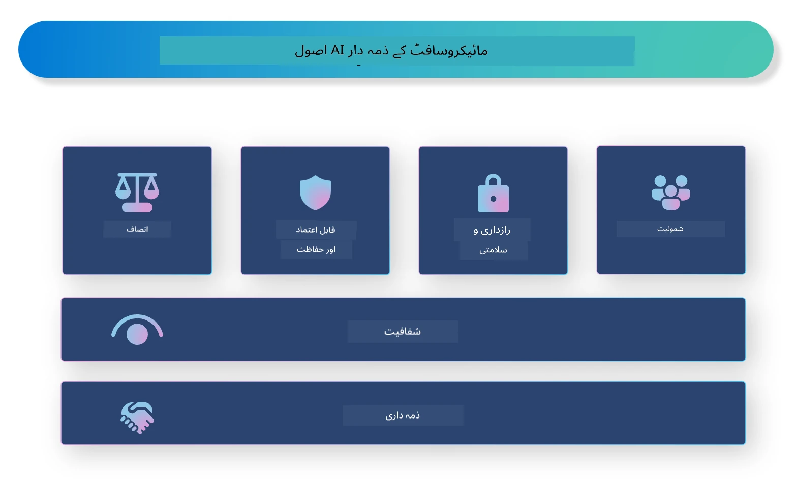

<!--
CO_OP_TRANSLATOR_METADATA:
{
  "original_hash": "805b96b20152936d8f4c587d90d6e06e",
  "translation_date": "2025-07-16T22:48:06+00:00",
  "source_file": "md/01.Introduction/05/ResponsibleAI.md",
  "language_code": "ur"
}
-->
# **ذمہ دار AI کا تعارف**

[Microsoft Responsible AI](https://www.microsoft.com/ai/responsible-ai?WT.mc_id=aiml-138114-kinfeylo) ایک ایسا اقدام ہے جس کا مقصد ڈویلپرز اور تنظیموں کی مدد کرنا ہے تاکہ وہ ایسے AI نظام تیار کریں جو شفاف، قابل اعتماد اور جوابدہ ہوں۔ یہ اقدام ذمہ دار AI حل تیار کرنے کے لیے رہنمائی اور وسائل فراہم کرتا ہے جو اخلاقی اصولوں جیسے کہ پرائیویسی، انصاف، اور شفافیت کے مطابق ہوں۔ ہم ذمہ دار AI نظام بنانے سے جڑے کچھ چیلنجز اور بہترین طریقوں کا بھی جائزہ لیں گے۔

## Microsoft Responsible AI کا جائزہ

**اخلاقی اصول**

Microsoft Responsible AI کو چند اخلاقی اصولوں کی رہنمائی حاصل ہے، جیسے کہ پرائیویسی، انصاف، شفافیت، جوابدہی، اور حفاظت۔ یہ اصول اس بات کو یقینی بنانے کے لیے بنائے گئے ہیں کہ AI نظام اخلاقی اور ذمہ دار طریقے سے تیار کیے جائیں۔

**شفاف AI**

Microsoft Responsible AI AI نظاموں میں شفافیت کی اہمیت پر زور دیتا ہے۔ اس میں یہ شامل ہے کہ AI ماڈلز کیسے کام کرتے ہیں اس کی واضح وضاحت فراہم کی جائے، اور ساتھ ہی ڈیٹا کے ذرائع اور الگورتھمز عوام کے لیے دستیاب ہوں۔

**جوابدہ AI**

[Microsoft Responsible AI](https://www.microsoft.com/ai/responsible-ai?WT.mc_id=aiml-138114-kinfeylo) جوابدہ AI نظاموں کی ترقی کو فروغ دیتا ہے، جو یہ سمجھنے میں مدد دیتے ہیں کہ AI ماڈلز کیسے فیصلے کرتے ہیں۔ اس سے صارفین کو AI نظاموں کے نتائج پر اعتماد کرنے میں مدد ملتی ہے۔

**شمولیت**

AI نظام ایسے بنائے جانے چاہئیں کہ وہ سب کے فائدے کے لیے ہوں۔ Microsoft کا مقصد ایسا جامع AI تیار کرنا ہے جو مختلف نقطہ نظر کو مدنظر رکھے اور تعصب یا امتیاز سے بچے۔

**قابل اعتماد اور محفوظ**

AI نظاموں کا قابل اعتماد اور محفوظ ہونا بہت ضروری ہے۔ Microsoft مضبوط ماڈلز بنانے پر توجہ دیتا ہے جو مستقل کارکردگی دکھائیں اور نقصان دہ نتائج سے بچیں۔

**AI میں انصاف**

Microsoft Responsible AI اس بات کو تسلیم کرتا ہے کہ اگر AI نظام تعصب زدہ ڈیٹا یا الگورتھمز پر تربیت پائیں تو وہ تعصبات کو بڑھا سکتے ہیں۔ یہ اقدام ایسے منصفانہ AI نظام تیار کرنے کی رہنمائی فراہم کرتا ہے جو نسل، جنس، یا عمر جیسے عوامل کی بنیاد پر امتیاز نہ کریں۔

**پرائیویسی اور سیکیورٹی**

Microsoft Responsible AI AI نظاموں میں صارف کی پرائیویسی اور ڈیٹا کی حفاظت کی اہمیت پر زور دیتا ہے۔ اس میں مضبوط ڈیٹا انکرپشن اور رسائی کنٹرولز کا نفاذ شامل ہے، نیز AI نظاموں کی کمزوریوں کے لیے باقاعدہ آڈٹ کرنا بھی شامل ہے۔

**جوابدہی اور ذمہ داری**

Microsoft Responsible AI AI کی ترقی اور نفاذ میں جوابدہی اور ذمہ داری کو فروغ دیتا ہے۔ اس میں یہ یقینی بنانا شامل ہے کہ ڈویلپرز اور تنظیمیں AI نظاموں سے جڑے ممکنہ خطرات سے آگاہ ہوں اور ان خطرات کو کم کرنے کے اقدامات کریں۔

## ذمہ دار AI نظام بنانے کے بہترین طریقے

**مختلف ڈیٹا سیٹس استعمال کرتے ہوئے AI ماڈلز تیار کریں**

AI نظاموں میں تعصب سے بچنے کے لیے ضروری ہے کہ مختلف نقطہ نظر اور تجربات کی نمائندگی کرنے والے متنوع ڈیٹا سیٹس استعمال کیے جائیں۔

**قابل وضاحت AI تکنیکیں استعمال کریں**

قابل وضاحت AI تکنیکیں صارفین کو یہ سمجھنے میں مدد دیتی ہیں کہ AI ماڈلز کیسے فیصلے کرتے ہیں، جس سے نظام پر اعتماد بڑھتا ہے۔

**AI نظاموں کا باقاعدگی سے آڈٹ کریں**

AI نظاموں کے باقاعدہ آڈٹ سے ممکنہ خطرات اور کمزوریوں کی نشاندہی ہوتی ہے جنہیں حل کرنا ضروری ہوتا ہے۔

**مضبوط ڈیٹا انکرپشن اور رسائی کنٹرولز نافذ کریں**

ڈیٹا انکرپشن اور رسائی کنٹرولز AI نظاموں میں صارف کی پرائیویسی اور سیکیورٹی کی حفاظت میں مدد دیتے ہیں۔

**AI کی ترقی میں اخلاقی اصولوں کی پیروی کریں**

انصاف، شفافیت، اور جوابدہی جیسے اخلاقی اصولوں کی پیروی AI نظاموں میں اعتماد پیدا کرنے اور انہیں ذمہ داری کے ساتھ تیار کرنے میں مدد دیتی ہے۔

## ذمہ دار AI کے لیے AI Foundry کا استعمال

[Azure AI Foundry](https://ai.azure.com?WT.mc_id=aiml-138114-kinfeylo) ایک طاقتور پلیٹ فارم ہے جو ڈویلپرز اور تنظیموں کو ذہین، جدید، مارکیٹ کے لیے تیار، اور ذمہ دار ایپلیکیشنز تیزی سے بنانے کی سہولت دیتا ہے۔ Azure AI Foundry کی چند اہم خصوصیات اور صلاحیتیں درج ذیل ہیں:

**تیار شدہ APIs اور ماڈلز**

Azure AI Foundry پہلے سے تیار شدہ اور حسب ضرورت APIs اور ماڈلز فراہم کرتا ہے۔ یہ مختلف AI کاموں کو کور کرتے ہیں، جن میں جنریٹو AI، قدرتی زبان کی پروسیسنگ برائے گفتگو، تلاش، مانیٹرنگ، ترجمہ، تقریر، وژن، اور فیصلہ سازی شامل ہیں۔

**Prompt Flow**

Azure AI Foundry میں Prompt Flow آپ کو بات چیت پر مبنی AI تجربات بنانے کی اجازت دیتا ہے۔ یہ آپ کو بات چیت کے بہاؤ کو ڈیزائن اور منظم کرنے میں مدد دیتا ہے، جس سے چیٹ بوٹس، ورچوئل اسسٹنٹس، اور دیگر انٹرایکٹو ایپلیکیشنز بنانا آسان ہو جاتا ہے۔

**Retrieval Augmented Generation (RAG)**

RAG ایک تکنیک ہے جو بازیافت پر مبنی اور تخلیقی طریقوں کو یکجا کرتی ہے۔ یہ پہلے سے موجود معلومات (بازیافت) اور تخلیقی جنریشن دونوں کا فائدہ اٹھا کر جوابات کے معیار کو بہتر بناتی ہے۔

**جنریٹو AI کے لیے تشخیص اور مانیٹرنگ میٹرکس**

Azure AI Foundry جنریٹو AI ماڈلز کی کارکردگی، انصاف، اور دیگر اہم میٹرکس کی تشخیص اور مانیٹرنگ کے لیے اوزار فراہم کرتا ہے تاکہ ذمہ دارانہ نفاذ کو یقینی بنایا جا سکے۔ مزید برآں، اگر آپ نے ڈیش بورڈ بنایا ہے تو آپ Azure Machine Learning Studio میں نو-کوڈ UI استعمال کر کے [Repsonsible AI Toolbox](https://responsibleaitoolbox.ai/?WT.mc_id=aiml-138114-kinfeylo) Python لائبریریز کی بنیاد پر ایک Responsible AI Dashboard اور متعلقہ اسکور کارڈ حسب ضرورت بنا سکتے ہیں۔ یہ اسکور کارڈ تکنیکی اور غیر تکنیکی اسٹیک ہولڈرز دونوں کے ساتھ انصاف، فیچر کی اہمیت، اور دیگر ذمہ دار نفاذ کے متعلق کلیدی بصیرتیں شیئر کرنے میں مدد دیتا ہے۔

ذمہ دار AI کے لیے AI Foundry استعمال کرنے کے لیے آپ درج ذیل بہترین طریقے اپنا سکتے ہیں:

**اپنے AI نظام کے مسئلے اور مقاصد کی وضاحت کریں**

ترقیاتی عمل شروع کرنے سے پہلے، یہ واضح کرنا ضروری ہے کہ آپ کا AI نظام کون سا مسئلہ حل کرنا چاہتا ہے یا اس کا مقصد کیا ہے۔ اس سے آپ کو ڈیٹا، الگورتھمز، اور وسائل کی شناخت میں مدد ملے گی جو ایک مؤثر ماڈل بنانے کے لیے درکار ہیں۔

**متعلقہ ڈیٹا جمع کریں اور پری پروسیس کریں**

AI نظام کی تربیت میں استعمال ہونے والے ڈیٹا کی معیار اور مقدار اس کی کارکردگی پر گہرا اثر ڈالتی ہے۔ اس لیے ضروری ہے کہ متعلقہ ڈیٹا جمع کیا جائے، صاف کیا جائے، پری پروسیس کیا جائے، اور اس بات کو یقینی بنایا جائے کہ یہ آپ کی آبادی یا مسئلے کی نمائندگی کرتا ہو۔

**مناسب تشخیصی الگورتھم منتخب کریں**

مختلف تشخیصی الگورتھمز دستیاب ہیں۔ آپ کے ڈیٹا اور مسئلے کی بنیاد پر سب سے مناسب الگورتھم کا انتخاب کرنا ضروری ہے۔

**ماڈل کی تشخیص اور تشریح کریں**

ماڈل بنانے کے بعد، اس کی کارکردگی کو مناسب میٹرکس کے ذریعے جانچنا اور نتائج کو شفاف انداز میں سمجھنا ضروری ہے۔ اس سے آپ ماڈل میں موجود کسی بھی تعصب یا حدود کی نشاندہی کر کے بہتری لا سکتے ہیں۔

**شفافیت اور وضاحت کو یقینی بنائیں**

AI نظام شفاف اور قابل وضاحت ہونے چاہئیں تاکہ صارفین سمجھ سکیں کہ یہ کیسے کام کرتے ہیں اور فیصلے کیسے کیے جاتے ہیں۔ یہ خاص طور پر ان ایپلیکیشنز کے لیے اہم ہے جن کے انسانی زندگیوں پر گہرے اثرات ہوتے ہیں، جیسے صحت، مالیات، اور قانونی نظام۔

**ماڈل کی نگرانی اور اپ ڈیٹ کریں**

AI نظاموں کی مسلسل نگرانی اور اپ ڈیٹ ضروری ہے تاکہ وہ وقت کے ساتھ درست اور مؤثر رہیں۔ اس کے لیے ماڈل کی باقاعدہ دیکھ بھال، جانچ، اور دوبارہ تربیت کی ضرورت ہوتی ہے۔

آخر میں، Microsoft Responsible AI ایک ایسا اقدام ہے جو ڈویلپرز اور تنظیموں کی مدد کرتا ہے کہ وہ شفاف، قابل اعتماد، اور جوابدہ AI نظام تیار کریں۔ یاد رکھیں کہ ذمہ دار AI کا نفاذ بہت اہم ہے، اور Azure AI Foundry تنظیموں کے لیے اسے عملی بنانے کا ہدف رکھتا ہے۔ اخلاقی اصولوں اور بہترین طریقوں کی پیروی کر کے ہم اس بات کو یقینی بنا سکتے ہیں کہ AI نظام ذمہ داری کے ساتھ تیار اور نافذ کیے جائیں جو معاشرے کے لیے فائدہ مند ہوں۔

**دستخطی دستبرداری**:  
یہ دستاویز AI ترجمہ سروس [Co-op Translator](https://github.com/Azure/co-op-translator) کے ذریعے ترجمہ کی گئی ہے۔ اگرچہ ہم درستگی کے لیے کوشاں ہیں، براہ کرم آگاہ رہیں کہ خودکار ترجمے میں غلطیاں یا عدم درستیاں ہو سکتی ہیں۔ اصل دستاویز اپنی مادری زبان میں ہی معتبر ماخذ سمجھی جانی چاہیے۔ اہم معلومات کے لیے پیشہ ور انسانی ترجمہ کی سفارش کی جاتی ہے۔ اس ترجمے کے استعمال سے پیدا ہونے والی کسی بھی غلط فہمی یا غلط تشریح کی ذمہ داری ہم پر عائد نہیں ہوتی۔