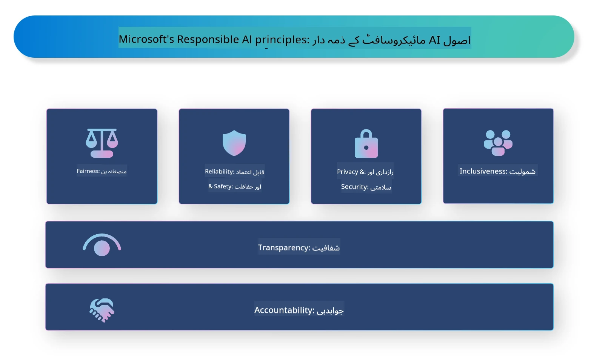

# **ذمہ دار AI کا تعارف**

[Microsoft Responsible AI](https://www.microsoft.com/ai/responsible-ai?WT.mc_id=aiml-138114-kinfeylo) ایک ایسا منصوبہ ہے جس کا مقصد ڈویلپرز اور تنظیموں کی مدد کرنا ہے تاکہ وہ ایسے AI نظام تیار کریں جو شفاف، قابل اعتماد اور جوابدہ ہوں۔ یہ اقدام ذمہ دار AI حل تیار کرنے کے لئے رہنمائی اور وسائل فراہم کرتا ہے جو اخلاقی اصولوں جیسے کہ پرائیویسی، انصاف، اور شفافیت کے مطابق ہوں۔ ہم ذمہ دار AI نظام بنانے سے متعلق کچھ چیلنجز اور بہترین طریقے بھی تلاش کریں گے۔

## Microsoft Responsible AI کا جائزہ

**اخلاقی اصول**

Microsoft Responsible AI کو اخلاقی اصولوں کے ایک سیٹ سے رہنمائی حاصل ہے، جیسے کہ پرائیویسی، انصاف، شفافیت، جوابدہی، اور حفاظت۔ یہ اصول اس بات کو یقینی بنانے کے لیے تیار کیے گئے ہیں کہ AI نظام اخلاقی اور ذمہ دارانہ طریقے سے تیار کیے جائیں۔

**شفاف AI**

Microsoft Responsible AI AI نظام میں شفافیت کی اہمیت پر زور دیتا ہے۔ اس میں واضح وضاحت فراہم کرنا شامل ہے کہ AI ماڈلز کیسے کام کرتے ہیں، نیز یہ بھی یقینی بنانا کہ ڈیٹا ذرائع اور الگورز ہم عوام کے لیے دستیاب ہوں۔

**جوابدہ AI**

[Microsoft Responsible AI](https://www.microsoft.com/ai/responsible-ai?WT.mc_id=aiml-138114-kinfeylo) جوابدہ AI نظاموں کی ترقی کو فروغ دیتا ہے، جو یہ بتا سکتے ہیں کہ AI ماڈلز کس طرح فیصلے کرتے ہیں۔ اس سے صارفین کو AI نظام کے نتائج کو سمجھنے اور ان پر اعتماد کرنے میں مدد ملتی ہے۔

**شمولیت**

AI نظام ایسے بنائے جانے چاہئیں کہ ہر کسی کو فائدہ پہنچے۔ Microsoft کا مقصد شمولیتی AI بنانا ہے جو مختلف نقطہ نظر کو مدنظر رکھتا ہو اور تعصب یا امتیاز سے گریز کرے۔

**اعتماد اور حفاظت**

AI نظاموں کا قابل اعتماد اور محفوظ ہونا بہت ضروری ہے۔ Microsoft مضبوط ماڈلز بنانے پر توجہ دیتا ہے جو مستقل کارکردگی دکھائیں اور نقصان دہ نتائج سے بچیں۔

**AI میں انصاف**

Microsoft Responsible AI تسلیم کرتا ہے کہ اگر AI نظام تعصب شدہ ڈیٹا یا الگورز پر تربیت پائیں تو وہ تعصبات کو جاری رکھ سکتے ہیں۔ یہ اقدام ایسے منصفانہ AI نظام بنانے کے لیے رہنمائی فراہم کرتا ہے جو نسل، جنس، یا عمر جیسے عوامل کی بنیاد پر امتیاز نہ کریں۔

**پرائیویسی اور سیکیورٹی**

Microsoft Responsible AI صارف کی پرائیویسی اور ڈیٹا کی حفاظت کی اہمیت پر زور دیتا ہے۔ اس میں مضبوط ڈیٹا انکرپشن اور رسائی کنٹرولز کا نفاذ شامل ہے، نیز AI نظاموں میں کمزوریوں کے لیے باقاعدگی سے آڈٹ کرنا بھی شامل ہے۔

**جوابدہی اور ذمہ داری**

Microsoft Responsible AI AI کی ترقی اور تعیناتی میں جوابدہی اور ذمہ داری کو فروغ دیتا ہے۔ اس میں اس بات کو یقینی بنانا شامل ہے کہ ڈویلپرز اور تنظیمیں AI نظاموں سے منسلک ممکنہ خطرات سے آگاہ ہوں اور ان خطرات کو کم کرنے کے اقدامات کریں۔

## ذمہ دار AI نظام بنانے کے بہترین طریقے

**متنوع ڈیٹا سیٹس کے ساتھ AI ماڈلز تیار کریں**

AI نظاموں میں تعصب سے بچنے کے لیے ضروری ہے کہ مختلف نقطہ نظر اور تجربات کی نمائندگی کرنے والے متنوع ڈیٹا سیٹس استعمال کیے جائیں۔

**وضاحتی AI تکنیکوں کا استعمال کریں**

وضاحتی AI تکنیکیں صارفین کو یہ سمجھنے میں مدد دے سکتی ہیں کہ AI ماڈلز کس طرح فیصلے کرتے ہیں، جو نظام پر اعتماد بڑھا سکتا ہے۔

**AI نظاموں کا باقاعدگی سے کمزوریوں کے لیے آڈٹ کریں**

AI نظاموں کا باقاعدہ آڈٹ ممکنہ خطرات اور کمزوریوں کی نشاندہی میں مدد کرسکتا ہے جنہیں حل کرنے کی ضرورت ہے۔

**مضبوط ڈیٹا انکرپشن اور رسائی کنٹرولز نافذ کریں**

ڈیٹا انکرپشن اور رسائی کنٹرولز AI نظاموں میں صارف کی پرائیویسی اور سیکیورٹی کی حفاظت کرنے میں مدد دیتے ہیں۔

**AI کی ترقی میں اخلاقی اصولوں پر عمل کریں**

اخلاقی اصولوں جیسے انصاف، شفافیت اور جوابدہی پر عمل کرنا AI نظاموں میں اعتماد پیدا کرتا ہے اور یقینی بناتا ہے کہ وہ ذمہ داری کے ساتھ تیار کیے جائیں۔

## ذمہ دار AI کے لیے AI Foundry کا استعمال

[Microsoft Foundry](https://ai.azure.com?WT.mc_id=aiml-138114-kinfeylo) ایک طاقتور پلیٹ فارم ہے جو ڈویلپرز اور تنظیموں کو ذہین، جدید، مارکیٹ کے لیے تیار، اور ذمہ دار ایپلیکیشنز تیزی سے بنانے کی اجازت دیتا ہے۔ یہاں Microsoft Foundry کی کچھ اہم خصوصیات اور صلاحیتیں ہیں:

**تیار شدہ اور حسب ضرورت APIs اور ماڈلز**

Microsoft Foundry پہلے سے تیار شدہ اور حسب ضرورت APIs اور ماڈلز فراہم کرتا ہے۔ یہ جنریٹو AI، قدرتی زبان کی پروسیسنگ برائے بات چیت، تلاش، نگرانی، ترجمہ، تقریر، وژن، اور فیصلہ سازی سمیت AI کے مختلف کاموں کو کور کرتے ہیں۔

**Prompt Flow**

Microsoft Foundry میں Prompt Flow آپ کو مکالماتی AI تجربات بنانے کی اجازت دیتا ہے۔ یہ آپ کو بات چیت کے بہاؤ کو ڈیزائن اور منظم کرنے میں مدد دیتا ہے، جس سے چیٹ بوٹس، ورچوئل اسسٹنٹس، اور دیگر تعاملی ایپلیکیشنز بنانا آسان ہوجاتا ہے۔

**Retrieval Augmented Generation (RAG)**

RAG ایک تکنیک ہے جو رٹریول پر مبنی اور جنریٹو طریقوں کو ملاتی ہے۔ یہ پہلے سے موجود معلومات (retrieval) اور تخلیقی پیداوار (generation) دونوں کا فائدہ اٹھا کر پیدا کردہ جوابات کے معیار کو بہتر بناتی ہے۔

**جنریٹو AI کے لیے تشخیصی اور نگرانی کے میٹرکس**

Microsoft Foundry جنریٹو AI ماڈلز کی کارکردگی، انصاف، اور دیگر اہم میٹرکس کے جائزے اور نگرانی کے اوزار فراہم کرتا ہے تاکہ ذمہ دار تعیناتی کو یقینی بنایا جا سکے۔ مزید برآں، اگر آپ نے ڈیش بورڈ بنایا ہے، تو آپ Azure Machine Learning Studio کے نو کوڈ UI کا استعمال کرتے ہوئے [Repsonsible AI Toolbox](https://responsibleaitoolbox.ai/?WT.mc_id=aiml-138114-kinfeylo) پائتھن لائبریریوں کی بنیاد پر ایک ذمہ دار AI ڈیش بورڈ اور اسکور کارڈ حسب ضرورت تیار کر سکتے ہیں۔ یہ اسکور کارڈ تکنیکی اور غیر تکنیکی اسٹیک ہولڈرز دونوں کے ساتھ انصاف، فیچر کی اہمیت، اور دیگر ذمہ دار تعیناتی کے ملاحظات سے متعلق کلیدی بصیرتیں شیئر کرنے میں مدد کرتا ہے۔

AI Foundry کو ذمہ دار AI کے ساتھ استعمال کرنے کے لیے آپ یہ بہترین طریقے اپنا سکتے ہیں:

**اپنے AI نظام کے مسئلے اور مقاصد کی وضاحت کریں**

ترقیاتی عمل شروع کرنے سے پہلے، یہ ضروری ہے کہ آپ واضح طور پر مسئلہ یا مقصد کی وضاحت کریں جسے آپ کا AI نظام حل کرنا چاہتا ہے۔ اس سے آپ کو موثر ماڈل بنانے کے لیے درکار ڈیٹا، الگورز، اور وسائل کی شناخت میں مدد ملے گی۔

**متعلقہ ڈیٹا جمع کریں اور پیشگی عمل کریں**

AI نظام کی تربیت میں استعمال ہونے والے ڈیٹا کا معیار اور مقدار اس کی کارکردگی پر کافی اثر ڈالتی ہے۔ لہٰذا، متعلقہ ڈیٹا جمع کرنا، صاف کرنا، پیشگی عمل کرنا، اور یہ یقینی بنانا ضروری ہے کہ یہ آپ کی آبادی یا مسئلے کی نمائندگی کرتا ہو۔

**موزوں تشخیص کا انتخاب کریں**

مختلف تشخیصی الگورز دستیاب ہیں۔ اپنے ڈیٹا اور مسئلے کی بنیاد پر سب سے موزوں الگورز کا انتخاب کرنا اہم ہے۔

**ماڈل کی جانچ کریں اور نتائج کی تشریح کریں**

AI ماڈل بنانے کے بعد، اس کی کارکردگی کو مناسب میٹرکس کے ذریعے جانچنا اور نتائج کو شفاف انداز میں سمجھانا ضروری ہے۔ اس سے آپ ماڈل میں کسی بھی تعصب یا حدود کی نشاندہی کر سکیں گے اور جہاں ضروری ہو بہتری لا سکیں گے۔

**شفافیت اور وضاحت کو یقینی بنائیں**

AI نظام شفاف اور قابل وضاحت ہونے چاہئیں تاکہ صارفین یہ سمجھ سکیں کہ یہ کیسے کام کرتے ہیں اور فیصلے کیسے کیے جاتے ہیں۔ یہ خاص طور پر صحت کی دیکھ بھال، مالیات، اور قانونی نظاموں جیسے ایسے ایپلیکیشنز کے لیے اہم ہے جن کا انسانی زندگیوں پر بڑا اثر ہوتا ہے۔

**ماڈل کی نگرانی اور اپ ڈیٹ کریں**

AI نظاموں کی مستقل نگرانی اور اپ ڈیٹ ضروری ہے تاکہ وہ وقت کے ساتھ درست اور موثر رہیں۔ اس کے لیے ماڈل کی مسلسل دیکھ بھال، جانچ، اور دوبارہ تربیت کی ضرورت ہوتی ہے۔

آخر میں، Microsoft Responsible AI ایک ایسا اقدام ہے جو ڈویلپرز اور تنظیموں کی مدد کرتا ہے تاکہ وہ ایسے AI نظام تیار کریں جو شفاف، قابل اعتماد اور جوابدہ ہوں۔ یاد رکھیں کہ ذمہ دار AI کا نفاذ نہایت اہم ہے، اور Microsoft Foundry تنظیموں کے لیے اسے عملی بنانے کا مقصد رکھتا ہے۔ اخلاقی اصولوں اور بہترین طریقوں پر عمل کر کے ہم یہ یقینی بنا سکتے ہیں کہ AI نظام ایسی ذمہ داری کے ساتھ تیار اور تعینات کیے جائیں جو پورے معاشرے کو فائدہ پہنچائے۔

---

<!-- CO-OP TRANSLATOR DISCLAIMER START -->
**ڈس کلیمر**:  
یہ دستاویز AI ترجمہ سروس [Co-op Translator](https://github.com/Azure/co-op-translator) کے استعمال سے ترجمہ کی گئی ہے۔ اگرچہ ہم درستگی کے لیے کوشاں ہیں، لیکن مہربانی فرما کر یہ بات ذہن میں رکھیں کہ خودکار ترجمے میں غلطیاں یا عدم درستیاں ہو سکتی ہیں۔ اصل دستاویز اپنی مادری زبان میں معتبر ماخذ سمجھی جانی چاہیے۔ اہم معلومات کے لیے پیشہ ور انسانی ترجمے کی سفارش کی جاتی ہے۔ اس ترجمے کے استعمال سے پیدا ہونے والی کسی بھی غلط فہمی یا غلط تشریح کی ذمہ داری ہم پر عائد نہیں ہوتی۔
<!-- CO-OP TRANSLATOR DISCLAIMER END -->