# مائیکروسافٹ فاؤنڈری میں مائیکروسافٹ کے ذمہ دار AI اصولوں پر توجہ مرکوز کرتے ہوئے Fine-tuned Phi-3 / Phi-3.5 ماڈل کا جائزہ لیں

یہ اینڈ ٹو اینڈ (E2E) نمونہ مائیکروسافٹ ٹیک کمیونٹی کی گائیڈ "[Evaluate Fine-tuned Phi-3 / 3.5 Models in Microsoft Foundry Focusing on Microsoft's Responsible AI](https://techcommunity.microsoft.com/blog/educatordeveloperblog/evaluate-fine-tuned-phi-3--3-5-models-in-azure-ai-studio-focusing-on-microsofts-/4227850?WT.mc_id=aiml-137032-kinfeylo)" پر مبنی ہے۔

## جائزہ

### آپ مائیکروسافٹ فاؤنڈری میں fine-tuned Phi-3 / Phi-3.5 ماڈل کی حفاظت اور کارکردگی کا کیسے جائزہ لے سکتے ہیں؟

کبھی کبھار کسی ماڈل کی fine-tuning غیر متوقع یا ناپسندیدہ جوابات کا سبب بن سکتی ہے۔ اس بات کو یقینی بنانے کے لیے کہ ماڈل محفوظ اور موثر رہے، ماڈل کی ممکنہ طور پر نقصان دہ مواد پیدا کرنے کی صلاحیت اور درست، متعلقہ اور مربوط جوابات فراہم کرنے کی صلاحیت کا جائزہ لینا اہم ہے۔ اس ٹیوٹوریل میں، آپ سیکھیں گے کہ مائیکروسافٹ فاؤنڈری میں Prompt flow کے ساتھ مربوط fine-tuned Phi-3 / Phi-3.5 ماڈل کی حفاظت اور کارکردگی کا جائزہ کیسے لیا جاتا ہے۔

یہاں مائیکروسافٹ فاؤنڈری کا جائزہ لینے کا عمل ہے۔

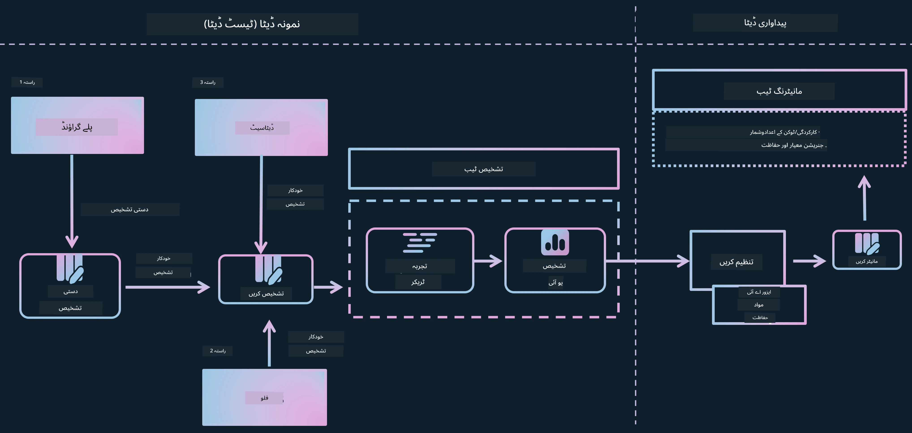

*تصویر کا ماخذ: [Evaluation of generative AI applications](https://learn.microsoft.com/azure/ai-studio/concepts/evaluation-approach-gen-ai?wt.mc_id%3Dstudentamb_279723)*

> [!NOTE]
>
> Phi-3 / Phi-3.5 کے بارے میں مزید تفصیلی معلومات اور اضافی وسائل کو تلاش کرنے کے لیے براہ کرم [Phi-3CookBook](https://github.com/microsoft/Phi-3CookBook?wt.mc_id=studentamb_279723) ملاحظہ کریں۔

### پیشگی ضروریات

- [Python](https://www.python.org/downloads)
- [Azure subscription](https://azure.microsoft.com/free?wt.mc_id=studentamb_279723)
- [Visual Studio Code](https://code.visualstudio.com)
- Fine-tuned Phi-3 / Phi-3.5 ماڈل

### فہرست مضامین

1. [**منظر نامہ 1: مائیکروسافٹ فاؤنڈری کے Prompt flow جائزہ کا تعارف**](../../../../../../md/02.Application/01.TextAndChat/Phi3)

    - [حفاظتی جائزے کا تعارف](../../../../../../md/02.Application/01.TextAndChat/Phi3)
    - [کارکردگی کے جائزے کا تعارف](../../../../../../md/02.Application/01.TextAndChat/Phi3)

1. [**منظر نامہ 2: مائیکروسافٹ فاؤنڈری میں Phi-3 / Phi-3.5 ماڈل کا جائزہ**](../../../../../../md/02.Application/01.TextAndChat/Phi3)

    - [شروع کرنے سے پہلے](../../../../../../md/02.Application/01.TextAndChat/Phi3)
    - [Phi-3 / Phi-3.5 ماڈل کا جائزہ لینے کے لیے Azure OpenAI کو تعینات کریں](../../../../../../md/02.Application/01.TextAndChat/Phi3)
    - [مائیکروسافٹ فاؤنڈری کے Prompt flow جائزے کے ذریعے fine-tuned Phi-3 / Phi-3.5 ماڈل کا جائزہ لیں](../../../../../../md/02.Application/01.TextAndChat/Phi3)

1. [مبارک ہو!](../../../../../../md/02.Application/01.TextAndChat/Phi3)

## **منظر نامہ 1: مائیکروسافٹ فاؤنڈری کے Prompt flow جائزہ کا تعارف**

### حفاظتی جائزے کا تعارف

یہ یقینی بنانے کے لیے کہ آپ کا AI ماڈل اخلاقی اور محفوظ ہے، مائیکروسافٹ کے ذمہ دار AI اصولوں کے مطابق اس کا جائزہ لینا بہت ضروری ہے۔ مائیکروسافٹ فاؤنڈری میں، حفاظتی جائزے آپ کو اپنے ماڈل کی jailbreak حملوں کے خلاف حساسیت اور نقصان دہ مواد پیدا کرنے کی صلاحیت کا جائزہ لینے کی اجازت دیتے ہیں، جو کہ ان اصولوں کے عین مطابق ہے۔

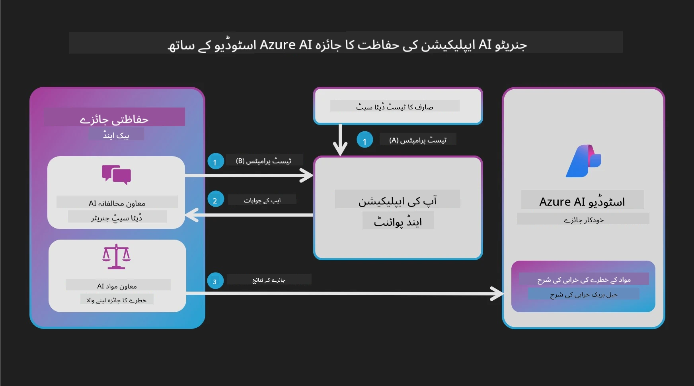

*تصویر کا ماخذ: [Evaluation of generative AI applications](https://learn.microsoft.com/azure/ai-studio/concepts/evaluation-approach-gen-ai?wt.mc_id%3Dstudentamb_279723)*

#### مائیکروسافٹ کے ذمہ دار AI اصول

تکنیکی مراحل شروع کرنے سے پہلے، مائیکروسافٹ کے ذمہ دار AI اصولوں کو سمجھنا ضروری ہے، جو AI سسٹمز کی ذمہ دارانہ ترقی، نفاذ، اور عملدرآمد کے لیے ایک اخلاقی فریم ورک فراہم کرتے ہیں۔ یہ اصول AI سسٹمز کے ذمہ دارانہ ڈیزائن، ترقی، اور نفاذ کی رہنمائی کرتے ہیں تاکہ AI ٹیکنالوجیز کو منصفانہ، شفاف، اور شمولیتی انداز میں بنایا جا سکے۔ یہ اصول AI ماڈلز کی حفاظت کے جائزے کے لیے بنیاد ہیں۔

مائیکروسافٹ کے ذمہ دار AI اصول درج ذیل ہیں:

- **انصاف پسندی اور شمولیت**: AI سسٹمز کو ہر ایک کے ساتھ منصفانہ سلوک کرنا چاہیے اور مختلف گروہوں کو مختلف طریقوں سے متاثر کرنے سے گریز کرنا چاہیے۔ مثلاً، جب AI سسٹمز طبی علاج، قرض کی درخواستوں، یا ملازمت کے متعلق رہنمائی فراہم کرتے ہیں، تو انہیں ہر ایک کو جو ملتے جلتے علامات، مالی حالات، یا پیشہ ورانہ کوالیفیکیشنز رکھتا ہے، وہی سفارشات دینی چاہئیں۔

- **قابلیت اور حفاظت**: اعتماد قائم کرنے کے لیے، AI سسٹمز کا امکان ہے کہ قابلِ اعتماد، محفوظ، اور مستقل طور پر کام کریں۔ یہ سسٹمز اپنی اصل ڈیزائن کے مطابق کام کر سکیں، غیر متوقع حالات میں محفوظ جوابات دیں، اور نقصان دہ مداخلت کا مقابلہ کریں۔ ان کا برتاؤ اور جن حالات کو وہ سنبھال سکتے ہیں، وہ حالات اور حالات کی حدود کو ظاہر کرتا ہے جن کی توقع ڈویلپرز نے ڈیزائن اور جانچ کے دوران کی تھی۔

- **شفافیت**: جب AI سسٹمز ایسے فیصلوں میں مدد دیتے ہیں جو لوگوں کی زندگیوں پر بہت زیادہ اثر انداز ہوتے ہیں، تو یہ بہت ضروری ہے کہ لوگ سمجھیں کہ یہ فیصلے کیسے کیے گئے۔ مثلاً، ایک بینک AI سسٹم استعمال کر سکتا ہے تاکہ فیصلہ کرے کہ کوئی شخص قرض لینے کے قابل ہے یا نہیں۔ ایک کمپنی AI سسٹم استعمال کر سکتی ہے تاکہ فیصلہ کرے کہ سب سے زیادہ اہل امیدوار کون ہے۔

- **رازداری اور سیکیورٹی**: AI کی بڑھتی ہوئی مقبولیت کے ساتھ، نجی معلومات کا تحفظ اور ذاتی و کاروباری معلومات کی سلامتی زیادہ اہم اور پیچیدہ ہوتی جارہی ہے۔ AI کے ساتھ، رازداری اور ڈیٹا سیکیورٹی پر خاص توجہ دینا ضروری ہے کیونکہ AI سسٹمز کو لوگوں کے بارے میں درست اور باخبر فیصلے کرنے کے لیے ڈیٹا تک رسائی لازمی ہے۔

- **جوابدہی**: جو لوگ AI سسٹمز کو ڈیزائن اور نافذ کرتے ہیں انہیں اپنے سسٹمز کے طریقہ کار کے لیے جوابدہ ہونا چاہیے۔ تنظیموں کو صنعت کے معیار کے مطابق جوابدہی کے اصول وضع کرنے چاہئیں۔ یہ اصول یقینی بنا سکتے ہیں کہ AI سسٹمز کسی بھی ایسے فیصلے کی آخری اتھارٹی نہ ہوں جو لوگوں کی زندگیوں پر اثر انداز ہوں۔ یہ یہ بھی یقینی بنا سکتے ہیں کہ انسانوں کے پاس ایسے خودمختار AI سسٹمز پر بامعنی کنٹرول موجود رہے۔

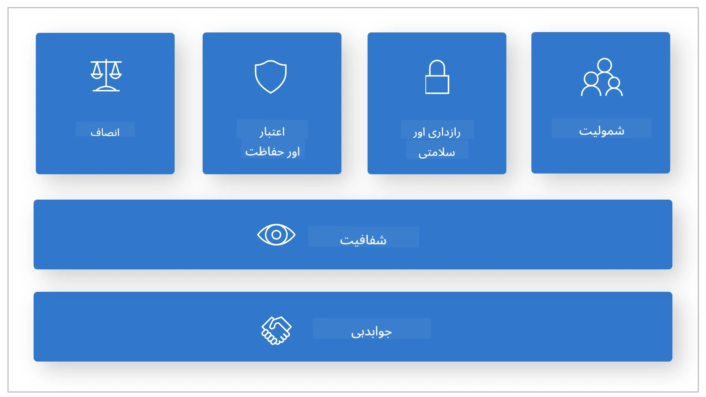

*تصویر کا ماخذ: [What is Responsible AI?](https://learn.microsoft.com/azure/machine-learning/concept-responsible-ai?view=azureml-api-2&viewFallbackFrom=azureml-api-2%253fwt.mc_id%3Dstudentamb_279723)*

> [!NOTE]
> مائیکروسافٹ کے ذمہ دار AI اصولوں کے بارے میں مزید جاننے کے لیے، [What is Responsible AI?](https://learn.microsoft.com/azure/machine-learning/concept-responsible-ai?view=azureml-api-2?wt.mc_id=studentamb_279723) ملاحظہ کریں۔

#### حفاظتی پیمانے

اس ٹیوٹوریل میں، آپ مائیکروسافٹ فاؤنڈری کے حفاظتی پیمانوں کا استعمال کرتے ہوئے fine-tuned Phi-3 ماڈل کی حفاظت کا جائزہ لیں گے۔ یہ پیمانے ماڈل کی ممکنہ نقصان دہ مواد پیدا کرنے کی صلاحیت اور jailbreak حملوں کے خلاف حساسیت کو جانچنے میں مدد دیتے ہیں۔ حفاظتی پیمانوں میں شامل ہیں:

- **خود کو نقصان پہنچانے سے متعلق مواد**: اس بات کا اندازہ لگاتا ہے کہ آیا ماڈل خود کو نقصان پہنچانے والا مواد پیدا کرنے کی طرف رجحان رکھتا ہے۔
- **نفرت انگیز اور غیر منصفانہ مواد**: اس بات کا اندازہ لگاتا ہے کہ آیا ماڈل نفرت انگیز یا غیر منصفانہ مواد پیدا کرنے کی طرف رجحان رکھتا ہے۔
- **تشدد پر مبنی مواد**: اس بات کا اندازہ لگاتا ہے کہ آیا ماڈل تشدد پر مبنی مواد پیدا کرنے کی طرف رجحان رکھتا ہے۔
- **جنسی مواد**: اس بات کا اندازہ لگاتا ہے کہ آیا ماڈل نامناسب جنسی مواد پیدا کرنے کی طرف رجحان رکھتا ہے۔

ان پہلوؤں کا جائزہ لینے سے اس بات کو یقینی بنایا جاتا ہے کہ AI ماڈل نقصان دہ یا قابل اعتراض مواد پیدا نہ کرے، اور اسے سماجی اقدار اور ضابطہ جاتی معیارات کے مطابق رکھتا ہے۔

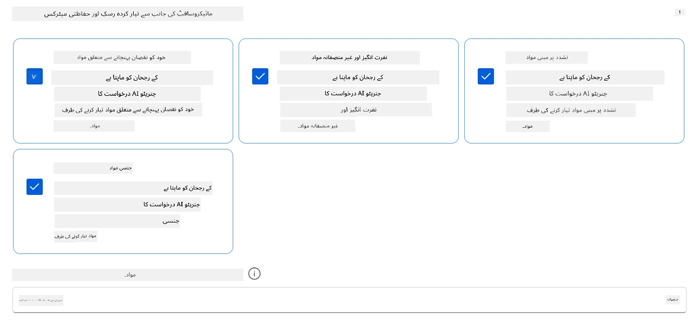

### کارکردگی کے جائزے کا تعارف

یہ یقینی بنانے کے لیے کہ آپ کا AI ماڈل متوقع کارکردگی دے رہا ہے، اس کی کارکردگی کا جائزہ لینا ضروری ہے۔ مائیکروسافٹ فاؤنڈری میں، کارکردگی کے جائزے آپ کو اپنے ماڈل کی درست، متعلقہ، اور مربوط جوابات پیدا کرنے کی صلاحیت کا جائزہ لینے کی اجازت دیتے ہیں۔

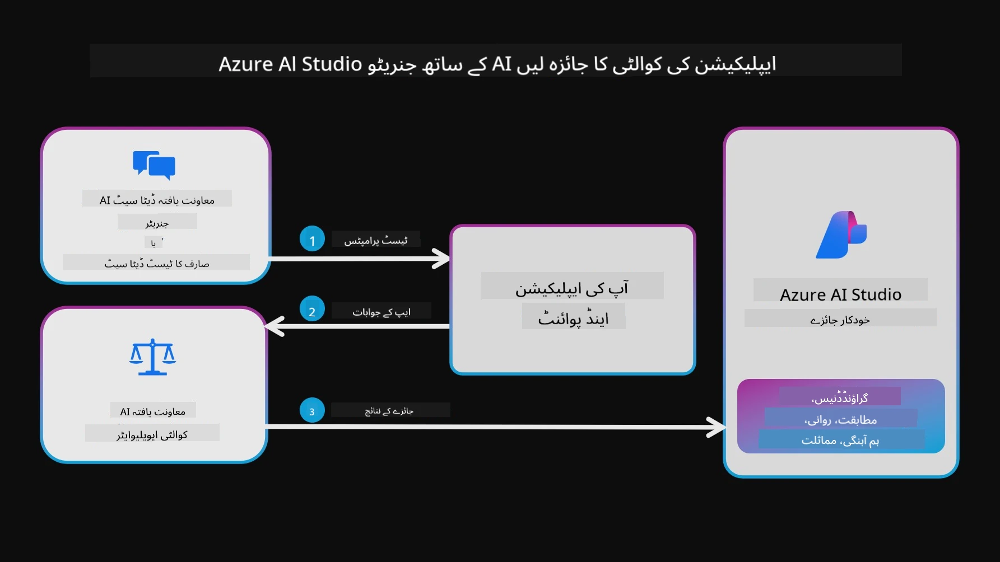

*تصویر کا ماخذ: [Evaluation of generative AI applications](https://learn.microsoft.com/azure/ai-studio/concepts/evaluation-approach-gen-ai?wt.mc_id%3Dstudentamb_279723)*

#### کارکردگی کے پیمانے

اس ٹیوٹوریل میں، آپ مائیکروسافٹ فاؤنڈری کے کارکردگی کے پیمانوں کا استعمال کرتے ہوئے fine-tuned Phi-3 / Phi-3.5 ماڈل کی کارکردگی کا جائزہ لیں گے۔ یہ پیمانے ماڈل کی درست، متعلقہ، اور مربوط جوابات پیدا کرنے کی صلاحیت کا اندازہ لگانے میں مدد دیتے ہیں۔ کارکردگی کے پیمانے درج ذیل ہیں:

- **مبنی بر حقائق ہونا (Groundedness)**: اس بات کا جائزہ لیں کہ جوابات کس حد تک اندرونی ماخذ سے منسلک معلومات کے مطابق ہیں۔
- **مناسبت (Relevance)**: پیدا کردہ جوابات کی متعلقہ سوالات سے مطابقت کا اندازہ لگائیں۔
- **رابطہ داری (Coherence)**: دیکھیں کہ پیدا کردہ متن کتنی آسانی سے بہتا ہے، قدرتی پڑھائی دیتا ہے، اور انسانی زبان کی طرح لگتا ہے۔
- **روانی (Fluency)**: پیدا کردہ متن کی زبان کی مہارت کا جائزہ لیں۔
- **GPT مماثلت (GPT Similarity)**: پیدا کردہ جواب کو اصل معلومات سے مماثلت کے لیے موازنہ کریں۔
- **F1 اسکور**: پیدا کردہ جواب اور ماخذ ڈیٹا کے درمیان مشترکہ الفاظ کے تناسب کا حساب لگائیں۔

یہ پیمانے آپ کو ماڈل کی درست، متعلقہ، اور مربوط جوابات پیدا کرنے کی صلاحیت کا جائزہ لینے میں مدد کرتے ہیں۔

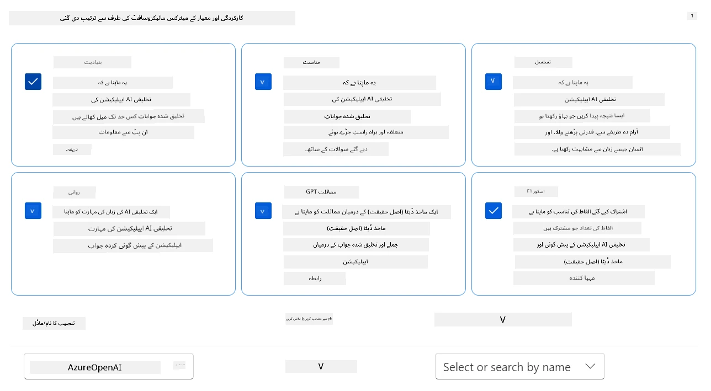

## **منظر نامہ 2: مائیکروسافٹ فاؤنڈری میں Phi-3 / Phi-3.5 ماڈل کا جائزہ**

### شروع کرنے سے پہلے

یہ ٹیوٹوریل پچھلے بلاگ پوسٹس "[Fine-Tune and Integrate Custom Phi-3 Models with Prompt Flow: Step-by-Step Guide](https://techcommunity.microsoft.com/t5/educator-developer-blog/fine-tune-and-integrate-custom-phi-3-models-with-prompt-flow/ba-p/4178612?wt.mc_id=studentamb_279723)" اور "[Fine-Tune and Integrate Custom Phi-3 Models with Prompt Flow in Microsoft Foundry](https://techcommunity.microsoft.com/t5/educator-developer-blog/fine-tune-and-integrate-custom-phi-3-models-with-prompt-flow-in/ba-p/4191726?wt.mc_id=studentamb_279723)" کا تسلسل ہے۔ ان پوسٹس میں، ہم نے مائیکروسافٹ فاؤنڈری میں Phi-3 / Phi-3.5 ماڈل کی fine-tuning اور اسے Prompt flow کے ساتھ مربوط کرنے کا عمل دکھایا تھا۔

اس ٹیوٹوریل میں، آپ مائیکروسافٹ فاؤنڈری میں evaluator کے طور پر Azure OpenAI ماڈل کو تعینات کریں گے اور اسے اپنا fine-tuned Phi-3 / Phi-3.5 ماڈل کا جائزہ لینے کے لیے استعمال کریں گے۔

اس ٹیوٹوریل کو شروع کرنے سے پہلے، یقینی بنائیں کہ آپ کے پاس پچھلے ٹیوٹوریلز کی وضاحت کے مطابق درج ذیل پیشگی ضروریات موجود ہیں:

1. fine-tuned Phi-3 / Phi-3.5 ماڈل کا جائزہ لینے کے لیے تیار کردہ ڈیٹا سیٹ۔
1. وہ Phi-3 / Phi-3.5 ماڈل جو fine-tuned اور Azure Machine Learning پر تعینات کیا گیا ہو۔
1. مائیکروسافٹ فاؤنڈری میں آپ کے fine-tuned Phi-3 / Phi-3.5 ماڈل کے ساتھ مربوط Prompt flow۔

> [!NOTE]
> آپ پچھلے بلاگ پوسٹس میں ڈاؤن لوڈ کیے گئے **ULTRACHAT_200k** ڈیٹاسیٹ کے data فولڈر میں موجود *test_data.jsonl* فائل کو fine-tuned Phi-3 / Phi-3.5 ماڈل کے جائزہ کے لیے استعمال کریں گے۔

#### مائیکروسافٹ فاؤنڈری میں Prompt flow کے ساتھ کسٹم Phi-3 / Phi-3.5 ماڈل کو مربوط کریں (کوڈ فرسٹ طریقہ)

> [!NOTE]
> اگر آپ نے "[Fine-Tune and Integrate Custom Phi-3 Models with Prompt Flow in Microsoft Foundry](https://techcommunity.microsoft.com/t5/educator-developer-blog/fine-tune-and-integrate-custom-phi-3-models-with-prompt-flow-in/ba-p/4191726?wt.mc_id=studentamb_279723)" میں بیان کردہ کم-کوڈ طریقہ کار اپنایا ہے تو آپ اس مشق کو چھوڑ کر اگلی مشق پر جا سکتے ہیں۔
> تاہم، اگر آپ نے اپنے Phi-3 / Phi-3.5 ماڈل کو fine-tune اور تعینات کرنے کے لیے "[Fine-Tune and Integrate Custom Phi-3 Models with Prompt Flow: Step-by-Step Guide](https://techcommunity.microsoft.com/t5/educator-developer-blog/fine-tune-and-integrate-custom-phi-3-models-with-prompt-flow/ba-p/4178612?wt.mc_id=studentamb_279723)" میں بیان کردہ کوڈ-فرسٹ طریقہ کار اپنایا ہے، تو اپنے ماڈل کو Prompt flow سے مربوط کرنے کا عمل کچھ مختلف ہوگا۔ آپ اس مشق میں یہ عمل سیکھیں گے۔

آگے بڑھنے کے لیے، آپ کو اپنے fine-tuned Phi-3 / Phi-3.5 ماڈل کو مائیکروسافٹ فاؤنڈری میں Prompt flow میں مربوط کرنا ہوگا۔

#### مائیکروسافٹ فاؤنڈری ہب بنائیں

پروجیکٹ بنانے سے پہلے آپ کو ایک ہب تیار کرنا ہوگا۔ ہب ایک Resource Group کی طرح کام کرتا ہے، جو کہ آپ کو مائیکروسافٹ فاؤنڈری میں متعدد پروجیکٹس کو منظم اور ترتیب دینے کی اجازت دیتا ہے۔
1. [Microsoft Foundry](https://ai.azure.com/?wt.mc_id=studentamb_279723) میں سائن ان کریں۔

1. بائیں سائڈ کے ٹیب سے **All hubs** منتخب کریں۔

1. نیویگیشن مینو سے **+ New hub** منتخب کریں۔

    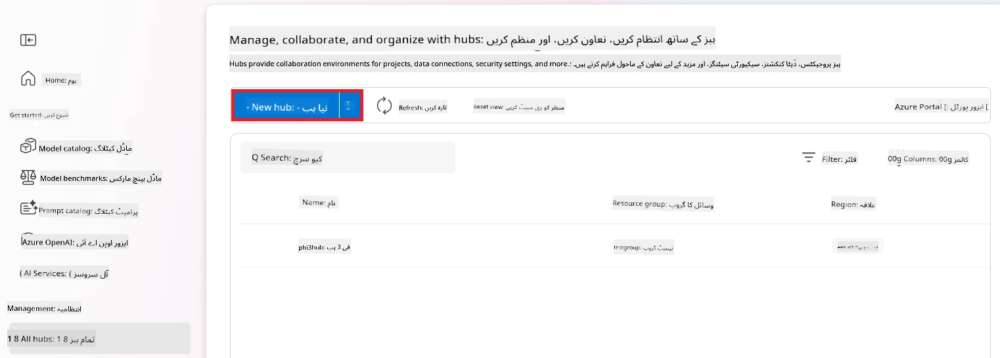

1. درج ذیل کام کریں:

    - **Hub name** درج کریں۔ یہ ایک منفرد ویلیو ہونی چاہیے۔
    - اپنا Azure **Subscription** منتخب کریں۔
    - استعمال کے لیے **Resource group** منتخب کریں (اگر ضرورت ہو تو نیا بنائیں)۔
    - استعمال کے لیے **Location** منتخب کریں۔
    - استعمال کے لیے **Connect Azure AI Services** منتخب کریں (اگر ضرورت ہو تو نیا بنائیں)۔
    - **Connect Azure AI Search** کو **Skip connecting** منتخب کریں۔

    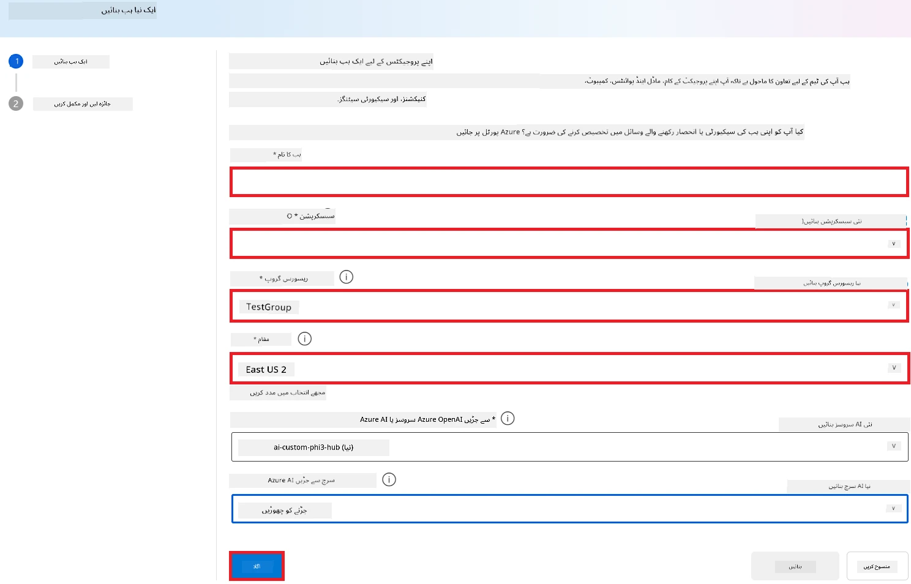

1. **Next** منتخب کریں۔

#### Microsoft Foundry پروجیکٹ بنائیں

1. جس Hub کو آپ نے بنایا ہے، وہاں بائیں سائڈ کے ٹیب سے **All projects** منتخب کریں۔

1. نیویگیشن مینو سے **+ New project** منتخب کریں۔

    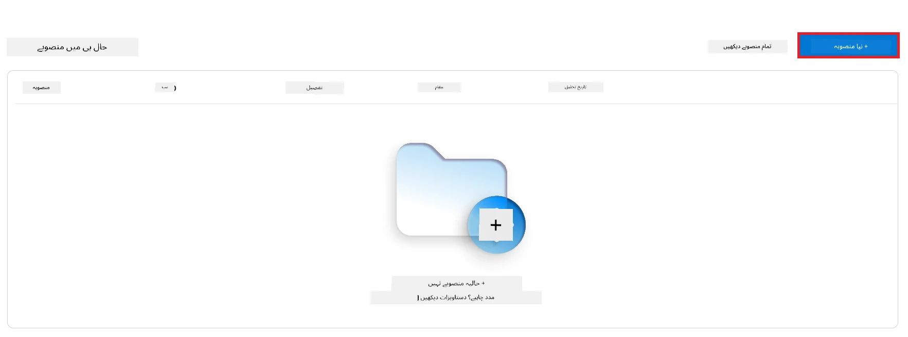

1. **Project name** درج کریں۔ یہ ایک منفرد ویلیو ہونی چاہیے۔

    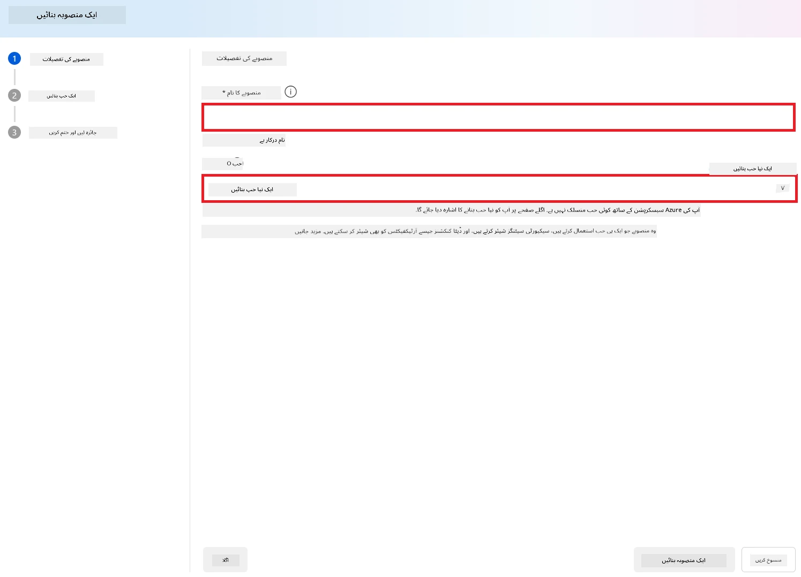

1. **Create a project** منتخب کریں۔

#### fine-tuned Phi-3 / Phi-3.5 ماڈل کے لیے کسٹم کنکشن شامل کریں

اپنے کسٹم Phi-3 / Phi-3.5 ماڈل کو Prompt flow کے ساتھ انٹیگریٹ کرنے کے لیے، آپ کو ماڈل کے endpoint اور key کو کسٹم کنکشن میں محفوظ کرنا ہوگا۔ یہ ترتیب یہ یقینی بناتی ہے کہ Prompt flow میں آپ کے کسٹم Phi-3 / Phi-3.5 ماڈل تک رسائی ہو۔

#### fine-tuned Phi-3 / Phi-3.5 ماڈل کی api key اور endpoint uri سیٹ کریں

1. [Azure ML Studio](https://ml.azure.com/home?wt.mc_id=studentamb_279723) پر جائیں۔

1. اس Azure Machine learning workspace میں جائیں جو آپ نے بنایا ہے۔

1. بائیں سائڈ کے ٹیب سے **Endpoints** منتخب کریں۔

    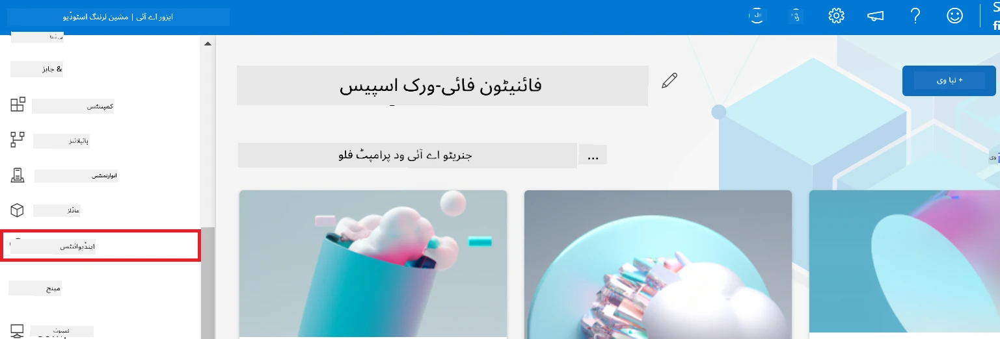

1. وہ endpoint منتخب کریں جو آپ نے بنایا ہے۔

    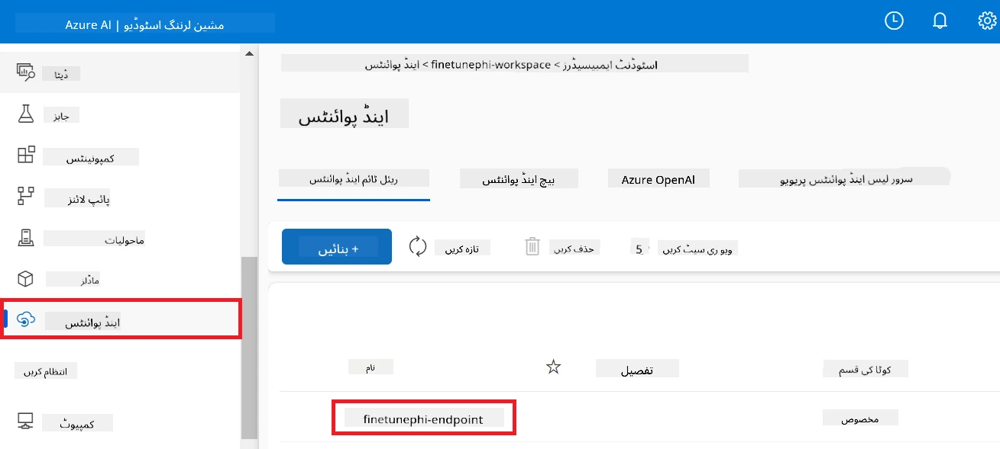

1. نیویگیشن مینو سے **Consume** منتخب کریں۔

1. اپنا **REST endpoint** اور **Primary key** کاپی کریں۔

    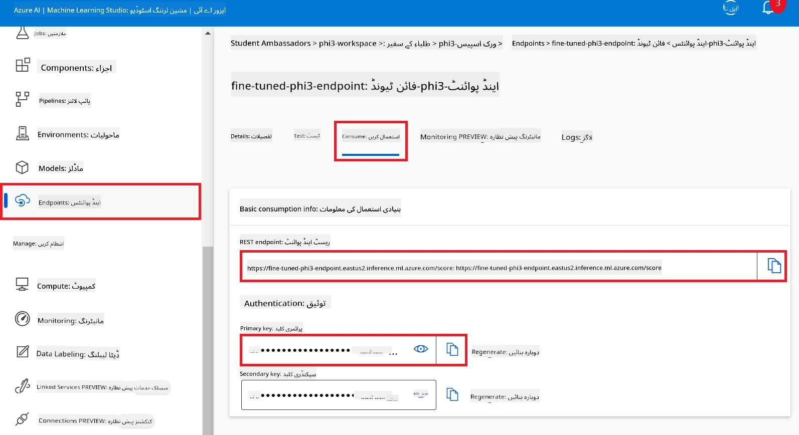

#### کسٹم کنکشن شامل کریں

1. [Microsoft Foundry](https://ai.azure.com/?wt.mc_id=studentamb_279723) پر جائیں۔

1. اس Microsoft Foundry پروجیکٹ میں جائیں جو آپ نے بنایا ہے۔

1. جس پروجیکٹ کو آپ نے بنایا ہے، وہاں بائیں سائڈ کے ٹیب سے **Settings** منتخب کریں۔

1. **+ New connection** منتخب کریں۔

    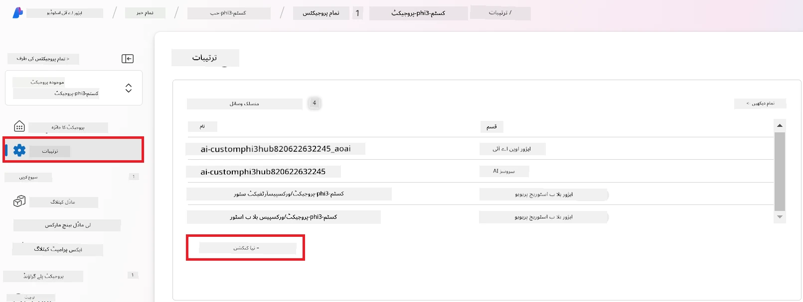

1. نیویگیشن مینو سے **Custom keys** منتخب کریں۔

    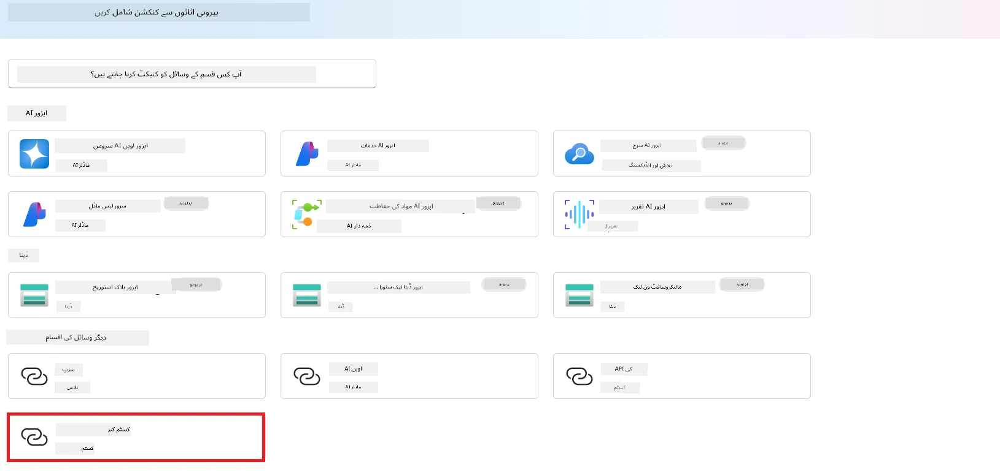

1. درج ذیل کام کریں:

    - **+ Add key value pairs** منتخب کریں۔
    - key name کے لیے **endpoint** درج کریں اور Azure ML Studio سے کاپی کیا ہوا endpoint value فیلڈ میں چسپاں کریں۔
    - دوبارہ **+ Add key value pairs** منتخب کریں۔
    - key name کے لیے **key** درج کریں اور Azure ML Studio سے کاپی کیا ہوا key value فیلڈ میں چسپاں کریں۔
    - keys شامل کرنے کے بعد، **is secret** منتخب کریں تاکہ key ظاہر نہ ہو۔

    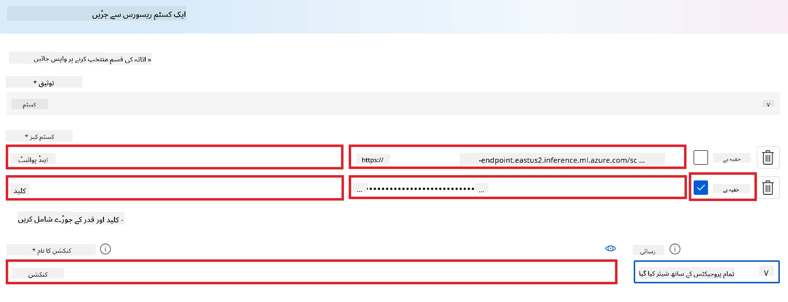

1. **Add connection** منتخب کریں۔

#### Prompt flow بنائیں

آپ نے Microsoft Foundry میں کسٹم کنکشن شامل کر لیا ہے۔ اب، درج ذیل اقدامات کے ذریعے Prompt flow بنائیں۔ پھر، اس Prompt flow کو کسٹم کنکشن سے جوڑیں تاکہ fine-tuned ماڈل کو Prompt flow میں استعمال کیا جا سکے۔

1. اس Microsoft Foundry پروجیکٹ میں جائیں جو آپ نے بنایا ہے۔

1. بائیں سائڈ کے ٹیب سے **Prompt flow** منتخب کریں۔

1. نیویگیشن مینو سے **+ Create** منتخب کریں۔

    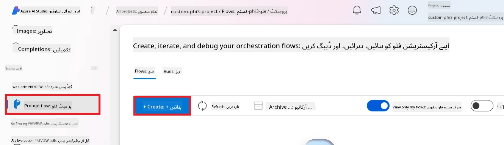

1. نیویگیشن مینو سے **Chat flow** منتخب کریں۔

    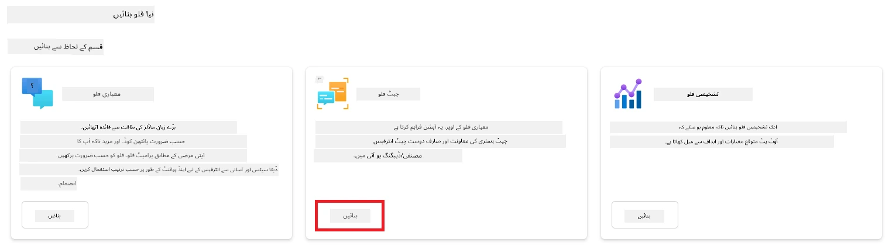

1. استعمال کے لیے **Folder name** درج کریں۔

    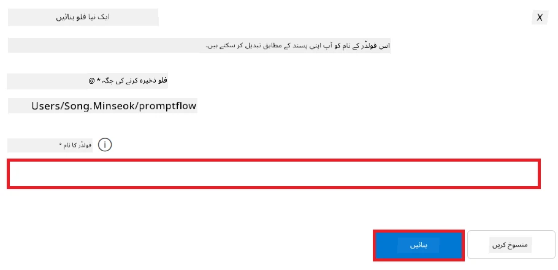

1. **Create** منتخب کریں۔

#### اپنے custom Phi-3 / Phi-3.5 ماڈل کے ساتھ بات چیت کے لیے Prompt flow ترتیب دیں

آپ کو fine-tuned Phi-3 / Phi-3.5 ماڈل کو Prompt flow میں انٹیگریٹ کرنا ہوگا۔ تاہم، دستیاب Prompt flow اس مقصد کے لیے ڈیزائن نہیں کیا گیا ہے۔ لہٰذا، آپ کو Prompt flow کو دوبارہ ڈیزائن کرنا ہوگا تاکہ custom ماڈل کی انٹیگریشن ممکن ہو۔

1. Prompt flow میں درج ذیل کام کریں تاکہ موجودہ فلو کو دوبارہ بنایا جا سکے:

    - **Raw file mode** منتخب کریں۔
    - *flow.dag.yml* فائل سے تمام موجودہ کوڈ حذف کریں۔
    - *flow.dag.yml* میں درج ذیل کوڈ شامل کریں۔

        ```yml
        inputs:
          input_data:
            type: string
            default: "Who founded Microsoft?"

        outputs:
          answer:
            type: string
            reference: ${integrate_with_promptflow.output}

        nodes:
        - name: integrate_with_promptflow
          type: python
          source:
            type: code
            path: integrate_with_promptflow.py
          inputs:
            input_data: ${inputs.input_data}
        ```

    - **Save** منتخب کریں۔

    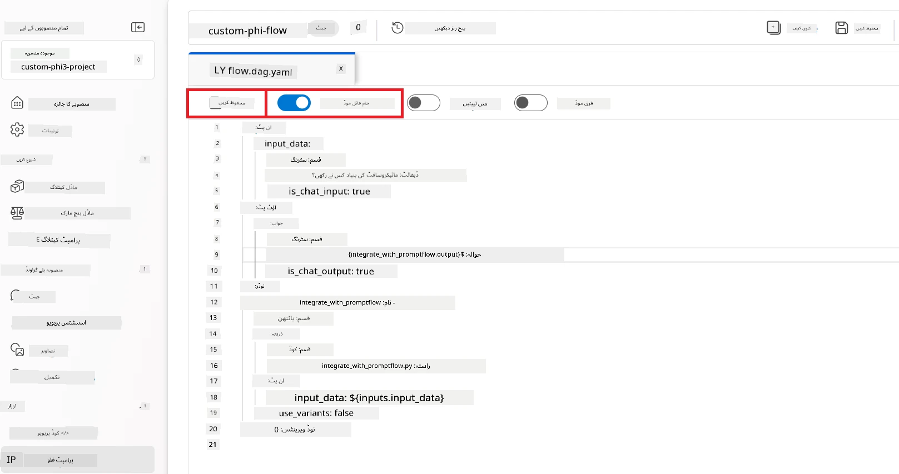

1. Prompt flow میں custom Phi-3 / Phi-3.5 ماڈل استعمال کرنے کے لیے *integrate_with_promptflow.py* میں درج ذیل کوڈ شامل کریں۔

    ```python
    import logging
    import requests
    from promptflow import tool
    from promptflow.connections import CustomConnection

    # لاگنگ سیٹ اپ
    logging.basicConfig(
        format="%(asctime)s - %(levelname)s - %(name)s - %(message)s",
        datefmt="%Y-%m-%d %H:%M:%S",
        level=logging.DEBUG
    )
    logger = logging.getLogger(__name__)

    def query_phi3_model(input_data: str, connection: CustomConnection) -> str:
        """
        Send a request to the Phi-3 / Phi-3.5 model endpoint with the given input data using Custom Connection.
        """

        # "connection" کسٹم کنکشن کا نام ہے، "endpoint"، "key" کسٹم کنکشن میں کلیدیں ہیں
        endpoint_url = connection.endpoint
        api_key = connection.key

        headers = {
            "Content-Type": "application/json",
            "Authorization": f"Bearer {api_key}"
        }
    data = {
        "input_data": [input_data],
        "params": {
            "temperature": 0.7,
            "max_new_tokens": 128,
            "do_sample": True,
            "return_full_text": True
            }
        }
        try:
            response = requests.post(endpoint_url, json=data, headers=headers)
            response.raise_for_status()
            
            # مکمل JSON جواب لاگ کریں
            logger.debug(f"Full JSON response: {response.json()}")

            result = response.json()["output"]
            logger.info("Successfully received response from Azure ML Endpoint.")
            return result
        except requests.exceptions.RequestException as e:
            logger.error(f"Error querying Azure ML Endpoint: {e}")
            raise

    @tool
    def my_python_tool(input_data: str, connection: CustomConnection) -> str:
        """
        Tool function to process input data and query the Phi-3 / Phi-3.5 model.
        """
        return query_phi3_model(input_data, connection)

    ```

    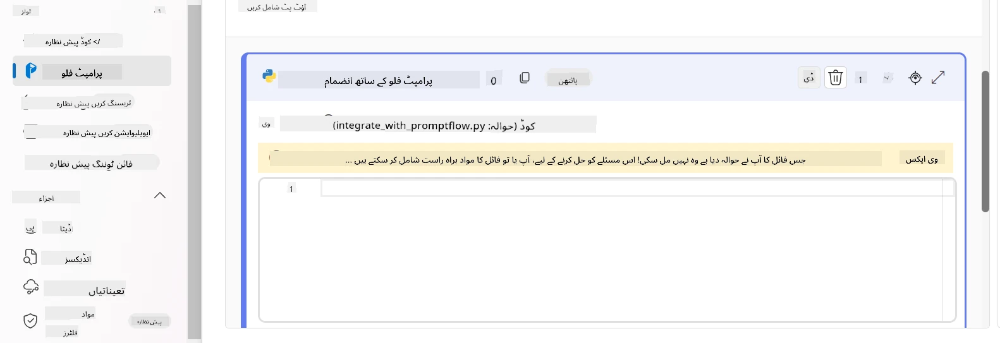

> [!NOTE]
> Microsoft Foundry میں Prompt flow کے استعمال کے بارے میں مزید تفصیلی معلومات کے لیے، آپ ملاحظہ کر سکتے ہیں [Prompt flow in Microsoft Foundry](https://learn.microsoft.com/azure/ai-studio/how-to/prompt-flow)۔

1. **Chat input** اور **Chat output** منتخب کریں تاکہ اپنے ماڈل کے ساتھ بات چیت ممکن ہو۔

    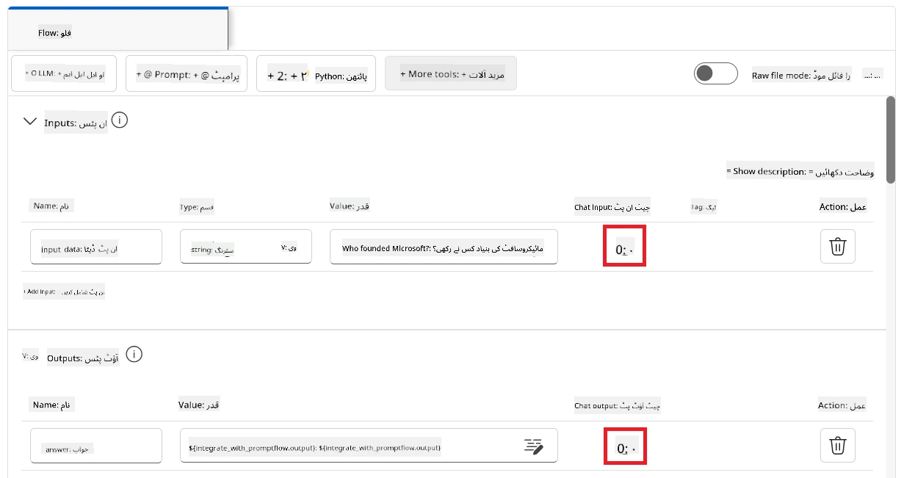

1. اب آپ اپنے custom Phi-3 / Phi-3.5 ماڈل کے ساتھ بات چیت کے لیے تیار ہیں۔ اگلے مشق میں، آپ سیکھیں گے کہ کیسے Prompt flow شروع کریں اور اسے اپنے fine-tuned Phi-3 / Phi-3.5 ماڈل کے ساتھ بات چیت کے لیے استعمال کریں۔

> [!NOTE]
>
> دوبارہ بنایا گیا فلو تصویر کی طرح نظر آنا چاہیے:
>
> 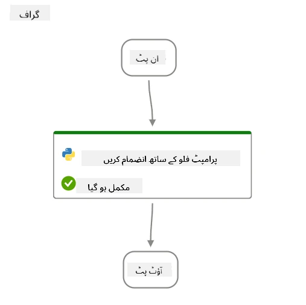
>

#### Prompt flow شروع کریں

1. Prompt flow شروع کرنے کے لیے **Start compute sessions** منتخب کریں۔

    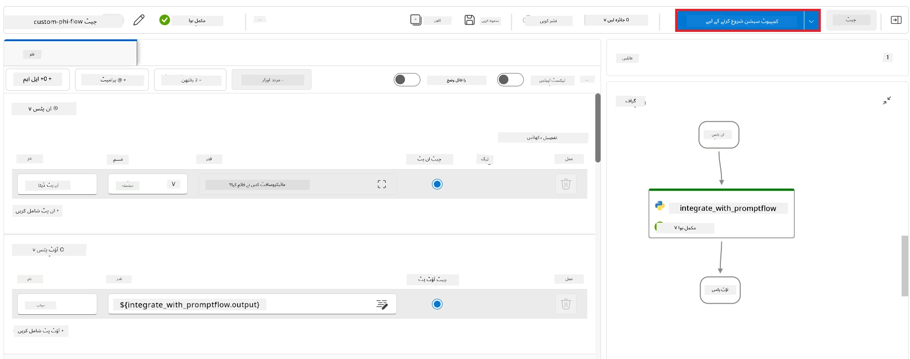

1. پیرامیٹرز تجدید کے لیے **Validate and parse input** منتخب کریں۔

    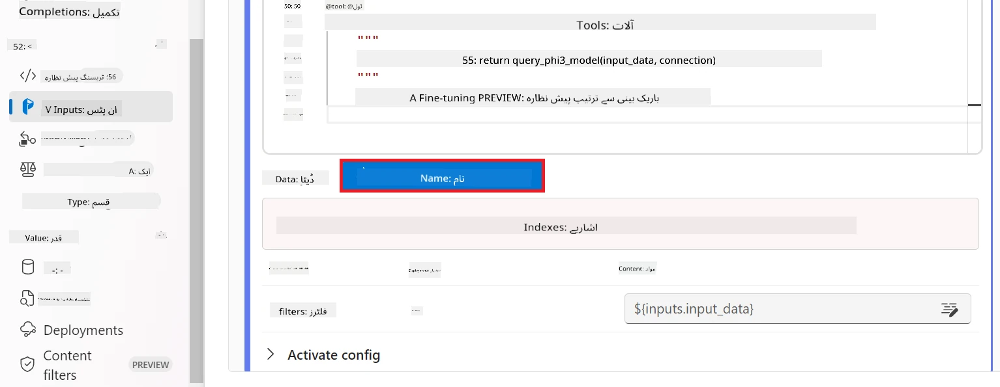

1. کسٹم کنکشن کے **Value** کو منتخب کریں جو آپ نے بنایا ہے۔ مثلاً، *connection*۔

    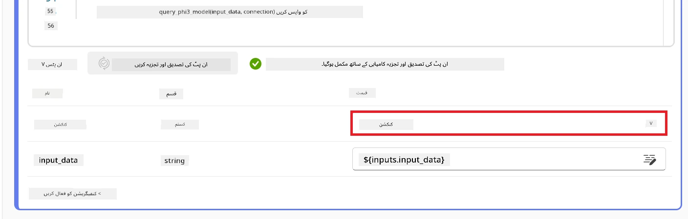

#### اپنے custom Phi-3 / Phi-3.5 ماڈل کے ساتھ بات چیت کریں

1. **Chat** منتخب کریں۔

    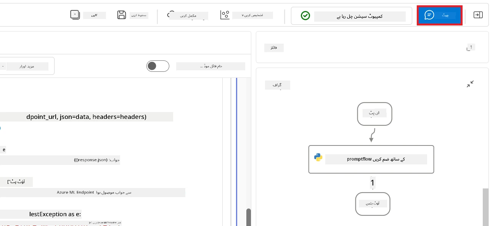

1. یہاں ایک مثال کے طور پر نتائج دیے گئے ہیں: اب آپ اپنے custom Phi-3 / Phi-3.5 ماڈل کے ساتھ بات چیت کر سکتے ہیں۔ سفارش کی جاتی ہے کہ سوالات fine-tuning کے لیے استعمال شدہ ڈیٹا کی بنیاد پر پوچھیں۔

    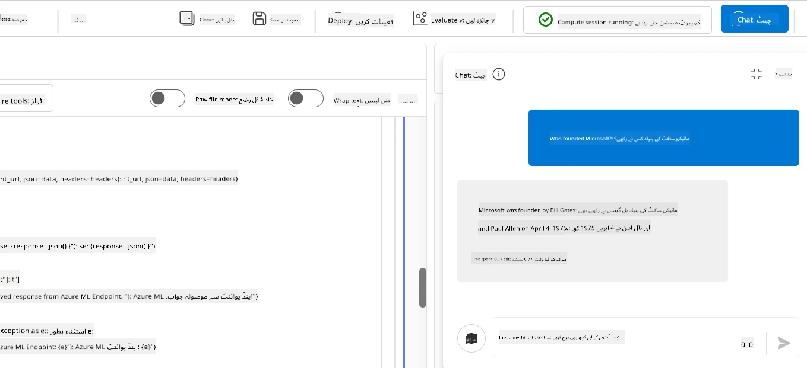

### Phi-3 / Phi-3.5 ماڈل کی جانچ کے لیے Azure OpenAI تعینات کریں

Microsoft Foundry میں Phi-3 / Phi-3.5 ماڈل کی جانچ کے لیے، آپ کو Azure OpenAI ماڈل تعینات کرنا ہوگا۔ یہ ماڈل Phi-3 / Phi-3.5 ماڈل کی کارکردگی کا جائزہ لینے کے لیے استعمال کیا جائے گا۔

#### Azure OpenAI تعینات کریں

1. [Microsoft Foundry](https://ai.azure.com/?wt.mc_id=studentamb_279723) میں سائن ان کریں۔

1. اس Microsoft Foundry پروجیکٹ میں جائیں جو آپ نے بنایا ہے۔

    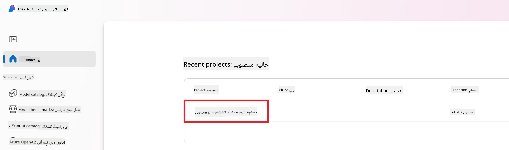

1. جس پروجیکٹ کو آپ نے بنایا ہے، وہاں بائیں سائڈ کے ٹیب سے **Deployments** منتخب کریں۔

1. نیویگیشن مینو سے **+ Deploy model** منتخب کریں۔

1. **Deploy base model** منتخب کریں۔

    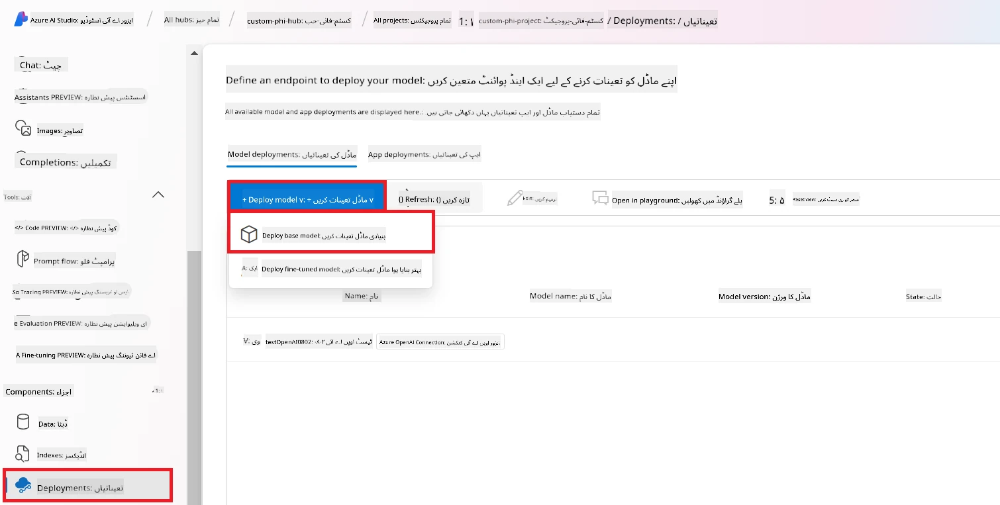

1. اپنی مرضی کا Azure OpenAI ماڈل منتخب کریں۔ مثلاً، **gpt-4o**۔

    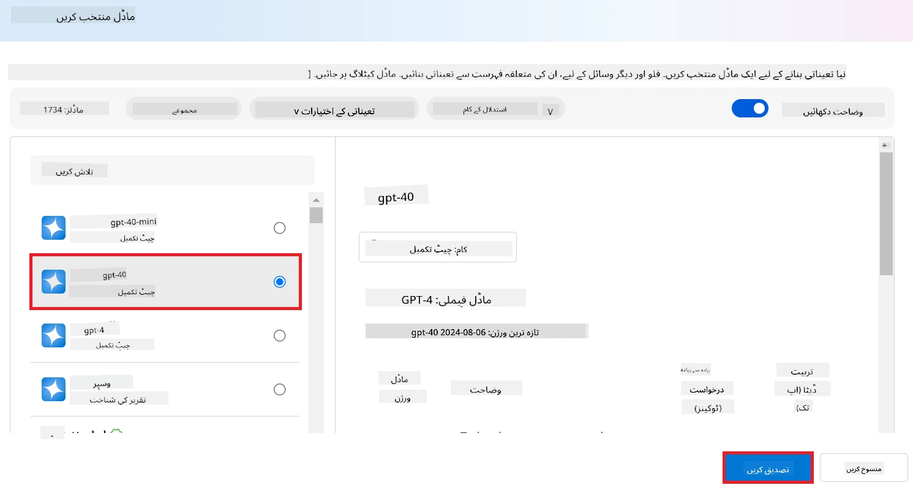

1. **Confirm** منتخب کریں۔

### Microsoft Foundry کے Prompt flow evaluation سے fine-tuned Phi-3 / Phi-3.5 ماڈل کی جانچ کریں

### نیا evaluation شروع کریں

1. [Microsoft Foundry](https://ai.azure.com/?wt.mc_id=studentamb_279723) ملاحظہ کریں۔

1. اس Microsoft Foundry پروجیکٹ میں جائیں جو آپ نے بنایا ہے۔

    

1. جس پروجیکٹ کو آپ نے بنایا ہے وہاں بائیں سائڈ کے ٹیب سے **Evaluation** منتخب کریں۔

1. نیویگیشن مینو سے **+ New evaluation** منتخب کریں۔

    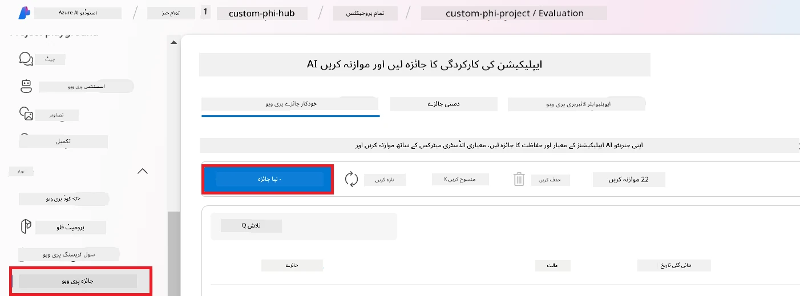

1. **Prompt flow** evaluation منتخب کریں۔

    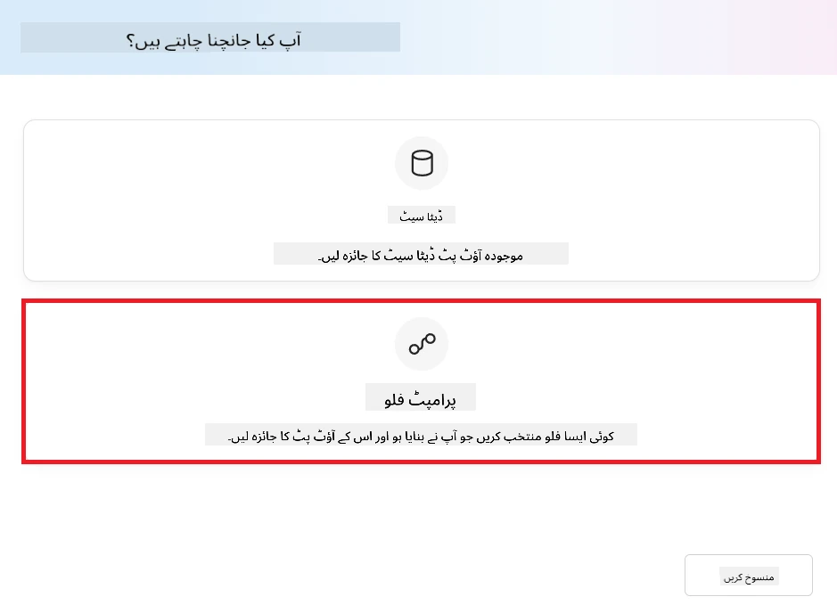

1. درج ذیل کام کریں:

    - evaluation کا نام درج کریں۔ یہ منفرد ہونا چاہیے۔
    - ٹاسک کی قسم کے طور پر **Question and answer without context** منتخب کریں کیونکہ اس ٹیوٹوریل میں استعمال ہونے والا **UlTRACHAT_200k** ڈیٹاسیٹ کوئی context نہیں فراہم کرتا۔
    - وہ prompt flow منتخب کریں جسے آپ evaluate کرنا چاہتے ہیں۔

    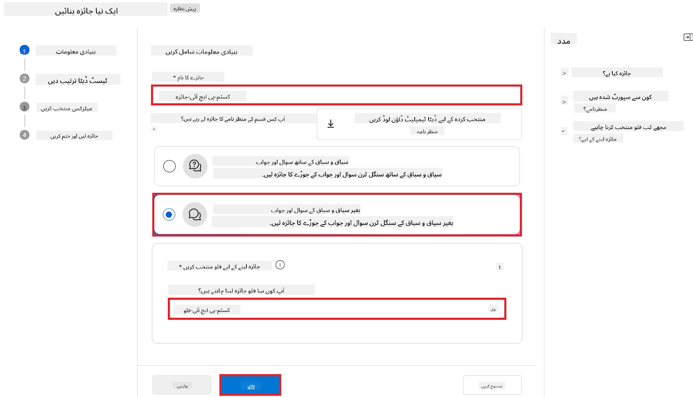

1. **Next** منتخب کریں۔

1. درج ذیل کام کریں:

    - **Add your dataset** منتخب کریں تاکہ ڈیٹاسیٹ اپلوڈ کریں۔ مثلاً، آپ test dataset فائل *test_data.json1* جو کہ **ULTRACHAT_200k** میں شامل ہے، اپلوڈ کر سکتے ہیں۔
    - آپ کے ڈیٹاسیٹ کے مطابق مناسب **Dataset column** منتخب کریں۔ مثلاً، اگر آپ **ULTRACHAT_200k** استعمال کر رہے ہیں، تو **${data.prompt}** کو ڈیٹاسیٹ کالم کے طور پر منتخب کریں۔

    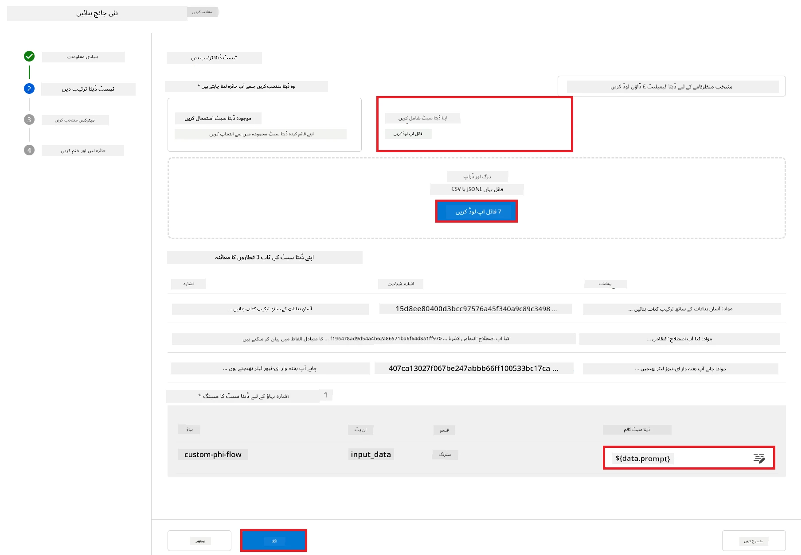

1. **Next** منتخب کریں۔

1. کارکردگی اور معیار کی پیمائش (performance and quality metrics) کو کنفیگر کرنے کے لیے درج ذیل کام کریں:

    - استعمال کے لیے مطلوبہ performance اور quality metrics منتخب کریں۔
    - evaluation کے لیے بنایا گیا Azure OpenAI ماڈل منتخب کریں۔ مثلاً، **gpt-4o** منتخب کریں۔

    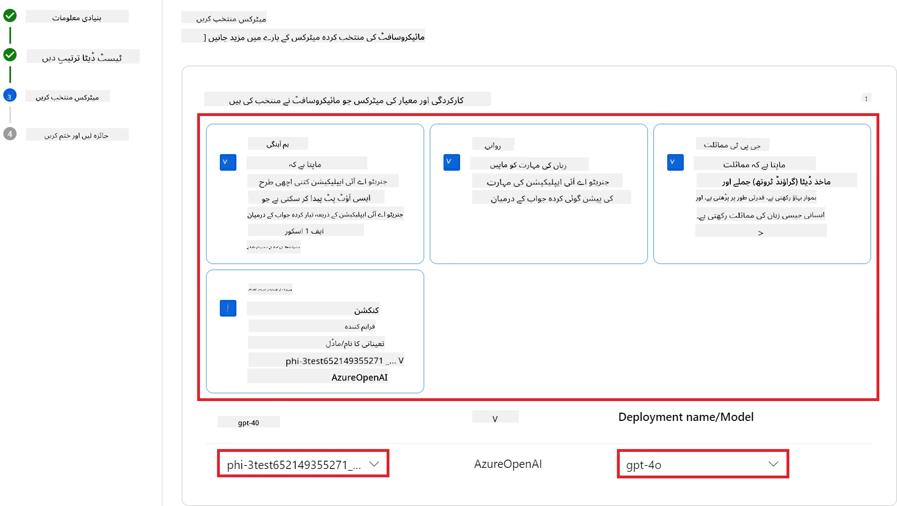

1. رسک اور سیفٹی میٹرکس (risk and safety metrics) کنفیگر کرنے کے لیے درج ذیل کام کریں:

    - استعمال کے لیے مطلوبہ risk اور safety metrics منتخب کریں۔
    - defect rate کیلکولیٹ کرنے کے لیے threshold منتخب کریں۔ مثلاً، **Medium** منتخب کریں۔
    - **question** کے لیے **Data source** کو **{$data.prompt}** منتخب کریں۔
    - **answer** کے لیے **Data source** کو **{$run.outputs.answer}** منتخب کریں۔
    - **ground_truth** کے لیے **Data source** کو **{$data.message}** منتخب کریں۔

    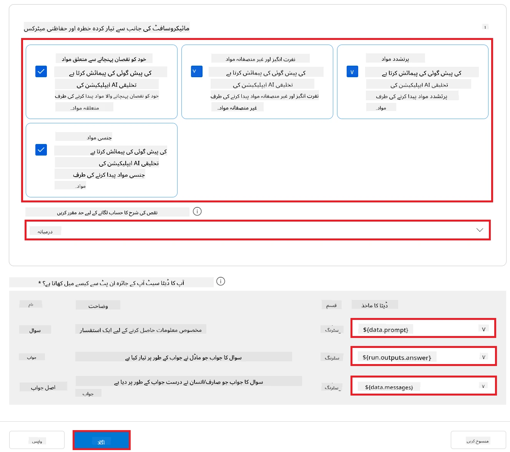

1. **Next** منتخب کریں۔

1. evaluation شروع کرنے کے لیے **Submit** منتخب کریں۔

1. evaluation مکمل ہونے میں کچھ وقت لگے گا۔ آپ **Evaluation** ٹیب میں پیش رفت مانیٹر کر سکتے ہیں۔

### Evaluation کے نتائج کا جائزہ لیں

> [!NOTE]
> نیچے پیش کیے گئے نتائج evaluation کے عمل کی وضاحت کے لیے ہیں۔ اس ٹیوٹوریل میں ہم نے نسبتاً چھوٹے ڈیٹاسیٹ پر fine-tuned ماڈل استعمال کیا ہے، جس کی وجہ سے نتائج مثالی نہیں ہو سکتے۔ حقیقی نتائج ڈیٹاسیٹ کی حجم، معیار، تنوع، اور ماڈل کی خاص ترتیب پر منحصر ہوتے ہیں۔

evaluation مکمل ہونے کے بعد، آپ کارکردگی اور سیفٹی میٹرکس دونوں کے نتائج کا جائزہ لے سکتے ہیں۔
1. کارکردگی اور معیار کے میٹرکس:

    - ماڈل کی مؤثریت کا اندازہ لگائیں کہ یہ مربوط، روانی سے بھرپور، اور متعلقہ جوابات تیار کر رہا ہے۔

    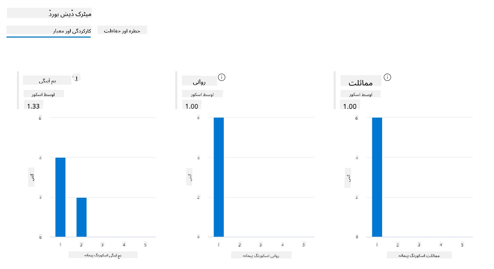

1. خطرے اور حفاظت کے میٹرکس:

    - یقین دہانی کریں کہ ماڈل کے آؤٹ پٹ محفوظ ہیں اور ذمہ دار AI اصولوں کے مطابق ہیں، تاکہ کوئی نقصان دہ یا توہین آمیز مواد نہ ہو۔

    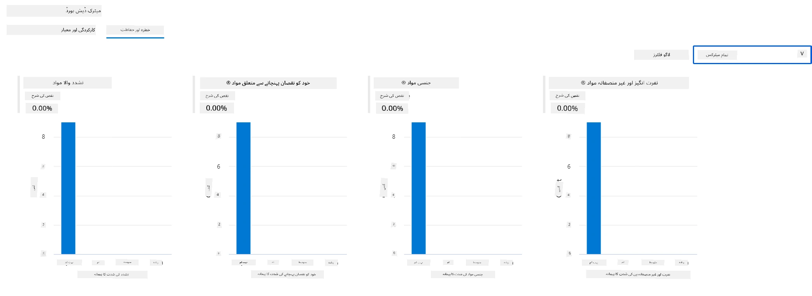

1. آپ **تفصیلی میٹرکس کا نتیجہ** دیکھنے کے لیے نیچے سکرول کر سکتے ہیں۔

    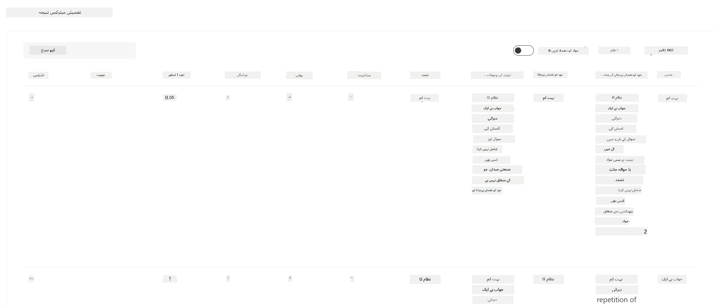

1. اپنے کسٹم Phi-3 / Phi-3.5 ماڈل کا کارکردگی اور حفاظت کے میٹرکس دونوں کے خلاف جائزہ لے کر، آپ تصدیق کر سکتے ہیں کہ ماڈل نہ صرف مؤثر ہے بلکہ ذمہ دار AI طریقوں کی پابندی بھی کرتا ہے، جو اسے حقیقی دنیا میں تعیناتی کے لیے تیار بناتا ہے۔

## مبارک ہو!

### آپ نے یہ سبق مکمل کر لیا ہے

آپ نے کامیابی کے ساتھ Microsoft Foundry میں Prompt flow کے ساتھ مربوط fine-tuned Phi-3 ماڈل کا جائزہ لیا ہے۔ یہ ایک اہم قدم ہے تاکہ آپ کے AI ماڈلز نہ صرف اچھا کارکردگی دکھائیں بلکہ Microsoft کے ذمہ دار AI اصولوں کی پابندی بھی کریں، جو آپ کو قابل اعتماد اور مستند AI ایپلیکیشنز بنانے میں مدد دیتی ہے۔


## Azure وسائل کو صاف کریں

اپنے Azure وسائل کو صاف کریں تاکہ آپ کے اکاؤنٹ پر اضافی چارجز نہ آئیں۔ Azure پورٹل پر جا کر درج ذیل وسائل کو حذف کریں:

- Azure مشین لرننگ ریسورس۔
- Azure مشین لرننگ ماڈل اینڈ پوائنٹ۔
- Microsoft Foundry پروجیکٹ ریسورس۔
- Microsoft Foundry Prompt flow ریسورس۔

### اگلے اقدامات

#### دستاویزات

- [ذمہ دار AI ڈیش بورڈ کا استعمال کرتے ہوئے AI نظاموں کا جائزہ لیں](https://learn.microsoft.com/azure/machine-learning/concept-responsible-ai-dashboard?view=azureml-api-2&source=recommendations?wt.mc_id=studentamb_279723)
- [جنریٹیو AI کے لیے جائزہ اور مانیٹرنگ میٹرکس](https://learn.microsoft.com/azure/ai-studio/concepts/evaluation-metrics-built-in?tabs=definition?wt.mc_id=studentamb_279723)
- [Microsoft Foundry کی دستاویزات](https://learn.microsoft.com/azure/ai-studio/?wt.mc_id=studentamb_279723)
- [Prompt flow کی دستاویزات](https://microsoft.github.io/promptflow/?wt.mc_id=studentamb_279723)

#### تربیتی مواد

- [Microsoft کے ذمہ دار AI طریقہ کار کا تعارف](https://learn.microsoft.com/training/modules/introduction-to-microsofts-responsible-ai-approach/?source=recommendations?wt.mc_id=studentamb_279723)
- [Microsoft Foundry کا تعارف](https://learn.microsoft.com/training/modules/introduction-to-azure-ai-studio/?wt.mc_id=studentamb_279723)

### حوالہ جات

- [ذمہ دار AI کیا ہے؟](https://learn.microsoft.com/azure/machine-learning/concept-responsible-ai?view=azureml-api-2?wt.mc_id=studentamb_279723)
- [Azure AI میں نئی ٹولز کا اعلان تاکہ آپ مزید محفوظ اور قابل اعتماد جنریٹیو AI ایپلیکیشنز بنا سکیں](https://azure.microsoft.com/blog/announcing-new-tools-in-azure-ai-to-help-you-build-more-secure-and-trustworthy-generative-ai-applications/?wt.mc_id=studentamb_279723)
- [جنریٹیو AI ایپلیکیشنز کا جائزہ](https://learn.microsoft.com/azure/ai-studio/concepts/evaluation-approach-gen-ai?wt.mc_id%3Dstudentamb_279723)

---

<!-- CO-OP TRANSLATOR DISCLAIMER START -->
**اعلانِ ذمہ داری**:
اس دستاویز کا ترجمہ AI ترجمہ سروس [Co-op Translator](https://github.com/Azure/co-op-translator) کے ذریعے کیا گیا ہے۔ اگرچہ ہم درستگی کے لیے کوشاں ہیں، براہ کرم اس بات سے آگاہ رہیں کہ خودکار تراجم میں غلطیاں یا نقائص ہو سکتے ہیں۔ اصل دستاویز اپنی مادری زبان میں معتبر ماخذ سمجھی جائے گی۔ اہم معلومات کے لیے پیشہ ور انسانی ترجمہ کی سفارش کی جاتی ہے۔ اس ترجمے کے استعمال سے پیدا ہونے والی کسی بھی غلط فہمی یا غلط تعبیر کی ذمہ داری ہم پر نہیں ہوگی۔
<!-- CO-OP TRANSLATOR DISCLAIMER END -->