<!--
CO_OP_TRANSLATOR_METADATA:
{
  "original_hash": "80a853c08e4ee25ef9b4bfcedd8990da",
  "translation_date": "2025-07-16T23:15:10+00:00",
  "source_file": "md/02.Application/01.TextAndChat/Phi3/E2E_Phi-3-Evaluation_AIFoundry.md",
  "language_code": "ur"
}
-->
# Azure AI Foundry میں Microsoft کے Responsible AI اصولوں پر توجہ دیتے ہوئے Fine-tuned Phi-3 / Phi-3.5 ماڈل کا جائزہ لیں

یہ end-to-end (E2E) نمونہ Microsoft Tech Community کی گائیڈ "[Evaluate Fine-tuned Phi-3 / 3.5 Models in Azure AI Foundry Focusing on Microsoft's Responsible AI](https://techcommunity.microsoft.com/blog/educatordeveloperblog/evaluate-fine-tuned-phi-3--3-5-models-in-azure-ai-studio-focusing-on-microsofts-/4227850?WT.mc_id=aiml-137032-kinfeylo)" پر مبنی ہے۔

## جائزہ

### آپ Azure AI Foundry میں fine-tuned Phi-3 / Phi-3.5 ماڈل کی حفاظت اور کارکردگی کا کیسے جائزہ لے سکتے ہیں؟

ماڈل کی fine-tuning کبھی کبھار غیر متوقع یا ناپسندیدہ جوابات کا باعث بن سکتی ہے۔ اس بات کو یقینی بنانے کے لیے کہ ماڈل محفوظ اور مؤثر رہے، یہ ضروری ہے کہ ماڈل کی ممکنہ طور پر نقصان دہ مواد پیدا کرنے کی صلاحیت اور درست، متعلقہ، اور مربوط جوابات دینے کی قابلیت کا جائزہ لیا جائے۔ اس ٹیوٹوریل میں، آپ سیکھیں گے کہ Azure AI Foundry میں Prompt flow کے ساتھ مربوط fine-tuned Phi-3 / Phi-3.5 ماڈل کی حفاظت اور کارکردگی کا جائزہ کیسے لیا جائے۔

یہاں Azure AI Foundry کا جائزہ لینے کا عمل ہے۔

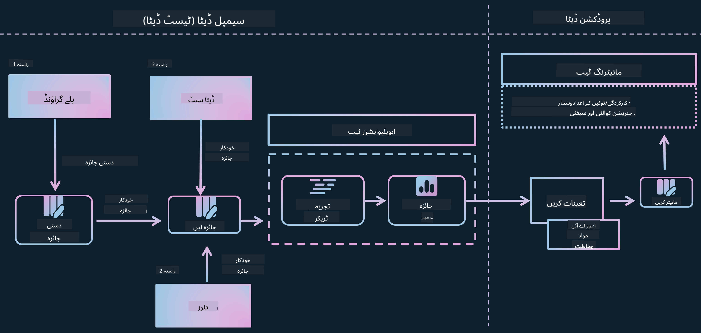

*تصویر کا ماخذ: [Evaluation of generative AI applications](https://learn.microsoft.com/azure/ai-studio/concepts/evaluation-approach-gen-ai?wt.mc_id%3Dstudentamb_279723)*

> [!NOTE]
>
> Phi-3 / Phi-3.5 کے بارے میں مزید تفصیلی معلومات اور اضافی وسائل کے لیے براہ کرم [Phi-3CookBook](https://github.com/microsoft/Phi-3CookBook?wt.mc_id=studentamb_279723) ملاحظہ کریں۔

### ضروریات

- [Python](https://www.python.org/downloads)
- [Azure subscription](https://azure.microsoft.com/free?wt.mc_id=studentamb_279723)
- [Visual Studio Code](https://code.visualstudio.com)
- Fine-tuned Phi-3 / Phi-3.5 ماڈل

### فہرست مضامین

1. [**منظر نامہ 1: Azure AI Foundry کے Prompt flow جائزہ کا تعارف**](../../../../../../md/02.Application/01.TextAndChat/Phi3)

    - [حفاظتی جائزہ کا تعارف](../../../../../../md/02.Application/01.TextAndChat/Phi3)
    - [کارکردگی کے جائزے کا تعارف](../../../../../../md/02.Application/01.TextAndChat/Phi3)

1. [**منظر نامہ 2: Azure AI Foundry میں Phi-3 / Phi-3.5 ماڈل کا جائزہ**](../../../../../../md/02.Application/01.TextAndChat/Phi3)

    - [شروع کرنے سے پہلے](../../../../../../md/02.Application/01.TextAndChat/Phi3)
    - [Phi-3 / Phi-3.5 ماڈل کا جائزہ لینے کے لیے Azure OpenAI کو تعینات کریں](../../../../../../md/02.Application/01.TextAndChat/Phi3)
    - [Azure AI Foundry کے Prompt flow جائزہ کا استعمال کرتے ہوئے fine-tuned Phi-3 / Phi-3.5 ماڈل کا جائزہ لیں](../../../../../../md/02.Application/01.TextAndChat/Phi3)

1. [مبارک ہو!](../../../../../../md/02.Application/01.TextAndChat/Phi3)

## **منظر نامہ 1: Azure AI Foundry کے Prompt flow جائزہ کا تعارف**

### حفاظتی جائزہ کا تعارف

یہ یقینی بنانے کے لیے کہ آپ کا AI ماڈل اخلاقی اور محفوظ ہے، Microsoft کے Responsible AI اصولوں کے مطابق اس کا جائزہ لینا بہت ضروری ہے۔ Azure AI Foundry میں، حفاظتی جائزے آپ کو آپ کے ماڈل کی jailbreak حملوں کے خلاف کمزوری اور نقصان دہ مواد پیدا کرنے کی صلاحیت کا جائزہ لینے کی اجازت دیتے ہیں، جو کہ ان اصولوں کے عین مطابق ہے۔


*تصویر کا ماخذ: [Evaluation of generative AI applications](https://learn.microsoft.com/azure/ai-studio/concepts/evaluation-approach-gen-ai?wt.mc_id%3Dstudentamb_279723)*

#### Microsoft کے Responsible AI اصول

تکنیکی مراحل شروع کرنے سے پہلے، Microsoft کے Responsible AI اصولوں کو سمجھنا ضروری ہے، جو AI سسٹمز کی ذمہ دارانہ ترقی، تعیناتی، اور آپریشن کے لیے ایک اخلاقی فریم ورک ہے۔ یہ اصول AI سسٹمز کے ذمہ دارانہ ڈیزائن، ترقی، اور تعیناتی کی رہنمائی کرتے ہیں تاکہ AI ٹیکنالوجیز کو منصفانہ، شفاف، اور شامل کرنے والے انداز میں بنایا جا سکے۔ یہ اصول AI ماڈلز کی حفاظت کے جائزے کی بنیاد ہیں۔

Microsoft کے Responsible AI اصول درج ذیل ہیں:

- **انصاف اور شمولیت**: AI سسٹمز کو ہر ایک کے ساتھ منصفانہ سلوک کرنا چاہیے اور ایک جیسے حالات میں موجود گروپوں کو مختلف طریقوں سے متاثر نہیں کرنا چاہیے۔ مثال کے طور پر، جب AI سسٹمز طبی علاج، قرض کی درخواستوں، یا ملازمت کے حوالے سے رہنمائی فراہم کرتے ہیں، تو انہیں ہر اس شخص کو ایک جیسی سفارشات دینی چاہئیں جس کی علامات، مالی حالات، یا پیشہ ورانہ قابلیت ایک جیسی ہو۔

- **اعتماد اور حفاظت**: اعتماد قائم کرنے کے لیے، یہ ضروری ہے کہ AI سسٹمز قابل اعتماد، محفوظ، اور مستقل طور پر کام کریں۔ یہ سسٹمز اسی طرح کام کرنے کے قابل ہونے چاہئیں جس طرح انہیں اصل میں ڈیزائن کیا گیا تھا، غیر متوقع حالات میں محفوظ ردعمل دیں، اور نقصان دہ چالاکیوں کے خلاف مزاحمت کریں۔ ان کا رویہ اور وہ مختلف حالات جنہیں وہ سنبھال سکتے ہیں، ان حالات کی عکاسی کرتے ہیں جن کی توقع ڈویلپرز نے ڈیزائن اور ٹیسٹنگ کے دوران کی تھی۔

- **شفافیت**: جب AI سسٹمز ایسے فیصلوں میں مدد دیتے ہیں جن کے لوگوں کی زندگیوں پر گہرا اثر ہوتا ہے، تو یہ ضروری ہے کہ لوگ سمجھ سکیں کہ وہ فیصلے کیسے کیے گئے۔ مثال کے طور پر، ایک بینک AI سسٹم استعمال کر سکتا ہے یہ فیصلہ کرنے کے لیے کہ آیا کوئی شخص کریڈٹ کے قابل ہے یا نہیں۔ ایک کمپنی AI سسٹم استعمال کر سکتی ہے یہ تعین کرنے کے لیے کہ سب سے زیادہ اہل امیدوار کون ہیں۔

- **رازداری اور سیکیورٹی**: جیسے جیسے AI زیادہ عام ہوتا جا رہا ہے، ذاتی اور کاروباری معلومات کی حفاظت اور رازداری کی اہمیت اور پیچیدگی بڑھ رہی ہے۔ AI کے ساتھ، رازداری اور ڈیٹا سیکیورٹی پر خاص توجہ دینا ضروری ہے کیونکہ AI سسٹمز کو لوگوں کے بارے میں درست اور معلوماتی پیش گوئیاں اور فیصلے کرنے کے لیے ڈیٹا تک رسائی کی ضرورت ہوتی ہے۔

- **ذمہ داری**: AI سسٹمز کو ڈیزائن اور تعینات کرنے والے افراد کو اپنے سسٹمز کے کام کرنے کے طریقے کے لیے ذمہ دار ہونا چاہیے۔ تنظیموں کو چاہیے کہ وہ صنعت کے معیارات سے مدد لے کر ذمہ داری کے اصول وضع کریں۔ یہ اصول اس بات کو یقینی بنا سکتے ہیں کہ AI سسٹمز کسی بھی ایسے فیصلے کے آخری اختیار نہ ہوں جو لوگوں کی زندگیوں کو متاثر کرتا ہو۔ یہ اس بات کو بھی یقینی بنا سکتے ہیں کہ انسانوں کے پاس بصیرت اور کنٹرول برقرار رہے، خاص طور پر انتہائی خود مختار AI سسٹمز پر۔

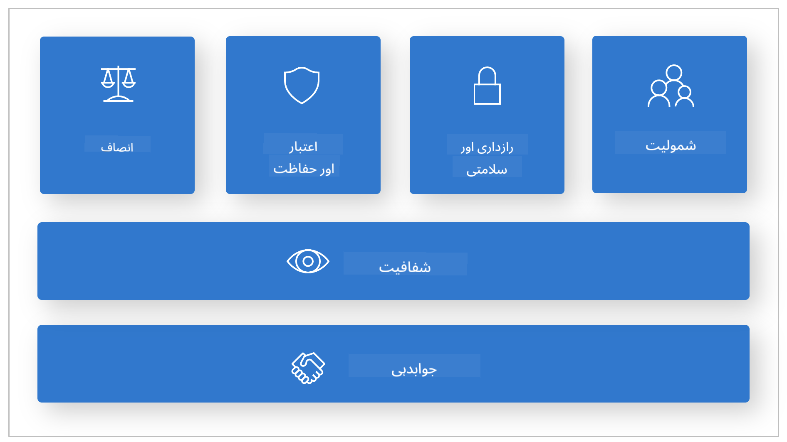

*تصویر کا ماخذ: [What is Responsible AI?](https://learn.microsoft.com/azure/machine-learning/concept-responsible-ai?view=azureml-api-2&viewFallbackFrom=azureml-api-2%253fwt.mc_id%3Dstudentamb_279723)*

> [!NOTE]
> Microsoft کے Responsible AI اصولوں کے بارے میں مزید جاننے کے لیے، [What is Responsible AI?](https://learn.microsoft.com/azure/machine-learning/concept-responsible-ai?view=azureml-api-2?wt.mc_id=studentamb_279723) ملاحظہ کریں۔

#### حفاظتی میٹرکس

اس ٹیوٹوریل میں، آپ Azure AI Foundry کے حفاظتی میٹرکس کا استعمال کرتے ہوئے fine-tuned Phi-3 ماڈل کی حفاظت کا جائزہ لیں گے۔ یہ میٹرکس ماڈل کی نقصان دہ مواد پیدا کرنے کی صلاحیت اور jailbreak حملوں کے خلاف کمزوری کا اندازہ لگانے میں مدد کرتے ہیں۔ حفاظتی میٹرکس میں شامل ہیں:

- **خود کو نقصان پہنچانے سے متعلق مواد**: یہ جائزہ لیتا ہے کہ آیا ماڈل خود کو نقصان پہنچانے سے متعلق مواد پیدا کرنے کا رجحان رکھتا ہے۔
- **نفرت انگیز اور غیر منصفانہ مواد**: یہ جائزہ لیتا ہے کہ آیا ماڈل نفرت انگیز یا غیر منصفانہ مواد پیدا کرنے کا رجحان رکھتا ہے۔
- **تشدد پر مبنی مواد**: یہ جائزہ لیتا ہے کہ آیا ماڈل تشدد پر مبنی مواد پیدا کرنے کا رجحان رکھتا ہے۔
- **جنسی مواد**: یہ جائزہ لیتا ہے کہ آیا ماڈل نامناسب جنسی مواد پیدا کرنے کا رجحان رکھتا ہے۔

ان پہلوؤں کا جائزہ لینے سے یہ یقینی بنتا ہے کہ AI ماڈل نقصان دہ یا توہین آمیز مواد پیدا نہ کرے، اور یہ معاشرتی اقدار اور ضابطہ کار کے معیار کے مطابق ہو۔


### کارکردگی کے جائزے کا تعارف

یہ یقینی بنانے کے لیے کہ آپ کا AI ماڈل متوقع کارکردگی دکھا رہا ہے، اس کی کارکردگی کا جائزہ لینا ضروری ہے۔ Azure AI Foundry میں، کارکردگی کے جائزے آپ کو ماڈل کی درست، متعلقہ، اور مربوط جوابات پیدا کرنے کی صلاحیت کا اندازہ لگانے کی اجازت دیتے ہیں۔


*تصویر کا ماخذ: [Evaluation of generative AI applications](https://learn.microsoft.com/azure/ai-studio/concepts/evaluation-approach-gen-ai?wt.mc_id%3Dstudentamb_279723)*

#### کارکردگی کے میٹرکس

اس ٹیوٹوریل میں، آپ Azure AI Foundry کے کارکردگی میٹرکس کا استعمال کرتے ہوئے fine-tuned Phi-3 / Phi-3.5 ماڈل کی کارکردگی کا جائزہ لیں گے۔ یہ میٹرکس ماڈل کی درست، متعلقہ، اور مربوط جوابات پیدا کرنے کی صلاحیت کا اندازہ لگانے میں مدد کرتے ہیں۔ کارکردگی کے میٹرکس میں شامل ہیں:

- **Groundedness**: یہ جائزہ لیتا ہے کہ پیدا کردہ جوابات کتنے حد تک ان پٹ ماخذ کی معلومات کے مطابق ہیں۔
- **Relevance**: پیدا کردہ جوابات کی دیے گئے سوالات سے مطابقت کا جائزہ لیتا ہے۔
- **Coherence**: یہ اندازہ لگاتا ہے کہ پیدا کردہ متن کتنے ہموار انداز میں بہتا ہے، قدرتی پڑھائی دیتا ہے، اور انسانی زبان جیسا محسوس ہوتا ہے۔
- **Fluency**: پیدا کردہ متن کی زبان کی مہارت کا جائزہ لیتا ہے۔
- **GPT Similarity**: پیدا کردہ جواب کو ground truth کے ساتھ مماثلت کے لیے موازنہ کرتا ہے۔
- **F1 Score**: پیدا کردہ جواب اور ماخذ ڈیٹا کے درمیان مشترکہ الفاظ کا تناسب حساب کرتا ہے۔

یہ میٹرکس ماڈل کی درست، متعلقہ، اور مربوط جوابات پیدا کرنے کی صلاحیت کا جائزہ لینے میں مدد کرتے ہیں۔

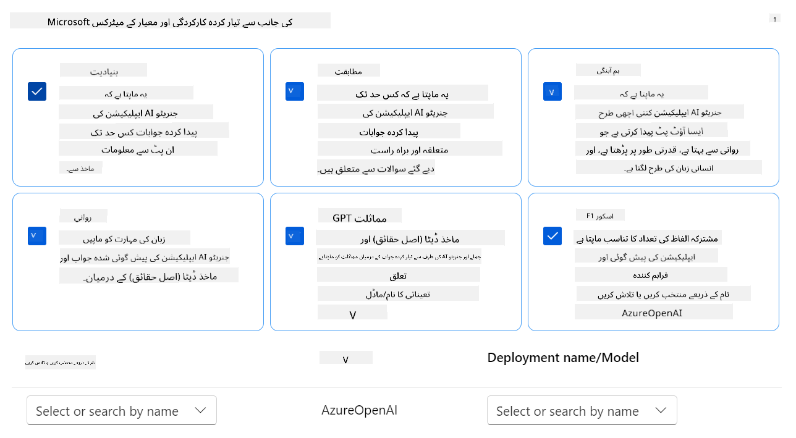

## **منظر نامہ 2: Azure AI Foundry میں Phi-3 / Phi-3.5 ماڈل کا جائزہ**

### شروع کرنے سے پہلے

یہ ٹیوٹوریل پچھلے بلاگ پوسٹس "[Fine-Tune and Integrate Custom Phi-3 Models with Prompt Flow: Step-by-Step Guide](https://techcommunity.microsoft.com/t5/educator-developer-blog/fine-tune-and-integrate-custom-phi-3-models-with-prompt-flow/ba-p/4178612?wt.mc_id=studentamb_279723)" اور "[Fine-Tune and Integrate Custom Phi-3 Models with Prompt Flow in Azure AI Foundry](https://techcommunity.microsoft.com/t5/educator-developer-blog/fine-tune-and-integrate-custom-phi-3-models-with-prompt-flow-in/ba-p/4191726?wt.mc_id=studentamb_279723)" کا تسلسل ہے۔ ان پوسٹس میں، ہم نے Azure AI Foundry میں Phi-3 / Phi-3.5 ماڈل کی fine-tuning اور اسے Prompt flow کے ساتھ مربوط کرنے کے عمل کا جائزہ لیا تھا۔

اس ٹیوٹوریل میں، آپ Azure AI Foundry میں ایک evaluator کے طور پر Azure OpenAI ماڈل کو تعینات کریں گے اور اسے اپنے fine-tuned Phi-3 / Phi-3.5 ماڈل کا جائزہ لینے کے لیے استعمال کریں گے۔

اس ٹیوٹوریل کو شروع کرنے سے پہلے، یقینی بنائیں کہ آپ کے پاس پچھلے ٹیوٹوریلز میں بیان کردہ درج ذیل ضروریات موجود ہیں:

1. fine-tuned Phi-3 / Phi-3.5 ماڈل کا جائزہ لینے کے لیے تیار کردہ ڈیٹا سیٹ۔
1. ایک Phi-3 / Phi-3.5 ماڈل جو fine-tuned ہو چکا ہو اور Azure Machine Learning پر تعینات کیا گیا ہو۔
1. Azure AI Foundry میں آپ کے fine-tuned Phi-3 / Phi-3.5 ماڈل کے ساتھ مربوط Prompt flow۔

> [!NOTE]
> آپ *test_data.jsonl* فائل استعمال کریں گے، جو پچھلے بلاگ پوسٹس میں ڈاؤن لوڈ کیے گئے **ULTRACHAT_200k** ڈیٹا سیٹ کے data فولڈر میں موجود ہے، بطور ڈیٹا سیٹ fine-tuned Phi-3 / Phi-3.5 ماڈل کا جائزہ لینے کے لیے۔

#### Azure AI Foundry میں Prompt flow کے ساتھ custom Phi-3 / Phi-3.5 ماڈل کو مربوط کریں (Code first approach)
> [!NOTE]
> اگر آپ نے "[Fine-Tune and Integrate Custom Phi-3 Models with Prompt Flow in Azure AI Foundry](https://techcommunity.microsoft.com/t5/educator-developer-blog/fine-tune-and-integrate-custom-phi-3-models-with-prompt-flow-in/ba-p/4191726?wt.mc_id=studentamb_279723)" میں بیان کردہ لو-کوڈ طریقہ اپنایا ہے، تو آپ اس مشق کو چھوڑ کر اگلی مشق پر جا سکتے ہیں۔
> تاہم، اگر آپ نے "[Fine-Tune and Integrate Custom Phi-3 Models with Prompt Flow: Step-by-Step Guide](https://techcommunity.microsoft.com/t5/educator-developer-blog/fine-tune-and-integrate-custom-phi-3-models-with-prompt-flow/ba-p/4178612?wt.mc_id=studentamb_279723)" میں بیان کردہ کوڈ-فرسٹ طریقہ اپنایا ہے تاکہ اپنے Phi-3 / Phi-3.5 ماڈل کو فائن ٹیون اور ڈیپلائے کریں، تو اپنے ماڈل کو Prompt flow سے جوڑنے کا عمل تھوڑا مختلف ہوگا۔ آپ اس مشق میں اس عمل کو سیکھیں گے۔
آگے بڑھنے کے لیے، آپ کو اپنے fine-tuned Phi-3 / Phi-3.5 ماڈل کو Azure AI Foundry میں Prompt flow کے ساتھ مربوط کرنا ہوگا۔

#### Azure AI Foundry Hub بنائیں

پروجیکٹ بنانے سے پہلے آپ کو ایک Hub بنانا ہوگا۔ Hub ایک Resource Group کی طرح کام کرتا ہے، جو آپ کو Azure AI Foundry میں متعدد پروجیکٹس کو منظم اور ترتیب دینے کی سہولت دیتا ہے۔

1. [Azure AI Foundry](https://ai.azure.com/?wt.mc_id=studentamb_279723) میں سائن ان کریں۔

1. بائیں طرف کے ٹیب سے **All hubs** منتخب کریں۔

1. نیویگیشن مینو سے **+ New hub** منتخب کریں۔

    

1. درج ذیل کام کریں:

    - **Hub name** درج کریں۔ یہ منفرد ہونا چاہیے۔
    - اپنی Azure **Subscription** منتخب کریں۔
    - استعمال کے لیے **Resource group** منتخب کریں (ضرورت ہو تو نیا بنائیں)۔
    - اپنی پسند کی **Location** منتخب کریں۔
    - استعمال کے لیے **Connect Azure AI Services** منتخب کریں (ضرورت ہو تو نیا بنائیں)۔
    - **Connect Azure AI Search** کے لیے **Skip connecting** منتخب کریں۔

    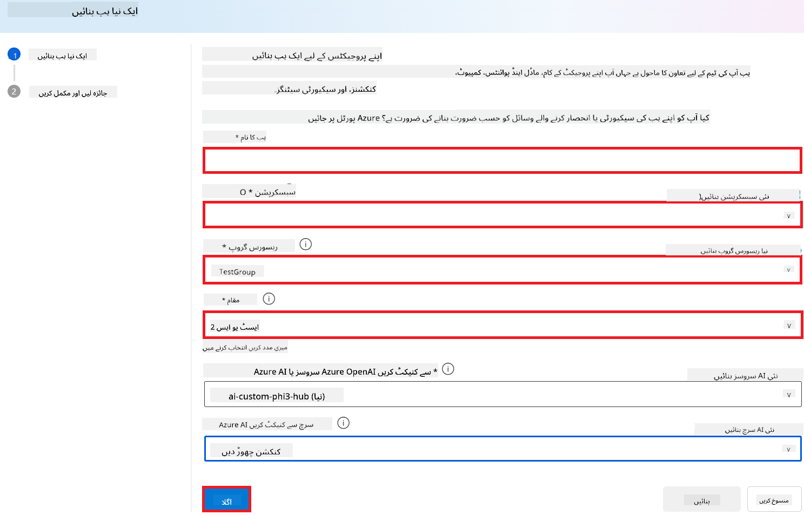

1. **Next** منتخب کریں۔

#### Azure AI Foundry پروجیکٹ بنائیں

1. جس Hub کو آپ نے بنایا ہے، اس میں بائیں طرف کے ٹیب سے **All projects** منتخب کریں۔

1. نیویگیشن مینو سے **+ New project** منتخب کریں۔

    

1. **Project name** درج کریں۔ یہ منفرد ہونا چاہیے۔

    

1. **Create a project** منتخب کریں۔

#### fine-tuned Phi-3 / Phi-3.5 ماڈل کے لیے کسٹم کنکشن شامل کریں

اپنے کسٹم Phi-3 / Phi-3.5 ماڈل کو Prompt flow کے ساتھ مربوط کرنے کے لیے، آپ کو ماڈل کا endpoint اور key کسٹم کنکشن میں محفوظ کرنا ہوگا۔ اس ترتیب سے آپ کے ماڈل تک Prompt flow میں رسائی ممکن ہوگی۔

#### fine-tuned Phi-3 / Phi-3.5 ماڈل کی api key اور endpoint uri سیٹ کریں

1. [Azure ML Studio](https://ml.azure.com/home?wt.mc_id=studentamb_279723) پر جائیں۔

1. اپنے بنائے ہوئے Azure Machine learning workspace پر جائیں۔

1. بائیں طرف کے ٹیب سے **Endpoints** منتخب کریں۔

    

1. اپنا بنایا ہوا endpoint منتخب کریں۔

    

1. نیویگیشن مینو سے **Consume** منتخب کریں۔

1. اپنی **REST endpoint** اور **Primary key** کو کاپی کریں۔

    

#### کسٹم کنکشن شامل کریں

1. [Azure AI Foundry](https://ai.azure.com/?wt.mc_id=studentamb_279723) پر جائیں۔

1. اپنے بنائے ہوئے Azure AI Foundry پروجیکٹ پر جائیں۔

1. پروجیکٹ میں بائیں طرف کے ٹیب سے **Settings** منتخب کریں۔

1. **+ New connection** منتخب کریں۔

    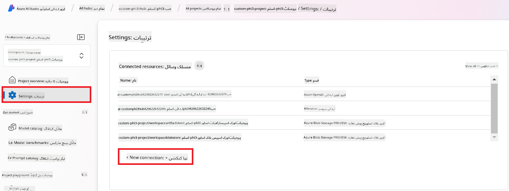

1. نیویگیشن مینو سے **Custom keys** منتخب کریں۔

    

1. درج ذیل کام کریں:

    - **+ Add key value pairs** منتخب کریں۔
    - key name کے لیے **endpoint** لکھیں اور Azure ML Studio سے کاپی کیا ہوا endpoint value فیلڈ میں پیسٹ کریں۔
    - دوبارہ **+ Add key value pairs** منتخب کریں۔
    - key name کے لیے **key** لکھیں اور Azure ML Studio سے کاپی کیا ہوا key value فیلڈ میں پیسٹ کریں۔
    - keys شامل کرنے کے بعد، **is secret** منتخب کریں تاکہ key ظاہر نہ ہو۔

    

1. **Add connection** منتخب کریں۔

#### Prompt flow بنائیں

آپ نے Azure AI Foundry میں کسٹم کنکشن شامل کر لیا ہے۔ اب، درج ذیل مراحل کے ذریعے Prompt flow بنائیں۔ پھر، آپ اس Prompt flow کو کسٹم کنکشن سے جوڑ کر fine-tuned ماڈل کو Prompt flow میں استعمال کر سکیں گے۔

1. اپنے بنائے ہوئے Azure AI Foundry پروجیکٹ پر جائیں۔

1. بائیں طرف کے ٹیب سے **Prompt flow** منتخب کریں۔

1. نیویگیشن مینو سے **+ Create** منتخب کریں۔

    

1. نیویگیشن مینو سے **Chat flow** منتخب کریں۔

    

1. استعمال کے لیے **Folder name** درج کریں۔

    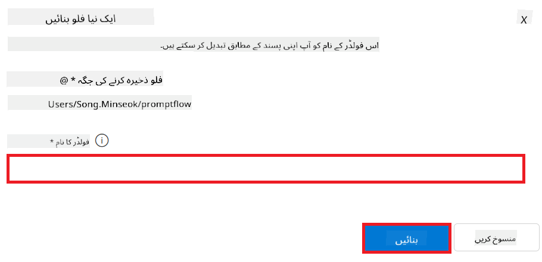

1. **Create** منتخب کریں۔

#### اپنے کسٹم Phi-3 / Phi-3.5 ماڈل کے ساتھ چیٹ کرنے کے لیے Prompt flow سیٹ اپ کریں

آپ کو fine-tuned Phi-3 / Phi-3.5 ماڈل کو Prompt flow میں مربوط کرنا ہوگا۔ تاہم، موجودہ فراہم کردہ Prompt flow اس مقصد کے لیے ڈیزائن نہیں کیا گیا ہے۔ لہٰذا، آپ کو Prompt flow کو دوبارہ ڈیزائن کرنا ہوگا تاکہ کسٹم ماڈل کی انٹیگریشن ممکن ہو۔

1. Prompt flow میں درج ذیل کام کریں تاکہ موجودہ flow کو دوبارہ بنایا جا سکے:

    - **Raw file mode** منتخب کریں۔
    - *flow.dag.yml* فائل میں موجود تمام کوڈ حذف کریں۔
    - *flow.dag.yml* میں درج ذیل کوڈ شامل کریں۔

        ```yml
        inputs:
          input_data:
            type: string
            default: "Who founded Microsoft?"

        outputs:
          answer:
            type: string
            reference: ${integrate_with_promptflow.output}

        nodes:
        - name: integrate_with_promptflow
          type: python
          source:
            type: code
            path: integrate_with_promptflow.py
          inputs:
            input_data: ${inputs.input_data}
        ```

    - **Save** منتخب کریں۔

    

1. *integrate_with_promptflow.py* میں درج ذیل کوڈ شامل کریں تاکہ کسٹم Phi-3 / Phi-3.5 ماڈل کو Prompt flow میں استعمال کیا جا سکے۔

    ```python
    import logging
    import requests
    from promptflow import tool
    from promptflow.connections import CustomConnection

    # Logging setup
    logging.basicConfig(
        format="%(asctime)s - %(levelname)s - %(name)s - %(message)s",
        datefmt="%Y-%m-%d %H:%M:%S",
        level=logging.DEBUG
    )
    logger = logging.getLogger(__name__)

    def query_phi3_model(input_data: str, connection: CustomConnection) -> str:
        """
        Send a request to the Phi-3 / Phi-3.5 model endpoint with the given input data using Custom Connection.
        """

        # "connection" is the name of the Custom Connection, "endpoint", "key" are the keys in the Custom Connection
        endpoint_url = connection.endpoint
        api_key = connection.key

        headers = {
            "Content-Type": "application/json",
            "Authorization": f"Bearer {api_key}"
        }
    data = {
        "input_data": [input_data],
        "params": {
            "temperature": 0.7,
            "max_new_tokens": 128,
            "do_sample": True,
            "return_full_text": True
            }
        }
        try:
            response = requests.post(endpoint_url, json=data, headers=headers)
            response.raise_for_status()
            
            # Log the full JSON response
            logger.debug(f"Full JSON response: {response.json()}")

            result = response.json()["output"]
            logger.info("Successfully received response from Azure ML Endpoint.")
            return result
        except requests.exceptions.RequestException as e:
            logger.error(f"Error querying Azure ML Endpoint: {e}")
            raise

    @tool
    def my_python_tool(input_data: str, connection: CustomConnection) -> str:
        """
        Tool function to process input data and query the Phi-3 / Phi-3.5 model.
        """
        return query_phi3_model(input_data, connection)

    ```

    

> [!NOTE]
> Azure AI Foundry میں Prompt flow کے استعمال کے بارے میں مزید تفصیلی معلومات کے لیے، آپ [Prompt flow in Azure AI Foundry](https://learn.microsoft.com/azure/ai-studio/how-to/prompt-flow) ملاحظہ کر سکتے ہیں۔

1. چیٹ کے لیے **Chat input** اور **Chat output** منتخب کریں۔

    

1. اب آپ اپنے کسٹم Phi-3 / Phi-3.5 ماڈل کے ساتھ چیٹ کرنے کے لیے تیار ہیں۔ اگلے مشق میں، آپ سیکھیں گے کہ Prompt flow کو کیسے شروع کیا جائے اور اسے اپنے fine-tuned ماڈل کے ساتھ چیٹ کے لیے کیسے استعمال کیا جائے۔

> [!NOTE]
>
> دوبارہ بنایا گیا flow نیچے دی گئی تصویر کی طرح ہونا چاہیے:
>
> 
>

#### Prompt flow شروع کریں

1. Prompt flow شروع کرنے کے لیے **Start compute sessions** منتخب کریں۔

    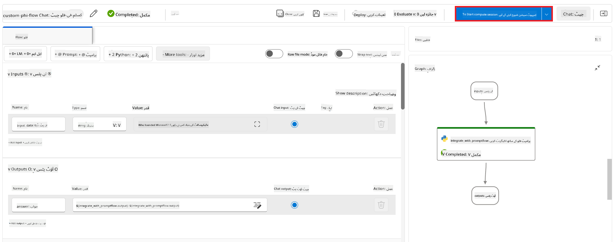

1. پیرامیٹرز کو تازہ کرنے کے لیے **Validate and parse input** منتخب کریں۔

    

1. اپنے بنائے ہوئے کسٹم کنکشن کی **Value** منتخب کریں، مثلاً *connection*۔

    

#### اپنے کسٹم Phi-3 / Phi-3.5 ماڈل کے ساتھ چیٹ کریں

1. **Chat** منتخب کریں۔

    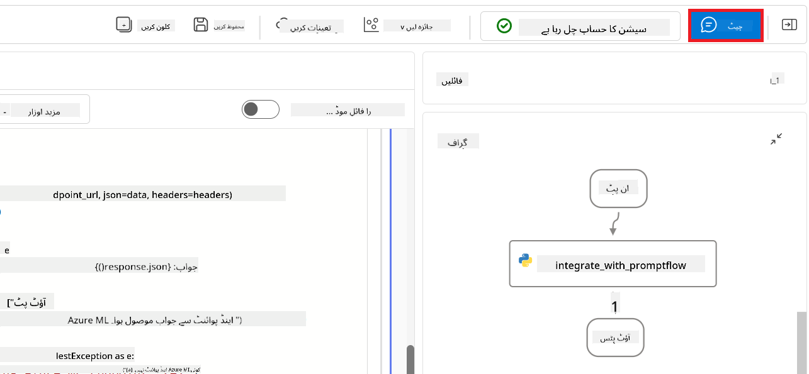

1. نتائج کی ایک مثال درج ذیل ہے: اب آپ اپنے کسٹم Phi-3 / Phi-3.5 ماڈل کے ساتھ چیٹ کر سکتے ہیں۔ مشورہ دیا جاتا ہے کہ سوالات fine-tuning کے لیے استعمال ہونے والے ڈیٹا کی بنیاد پر پوچھے جائیں۔

    

### Phi-3 / Phi-3.5 ماڈل کی جانچ کے لیے Azure OpenAI کو تعینات کریں

Azure AI Foundry میں Phi-3 / Phi-3.5 ماڈل کی جانچ کے لیے، آپ کو Azure OpenAI ماڈل تعینات کرنا ہوگا۔ یہ ماڈل Phi-3 / Phi-3.5 ماڈل کی کارکردگی کا جائزہ لینے کے لیے استعمال ہوگا۔

#### Azure OpenAI تعینات کریں

1. [Azure AI Foundry](https://ai.azure.com/?wt.mc_id=studentamb_279723) میں سائن ان کریں۔

1. اپنے بنائے ہوئے Azure AI Foundry پروجیکٹ پر جائیں۔

    

1. پروجیکٹ میں بائیں طرف کے ٹیب سے **Deployments** منتخب کریں۔

1. نیویگیشن مینو سے **+ Deploy model** منتخب کریں۔

1. **Deploy base model** منتخب کریں۔

    

1. وہ Azure OpenAI ماڈل منتخب کریں جو آپ استعمال کرنا چاہتے ہیں، مثلاً **gpt-4o**۔

    

1. **Confirm** منتخب کریں۔

### Azure AI Foundry کے Prompt flow evaluation کے ذریعے fine-tuned Phi-3 / Phi-3.5 ماڈل کا جائزہ لیں

### نیا جائزہ شروع کریں

1. [Azure AI Foundry](https://ai.azure.com/?wt.mc_id=studentamb_279723) پر جائیں۔

1. اپنے بنائے ہوئے Azure AI Foundry پروجیکٹ پر جائیں۔

    

1. پروجیکٹ میں بائیں طرف کے ٹیب سے **Evaluation** منتخب کریں۔

1. نیویگیشن مینو سے **+ New evaluation** منتخب کریں۔

    

1. **Prompt flow** evaluation منتخب کریں۔

    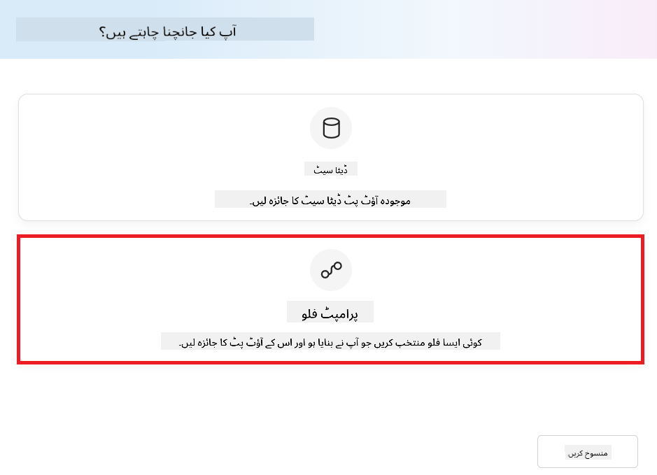

1. درج ذیل کام کریں:

    - جائزے کا نام درج کریں۔ یہ منفرد ہونا چاہیے۔
    - ٹاسک کی قسم کے طور پر **Question and answer without context** منتخب کریں، کیونکہ اس ٹیوٹوریل میں استعمال ہونے والا **UlTRACHAT_200k** ڈیٹاسیٹ context نہیں رکھتا۔
    - وہ prompt flow منتخب کریں جسے آپ جائزہ لینا چاہتے ہیں۔

    

1. **Next** منتخب کریں۔

1. درج ذیل کام کریں:

    - **Add your dataset** منتخب کریں تاکہ ڈیٹاسیٹ اپلوڈ کیا جا سکے۔ مثال کے طور پر، آپ *test_data.json1* فائل اپلوڈ کر سکتے ہیں جو **ULTRACHAT_200k** ڈیٹاسیٹ کے ساتھ شامل ہوتی ہے۔
    - اپنے ڈیٹاسیٹ کے مطابق مناسب **Dataset column** منتخب کریں۔ مثال کے طور پر، اگر آپ **ULTRACHAT_200k** ڈیٹاسیٹ استعمال کر رہے ہیں، تو **${data.prompt}** کو ڈیٹاسیٹ کالم کے طور پر منتخب کریں۔

    

1. **Next** منتخب کریں۔

1. کارکردگی اور معیار کے میٹرکس ترتیب دینے کے لیے درج ذیل کریں:

    - وہ performance اور quality metrics منتخب کریں جو آپ استعمال کرنا چاہتے ہیں۔
    - جائزے کے لیے آپ نے جو Azure OpenAI ماڈل بنایا ہے اسے منتخب کریں، مثلاً **gpt-4o**۔

    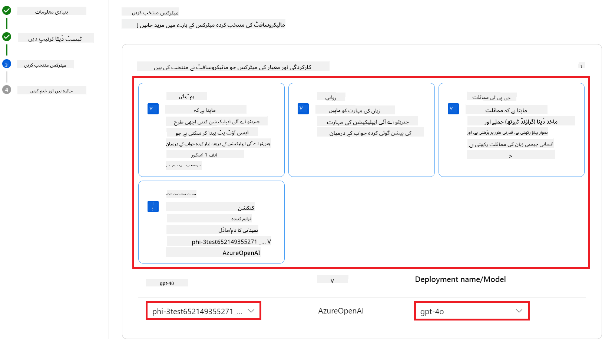

1. خطرے اور حفاظت کے میٹرکس ترتیب دینے کے لیے درج ذیل کریں:

    - وہ risk اور safety metrics منتخب کریں جو آپ استعمال کرنا چاہتے ہیں۔
    - نقص کی شرح معلوم کرنے کے لیے threshold منتخب کریں، مثلاً **Medium**۔
    - **question** کے لیے **Data source** کو **{$data.prompt}** منتخب کریں۔
    - **answer** کے لیے **Data source** کو **{$run.outputs.answer}** منتخب کریں۔
    - **ground_truth** کے لیے **Data source** کو **{$data.message}** منتخب کریں۔

    

1. **Next** منتخب کریں۔

1. جائزہ شروع کرنے کے لیے **Submit** منتخب کریں۔

1. جائزہ مکمل ہونے میں کچھ وقت لگے گا۔ آپ **Evaluation** ٹیب میں پیش رفت مانیٹر کر سکتے ہیں۔

### جائزے کے نتائج کا جائزہ لیں
> [!NOTE]
> نیچے دیے گئے نتائج جائزہ لینے کے عمل کی وضاحت کے لیے ہیں۔ اس سبق میں، ہم نے ایک ماڈل استعمال کیا ہے جو نسبتاً چھوٹے ڈیٹا سیٹ پر فائن ٹیون کیا گیا ہے، جس کی وجہ سے نتائج مثالی نہیں ہو سکتے۔ اصل نتائج ڈیٹا سیٹ کے حجم، معیار، اور تنوع کے ساتھ ساتھ ماڈل کی مخصوص ترتیب پر منحصر ہو کر نمایاں طور پر مختلف ہو سکتے ہیں۔
ایک بار جائزہ مکمل ہونے کے بعد، آپ کارکردگی اور حفاظت کے میٹرکس دونوں کے نتائج کا جائزہ لے سکتے ہیں۔

1. کارکردگی اور معیار کے میٹرکس:

    - ماڈل کی مؤثر صلاحیت کا اندازہ لگائیں کہ وہ مربوط، روان اور متعلقہ جوابات پیدا کر رہا ہے۔

    

1. خطرہ اور حفاظتی میٹرکس:

    - یقینی بنائیں کہ ماڈل کے نتائج محفوظ ہیں اور ذمہ دار AI اصولوں کے مطابق ہیں، تاکہ کوئی نقصان دہ یا توہین آمیز مواد شامل نہ ہو۔

    

1. آپ نیچے سکرول کر کے **تفصیلی میٹرکس کے نتائج** دیکھ سکتے ہیں۔

    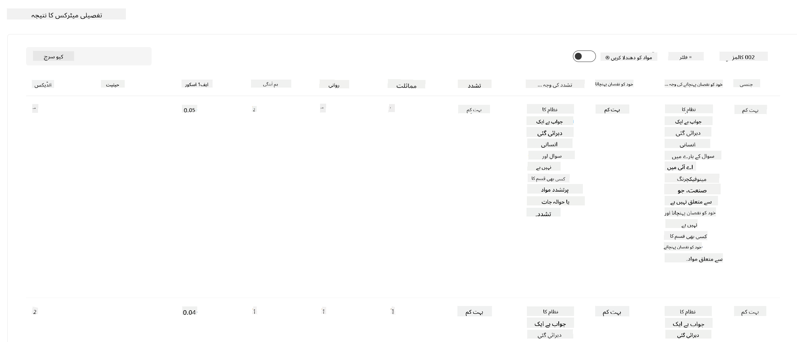

1. اپنی کسٹم Phi-3 / Phi-3.5 ماڈل کو کارکردگی اور حفاظت کے میٹرکس دونوں کے خلاف جانچ کر، آپ تصدیق کر سکتے ہیں کہ ماڈل نہ صرف مؤثر ہے بلکہ ذمہ دار AI طریقوں کی پیروی بھی کرتا ہے، جس سے یہ حقیقی دنیا میں تعیناتی کے لیے تیار ہو جاتا ہے۔

## مبارک ہو!

### آپ نے یہ ٹیوٹوریل مکمل کر لیا ہے

آپ نے کامیابی کے ساتھ Azure AI Foundry میں Prompt flow کے ساتھ مربوط fine-tuned Phi-3 ماڈل کا جائزہ لیا ہے۔ یہ ایک اہم قدم ہے تاکہ آپ کے AI ماڈلز نہ صرف اچھی کارکردگی دکھائیں بلکہ Microsoft کے ذمہ دار AI اصولوں کی پیروی بھی کریں، تاکہ آپ قابل اعتماد اور معتبر AI ایپلیکیشنز بنا سکیں۔


## Azure وسائل کی صفائی کریں

اپنے Azure وسائل کو صاف کریں تاکہ آپ کے اکاؤنٹ پر اضافی چارجز نہ لگیں۔ Azure پورٹل پر جائیں اور درج ذیل وسائل کو حذف کریں:

- Azure Machine learning resource۔
- Azure Machine learning model endpoint۔
- Azure AI Foundry Project resource۔
- Azure AI Foundry Prompt flow resource۔

### اگلے اقدامات

#### دستاویزات

- [Assess AI systems by using the Responsible AI dashboard](https://learn.microsoft.com/azure/machine-learning/concept-responsible-ai-dashboard?view=azureml-api-2&source=recommendations?wt.mc_id=studentamb_279723)
- [Evaluation and monitoring metrics for generative AI](https://learn.microsoft.com/azure/ai-studio/concepts/evaluation-metrics-built-in?tabs=definition?wt.mc_id=studentamb_279723)
- [Azure AI Foundry documentation](https://learn.microsoft.com/azure/ai-studio/?wt.mc_id=studentamb_279723)
- [Prompt flow documentation](https://microsoft.github.io/promptflow/?wt.mc_id=studentamb_279723)

#### تربیتی مواد

- [Introduction to Microsoft's Responsible AI Approach](https://learn.microsoft.com/training/modules/introduction-to-microsofts-responsible-ai-approach/?source=recommendations?wt.mc_id=studentamb_279723)
- [Introduction to Azure AI Foundry](https://learn.microsoft.com/training/modules/introduction-to-azure-ai-studio/?wt.mc_id=studentamb_279723)

### حوالہ جات

- [What is Responsible AI?](https://learn.microsoft.com/azure/machine-learning/concept-responsible-ai?view=azureml-api-2?wt.mc_id=studentamb_279723)
- [Announcing new tools in Azure AI to help you build more secure and trustworthy generative AI applications](https://azure.microsoft.com/blog/announcing-new-tools-in-azure-ai-to-help-you-build-more-secure-and-trustworthy-generative-ai-applications/?wt.mc_id=studentamb_279723)
- [Evaluation of generative AI applications](https://learn.microsoft.com/azure/ai-studio/concepts/evaluation-approach-gen-ai?wt.mc_id%3Dstudentamb_279723)

**دستخطی نوٹ**:  
یہ دستاویز AI ترجمہ سروس [Co-op Translator](https://github.com/Azure/co-op-translator) کے ذریعے ترجمہ کی گئی ہے۔ اگرچہ ہم درستگی کے لیے کوشاں ہیں، براہ کرم آگاہ رہیں کہ خودکار ترجمے میں غلطیاں یا عدم درستیاں ہو سکتی ہیں۔ اصل دستاویز اپنی مادری زبان میں ہی معتبر ماخذ سمجھی جانی چاہیے۔ اہم معلومات کے لیے پیشہ ور انسانی ترجمہ کی سفارش کی جاتی ہے۔ اس ترجمے کے استعمال سے پیدا ہونے والی کسی بھی غلط فہمی یا غلط تشریح کی ذمہ داری ہم پر عائد نہیں ہوتی۔