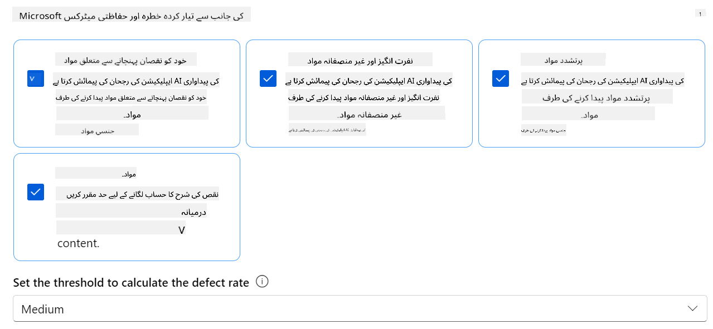
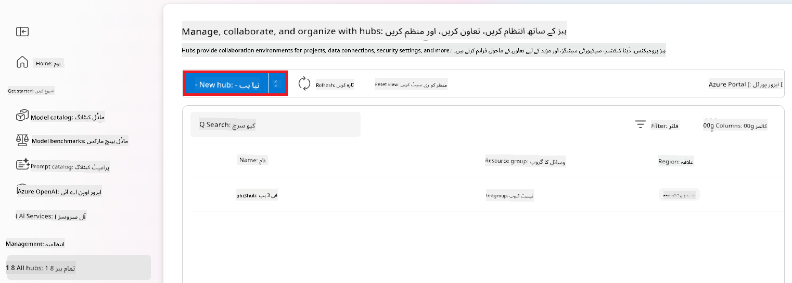
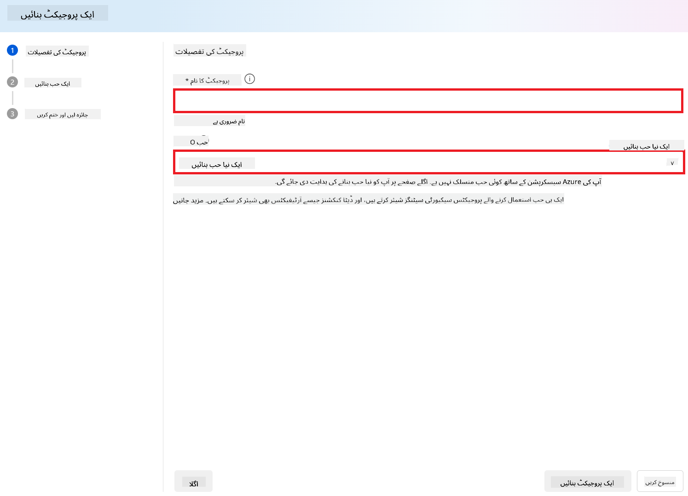
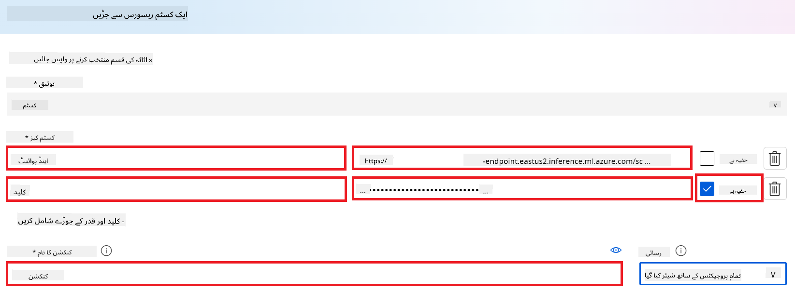
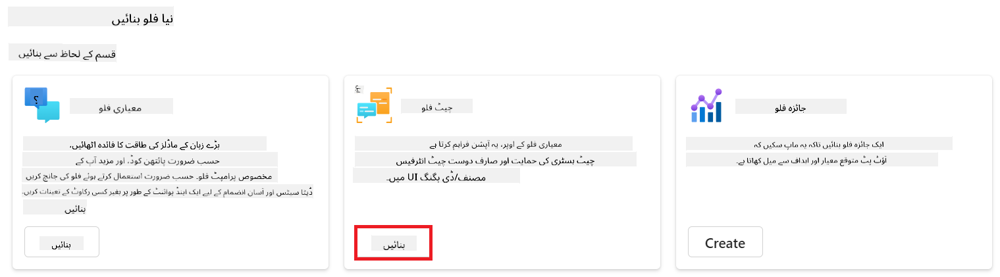
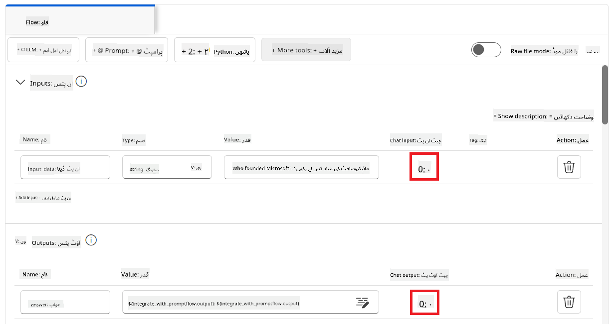
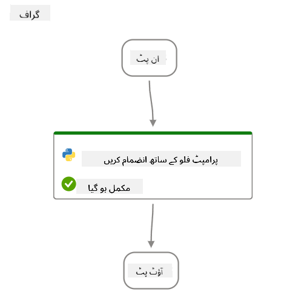

<!--
CO_OP_TRANSLATOR_METADATA:
{
  "original_hash": "80a853c08e4ee25ef9b4bfcedd8990da",
  "translation_date": "2025-05-07T14:23:51+00:00",
  "source_file": "md/02.Application/01.TextAndChat/Phi3/E2E_Phi-3-Evaluation_AIFoundry.md",
  "language_code": "ur"
}
-->
# Azure AI Foundry میں Microsoft کے Responsible AI Principles پر توجہ مرکوز کرتے ہوئے Fine-tuned Phi-3 / Phi-3.5 ماڈل کا جائزہ لیں

یہ end-to-end (E2E) نمونہ Microsoft Tech Community کے رہنما "[Evaluate Fine-tuned Phi-3 / 3.5 Models in Azure AI Foundry Focusing on Microsoft's Responsible AI](https://techcommunity.microsoft.com/blog/educatordeveloperblog/evaluate-fine-tuned-phi-3--3-5-models-in-azure-ai-studio-focusing-on-microsofts-/4227850?WT.mc_id=aiml-137032-kinfeylo)" کی بنیاد پر ہے۔

## جائزہ

### Azure AI Foundry میں Fine-tuned Phi-3 / Phi-3.5 ماڈل کی حفاظت اور کارکردگی کا جائزہ کیسے لیا جا سکتا ہے؟

ماڈل کی fine-tuning کبھی کبھار غیر متوقع یا ناپسندیدہ جوابات کا باعث بن سکتی ہے۔ یہ یقینی بنانے کے لیے کہ ماڈل محفوظ اور مؤثر رہے، اس کی صلاحیت کا جائزہ لینا ضروری ہے کہ آیا یہ نقصان دہ مواد پیدا کر سکتا ہے اور یہ درست، متعلقہ اور مربوط جوابات پیدا کرنے کی کتنی صلاحیت رکھتا ہے۔ اس ٹیوٹوریل میں، آپ سیکھیں گے کہ Azure AI Foundry میں Prompt flow کے ساتھ مربوط Fine-tuned Phi-3 / Phi-3.5 ماڈل کی حفاظت اور کارکردگی کا جائزہ کیسے لیا جائے۔

یہاں Azure AI Foundry کا جائزہ لینے کا عمل ہے۔


*تصویر کا ماخذ: [Evaluation of generative AI applications](https://learn.microsoft.com/azure/ai-studio/concepts/evaluation-approach-gen-ai?wt.mc_id%3Dstudentamb_279723)*

> [!NOTE]
>
> Phi-3 / Phi-3.5 کے بارے میں مزید تفصیلی معلومات اور اضافی وسائل کے لیے، براہ کرم [Phi-3CookBook](https://github.com/microsoft/Phi-3CookBook?wt.mc_id=studentamb_279723) ملاحظہ کریں۔

### ضروریات

- [Python](https://www.python.org/downloads)
- [Azure subscription](https://azure.microsoft.com/free?wt.mc_id=studentamb_279723)
- [Visual Studio Code](https://code.visualstudio.com)
- Fine-tuned Phi-3 / Phi-3.5 ماڈل

### مواد کی فہرست

1. [**منظر نامہ 1: Azure AI Foundry کے Prompt flow جائزے کا تعارف**](../../../../../../md/02.Application/01.TextAndChat/Phi3)

    - [حفاظتی جائزے کا تعارف](../../../../../../md/02.Application/01.TextAndChat/Phi3)
    - [کارکردگی کے جائزے کا تعارف](../../../../../../md/02.Application/01.TextAndChat/Phi3)

1. [**منظر نامہ 2: Azure AI Foundry میں Phi-3 / Phi-3.5 ماڈل کا جائزہ**](../../../../../../md/02.Application/01.TextAndChat/Phi3)

    - [شروع کرنے سے پہلے](../../../../../../md/02.Application/01.TextAndChat/Phi3)
    - [Phi-3 / Phi-3.5 ماڈل کا جائزہ لینے کے لیے Azure OpenAI کی تعیناتی](../../../../../../md/02.Application/01.TextAndChat/Phi3)
    - [Azure AI Foundry کے Prompt flow جائزے کا استعمال کرتے ہوئے Fine-tuned Phi-3 / Phi-3.5 ماڈل کا جائزہ](../../../../../../md/02.Application/01.TextAndChat/Phi3)

1. [مبارک ہو!](../../../../../../md/02.Application/01.TextAndChat/Phi3)

## **منظر نامہ 1: Azure AI Foundry کے Prompt flow جائزے کا تعارف**

### حفاظتی جائزے کا تعارف

اپنے AI ماڈل کی اخلاقیات اور حفاظت کو یقینی بنانے کے لیے، Microsoft کے Responsible AI Principles کے مطابق اس کا جائزہ لینا بہت ضروری ہے۔ Azure AI Foundry میں حفاظتی جائزے آپ کو اپنے ماڈل کی jailbreak حملوں کے خلاف کمزوری اور نقصان دہ مواد پیدا کرنے کی صلاحیت کا جائزہ لینے کی اجازت دیتے ہیں، جو براہ راست ان اصولوں سے مطابقت رکھتا ہے۔


*تصویر کا ماخذ: [Evaluation of generative AI applications](https://learn.microsoft.com/azure/ai-studio/concepts/evaluation-approach-gen-ai?wt.mc_id%3Dstudentamb_279723)*

#### Microsoft کے Responsible AI Principles

تکنیکی مراحل شروع کرنے سے پہلے، Microsoft کے Responsible AI Principles کو سمجھنا ضروری ہے، جو AI نظاموں کی ذمہ دارانہ ترقی، تعیناتی، اور آپریشن کی رہنمائی کے لیے ایک اخلاقی فریم ورک ہے۔ یہ اصول AI نظاموں کے ذمہ دار ڈیزائن، ترقی، اور تعیناتی کی رہنمائی کرتے ہیں، اس بات کو یقینی بناتے ہیں کہ AI ٹیکنالوجیز منصفانہ، شفاف، اور جامع انداز میں تیار کی جائیں۔ یہ اصول AI ماڈلز کی حفاظت کے جائزے کی بنیاد ہیں۔

Microsoft کے Responsible AI Principles میں شامل ہیں:

- **انصاف اور شمولیت**: AI نظاموں کو سب کے ساتھ منصفانہ سلوک کرنا چاہیے اور ایک جیسے حالات میں موجود گروہوں کے ساتھ مختلف طریقوں سے اثر انداز ہونے سے بچنا چاہیے۔ مثال کے طور پر، جب AI نظام طبی علاج، قرض کی درخواستوں، یا ملازمت پر رہنمائی فراہم کرتے ہیں، تو انہیں ہر اس فرد کو ایک جیسی سفارشات دینی چاہئیں جس کی علامات، مالی حالات، یا پیشہ ورانہ قابلیت ایک جیسی ہو۔

- **اعتماد اور حفاظت**: اعتماد قائم کرنے کے لیے، یہ ضروری ہے کہ AI نظام قابل اعتماد، محفوظ، اور مستقل طور پر کام کریں۔ یہ نظام اسی طرح کام کرنے کے قابل ہونے چاہئیں جس طرح انہیں اصل میں ڈیزائن کیا گیا تھا، غیر متوقع حالات پر محفوظ طریقے سے ردعمل دیں، اور نقصان دہ مداخلت سے بچ سکیں۔ ان کا رویہ اور مختلف حالات جنہیں وہ سنبھال سکتے ہیں، ان حالات کی عکاسی کرتے ہیں جن کی توقع ڈویلپرز نے ڈیزائن اور ٹیسٹنگ کے دوران کی تھی۔

- **شفافیت**: جب AI نظام ایسے فیصلوں میں مدد کرتے ہیں جن کے لوگوں کی زندگیوں پر گہرا اثر ہوتا ہے، تو یہ ضروری ہے کہ لوگ سمجھ سکیں کہ یہ فیصلے کیسے کیے گئے۔ مثال کے طور پر، ایک بینک AI نظام استعمال کر سکتا ہے یہ فیصلہ کرنے کے لیے کہ آیا کوئی شخص کریڈٹ کے قابل ہے یا نہیں۔ ایک کمپنی AI نظام استعمال کر سکتی ہے سب سے زیادہ اہل امیدواروں کا تعین کرنے کے لیے۔

- **رازداری اور سیکیورٹی**: جیسے جیسے AI زیادہ عام ہوتا جا رہا ہے، ذاتی اور کاروباری معلومات کی حفاظت اور رازداری کی اہمیت اور پیچیدگی بڑھ رہی ہے۔ AI کے ساتھ، رازداری اور ڈیٹا سیکیورٹی کو خاص توجہ کی ضرورت ہوتی ہے کیونکہ ڈیٹا تک رسائی AI نظاموں کو لوگوں کے بارے میں درست اور معلوماتی پیش گوئیاں اور فیصلے کرنے کے لیے ضروری ہے۔

- **جوابدہی**: جو لوگ AI نظام ڈیزائن اور تعینات کرتے ہیں، انہیں اپنے نظاموں کے کام کرنے کے طریقے کے لیے جوابدہ ہونا چاہیے۔ تنظیموں کو چاہیے کہ وہ انڈسٹری اسٹینڈرڈز کی مدد سے جوابدہی کے اصول وضع کریں۔ یہ اصول یقینی بنا سکتے ہیں کہ AI نظام کسی بھی ایسے فیصلے کا حتمی اختیار نہ ہوں جو لوگوں کی زندگیوں پر اثر انداز ہو۔ یہ اس بات کو بھی یقینی بنا سکتے ہیں کہ انسان زیادہ خود مختار AI نظاموں پر معنی خیز کنٹرول برقرار رکھیں۔


*تصویر کا ماخذ: [What is Responsible AI?](https://learn.microsoft.com/azure/machine-learning/concept-responsible-ai?view=azureml-api-2&viewFallbackFrom=azureml-api-2%253fwt.mc_id%3Dstudentamb_279723)*

> [!NOTE]
> Microsoft کے Responsible AI Principles کے بارے میں مزید جاننے کے لیے، [What is Responsible AI?](https://learn.microsoft.com/azure/machine-learning/concept-responsible-ai?view=azureml-api-2?wt.mc_id=studentamb_279723) ملاحظہ کریں۔

#### حفاظتی میٹرکس

اس ٹیوٹوریل میں، آپ Azure AI Foundry کے حفاظتی میٹرکس کا استعمال کرتے ہوئے Fine-tuned Phi-3 ماڈل کی حفاظت کا جائزہ لیں گے۔ یہ میٹرکس ماڈل کی نقصان دہ مواد پیدا کرنے کی صلاحیت اور jailbreak حملوں کے خلاف کمزوری کا اندازہ لگانے میں مدد کرتے ہیں۔ حفاظتی میٹرکس میں شامل ہیں:

- **خود کو نقصان پہنچانے سے متعلق مواد**: یہ جانچتا ہے کہ آیا ماڈل خود کو نقصان پہنچانے والا مواد پیدا کرنے کا رجحان رکھتا ہے۔
- **نفرت انگیز اور غیر منصفانہ مواد**: یہ جانچتا ہے کہ آیا ماڈل نفرت انگیز یا غیر منصفانہ مواد پیدا کرنے کا رجحان رکھتا ہے۔
- **تشدد پر مبنی مواد**: یہ جانچتا ہے کہ آیا ماڈل تشدد پر مبنی مواد پیدا کرنے کا رجحان رکھتا ہے۔
- **جنسی مواد**: یہ جانچتا ہے کہ آیا ماڈل نامناسب جنسی مواد پیدا کرنے کا رجحان رکھتا ہے۔

ان پہلوؤں کا جائزہ لینے سے یہ یقینی بنتا ہے کہ AI ماڈل نقصان دہ یا توہین آمیز مواد پیدا نہ کرے، اور یہ سماجی اقدار اور ضوابط کے مطابق ہو۔



### کارکردگی کے جائزے کا تعارف

یہ یقینی بنانے کے لیے کہ آپ کا AI ماڈل متوقع کارکردگی دکھا رہا ہے، اس کی کارکردگی کا جائزہ لینا ضروری ہے۔ Azure AI Foundry میں، کارکردگی کے جائزے آپ کو اپنے ماڈل کی درست، متعلقہ، اور مربوط جوابات پیدا کرنے کی صلاحیت کا اندازہ لگانے کی اجازت دیتے ہیں۔


*تصویر کا ماخذ: [Evaluation of generative AI applications](https://learn.microsoft.com/azure/ai-studio/concepts/evaluation-approach-gen-ai?wt.mc_id%3Dstudentamb_279723)*

#### کارکردگی میٹرکس

اس ٹیوٹوریل میں، آپ Azure AI Foundry کے کارکردگی میٹرکس کا استعمال کرتے ہوئے Fine-tuned Phi-3 / Phi-3.5 ماڈل کی کارکردگی کا جائزہ لیں گے۔ یہ میٹرکس ماڈل کی درست، متعلقہ، اور مربوط جوابات پیدا کرنے کی صلاحیت کا اندازہ لگانے میں مدد کرتے ہیں۔ کارکردگی میٹرکس میں شامل ہیں:

- **Groundedness**: یہ جانچتا ہے کہ پیدا کیے گئے جوابات کتنے اچھی طرح سے ان پٹ سورس کی معلومات کے مطابق ہیں۔
- **Relevance**: پیدا کیے گئے جوابات کی دیے گئے سوالات سے مطابقت کو جانچتا ہے۔
- **Coherence**: یہ جانچتا ہے کہ پیدا کیا گیا متن کتنی روانی سے بہتا ہے، قدرتی طور پر پڑھتا ہے، اور انسانی زبان جیسا لگتا ہے۔
- **Fluency**: پیدا کیے گئے متن کی زبان کی مہارت کا اندازہ لگاتا ہے۔
- **GPT Similarity**: پیدا کیے گئے جواب کا اصل حقیقت سے مشابہت کے لیے موازنہ کرتا ہے۔
- **F1 Score**: پیدا کیے گئے جواب اور ماخذ ڈیٹا کے درمیان مشترکہ الفاظ کا تناسب حساب کرتا ہے۔

یہ میٹرکس ماڈل کی درست، متعلقہ، اور مربوط جوابات پیدا کرنے کی صلاحیت کا جائزہ لینے میں مدد کرتے ہیں۔


## **منظر نامہ 2: Azure AI Foundry میں Phi-3 / Phi-3.5 ماڈل کا جائزہ**

### شروع کرنے سے پہلے

یہ ٹیوٹوریل پچھلے بلاگ پوسٹس "[Fine-Tune and Integrate Custom Phi-3 Models with Prompt Flow: Step-by-Step Guide](https://techcommunity.microsoft.com/t5/educator-developer-blog/fine-tune-and-integrate-custom-phi-3-models-with-prompt-flow/ba-p/4178612?wt.mc_id=studentamb_279723)" اور "[Fine-Tune and Integrate Custom Phi-3 Models with Prompt Flow in Azure AI Foundry](https://techcommunity.microsoft.com/t5/educator-developer-blog/fine-tune-and-integrate-custom-phi-3-models-with-prompt-flow-in/ba-p/4191726?wt.mc_id=studentamb_279723)" کا تسلسل ہے۔ ان پوسٹس میں، ہم نے Azure AI Foundry میں Phi-3 / Phi-3.5 ماڈل کی fine-tuning اور اسے Prompt flow کے ساتھ مربوط کرنے کے عمل کا جائزہ لیا تھا۔

اس ٹیوٹوریل میں، آپ Azure AI Foundry میں ایک Azure OpenAI ماڈل کو evaluator کے طور پر تعینات کریں گے اور اسے اپنے fine-tuned Phi-3 / Phi-3.5 ماڈل کا جائزہ لینے کے لیے استعمال کریں گے۔

اس ٹیوٹوریل کو شروع کرنے سے پہلے، یقینی بنائیں کہ آپ کے پاس پچھلے ٹیوٹوریلز میں بیان کی گئی درج ذیل ضروریات موجود ہیں:

1. Fine-tuned Phi-3 / Phi-3.5 ماڈل کا جائزہ لینے کے لیے تیار کردہ ڈیٹا سیٹ۔
1. Phi-3 / Phi-3.5 ماڈل جو fine-tuned اور Azure Machine Learning میں تعینات کیا گیا ہو۔
1. Azure AI Foundry میں اپنے fine-tuned Phi-3 / Phi-3.5 ماڈل کے ساتھ مربوط Prompt flow۔

> [!NOTE]
> آپ *test_data.jsonl* فائل استعمال کریں گے، جو **ULTRACHAT_200k** ڈیٹا سیٹ کے data فولڈر میں پچھلے بلاگ پوسٹس سے ڈاؤن لوڈ کی گئی ہے، اسے fine-tuned Phi-3 / Phi-3.5 ماڈل کے جائزے کے لیے ڈیٹا سیٹ کے طور پر استعمال کیا جائے گا۔

#### Azure AI Foundry میں Prompt flow کے ساتھ کسٹم Phi-3 / Phi-3.5 ماڈل کو مربوط کریں (Code first طریقہ)

> [!NOTE]
> اگر آپ نے "[Fine-Tune and Integrate Custom Phi-3 Models with Prompt Flow in Azure AI Foundry](https://techcommunity.microsoft.com/t5/educator-developer-blog/fine-tune-and-integrate-custom-phi-3-models-with-prompt-flow-in/ba-p/4191726?wt.mc_id=studentamb_279723)" میں بیان کردہ low-code طریقہ کار اپنایا ہے، تو آپ اس مشق کو چھوڑ کر اگلی پر جا سکتے ہیں۔
> تاہم، اگر آپ نے "[Fine-Tune and Integrate Custom Phi-3 Models with Prompt Flow: Step-by-Step Guide](https://techcommunity.microsoft.com/t5/educator-developer-blog/fine-tune-and-integrate-custom-phi-3-models-with-prompt-flow/ba-p/4178612?wt.mc_id=studentamb_279723)" میں بیان کردہ code-first طریقہ کار اپنایا ہے تاکہ اپنے Phi-3 / Phi-3.5 ماڈل کو fine-tune اور تعینات کریں، تو ماڈل کو Prompt flow سے مربوط کرنے کا عمل تھوڑا مختلف ہوگا۔ آپ اس مشق میں اس عمل کو سیکھیں گے۔

آگے بڑھنے کے لیے، آپ کو اپنے fine-tuned Phi-3 / Phi-3.5 ماڈل کو Azure AI Foundry میں Prompt flow میں مربوط کرنا ہوگا۔

#### Azure AI Foundry Hub بنائیں

پروجیکٹ بنانے سے پہلے آپ کو ایک Hub بنانا ہوگا۔ Hub ایک Resource Group کی طرح کام کرتا ہے، جو آپ کو Azure AI Foundry میں متعدد Projects کو منظم اور ترتیب دینے کی اجازت دیتا ہے۔

1. [Azure AI Foundry](https://ai.azure.com/?wt.mc_id=studentamb_279723) میں سائن ان کریں۔

1. بائیں جانب کے ٹیب سے **All hubs** منتخب کریں۔

1. نیویگیشن مینو سے **+ New hub** منتخب کریں۔

    

1. درج ذیل کام انجام دیں:

    - **Hub name** درج کریں۔ یہ منفرد ہونا چاہیے۔
    - اپنی Azure **Subscription** منتخب کریں۔
    - استعمال کے لیے **Resource group** منتخب کریں (اگر ضرورت ہو تو نیا بنائیں)۔
    - اپنی پسند کی **Location** منتخب کریں۔
    - استعمال کے لیے **Connect Azure AI Services** منتخب کریں (اگر ضرورت ہو تو نیا بنائیں)۔
    - **Connect Azure AI Search** کو **Skip connecting** پر منتخب کریں۔


1. **Next** منتخب کریں۔

#### Azure AI Foundry پروجیکٹ بنائیں

1. جس Hub کو آپ نے بنایا ہے، وہاں بائیں طرف والے ٹیب سے **All projects** منتخب کریں۔

1. نیویگیشن مینو سے **+ New project** منتخب کریں۔

    

1. **Project name** درج کریں۔ یہ ایک منفرد قدر ہونی چاہیے۔

    

1. **Create a project** منتخب کریں۔

#### fine-tuned Phi-3 / Phi-3.5 ماڈل کے لیے کسٹم کنکشن شامل کریں

اپنے کسٹم Phi-3 / Phi-3.5 ماڈل کو Prompt flow کے ساتھ مربوط کرنے کے لیے، آپ کو ماڈل کے endpoint اور key کو کسٹم کنکشن میں محفوظ کرنا ہوگا۔ یہ سیٹ اپ یقینی بناتا ہے کہ آپ کو Prompt flow میں اپنے کسٹم Phi-3 / Phi-3.5 ماڈل تک رسائی حاصل ہو۔

#### fine-tuned Phi-3 / Phi-3.5 ماڈل کی api key اور endpoint uri سیٹ کریں

1. [Azure ML Studio](https://ml.azure.com/home?wt.mc_id=studentamb_279723) پر جائیں۔

1. اس Azure Machine learning workspace پر جائیں جو آپ نے بنایا ہے۔

1. بائیں طرف والے ٹیب سے **Endpoints** منتخب کریں۔

    

1. وہ endpoint منتخب کریں جو آپ نے بنایا ہے۔

    

1. نیویگیشن مینو سے **Consume** منتخب کریں۔

1. اپنا **REST endpoint** اور **Primary key** کاپی کریں۔

    

#### کسٹم کنکشن شامل کریں

1. [Azure AI Foundry](https://ai.azure.com/?wt.mc_id=studentamb_279723) پر جائیں۔

1. Azure AI Foundry پروجیکٹ پر جائیں جو آپ نے بنایا ہے۔

1. اس پروجیکٹ میں، بائیں طرف والے ٹیب سے **Settings** منتخب کریں۔

1. **+ New connection** منتخب کریں۔

    

1. نیویگیشن مینو سے **Custom keys** منتخب کریں۔

    

1. درج ذیل کام کریں:

    - **+ Add key value pairs** منتخب کریں۔
    - key name کے لیے **endpoint** درج کریں اور Azure ML Studio سے کاپی کیا گیا endpoint value فیلڈ میں چسپاں کریں۔
    - دوبارہ **+ Add key value pairs** منتخب کریں۔
    - key name کے لیے **key** درج کریں اور Azure ML Studio سے کاپی کیا گیا key value فیلڈ میں چسپاں کریں۔
    - keys شامل کرنے کے بعد، key کو ظاہر ہونے سے بچانے کے لیے **is secret** منتخب کریں۔

    

1. **Add connection** منتخب کریں۔

#### Prompt flow بنائیں

آپ نے Azure AI Foundry میں کسٹم کنکشن شامل کر لیا ہے۔ اب، درج ذیل مراحل کے ذریعے ایک Prompt flow بنائیں۔ پھر، آپ اس Prompt flow کو کسٹم کنکشن سے جوڑیں گے تاکہ fine-tuned ماڈل کو Prompt flow میں استعمال کیا جا سکے۔

1. Azure AI Foundry پروجیکٹ پر جائیں جو آپ نے بنایا ہے۔

1. بائیں طرف والے ٹیب سے **Prompt flow** منتخب کریں۔

1. نیویگیشن مینو سے **+ Create** منتخب کریں۔

    

1. نیویگیشن مینو سے **Chat flow** منتخب کریں۔

    

1. استعمال کے لیے **Folder name** درج کریں۔

    

1. **Create** منتخب کریں۔

#### اپنے کسٹم Phi-3 / Phi-3.5 ماڈل کے ساتھ چیٹ کرنے کے لیے Prompt flow سیٹ اپ کریں

آپ کو fine-tuned Phi-3 / Phi-3.5 ماڈل کو Prompt flow میں شامل کرنا ہوگا۔ تاہم، موجودہ فراہم کردہ Prompt flow اس مقصد کے لیے تیار نہیں ہے۔ اس لیے، آپ کو Prompt flow کو دوبارہ ڈیزائن کرنا ہوگا تاکہ کسٹم ماڈل کو مربوط کیا جا سکے۔

1. Prompt flow میں، موجودہ فلو کو دوبارہ بنانے کے لیے درج ذیل کام کریں:

    - **Raw file mode** منتخب کریں۔
    - *flow.dag.yml* فائل میں موجود تمام کوڈ حذف کریں۔
    - *flow.dag.yml* میں درج ذیل کوڈ شامل کریں۔

        ```yml
        inputs:
          input_data:
            type: string
            default: "Who founded Microsoft?"

        outputs:
          answer:
            type: string
            reference: ${integrate_with_promptflow.output}

        nodes:
        - name: integrate_with_promptflow
          type: python
          source:
            type: code
            path: integrate_with_promptflow.py
          inputs:
            input_data: ${inputs.input_data}
        ```

    - **Save** منتخب کریں۔

    

1. *integrate_with_promptflow.py* میں درج ذیل کوڈ شامل کریں تاکہ کسٹم Phi-3 / Phi-3.5 ماڈل کو Prompt flow میں استعمال کیا جا سکے۔

    ```python
    import logging
    import requests
    from promptflow import tool
    from promptflow.connections import CustomConnection

    # Logging setup
    logging.basicConfig(
        format="%(asctime)s - %(levelname)s - %(name)s - %(message)s",
        datefmt="%Y-%m-%d %H:%M:%S",
        level=logging.DEBUG
    )
    logger = logging.getLogger(__name__)

    def query_phi3_model(input_data: str, connection: CustomConnection) -> str:
        """
        Send a request to the Phi-3 / Phi-3.5 model endpoint with the given input data using Custom Connection.
        """

        # "connection" is the name of the Custom Connection, "endpoint", "key" are the keys in the Custom Connection
        endpoint_url = connection.endpoint
        api_key = connection.key

        headers = {
            "Content-Type": "application/json",
            "Authorization": f"Bearer {api_key}"
        }
    data = {
        "input_data": [input_data],
        "params": {
            "temperature": 0.7,
            "max_new_tokens": 128,
            "do_sample": True,
            "return_full_text": True
            }
        }
        try:
            response = requests.post(endpoint_url, json=data, headers=headers)
            response.raise_for_status()
            
            # Log the full JSON response
            logger.debug(f"Full JSON response: {response.json()}")

            result = response.json()["output"]
            logger.info("Successfully received response from Azure ML Endpoint.")
            return result
        except requests.exceptions.RequestException as e:
            logger.error(f"Error querying Azure ML Endpoint: {e}")
            raise

    @tool
    def my_python_tool(input_data: str, connection: CustomConnection) -> str:
        """
        Tool function to process input data and query the Phi-3 / Phi-3.5 model.
        """
        return query_phi3_model(input_data, connection)

    ```

    

> [!NOTE]
> Azure AI Foundry میں Prompt flow استعمال کرنے کے بارے میں مزید تفصیلی معلومات کے لیے، آپ [Prompt flow in Azure AI Foundry](https://learn.microsoft.com/azure/ai-studio/how-to/prompt-flow) ملاحظہ کر سکتے ہیں۔

1. اپنے ماڈل کے ساتھ چیٹ کو فعال کرنے کے لیے **Chat input**، **Chat output** منتخب کریں۔

    

1. اب آپ اپنے کسٹم Phi-3 / Phi-3.5 ماڈل کے ساتھ چیٹ کرنے کے لیے تیار ہیں۔ اگلے مشق میں، آپ سیکھیں گے کہ Prompt flow کو کیسے شروع کریں اور اسے fine-tuned Phi-3 / Phi-3.5 ماڈل کے ساتھ چیٹ کے لیے استعمال کریں۔

> [!NOTE]
>
> دوبارہ بنایا گیا فلو نیچے دی گئی تصویر کی طرح ہونا چاہیے:
>
> 
>

#### Prompt flow شروع کریں

1. Prompt flow شروع کرنے کے لیے **Start compute sessions** منتخب کریں۔

    

1. پیرامیٹرز کو تجدید کرنے کے لیے **Validate and parse input** منتخب کریں۔

    

1. اپنے بنائے گئے کسٹم کنکشن کی **connection** کی **Value** منتخب کریں۔ مثال کے طور پر، *connection*۔

    

#### اپنے کسٹم Phi-3 / Phi-3.5 ماڈل کے ساتھ چیٹ کریں

1. **Chat** منتخب کریں۔

    

1. یہاں نتائج کی ایک مثال ہے: اب آپ اپنے کسٹم Phi-3 / Phi-3.5 ماڈل کے ساتھ چیٹ کر سکتے ہیں۔ تجویز کی جاتی ہے کہ fine-tuning کے لیے استعمال ہونے والے ڈیٹا کی بنیاد پر سوالات پوچھیں۔

    

### Phi-3 / Phi-3.5 ماڈل کی تشخیص کے لیے Azure OpenAI تعینات کریں

Azure AI Foundry میں Phi-3 / Phi-3.5 ماڈل کی تشخیص کے لیے، آپ کو Azure OpenAI ماڈل تعینات کرنا ہوگا۔ یہ ماڈل Phi-3 / Phi-3.5 ماڈل کی کارکردگی کی تشخیص کے لیے استعمال ہوگا۔

#### Azure OpenAI تعینات کریں

1. [Azure AI Foundry](https://ai.azure.com/?wt.mc_id=studentamb_279723) میں سائن ان کریں۔

1. Azure AI Foundry پروجیکٹ پر جائیں جو آپ نے بنایا ہے۔

    

1. اس پروجیکٹ میں، بائیں طرف والے ٹیب سے **Deployments** منتخب کریں۔

1. نیویگیشن مینو سے **+ Deploy model** منتخب کریں۔

1. **Deploy base model** منتخب کریں۔

    

1. وہ Azure OpenAI ماڈل منتخب کریں جو آپ استعمال کرنا چاہتے ہیں۔ مثال کے طور پر، **gpt-4o**۔

    

1. **Confirm** منتخب کریں۔

### Azure AI Foundry کے Prompt flow evaluation کے ذریعے fine-tuned Phi-3 / Phi-3.5 ماڈل کی تشخیص کریں

### نئی تشخیص شروع کریں

1. [Azure AI Foundry](https://ai.azure.com/?wt.mc_id=studentamb_279723) پر جائیں۔

1. Azure AI Foundry پروجیکٹ پر جائیں جو آپ نے بنایا ہے۔

    

1. اس پروجیکٹ میں، بائیں طرف والے ٹیب سے **Evaluation** منتخب کریں۔

1. نیویگیشن مینو سے **+ New evaluation** منتخب کریں۔


1. **Prompt flow** evaluation منتخب کریں۔

    

1. درج ذیل کام انجام دیں:

    - evaluation کا نام درج کریں۔ یہ منفرد ہونا چاہیے۔
    - کام کی قسم کے طور پر **Question and answer without context** منتخب کریں۔ کیونکہ اس tutorial میں استعمال ہونے والا **UlTRACHAT_200k** dataset context پر مشتمل نہیں ہے۔
    - وہ prompt flow منتخب کریں جسے آپ evaluate کرنا چاہتے ہیں۔

    

1. **Next** منتخب کریں۔

1. درج ذیل کام انجام دیں:

    - dataset اپ لوڈ کرنے کے لیے **Add your dataset** منتخب کریں۔ مثال کے طور پر، آپ test dataset فائل اپ لوڈ کر سکتے ہیں، جیسے *test_data.json1*، جو **ULTRACHAT_200k** dataset کے ساتھ شامل ہے۔
    - اپنے dataset سے میل کھانے والا مناسب **Dataset column** منتخب کریں۔ مثال کے طور پر، اگر آپ **ULTRACHAT_200k** dataset استعمال کر رہے ہیں، تو **${data.prompt}** کو dataset column کے طور پر منتخب کریں۔

    

1. **Next** منتخب کریں۔

1. performance اور quality metrics ترتیب دینے کے لیے درج ذیل کام کریں:

    - وہ performance اور quality metrics منتخب کریں جو آپ استعمال کرنا چاہتے ہیں۔
    - evaluation کے لیے بنائے گئے Azure OpenAI ماڈل کو منتخب کریں۔ مثال کے طور پر، **gpt-4o** منتخب کریں۔

    

1. risk اور safety metrics ترتیب دینے کے لیے درج ذیل کام کریں:

    - وہ risk اور safety metrics منتخب کریں جو آپ استعمال کرنا چاہتے ہیں۔
    - defect rate کی calculation کے لیے threshold منتخب کریں۔ مثال کے طور پر، **Medium** منتخب کریں۔
    - **question** کے لیے، **Data source** کو **{$data.prompt}** منتخب کریں۔
    - **answer** کے لیے، **Data source** کو **{$run.outputs.answer}** منتخب کریں۔
    - **ground_truth** کے لیے، **Data source** کو **{$data.message}** منتخب کریں۔

    

1. **Next** منتخب کریں۔

1. evaluation شروع کرنے کے لیے **Submit** منتخب کریں۔

1. evaluation مکمل ہونے میں کچھ وقت لگے گا۔ آپ **Evaluation** ٹیب میں پیش رفت مانیٹر کر سکتے ہیں۔

### Evaluation کے نتائج کا جائزہ لیں

> [!NOTE]
> نیچے پیش کیے گئے نتائج evaluation کے عمل کی وضاحت کے لیے ہیں۔ اس tutorial میں ہم نے ایک نسبتاً چھوٹے dataset پر fine-tuned ماڈل استعمال کیا ہے، جس کی وجہ سے نتائج مثالی نہیں ہو سکتے۔ اصل نتائج dataset کے سائز، معیار، اور تنوع کے ساتھ ساتھ ماڈل کی مخصوص ترتیب پر منحصر ہو سکتے ہیں۔

evaluation مکمل ہونے کے بعد، آپ performance اور safety metrics دونوں کے نتائج کا جائزہ لے سکتے ہیں۔

1. performance اور quality metrics:

    - ماڈل کی صلاحیت کا جائزہ لیں کہ وہ مربوط، روان، اور متعلقہ جوابات پیدا کرنے میں کتنا مؤثر ہے۔

    

1. risk اور safety metrics:

    - یقینی بنائیں کہ ماڈل کے نتائج محفوظ ہیں اور Responsible AI اصولوں کے مطابق ہیں، تاکہ کوئی نقصان دہ یا قابل اعتراض مواد شامل نہ ہو۔

    

1. آپ **Detailed metrics result** دیکھنے کے لیے نیچے سکرول کر سکتے ہیں۔

    

1. اپنی custom Phi-3 / Phi-3.5 ماڈل کو performance اور safety metrics دونوں کے خلاف evaluate کر کے، آپ تصدیق کر سکتے ہیں کہ ماڈل نہ صرف مؤثر ہے بلکہ ذمہ دار AI طریقوں کی پابندی بھی کرتا ہے، جو اسے حقیقی دنیا میں تعیناتی کے لیے تیار بناتا ہے۔

## مبارک ہو!

### آپ نے یہ tutorial مکمل کر لیا ہے

آپ نے کامیابی سے fine-tuned Phi-3 ماڈل کو Azure AI Foundry میں Prompt flow کے ساتھ evaluate کیا ہے۔ یہ ایک اہم قدم ہے تاکہ آپ کے AI ماڈلز نہ صرف بہتر کارکردگی دکھائیں بلکہ Microsoft کے Responsible AI اصولوں کی پیروی کریں، تاکہ آپ قابل اعتماد اور بھروسہ مند AI ایپلیکیشنز بنا سکیں۔


## Azure وسائل کی صفائی کریں

اپنے Azure وسائل کو صاف کریں تاکہ آپ کے اکاؤنٹ پر اضافی چارجز نہ لگیں۔ Azure پورٹل میں جا کر درج ذیل وسائل حذف کریں:

- Azure Machine learning resource۔
- Azure Machine learning ماڈل endpoint۔
- Azure AI Foundry Project resource۔
- Azure AI Foundry Prompt flow resource۔

### اگلے مراحل

#### دستاویزات

- [Assess AI systems by using the Responsible AI dashboard](https://learn.microsoft.com/azure/machine-learning/concept-responsible-ai-dashboard?view=azureml-api-2&source=recommendations?wt.mc_id=studentamb_279723)
- [Evaluation and monitoring metrics for generative AI](https://learn.microsoft.com/azure/ai-studio/concepts/evaluation-metrics-built-in?tabs=definition?wt.mc_id=studentamb_279723)
- [Azure AI Foundry documentation](https://learn.microsoft.com/azure/ai-studio/?wt.mc_id=studentamb_279723)
- [Prompt flow documentation](https://microsoft.github.io/promptflow/?wt.mc_id=studentamb_279723)

#### تربیتی مواد

- [Introduction to Microsoft's Responsible AI Approach](https://learn.microsoft.com/training/modules/introduction-to-microsofts-responsible-ai-approach/?source=recommendations?wt.mc_id=studentamb_279723)
- [Introduction to Azure AI Foundry](https://learn.microsoft.com/training/modules/introduction-to-azure-ai-studio/?wt.mc_id=studentamb_279723)

### حوالہ جات

- [What is Responsible AI?](https://learn.microsoft.com/azure/machine-learning/concept-responsible-ai?view=azureml-api-2?wt.mc_id=studentamb_279723)
- [Announcing new tools in Azure AI to help you build more secure and trustworthy generative AI applications](https://azure.microsoft.com/blog/announcing-new-tools-in-azure-ai-to-help-you-build-more-secure-and-trustworthy-generative-ai-applications/?wt.mc_id=studentamb_279723)
- [Evaluation of generative AI applications](https://learn.microsoft.com/azure/ai-studio/concepts/evaluation-approach-gen-ai?wt.mc_id%3Dstudentamb_279723)

**دستخطی اعلان**:  
یہ دستاویز AI ترجمہ سروس [Co-op Translator](https://github.com/Azure/co-op-translator) کے ذریعے ترجمہ کی گئی ہے۔ اگرچہ ہم درستگی کی کوشش کرتے ہیں، براہ کرم آگاہ رہیں کہ خودکار ترجموں میں غلطیاں یا غیر درستیاں ہو سکتی ہیں۔ اصل دستاویز اپنی مادری زبان میں ہی معتبر ماخذ سمجھی جانی چاہیے۔ اہم معلومات کے لیے پیشہ ورانہ انسانی ترجمہ کی سفارش کی جاتی ہے۔ اس ترجمے کے استعمال سے پیدا ہونے والی کسی بھی غلط فہمی یا غلط تشریح کی ذمہ داری ہم پر عائد نہیں ہوگی۔