# کسٹم Phi-3 ماڈلز کو Fine-tune اور Prompt flow کے ساتھ انٹیگریٹ کریں

یہ اختتام سے اختتام (E2E) نمونہ مائیکروسافٹ ٹیک کمیونٹی کے رہنما "[Fine-Tune and Integrate Custom Phi-3 Models with Prompt Flow: Step-by-Step Guide](https://techcommunity.microsoft.com/t5/educator-developer-blog/fine-tune-and-integrate-custom-phi-3-models-with-prompt-flow/ba-p/4178612?WT.mc_id=aiml-137032-kinfeylo)" پر مبنی ہے۔ یہ کسٹم Phi-3 ماڈلز کو Fine-tune، تعینات کرنے، اور Prompt flow کے ساتھ انٹیگریٹ کرنے کے عمل کو متعارف کراتا ہے۔

## جائزہ

اس E2E نمونے میں، آپ سیکھیں گے کہ کس طرح Phi-3 ماڈل کو Fine-tune کیا جائے اور اسے Prompt flow کے ساتھ انٹیگریٹ کیا جائے۔ Azure Machine Learning اور Prompt flow کا فائدہ اٹھاتے ہوئے، آپ ایک ورک فلو قائم کریں گے تاکہ کسٹم AI ماڈلز کو تعینات اور استعمال کیا جا سکے۔ یہ E2E نمونہ تین منظرناموں میں تقسیم ہے:

**منظرنامہ 1: Azure وسائل ترتیب دیں اور Fine-tuning کی تیاری کریں**

**منظرنامہ 2: Phi-3 ماڈل کو Fine-tune کریں اور Azure Machine Learning Studio میں تعینات کریں**

**منظرنامہ 3: Prompt flow کے ساتھ انٹیگریٹ کریں اور اپنے کسٹم ماڈل کے ساتھ چیٹ کریں**

یہاں اس E2E نمونے کا ایک جائزہ ہے۔

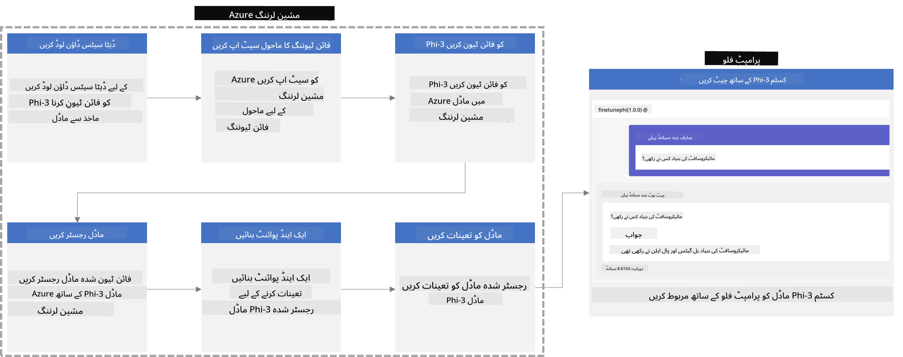

### مواد کی فہرست

1. **[منظرنامہ 1: Azure وسائل ترتیب دیں اور Fine-tuning کی تیاری کریں](../../../../../../md/02.Application/01.TextAndChat/Phi3)**
    - [Azure Machine Learning ورک اسپیس بنائیں](../../../../../../md/02.Application/01.TextAndChat/Phi3)
    - [Azure سبسکرپشن میں GPU کوٹہ کے لئے درخواست دیں](../../../../../../md/02.Application/01.TextAndChat/Phi3)
    - [رول اسائنمنٹ شامل کریں](../../../../../../md/02.Application/01.TextAndChat/Phi3)
    - [پروجیکٹ ترتیب دیں](../../../../../../md/02.Application/01.TextAndChat/Phi3)
    - [Fine-tuning کے لیے ڈیٹا سیٹ تیار کریں](../../../../../../md/02.Application/01.TextAndChat/Phi3)

1. **[منظرنامہ 2: Phi-3 ماڈل کو Fine-tune کریں اور Azure Machine Learning Studio میں تعینات کریں](../../../../../../md/02.Application/01.TextAndChat/Phi3)**
    - [Azure CLI ترتیب دیں](../../../../../../md/02.Application/01.TextAndChat/Phi3)
    - [Phi-3 ماڈل کو Fine-tune کریں](../../../../../../md/02.Application/01.TextAndChat/Phi3)
    - [Fine-tuned ماڈل کو تعینات کریں](../../../../../../md/02.Application/01.TextAndChat/Phi3)

1. **[منظرنامہ 3: Prompt flow کے ساتھ انٹیگریٹ کریں اور اپنے کسٹم ماڈل کے ساتھ چیٹ کریں](../../../../../../md/02.Application/01.TextAndChat/Phi3)**
    - [کسٹم Phi-3 ماڈل کو Prompt flow کے ساتھ انٹیگریٹ کریں](../../../../../../md/02.Application/01.TextAndChat/Phi3)
    - [اپنے کسٹم ماڈل کے ساتھ چیٹ کریں](../../../../../../md/02.Application/01.TextAndChat/Phi3)

## منظرنامہ 1: Azure وسائل ترتیب دیں اور Fine-tuning کی تیاری کریں

### Azure Machine Learning ورک اسپیس بنائیں

1. پورٹل صفحہ کے اوپر **تلاش بار** میں *azure machine learning* ٹائپ کریں اور ظاہر ہونے والے آپشنز میں سے **Azure Machine Learning** منتخب کریں۔

    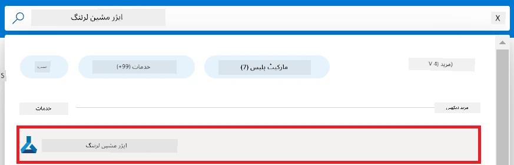

1. نیویگیشن مینو سے **+ Create** منتخب کریں۔

1. نیویگیشن مینو سے **New workspace** منتخب کریں۔

    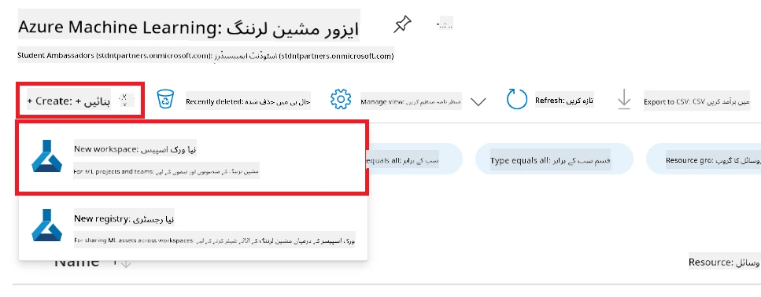

1. درج ذیل کام انجام دیں:

    - اپنی Azure **Subscription** منتخب کریں۔
    - جس **Resource group** کا استعمال کرنا ہے اسے منتخب کریں (ضرورت پڑنے پر نیا بنائیں)۔
    - **Workspace Name** درج کریں۔ یہ منفرد ہونا چاہیے۔
    - اس **Region** کو منتخب کریں جسے آپ استعمال کرنا چاہتے ہیں۔
    - جس **Storage account** کا استعمال کرنا ہے اسے منتخب کریں (ضرورت پڑنے پر نیا بنائیں)۔
    - جس **Key vault** کا استعمال کرنا ہے اسے منتخب کریں (ضرورت پڑنے پر نیا بنائیں)۔
    - جس **Application insights** کا استعمال کرنا ہے اسے منتخب کریں (ضرورت پڑنے پر نیا بنائیں)۔
    - جس **Container registry** کا استعمال کرنا ہے اسے منتخب کریں (ضرورت پڑنے پر نیا بنائیں)۔

    

1. **Review + Create** منتخب کریں۔

1. **Create** منتخب کریں۔

### Azure سبسکرپشن میں GPU کوٹہ کے لئے درخواست دیں

اس E2E نمونے میں، آپ Fine-tuning کے لیے *Standard_NC24ads_A100_v4 GPU* استعمال کریں گے، جس کے لیے کوٹہ درخواست کی ضرورت ہوتی ہے، اور تعیناتی کے لیے *Standard_E4s_v3* CPU استعمال کریں گے، جس کے لیے کوٹہ درخواست کی ضرورت نہیں ہے۔

> [!NOTE]
>
> صرف Pay-As-You-Go سبسکرپشنز (معیاری سبسکرپشن کی قسم) GPU الاٹمنٹ کے اہل ہیں؛ فائدہ دینے والی سبسکرپشنز فی الحال سپورٹڈ نہیں ہیں۔
>
> جو فائدہ دینے والی سبسکرپشنز (جیسے Visual Studio Enterprise Subscription) استعمال کر رہے ہیں یا جو Fine-tuning اور تعیناتی کے عمل کو جلدی آزمانا چاہتے ہیں، اس ٹیوٹوریل میں ایک چھوٹے ڈیٹا سیٹ کے ساتھ CPU پر Fine-tuning کے لیے بھی رہنمائی فراہم کی گئی ہے۔ تاہم، یہ بات قابل غور ہے کہ Fine-tuning کے نتائج بڑے ڈیٹا سیٹ کے ساتھ GPU استعمال کرنے پر نمایاں بہتر ہوتے ہیں۔

1. وزٹ کریں [Azure ML Studio](https://ml.azure.com/home?wt.mc_id=studentamb_279723)۔

1. *Standard NCADSA100v4 Family* کوٹہ کے لیے درخواست دینے کے لیے درج ذیل کام انجام دیں:

    - بائیں طرف کے ٹیب سے **Quota** منتخب کریں۔
    - جو **Virtual machine family** استعمال کرنی ہے اسے منتخب کریں۔ مثال کے طور پر، **Standard NCADSA100v4 Family Cluster Dedicated vCPUs** منتخب کریں، جس میں *Standard_NC24ads_A100_v4* GPU شامل ہے۔
    - نیویگیشن مینو سے **Request quota** منتخب کریں۔

        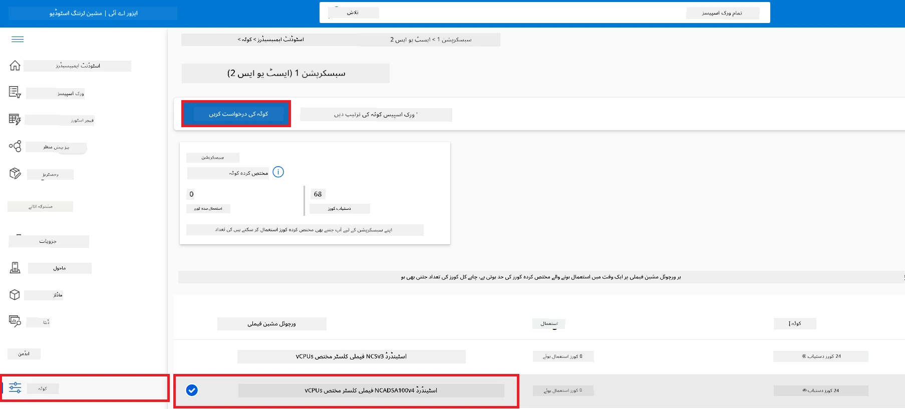

    - Request quota صفحہ کے اندر، وہ **New cores limit** درج کریں جو آپ استعمال کرنا چاہتے ہیں۔ مثال کے طور پر، 24۔
    - Request quota صفحہ میں، GPU کوٹہ کی درخواست کے لیے **Submit** منتخب کریں۔

> [!NOTE]
> آپ اپنی ضروریات کے لیے موزوں GPU یا CPU کا انتخاب [Sizes for Virtual Machines in Azure](https://learn.microsoft.com/azure/virtual-machines/sizes/overview?tabs=breakdownseries%2Cgeneralsizelist%2Ccomputesizelist%2Cmemorysizelist%2Cstoragesizelist%2Cgpusizelist%2Cfpgasizelist%2Chpcsizelist) دستاویز کو دیکھ کر کر سکتے ہیں۔

### رول اسائنمنٹ شامل کریں

اپنے ماڈلز کو Fine-tune اور تعینات کرنے کے لیے، آپ کو پہلے ایک User Assigned Managed Identity (UAI) بنانا ہوگا اور اسے مناسب اجازتیں دینی ہوں گی۔ یہ UAI تعیناتی کے دوران تصدیق کے لیے استعمال کی جائے گی۔

#### User Assigned Managed Identity (UAI) بنائیں

1. پورٹل صفحہ کے اوپر **تلاش بار** میں *managed identities* ٹائپ کریں اور ظاہر ہونے والے آپشنز میں سے **Managed Identities** منتخب کریں۔

    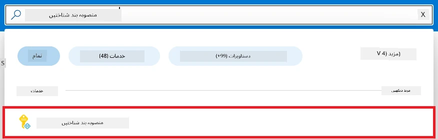

1. **+ Create** منتخب کریں۔

    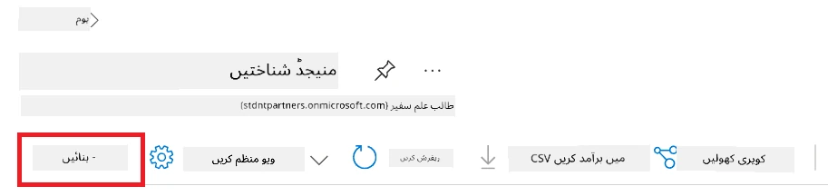

1. درج ذیل کام انجام دیں:

    - اپنی Azure **Subscription** منتخب کریں۔
    - جس **Resource group** کا استعمال کرنا ہے اسے منتخب کریں (ضرورت پڑنے پر نیا بنائیں)۔
    - وہ **Region** منتخب کریں جہاں آپ کام کرنا چاہتے ہیں۔
    - **Name** درج کریں۔ یہ منفرد ہونا چاہیے۔

1. **Review + create** منتخب کریں۔

1. **+ Create** منتخب کریں۔

#### Managed Identity کو Contributor رول اسائنمنٹ دیں

1. اس Managed Identity ریسورس پر جائیں جو آپ نے بنائی ہے۔

1. بائیں طرف کے ٹیب سے **Azure role assignments** منتخب کریں۔

1. نیویگیشن مینو سے **+Add role assignment** منتخب کریں۔

1. Add role assignment صفحہ کے اندر، درج ذیل کام کریں:
    - **Scope** کو **Resource group** پر سیٹ کریں۔
    - اپنی Azure **Subscription** منتخب کریں۔
    - استعمال کرنے والے **Resource group** کو منتخب کریں۔
    - **Role** کو **Contributor** منتخب کریں۔

    

1. **Save** منتخب کریں۔

#### Managed Identity کو Storage Blob Data Reader رول اسائنمنٹ دیں

1. پورٹل صفحہ کے اوپر **تلاش بار** میں *storage accounts* ٹائپ کریں اور ظاہر ہونے والے آپشنز میں سے **Storage accounts** منتخب کریں۔

    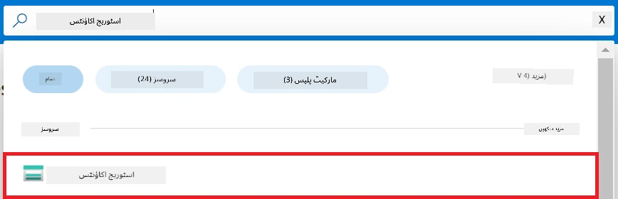

1. اس storage account کو منتخب کریں جو آپ کے Azure Machine Learning ورک اسپیس سے مربوط ہے۔ مثال کے طور پر، *finetunephistorage*۔

1. Add role assignment صفحہ پر جانے کے لیے درج ذیل کام کریں:

    - Azure Storage account پر جائیں جو آپ نے بنایا ہے۔
    - بائیں طرف کے ٹیب سے **Access Control (IAM)** منتخب کریں۔
    - نیویگیشن مینو سے **+ Add** منتخب کریں۔
    - نیویگیشن مینو سے **Add role assignment** منتخب کریں۔

    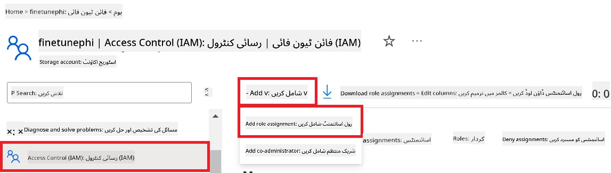

1. Add role assignment صفحہ کے اندر درج ذیل کام کریں:

    - Role صفحہ میں، **تلاش بار** میں *Storage Blob Data Reader* ٹائپ کریں اور ظاہر ہونے والے آپشنز میں سے **Storage Blob Data Reader** منتخب کریں۔
    - Role صفحہ میں، **Next** منتخب کریں۔
    - Members صفحہ میں، **Assign access to** کے تحت **Managed identity** منتخب کریں۔
    - Members صفحہ میں، **+ Select members** منتخب کریں۔
    - Select managed identities صفحہ میں، اپنی Azure **Subscription** منتخب کریں۔
    - Select managed identities صفحہ میں، **Managed identity** کے لیے **Manage Identity** منتخب کریں۔
    - Select managed identities صفحہ میں، وہ Manage Identity منتخب کریں جو آپ نے بنائی ہے۔ مثال کے طور پر، *finetunephi-managedidentity*۔
    - Select managed identities صفحہ میں، **Select** منتخب کریں۔

    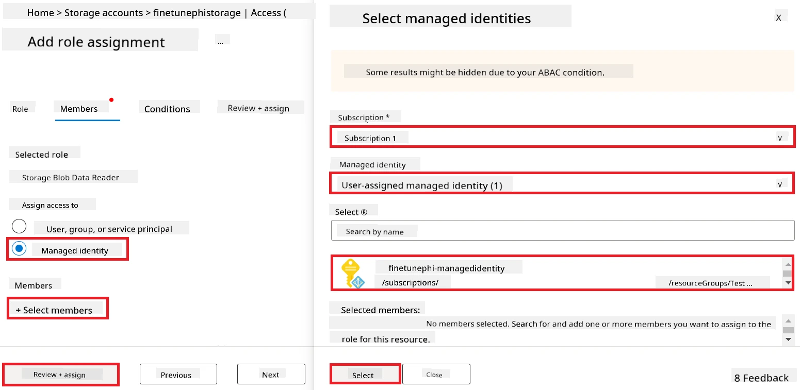

1. **Review + assign** منتخب کریں۔

#### Managed Identity کو AcrPull رول اسائنمنٹ دیں

1. پورٹل صفحہ کے اوپر **تلاش بار** میں *container registries* ٹائپ کریں اور ظاہر ہونے والے آپشنز میں سے **Container registries** منتخب کریں۔

    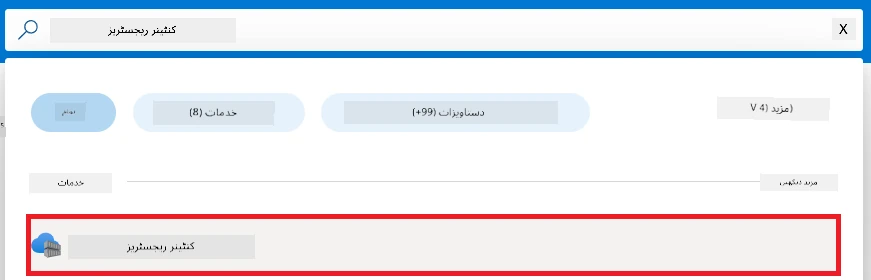

1. اس container registry کو منتخب کریں جو Azure Machine Learning ورک اسپیس سے مربوط ہے۔ مثال کے طور پر، *finetunephicontainerregistries*

1. Add role assignment صفحہ پر جانے کے لیے درج ذیل کریں:

    - بائیں طرف کے ٹیب سے **Access Control (IAM)** منتخب کریں۔
    - نیویگیشن مینو سے **+ Add** منتخب کریں۔
    - نیویگیشن مینو سے **Add role assignment** منتخب کریں۔

1. Add role assignment صفحہ میں، درج ذیل کام کریں:

    - Role صفحہ میں، **تلاش بار** میں *AcrPull* ٹائپ کریں اور ظاہر ہونے والے آپشنز میں سے **AcrPull** منتخب کریں۔
    - Role صفحہ میں، **Next** منتخب کریں۔
    - Members صفحہ میں، **Assign access to** کے تحت **Managed identity** منتخب کریں۔
    - Members صفحہ میں، **+ Select members** منتخب کریں۔
    - Select managed identities صفحہ میں، اپنی Azure **Subscription** منتخب کریں۔
    - Select managed identities صفحہ میں، **Managed identity** کے لیے **Manage Identity** منتخب کریں۔
    - Select managed identities صفحہ میں، وہ Manage Identity منتخب کریں جو آپ نے بنائی ہے۔ مثال کے طور پر، *finetunephi-managedidentity*۔
    - Select managed identities صفحہ میں، **Select** منتخب کریں۔
    - **Review + assign** منتخب کریں۔

### پروجیکٹ ترتیب دیں

اب، آپ ایک فولڈر بنائیں گے جہاں کام کریں گے اور ایک ورچوئل انوائرمنٹ ترتیب دیں گے تاکہ ایسا پروگرام تیار کیا جا سکے جو صارفین کے ساتھ تعامل کرے اور Azure Cosmos DB میں محفوظ شدہ چیٹ ہسٹری سے حاصل معلومات کی بنیاد پر جوابات دے۔

#### کام کرنے کے لیے فولڈر بنائیں

1. ٹرمینل ونڈو کھولیں اور ڈیفالٹ راہ میں *finetune-phi* نامی فولڈر بنانے کے لیے درج ذیل کمانڈ ٹائپ کریں۔

    ```console
    mkdir finetune-phi
    ```

1. ٹرمینل میں درج ذیل کمانڈ لکھیں تاکہ آپ اس *finetune-phi* فولڈر میں جا سکیں جو آپ نے بنایا ہے۔

    ```console
    cd finetune-phi
    ```

#### ورچوئل انوائرمنٹ بنائیں

1. ٹرمینل میں درج ذیل کمانڈ لکھیں تاکہ *.venv* نامی ورچوئل انوائرمنٹ بنائی جائے۔

    ```console
    python -m venv .venv
    ```

1. ٹرمینل میں درج ذیل کمانڈ لکھیں تاکہ ورچوئل انوائرمنٹ کو ایکٹیویٹ کیا جا سکے۔

    ```console
    .venv\Scripts\activate.bat
    ```

> [!NOTE]
>
> اگر یہ کام کر گیا تو، آپ کو کمانڈ پرامپٹ کے شروع میں *(.venv)* نظر آئے گا۔

#### درکار پیکیجز انسٹال کریں

1. ضرورت کے مطابق پیکیجز انسٹال کرنے کے لیے ٹرمینل میں درج ذیل کمانڈز ٹائپ کریں۔

    ```console
    pip install datasets==2.19.1
    pip install transformers==4.41.1
    pip install azure-ai-ml==1.16.0
    pip install torch==2.3.1
    pip install trl==0.9.4
    pip install promptflow==1.12.0
    ```

#### پروجیکٹ فائلز بنائیں
اس مشق میں، آپ ہمارے پروجیکٹ کے لیے ضروری فائلیں تیار کریں گے۔ یہ فائلیں ڈیٹا سیٹ ڈاؤن لوڈ کرنے، Azure Machine Learning ماحول قائم کرنے، Phi-3 ماڈل کی فائن ٹیوننگ کرنے، اور فائن ٹیون شدہ ماڈل کو تعینات کرنے کے لیے اسکرپٹس پر مشتمل ہوں گی۔ آپ ایک *conda.yml* فائل بھی بنائیں گے تاکہ فائن ٹیوننگ کے ماحول کو سیٹ اپ کیا جا سکے۔

اس مشق میں، آپ کریں گے:

- *download_dataset.py* فائل بنائیں گے تاکہ ڈیٹا سیٹ ڈاؤن لوڈ کیا جا سکے۔
- *setup_ml.py* فائل بنائیں گے تاکہ Azure Machine Learning ماحول کو سیٹ اپ کیا جا سکے۔
- *finetuning_dir* فولڈر میں *fine_tune.py* فائل بنائیں گے تاکہ ڈیٹا سیٹ استعمال کرتے ہوئے Phi-3 ماڈل کی فائن ٹیوننگ کی جا سکے۔
- فائن ٹیوننگ کے ماحول کو سیٹ اپ کرنے کے لیے *conda.yml* فائل بنائیں گے۔
- فائن ٹیون شدہ ماڈل کو تعینات کرنے کے لیے *deploy_model.py* فائل بنائیں گے۔
- فائن ٹیون شدہ ماڈل کو انٹیگریٹ کرنے اور Prompt flow کے ذریعے ماڈل کو چلانے کے لیے *integrate_with_promptflow.py* فائل بنائیں گے۔
- Prompt flow کے لیے ورک فلو ڈھانچہ سیٹ اپ کرنے کے لیے flow.dag.yml فائل بنائیں گے۔
- Azure کی معلومات درج کرنے کے لیے *config.py* فائل بنائیں گے۔

> [!NOTE]
>
> مکمل فولڈر ڈھانچہ:
>
> ```text
> └── YourUserName
> .    └── finetune-phi
> .        ├── finetuning_dir
> .        │      └── fine_tune.py
> .        ├── conda.yml
> .        ├── config.py
> .        ├── deploy_model.py
> .        ├── download_dataset.py
> .        ├── flow.dag.yml
> .        ├── integrate_with_promptflow.py
> .        └── setup_ml.py
> ```

1. **Visual Studio Code** کھولیں۔

1. مینو بار سے **File** منتخب کریں۔

1. **Open Folder** منتخب کریں۔

1. *finetune-phi* فولڈر منتخب کریں جو آپ نے بنایا ہے، جو کہ *C:\Users\yourUserName\finetune-phi* پر واقع ہے۔

    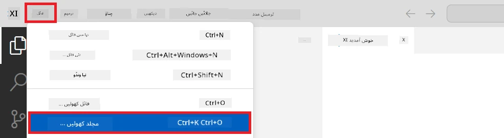

1. Visual Studio Code کے بائیں پین میں، رائٹ کلک کریں اور **New File** منتخب کریں تاکہ *download_dataset.py* نامی نئی فائل بنائیں۔

1. Visual Studio Code کے بائیں پین میں، رائٹ کلک کریں اور **New File** منتخب کریں تاکہ *setup_ml.py* نامی نئی فائل بنائیں۔

1. Visual Studio Code کے بائیں پین میں، رائٹ کلک کریں اور **New File** منتخب کریں تاکہ *deploy_model.py* نامی نئی فائل بنائیں۔

    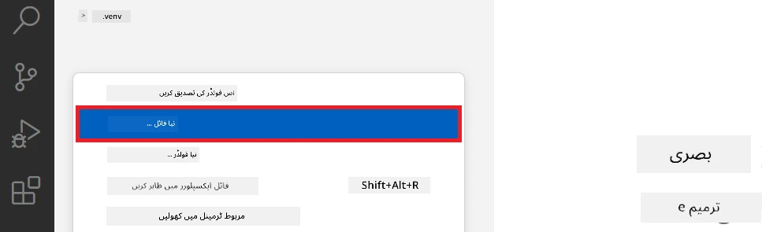

1. Visual Studio Code کے بائیں پین میں، رائٹ کلک کریں اور **New Folder** منتخب کریں تاکہ *finetuning_dir* نامی نیا فولڈر بنائیں۔

1. *finetuning_dir* فولڈر میں، *fine_tune.py* نامی نئی فائل بنائیں۔

#### *conda.yml* فائل بنائیں اور ترتیب دیں

1. Visual Studio Code کے بائیں پین میں، رائٹ کلک کریں اور **New File** منتخب کریں تاکہ *conda.yml* نامی نئی فائل بنائیں۔

1. *conda.yml* فائل میں درج ذیل کوڈ شامل کریں تاکہ Phi-3 ماڈل کے فائن ٹیوننگ کے ماحول کو سیٹ اپ کیا جا سکے۔

    ```yml
    name: phi-3-training-env
    channels:
      - defaults
      - conda-forge
    dependencies:
      - python=3.10
      - pip
      - numpy<2.0
      - pip:
          - torch==2.4.0
          - torchvision==0.19.0
          - trl==0.8.6
          - transformers==4.41
          - datasets==2.21.0
          - azureml-core==1.57.0
          - azure-storage-blob==12.19.0
          - azure-ai-ml==1.16
          - azure-identity==1.17.1
          - accelerate==0.33.0
          - mlflow==2.15.1
          - azureml-mlflow==1.57.0
    ```

#### *config.py* فائل بنائیں اور ترتیب دیں

1. Visual Studio Code کے بائیں پین میں، رائٹ کلک کریں اور **New File** منتخب کریں تاکہ *config.py* نامی نئی فائل بنائیں۔

1. *config.py* فائل میں اپنا Azure معلومات شامل کرنے کے لیے درج ذیل کوڈ شامل کریں۔

    ```python
    # ایزور کی ترتیبات
    AZURE_SUBSCRIPTION_ID = "your_subscription_id"
    AZURE_RESOURCE_GROUP_NAME = "your_resource_group_name" # "TestGroup"

    # ایزور مشین لرننگ کی ترتیبات
    AZURE_ML_WORKSPACE_NAME = "your_workspace_name" # "finetunephi-workspace"

    # ایزور منیجڈ شناخت کی ترتیبات
    AZURE_MANAGED_IDENTITY_CLIENT_ID = "your_azure_managed_identity_client_id"
    AZURE_MANAGED_IDENTITY_NAME = "your_azure_managed_identity_name" # "finetunephi-mangedidentity"
    AZURE_MANAGED_IDENTITY_RESOURCE_ID = f"/subscriptions/{AZURE_SUBSCRIPTION_ID}/resourceGroups/{AZURE_RESOURCE_GROUP_NAME}/providers/Microsoft.ManagedIdentity/userAssignedIdentities/{AZURE_MANAGED_IDENTITY_NAME}"

    # ڈیٹا سیٹ فائل کے راستے
    TRAIN_DATA_PATH = "data/train_data.jsonl"
    TEST_DATA_PATH = "data/test_data.jsonl"

    # فائن ٹون کردہ ماڈل کی ترتیبات
    AZURE_MODEL_NAME = "your_fine_tuned_model_name" # "finetune-phi-model"
    AZURE_ENDPOINT_NAME = "your_fine_tuned_model_endpoint_name" # "finetune-phi-endpoint"
    AZURE_DEPLOYMENT_NAME = "your_fine_tuned_model_deployment_name" # "finetune-phi-deployment"

    AZURE_ML_API_KEY = "your_fine_tuned_model_api_key"
    AZURE_ML_ENDPOINT = "your_fine_tuned_model_endpoint_uri" # "https://{your-endpoint-name}.{your-region}.inference.ml.azure.com/score"
    ```

#### Azure کے ماحول کے متغیرات شامل کریں

1. Azure Subscription ID شامل کرنے کے لیے درج ذیل کام کریں:

    - پورٹل پیج کے اوپر **search bar** میں *subscriptions* ٹائپ کریں اور ظاہر ہونے والے آپشنز میں سے **Subscriptions** منتخب کریں۔
    - وہ Azure Subscription منتخب کریں جو آپ استعمال کر رہے ہیں۔
    - اپنا Subscription ID کاپی کر کے *config.py* فائل میں چسپاں کریں۔

    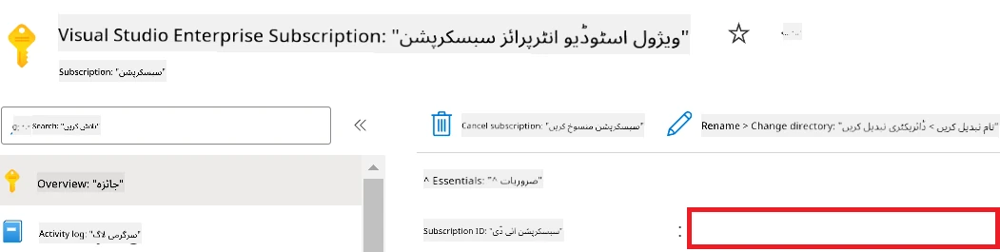

1. Azure Workspace Name شامل کرنے کے لیے درج ذیل کام کریں:

    - Azure Machine Learning ریسورس پر جائیں جو آپ نے بنایا ہے۔
    - اپنا اکاؤنٹ نام کاپی کر کے *config.py* فائل میں چسپاں کریں۔

    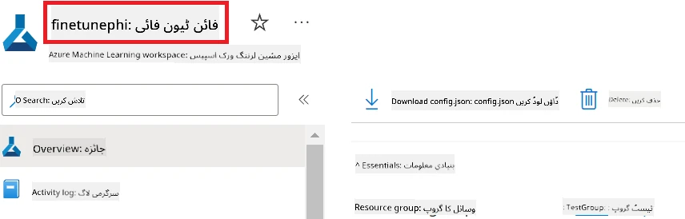

1. Azure Resource Group Name شامل کرنے کے لیے درج ذیل کام کریں:

    - Azure Machine Learning ریسورس پر جائیں جو آپ نے بنایا ہے۔
    - اپنا Azure Resource Group Name کاپی کر کے *config.py* فائل میں چسپاں کریں۔

    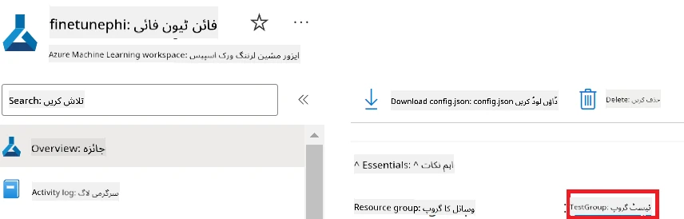

2. Azure Managed Identity کا نام شامل کرنے کے لیے درج ذیل کام کریں:

    - Managed Identities ریسورس پر جائیں جو آپ نے بنایا ہے۔
    - اپنا Azure Managed Identity کا نام کاپی کر کے *config.py* فائل میں چسپاں کریں۔

    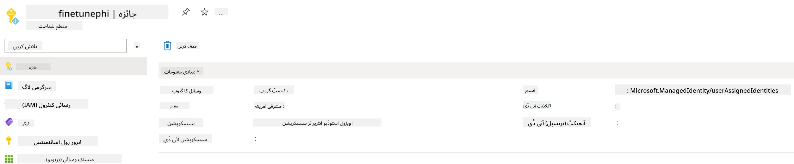

### فائن ٹیوننگ کے لیے ڈیٹا سیٹ تیار کریں

اس مشق میں، آپ *download_dataset.py* فائل چلائیں گے تاکہ *ULTRACHAT_200k* ڈیٹا سیٹس کو اپنی لوکل ماحول میں ڈاؤن لوڈ کیا جا سکے۔ اس کے بعد آپ اس ڈیٹا سیٹ کو Azure Machine Learning میں Phi-3 ماڈل کی فائن ٹیوننگ کے لیے استعمال کریں گے۔

#### *download_dataset.py* فائل کے ذریعے اپنا ڈیٹا سیٹ ڈاؤن لوڈ کریں

1. Visual Studio Code میں *download_dataset.py* فائل کھولیں۔

1. *download_dataset.py* میں درج ذیل کوڈ شامل کریں۔

    ```python
    import json
    import os
    from datasets import load_dataset
    from config import (
        TRAIN_DATA_PATH,
        TEST_DATA_PATH)

    def load_and_split_dataset(dataset_name, config_name, split_ratio):
        """
        Load and split a dataset.
        """
        # مخصوص نام، ترتیب، اور تقسیم تناسب کے ساتھ ڈیٹا سیٹ لوڈ کریں
        dataset = load_dataset(dataset_name, config_name, split=split_ratio)
        print(f"Original dataset size: {len(dataset)}")
        
        # ڈیٹا سیٹ کو ٹرین اور ٹیسٹ سیٹ میں تقسیم کریں (80٪ ٹرین، 20٪ ٹیسٹ)
        split_dataset = dataset.train_test_split(test_size=0.2)
        print(f"Train dataset size: {len(split_dataset['train'])}")
        print(f"Test dataset size: {len(split_dataset['test'])}")
        
        return split_dataset

    def save_dataset_to_jsonl(dataset, filepath):
        """
        Save a dataset to a JSONL file.
        """
        # اگر ڈائریکٹری موجود نہیں ہے تو اسے بنائیں
        os.makedirs(os.path.dirname(filepath), exist_ok=True)
        
        # فائل کو تحریری وضع میں کھولیں
        with open(filepath, 'w', encoding='utf-8') as f:
            # ڈیٹا سیٹ میں ہر ریکارڈ پر تکرار کریں
            for record in dataset:
                # ریکارڈ کو JSON آبجیکٹ کے طور پر ڈمپ کریں اور فائل میں لکھیں
                json.dump(record, f)
                # ریکارڈز کو الگ کرنے کے لیے نیو لائن کیریکٹر لکھیں
                f.write('\n')
        
        print(f"Dataset saved to {filepath}")

    def main():
        """
        Main function to load, split, and save the dataset.
        """
        # ULTRACHAT_200k ڈیٹا سیٹ کو مخصوص ترتیب اور تقسیم تناسب کے ساتھ لوڈ اور تقسیم کریں
        dataset = load_and_split_dataset("HuggingFaceH4/ultrachat_200k", 'default', 'train_sft[:1%]')
        
        # تقسیم سے ٹرین اور ٹیسٹ ڈیٹا سیٹ نکالیں
        train_dataset = dataset['train']
        test_dataset = dataset['test']

        # ٹرین ڈیٹا سیٹ کو JSONL فائل میں محفوظ کریں
        save_dataset_to_jsonl(train_dataset, TRAIN_DATA_PATH)
        
        # ٹیسٹ ڈیٹا سیٹ کو ایک الگ JSONL فائل میں محفوظ کریں
        save_dataset_to_jsonl(test_dataset, TEST_DATA_PATH)

    if __name__ == "__main__":
        main()

    ```

> [!TIP]
>
> **کم سے کم ڈیٹا سیٹ کے ساتھ CPU استعمال کرتے ہوئے فائن ٹیوننگ کے لیے رہنمائی**
>
> اگر آپ CPU استعمال کرنا چاہتے ہیں فائن ٹیوننگ کے لیے، تو یہ طریقہ ان صارفین کے لیے مثالی ہے جن کے پاس فوائد والی سبسکرپشنز ہیں (جیسے Visual Studio Enterprise Subscription) یا جو تیزی سے فائن ٹیوننگ اور تعیناتی کے عمل کو ٹیسٹ کرنا چاہتے ہیں۔
>
> `dataset = load_and_split_dataset("HuggingFaceH4/ultrachat_200k", 'default', 'train_sft[:1%]')` کو `dataset = load_and_split_dataset("HuggingFaceH4/ultrachat_200k", 'default', 'train_sft[:10]')` سے تبدیل کریں۔
>

1. اپنا ٹرمینل میں درج ذیل کمانڈ ٹائپ کریں تاکہ اسکرپٹ چلائیں اور ڈیٹا سیٹ کو اپنی لوکل ماحول میں ڈاؤن لوڈ کریں۔

    ```console
    python download_data.py
    ```

1. تصدیق کریں کہ ڈیٹا سیٹس کامیابی سے آپ کے لوکل *finetune-phi/data* ڈائریکٹری میں محفوظ ہو چکے ہیں۔

> [!NOTE]
>
> **ڈیٹا سیٹ کا سائز اور فائن ٹیوننگ کا وقت**
>
> اس E2E سیمپل میں، آپ صرف ڈیٹا سیٹ کا 1٪ (`train_sft[:1%]`) استعمال کر رہے ہیں۔ یہ ڈیٹا کی مقدار کو نمایاں طور پر کم کرتا ہے، جس سے اپ لوڈ اور فائن ٹیوننگ کے عمل کی رفتار بڑھ جاتی ہے۔ آپ فیصد کو اس طرح ایڈجسٹ کر سکتے ہیں کہ تربیت کے وقت اور ماڈل کی کارکردگی کے درمیان مناسب توازن مل جائے۔ ڈیٹا سیٹ کا چھوٹا حصہ استعمال کرنے سے فائن ٹیوننگ کا وقت کم ہوتا ہے، جس سے E2E سیمپل کے لیے عمل زیادہ قابلِ انتظام ہو جاتا ہے۔

## منظر نامہ 2: Phi-3 ماڈل کی فائن ٹیوننگ اور Azure Machine Learning اسٹوڈیو میں تعیناتی

### Azure CLI سیٹ اپ کریں

آپ کو اپنے ماحول کو مستند کرنے کے لیے Azure CLI سیٹ اپ کرنا ہوگا۔ Azure CLI آپ کو کمانڈ لائن سے براہ راست Azure ریسورسز کا انتظام کرنے کی اجازت دیتا ہے اور Azure Machine Learning کو ان ریسورسز تک رسائی کے لیے ضروری اسناد فراہم کرتا ہے۔ شروع کرنے کے لیے [Azure CLI](https://learn.microsoft.com/cli/azure/install-azure-cli) انسٹال کریں۔

1. ٹرمینل ونڈو کھولیں اور Azure اکاؤنٹ میں لاگ ان کرنے کے لیے درج ذیل کمانڈ ٹائپ کریں۔

    ```console
    az login
    ```

1. استعمال کے لیے اپنا Azure اکاؤنٹ منتخب کریں۔

1. استعمال کے لیے اپنی Azure سبسکرپشن منتخب کریں۔

    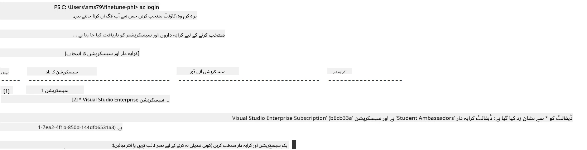

> [!TIP]
>
> اگر آپ کو Azure میں سائن ان کرنے میں دشواری ہو رہی ہے، تو ڈیوائس کوڈ استعمال کرنے کی کوشش کریں۔ ٹرمینل ونڈو کھولیں اور Azure اکاؤنٹ میں سائن ان کرنے کے لیے درج ذیل کمانڈ ٹائپ کریں:
>
> ```console
> az login --use-device-code
> ```


### Phi-3 ماڈل کی فائن ٹیوننگ کریں

اس مشق میں، آپ فراہم کردہ ڈیٹا سیٹ کا استعمال کرتے ہوئے Phi-3 ماڈل کی فائن ٹیوننگ کریں گے۔ سب سے پہلے، آپ *fine_tune.py* فائل میں فائن ٹیوننگ کے عمل کو ڈیفائن کریں گے۔ پھر، آپ Azure Machine Learning ماحول کو ترتیب دیں گے اور *setup_ml.py* فائل چلانے کے ذریعے فائن ٹیوننگ کے عمل کی شروعات کریں گے۔ یہ اسکرپٹ یقینی بنائے گا کہ فائن ٹیوننگ Azure Machine Learning کے ماحول میں ہو۔

*setup_ml.py* فائل چلا کر، آپ Azure Machine Learning ماحول میں فائن ٹیوننگ کے عمل کو چلائیں گے۔

#### *fine_tune.py* فائل میں کوڈ شامل کریں

1. *finetuning_dir* فولڈر پر جائیں اور Visual Studio Code میں *fine_tune.py* فائل کھولیں۔

1. *fine_tune.py* میں درج ذیل کوڈ شامل کریں۔

    ```python
    import argparse
    import sys
    import logging
    import os
    from datasets import load_dataset
    import torch
    import mlflow
    from transformers import AutoModelForCausalLM, AutoTokenizer, TrainingArguments
    from trl import SFTTrainer

    # MLflow میں INVALID_PARAMETER_VALUE کی خرابی سے بچنے کے لیے، MLflow انٹیگریشن کو غیر فعال کریں
    os.environ["DISABLE_MLFLOW_INTEGRATION"] = "True"

    # لاگنگ سیٹ اپ
    logging.basicConfig(
        format="%(asctime)s - %(levelname)s - %(name)s - %(message)s",
        datefmt="%Y-%m-%d %H:%M:%S",
        handlers=[logging.StreamHandler(sys.stdout)],
        level=logging.WARNING
    )
    logger = logging.getLogger(__name__)

    def initialize_model_and_tokenizer(model_name, model_kwargs):
        """
        Initialize the model and tokenizer with the given pretrained model name and arguments.
        """
        model = AutoModelForCausalLM.from_pretrained(model_name, **model_kwargs)
        tokenizer = AutoTokenizer.from_pretrained(model_name)
        tokenizer.model_max_length = 2048
        tokenizer.pad_token = tokenizer.unk_token
        tokenizer.pad_token_id = tokenizer.convert_tokens_to_ids(tokenizer.pad_token)
        tokenizer.padding_side = 'right'
        return model, tokenizer

    def apply_chat_template(example, tokenizer):
        """
        Apply a chat template to tokenize messages in the example.
        """
        messages = example["messages"]
        if messages[0]["role"] != "system":
            messages.insert(0, {"role": "system", "content": ""})
        example["text"] = tokenizer.apply_chat_template(
            messages, tokenize=False, add_generation_prompt=False
        )
        return example

    def load_and_preprocess_data(train_filepath, test_filepath, tokenizer):
        """
        Load and preprocess the dataset.
        """
        train_dataset = load_dataset('json', data_files=train_filepath, split='train')
        test_dataset = load_dataset('json', data_files=test_filepath, split='train')
        column_names = list(train_dataset.features)

        train_dataset = train_dataset.map(
            apply_chat_template,
            fn_kwargs={"tokenizer": tokenizer},
            num_proc=10,
            remove_columns=column_names,
            desc="Applying chat template to train dataset",
        )

        test_dataset = test_dataset.map(
            apply_chat_template,
            fn_kwargs={"tokenizer": tokenizer},
            num_proc=10,
            remove_columns=column_names,
            desc="Applying chat template to test dataset",
        )

        return train_dataset, test_dataset

    def train_and_evaluate_model(train_dataset, test_dataset, model, tokenizer, output_dir):
        """
        Train and evaluate the model.
        """
        training_args = TrainingArguments(
            bf16=True,
            do_eval=True,
            output_dir=output_dir,
            eval_strategy="epoch",
            learning_rate=5.0e-06,
            logging_steps=20,
            lr_scheduler_type="cosine",
            num_train_epochs=3,
            overwrite_output_dir=True,
            per_device_eval_batch_size=4,
            per_device_train_batch_size=4,
            remove_unused_columns=True,
            save_steps=500,
            seed=0,
            gradient_checkpointing=True,
            gradient_accumulation_steps=1,
            warmup_ratio=0.2,
        )

        trainer = SFTTrainer(
            model=model,
            args=training_args,
            train_dataset=train_dataset,
            eval_dataset=test_dataset,
            max_seq_length=2048,
            dataset_text_field="text",
            tokenizer=tokenizer,
            packing=True
        )

        train_result = trainer.train()
        trainer.log_metrics("train", train_result.metrics)

        mlflow.transformers.log_model(
            transformers_model={"model": trainer.model, "tokenizer": tokenizer},
            artifact_path=output_dir,
        )

        tokenizer.padding_side = 'left'
        eval_metrics = trainer.evaluate()
        eval_metrics["eval_samples"] = len(test_dataset)
        trainer.log_metrics("eval", eval_metrics)

    def main(train_file, eval_file, model_output_dir):
        """
        Main function to fine-tune the model.
        """
        model_kwargs = {
            "use_cache": False,
            "trust_remote_code": True,
            "torch_dtype": torch.bfloat16,
            "device_map": None,
            "attn_implementation": "eager"
        }

        # pretrained_model_name = "microsoft/Phi-3-mini-4k-instruct"
        pretrained_model_name = "microsoft/Phi-3.5-mini-instruct"

        with mlflow.start_run():
            model, tokenizer = initialize_model_and_tokenizer(pretrained_model_name, model_kwargs)
            train_dataset, test_dataset = load_and_preprocess_data(train_file, eval_file, tokenizer)
            train_and_evaluate_model(train_dataset, test_dataset, model, tokenizer, model_output_dir)

    if __name__ == "__main__":
        parser = argparse.ArgumentParser()
        parser.add_argument("--train-file", type=str, required=True, help="Path to the training data")
        parser.add_argument("--eval-file", type=str, required=True, help="Path to the evaluation data")
        parser.add_argument("--model_output_dir", type=str, required=True, help="Directory to save the fine-tuned model")
        args = parser.parse_args()
        main(args.train_file, args.eval_file, args.model_output_dir)

    ```

1. *fine_tune.py* فائل کو محفوظ کریں اور بند کریں۔

> [!TIP]
> **آپ Phi-3.5 ماڈل کی بھی فائن ٹیوننگ کر سکتے ہیں**
>
> *fine_tune.py* فائل میں، آپ `pretrained_model_name` کو `"microsoft/Phi-3-mini-4k-instruct"` سے بدل کر کسی بھی ماڈل تک فائن ٹیوننگ کر سکتے ہیں جو آپ چاہیں۔ مثال کے طور پر، اگر آپ اسے `"microsoft/Phi-3.5-mini-instruct"` کر دیں تو آپ Phi-3.5-mini-instruct ماڈل کے ساتھ فائن ٹیوننگ کر رہے ہوں گے۔ اپنی پسند کا ماڈل نام ڈھونڈنے اور استعمال کرنے کے لیے، [Hugging Face](https://huggingface.co/) وزٹ کریں، ماڈل تلاش کریں، اور نام کو اپنے اسکرپٹ میں `pretrained_model_name` فیلڈ میں کاپی کر کے چسپاں کریں۔
>
> <image type="content" src="../../../../imgs/02/FineTuning-PromptFlow/finetunephi3.5.png" alt-text="Fine tune Phi-3.5.">
>

#### *setup_ml.py* فائل میں کوڈ شامل کریں

1. Visual Studio Code میں *setup_ml.py* فائل کھولیں۔

1. *setup_ml.py* میں درج ذیل کوڈ شامل کریں۔

    ```python
    import logging
    from azure.ai.ml import MLClient, command, Input
    from azure.ai.ml.entities import Environment, AmlCompute
    from azure.identity import AzureCliCredential
    from config import (
        AZURE_SUBSCRIPTION_ID,
        AZURE_RESOURCE_GROUP_NAME,
        AZURE_ML_WORKSPACE_NAME,
        TRAIN_DATA_PATH,
        TEST_DATA_PATH
    )

    # مستقلات

    # تربیت کے لیے سی پی یو انسٹانس استعمال کرنے کے لیے درج ذیل لائنوں کو غیر تبصرہ کریں
    # COMPUTE_INSTANCE_TYPE = "Standard_E16s_v3" # cpu
    # COMPUTE_NAME = "cpu-e16s-v3"
    # DOCKER_IMAGE_NAME = "mcr.microsoft.com/azureml/openmpi4.1.0-ubuntu20.04:latest"

    # تربیت کے لیے جی پی یو انسٹانس استعمال کرنے کے لیے درج ذیل لائنوں کو غیر تبصرہ کریں
    COMPUTE_INSTANCE_TYPE = "Standard_NC24ads_A100_v4"
    COMPUTE_NAME = "gpu-nc24s-a100-v4"
    DOCKER_IMAGE_NAME = "mcr.microsoft.com/azureml/curated/acft-hf-nlp-gpu:59"

    CONDA_FILE = "conda.yml"
    LOCATION = "eastus2" # اپنے کمپیوٹ کلسٹر کی جگہ سے تبدیل کریں
    FINETUNING_DIR = "./finetuning_dir" # فائن ٹیوننگ اسکرپٹ کا راستہ
    TRAINING_ENV_NAME = "phi-3-training-environment" # تربیتی ماحول کا نام
    MODEL_OUTPUT_DIR = "./model_output" # Azure ML میں ماڈل آؤٹ پٹ ڈائریکٹری کا راستہ

    # عمل کو ٹریک کرنے کے لیے لاگنگ سیٹ اپ
    logger = logging.getLogger(__name__)
    logging.basicConfig(
        format="%(asctime)s - %(levelname)s - %(name)s - %(message)s",
        datefmt="%Y-%m-%d %H:%M:%S",
        level=logging.WARNING
    )

    def get_ml_client():
        """
        Initialize the ML Client using Azure CLI credentials.
        """
        credential = AzureCliCredential()
        return MLClient(credential, AZURE_SUBSCRIPTION_ID, AZURE_RESOURCE_GROUP_NAME, AZURE_ML_WORKSPACE_NAME)

    def create_or_get_environment(ml_client):
        """
        Create or update the training environment in Azure ML.
        """
        env = Environment(
            image=DOCKER_IMAGE_NAME,  # ماحول کے لیے ڈاکر امیج
            conda_file=CONDA_FILE,  # کوندا ماحول فائل
            name=TRAINING_ENV_NAME,  # ماحول کا نام
        )
        return ml_client.environments.create_or_update(env)

    def create_or_get_compute_cluster(ml_client, compute_name, COMPUTE_INSTANCE_TYPE, location):
        """
        Create or update the compute cluster in Azure ML.
        """
        try:
            compute_cluster = ml_client.compute.get(compute_name)
            logger.info(f"Compute cluster '{compute_name}' already exists. Reusing it for the current run.")
        except Exception:
            logger.info(f"Compute cluster '{compute_name}' does not exist. Creating a new one with size {COMPUTE_INSTANCE_TYPE}.")
            compute_cluster = AmlCompute(
                name=compute_name,
                size=COMPUTE_INSTANCE_TYPE,
                location=location,
                tier="Dedicated",  # کمپیوٹ کلسٹر کی سطح
                min_instances=0,  # کم از کم انسٹانس کی تعداد
                max_instances=1  # زیادہ سے زیادہ انسٹانس کی تعداد
            )
            ml_client.compute.begin_create_or_update(compute_cluster).wait()  # کلسٹر کے بننے کا انتظار کریں
        return compute_cluster

    def create_fine_tuning_job(env, compute_name):
        """
        Set up the fine-tuning job in Azure ML.
        """
        return command(
            code=FINETUNING_DIR,  # fine_tune.py کا راستہ
            command=(
                "python fine_tune.py "
                "--train-file ${{inputs.train_file}} "
                "--eval-file ${{inputs.eval_file}} "
                "--model_output_dir ${{inputs.model_output}}"
            ),
            environment=env,  # تربیتی ماحول
            compute=compute_name,  # استعمال کے لیے کمپیوٹ کلسٹر
            inputs={
                "train_file": Input(type="uri_file", path=TRAIN_DATA_PATH),  # تربیتی ڈیٹا فائل کا راستہ
                "eval_file": Input(type="uri_file", path=TEST_DATA_PATH),  # جائزہ لینے والے ڈیٹا فائل کا راستہ
                "model_output": MODEL_OUTPUT_DIR
            }
        )

    def main():
        """
        Main function to set up and run the fine-tuning job in Azure ML.
        """
        # ML کلائنٹ کو شروع کریں
        ml_client = get_ml_client()

        # ماحول بنائیں
        env = create_or_get_environment(ml_client)
        
        # کمپیوٹ کلسٹر بنائیں یا موجودہ حاصل کریں
        create_or_get_compute_cluster(ml_client, COMPUTE_NAME, COMPUTE_INSTANCE_TYPE, LOCATION)

        # فائن ٹیوننگ جاب بنائیں اور جمع کریں
        job = create_fine_tuning_job(env, COMPUTE_NAME)
        returned_job = ml_client.jobs.create_or_update(job)  # جاب جمع کریں
        ml_client.jobs.stream(returned_job.name)  # جاب لاگز کو اسٹریم کریں
        
        # جاب کا نام محفوظ کریں
        job_name = returned_job.name
        print(f"Job name: {job_name}")

    if __name__ == "__main__":
        main()

    ```

1. `COMPUTE_INSTANCE_TYPE`, `COMPUTE_NAME`, اور `LOCATION` کو اپنی مخصوص تفصیلات سے تبدیل کریں۔

    ```python
   # ٹریننگ کے لیے GPU انسٹانس استعمال کرنے کے لیے درج ذیل لائنوں سے تبصرہ ہٹائیں
    COMPUTE_INSTANCE_TYPE = "Standard_NC24ads_A100_v4"
    COMPUTE_NAME = "gpu-nc24s-a100-v4"
    ...
    LOCATION = "eastus2" # اپنے کمپیوٹ کلسٹر کی جگہ سے تبدیل کریں
    ```

> [!TIP]
>
> **کم سے کم ڈیٹا سیٹ کے ساتھ CPU استعمال کرتے ہوئے فائن ٹیوننگ کے لیے رہنمائی**
>
> اگر آپ CPU استعمال کرنا چاہتے ہیں فائن ٹیوننگ کے لیے، تو یہ طریقہ ان صارفین کے لیے مثالی ہے جن کے پاس فوائد والی سبسکرپشنز ہیں (جیسے Visual Studio Enterprise Subscription) یا جو تیزی سے فائن ٹیوننگ اور تعیناتی کے عمل کو ٹیسٹ کرنا چاہتے ہیں۔
>
> 1. *setup_ml* فائل کھولیں۔
> 1. `COMPUTE_INSTANCE_TYPE`, `COMPUTE_NAME`, اور `DOCKER_IMAGE_NAME` کو درج ذیل سے تبدیل کریں۔ اگر آپ کے پاس *Standard_E16s_v3* تک رسائی نہیں ہے، تو آپ کسی مساوی CPU انسٹنس استعمال کر سکتے ہیں یا نیا کوٹا درخواست کر سکتے ہیں۔
> 1. `LOCATION` کو اپنی مخصوص تفصیلات سے تبدیل کریں۔
>
>    ```python
>    # Uncomment the following lines to use a CPU instance for training
>    COMPUTE_INSTANCE_TYPE = "Standard_E16s_v3" # cpu
>    COMPUTE_NAME = "cpu-e16s-v3"
>    DOCKER_IMAGE_NAME = "mcr.microsoft.com/azureml/openmpi4.1.0-ubuntu20.04:latest"
>    LOCATION = "eastus2" # Replace with the location of your compute cluster
>    ```


1. ٹرمینل میں درج ذیل کمانڈ ٹائپ کریں تاکہ *setup_ml.py* اسکرپٹ چلایا جا سکے اور Azure Machine Learning میں فائن ٹیوننگ کا عمل شروع کیا جا سکے۔

    ```python
    python setup_ml.py
    ```

1. اس مشق میں، آپ نے Azure Machine Learning کا استعمال کرتے ہوئے کامیابی سے Phi-3 ماڈل کی فائن ٹیوننگ کی۔ *setup_ml.py* اسکرپٹ چلا کر آپ نے Azure Machine Learning ماحول سیٹ اپ کیا اور *fine_tune.py* فائل میں ڈیفائن کیے گئے فائن ٹیوننگ کے عمل کی شروعات کی۔ براہ کرم نوٹ کریں کہ فائن ٹیوننگ کا عمل کافی وقت لے سکتا ہے۔ `python setup_ml.py` کمانڈ چلانے کے بعد آپ کو عمل کے مکمل ہونے کا انتظار کرنا ہوگا۔ آپ ٹرمینل میں دیے گئے لنک کے ذریعے Azure Machine Learning پورٹل میں فائن ٹیوننگ جاب کی صورتحال مانیٹر کر سکتے ہیں۔

    

### فائن ٹیون شدہ ماڈل کو تعینات کریں

فائن ٹیون شدہ Phi-3 ماڈل کو Prompt Flow کے ساتھ انٹیگریٹ کرنے کے لیے، آپ کو ماڈل کو تعینات کرنا ہوگا تاکہ یہ رئیل ٹائم انفرنس کے لیے دستیاب ہو۔ اس عمل میں ماڈل کی رجسٹریشن، آن لائن اینڈپوائنٹ بنانا، اور ماڈل کو تعینات کرنا شامل ہے۔

#### تعیناتی کے لیے ماڈل کا نام، اینڈپوائنٹ کا نام، اور ڈیپلائمنٹ کا نام سیٹ کریں

1. *config.py* فائل کھولیں۔

1. `AZURE_MODEL_NAME = "your_fine_tuned_model_name"` کو اپنی ماڈل کے مطلوبہ نام سے تبدیل کریں۔

1. `AZURE_ENDPOINT_NAME = "your_fine_tuned_model_endpoint_name"` کو اپنی اینڈپوائنٹ کے مطلوبہ نام سے تبدیل کریں۔

1. `AZURE_DEPLOYMENT_NAME = "your_fine_tuned_model_deployment_name"` کو اپنی تعیناتی کے مطلوبہ نام سے تبدیل کریں۔

#### *deploy_model.py* فائل میں کوڈ شامل کریں

*deploy_model.py* فائل چلانے سے مکمل تعیناتی کا عمل خودکار ہو جاتا ہے۔ یہ ماڈل کی رجسٹریشن، اینڈپوائنٹ کی تخلیق، اور config.py فائل میں دی گئی سیٹنگز کے مطابق تعیناتی کر کے عمل درآمد کرتا ہے، جن میں ماڈل کا نام، اینڈپوائنٹ کا نام، اور تعیناتی کا نام شامل ہیں۔

1. Visual Studio Code میں *deploy_model.py* فائل کھولیں۔

1. *deploy_model.py* میں درج ذیل کوڈ شامل کریں۔

    ```python
    import logging
    from azure.identity import AzureCliCredential
    from azure.ai.ml import MLClient
    from azure.ai.ml.entities import Model, ProbeSettings, ManagedOnlineEndpoint, ManagedOnlineDeployment, IdentityConfiguration, ManagedIdentityConfiguration, OnlineRequestSettings
    from azure.ai.ml.constants import AssetTypes

    # ترتیب کی درآمدات
    from config import (
        AZURE_SUBSCRIPTION_ID,
        AZURE_RESOURCE_GROUP_NAME,
        AZURE_ML_WORKSPACE_NAME,
        AZURE_MANAGED_IDENTITY_RESOURCE_ID,
        AZURE_MANAGED_IDENTITY_CLIENT_ID,
        AZURE_MODEL_NAME,
        AZURE_ENDPOINT_NAME,
        AZURE_DEPLOYMENT_NAME
    )

    # مستقل اقدار
    JOB_NAME = "your-job-name"
    COMPUTE_INSTANCE_TYPE = "Standard_E4s_v3"

    deployment_env_vars = {
        "SUBSCRIPTION_ID": AZURE_SUBSCRIPTION_ID,
        "RESOURCE_GROUP_NAME": AZURE_RESOURCE_GROUP_NAME,
        "UAI_CLIENT_ID": AZURE_MANAGED_IDENTITY_CLIENT_ID,
    }

    # لاگنگ کی ترتیب
    logging.basicConfig(
        format="%(asctime)s - %(levelname)s - %(name)s - %(message)s",
        datefmt="%Y-%m-%d %H:%M:%S",
        level=logging.DEBUG
    )
    logger = logging.getLogger(__name__)

    def get_ml_client():
        """Initialize and return the ML Client."""
        credential = AzureCliCredential()
        return MLClient(credential, AZURE_SUBSCRIPTION_ID, AZURE_RESOURCE_GROUP_NAME, AZURE_ML_WORKSPACE_NAME)

    def register_model(ml_client, model_name, job_name):
        """Register a new model."""
        model_path = f"azureml://jobs/{job_name}/outputs/artifacts/paths/model_output"
        logger.info(f"Registering model {model_name} from job {job_name} at path {model_path}.")
        run_model = Model(
            path=model_path,
            name=model_name,
            description="Model created from run.",
            type=AssetTypes.MLFLOW_MODEL,
        )
        model = ml_client.models.create_or_update(run_model)
        logger.info(f"Registered model ID: {model.id}")
        return model

    def delete_existing_endpoint(ml_client, endpoint_name):
        """Delete existing endpoint if it exists."""
        try:
            endpoint_result = ml_client.online_endpoints.get(name=endpoint_name)
            logger.info(f"Deleting existing endpoint {endpoint_name}.")
            ml_client.online_endpoints.begin_delete(name=endpoint_name).result()
            logger.info(f"Deleted existing endpoint {endpoint_name}.")
        except Exception as e:
            logger.info(f"No existing endpoint {endpoint_name} found to delete: {e}")

    def create_or_update_endpoint(ml_client, endpoint_name, description=""):
        """Create or update an endpoint."""
        delete_existing_endpoint(ml_client, endpoint_name)
        logger.info(f"Creating new endpoint {endpoint_name}.")
        endpoint = ManagedOnlineEndpoint(
            name=endpoint_name,
            description=description,
            identity=IdentityConfiguration(
                type="user_assigned",
                user_assigned_identities=[ManagedIdentityConfiguration(resource_id=AZURE_MANAGED_IDENTITY_RESOURCE_ID)]
            )
        )
        endpoint_result = ml_client.online_endpoints.begin_create_or_update(endpoint).result()
        logger.info(f"Created new endpoint {endpoint_name}.")
        return endpoint_result

    def create_or_update_deployment(ml_client, endpoint_name, deployment_name, model):
        """Create or update a deployment."""

        logger.info(f"Creating deployment {deployment_name} for endpoint {endpoint_name}.")
        deployment = ManagedOnlineDeployment(
            name=deployment_name,
            endpoint_name=endpoint_name,
            model=model.id,
            instance_type=COMPUTE_INSTANCE_TYPE,
            instance_count=1,
            environment_variables=deployment_env_vars,
            request_settings=OnlineRequestSettings(
                max_concurrent_requests_per_instance=3,
                request_timeout_ms=180000,
                max_queue_wait_ms=120000
            ),
            liveness_probe=ProbeSettings(
                failure_threshold=30,
                success_threshold=1,
                period=100,
                initial_delay=500,
            ),
            readiness_probe=ProbeSettings(
                failure_threshold=30,
                success_threshold=1,
                period=100,
                initial_delay=500,
            ),
        )
        deployment_result = ml_client.online_deployments.begin_create_or_update(deployment).result()
        logger.info(f"Created deployment {deployment.name} for endpoint {endpoint_name}.")
        return deployment_result

    def set_traffic_to_deployment(ml_client, endpoint_name, deployment_name):
        """Set traffic to the specified deployment."""
        try:
            # موجودہ اینڈ پوائنٹ کی تفصیلات حاصل کریں
            endpoint = ml_client.online_endpoints.get(name=endpoint_name)
            
            # ڈیبگ کے لیے موجودہ ٹریفک الاٹمنٹ لاگ کریں
            logger.info(f"Current traffic allocation: {endpoint.traffic}")
            
            # ڈپلائمنٹ کے لیے ٹریفک الاٹمنٹ سیٹ کریں
            endpoint.traffic = {deployment_name: 100}
            
            # نئے ٹریفک الاٹمنٹ کے ساتھ اینڈ پوائنٹ کو اپ ڈیٹ کریں
            endpoint_poller = ml_client.online_endpoints.begin_create_or_update(endpoint)
            updated_endpoint = endpoint_poller.result()
            
            # ڈیبگ کے لیے اپ ڈیٹ شدہ ٹریفک الاٹمنٹ لاگ کریں
            logger.info(f"Updated traffic allocation: {updated_endpoint.traffic}")
            logger.info(f"Set traffic to deployment {deployment_name} at endpoint {endpoint_name}.")
            return updated_endpoint
        except Exception as e:
            # عمل کے دوران پیش آنے والی کسی بھی غلطی کو لاگ کریں
            logger.error(f"Failed to set traffic to deployment: {e}")
            raise


    def main():
        ml_client = get_ml_client()

        registered_model = register_model(ml_client, AZURE_MODEL_NAME, JOB_NAME)
        logger.info(f"Registered model ID: {registered_model.id}")

        endpoint = create_or_update_endpoint(ml_client, AZURE_ENDPOINT_NAME, "Endpoint for finetuned Phi-3 model")
        logger.info(f"Endpoint {AZURE_ENDPOINT_NAME} is ready.")

        try:
            deployment = create_or_update_deployment(ml_client, AZURE_ENDPOINT_NAME, AZURE_DEPLOYMENT_NAME, registered_model)
            logger.info(f"Deployment {AZURE_DEPLOYMENT_NAME} is created for endpoint {AZURE_ENDPOINT_NAME}.")

            set_traffic_to_deployment(ml_client, AZURE_ENDPOINT_NAME, AZURE_DEPLOYMENT_NAME)
            logger.info(f"Traffic is set to deployment {AZURE_DEPLOYMENT_NAME} at endpoint {AZURE_ENDPOINT_NAME}.")
        except Exception as e:
            logger.error(f"Failed to create or update deployment: {e}")

    if __name__ == "__main__":
        main()

    ```

1. `JOB_NAME` حاصل کرنے کے لیے درج ذیل کام کریں:

    - Azure Machine Learning ریسورس پر جائیں جو آپ نے بنایا ہے۔
    - **Studio web URL** منتخب کریں تاکہ Azure Machine Learning ورک اسپیس کھلے۔
    - بائیں جانب والے ٹیب سے **Jobs** منتخب کریں۔
    - فائن ٹیوننگ کے لیے تجربہ منتخب کریں، جیسے *finetunephi*۔
    - وہ جاب منتخب کریں جو آپ نے بنایا ہے۔
- اپنا جاب نام *deploy_model.py* فائل میں `JOB_NAME = "your-job-name"` میں کاپی اور پیسٹ کریں۔

1. `COMPUTE_INSTANCE_TYPE` کو اپنی مخصوص تفصیلات سے تبدیل کریں۔

1. Azure Machine Learning میں تعیناتی کے عمل کو شروع کرنے کے لیے *deploy_model.py* اسکرپٹ چلانے کے لیے درج ذیل کمانڈ ٹائپ کریں۔

    ```python
    python deploy_model.py
    ```

> [!WARNING]
> اپنے اکاؤنٹ پر اضافی چارجز سے بچنے کے لیے، Azure Machine Learning ورک اسپیس میں بنائے گئے اینڈپوائنٹ کو حذف کرنا یقینی بنائیں۔
>

#### Azure Machine Learning ورک اسپیس میں تعیناتی کی حالت چیک کریں

1. دورہ کریں [Azure ML Studio](https://ml.azure.com/home?wt.mc_id=studentamb_279723)۔

1. Azure Machine Learning ورک اسپیس پر جائیں جو آپ نے بنایا تھا۔

1. Azure Machine Learning ورک اسپیس کھولنے کے لیے **Studio web URL** منتخب کریں۔

1. بائیں طرف کے ٹیب سے **Endpoints** منتخب کریں۔

    

2. وہ اینڈپوائنٹ منتخب کریں جو آپ نے بنایا تھا۔

    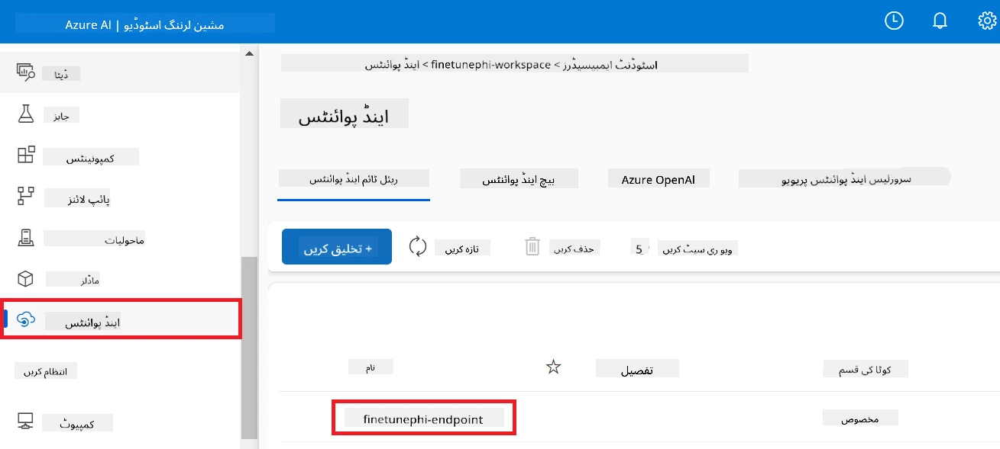

3. اس صفحے پر، آپ تعیناتی کے عمل کے دوران بنائے گئے اینڈپوائنٹس کا انتظام کر سکتے ہیں۔

## منظر نامہ 3: پرامپٹ فلو کے ساتھ انضمام کریں اور اپنے کسٹم ماڈل سے چیٹ کریں

### کسٹم Phi-3 ماڈل کو پرامپٹ فلو کے ساتھ انضمام کریں

اپنے فائن-ٹیون شدہ ماڈل کو کامیابی کے ساتھ تعینات کرنے کے بعد، آپ اب اسے پرامپٹ فلو کے ساتھ انضمام کر سکتے ہیں تاکہ اپنے ماڈل کو حقیقی وقت کی ایپلیکیشنز میں استعمال کریں، اور اپنے کسٹم Phi-3 ماڈل کے ساتھ مختلف انٹرایکٹو کام انجام دے سکیں۔

#### فائن-ٹیون Phi-3 ماڈل کی api key اور endpoint uri سیٹ کریں

1. اس Azure Machine Learning ورک اسپیس پر جائیں جو آپ نے بنایا تھا۔
1. بائیں طرف کے ٹیب سے **Endpoints** منتخب کریں۔
1. وہ اینڈپوائنٹ منتخب کریں جو آپ نے بنایا تھا۔
1. نیوی گیشن مینو سے **Consume** منتخب کریں۔
1. اپنی **REST endpoint** کو کاپی کرکے *config.py* فائل میں `AZURE_ML_ENDPOINT = "your_fine_tuned_model_endpoint_uri"` کی جگہ چسپاں کریں۔
1. اپنی **Primary key** کو کاپی کرکے *config.py* فائل میں `AZURE_ML_API_KEY = "your_fine_tuned_model_api_key"` کی جگہ چسپاں کریں۔

    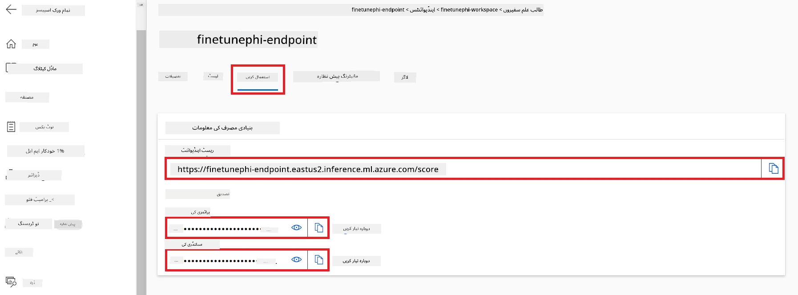

#### *flow.dag.yml* فائل میں کوڈ شامل کریں

1. Visual Studio Code میں *flow.dag.yml* فائل کھولیں۔

1. *flow.dag.yml* میں درج ذیل کوڈ شامل کریں۔

    ```yml
    inputs:
      input_data:
        type: string
        default: "Who founded Microsoft?"

    outputs:
      answer:
        type: string
        reference: ${integrate_with_promptflow.output}

    nodes:
    - name: integrate_with_promptflow
      type: python
      source:
        type: code
        path: integrate_with_promptflow.py
      inputs:
        input_data: ${inputs.input_data}
    ```

#### *integrate_with_promptflow.py* فائل میں کوڈ شامل کریں

1. Visual Studio Code میں *integrate_with_promptflow.py* فائل کھولیں۔

1. *integrate_with_promptflow.py* میں درج ذیل کوڈ شامل کریں۔

    ```python
    import logging
    import requests
    from promptflow.core import tool
    import asyncio
    import platform
    from config import (
        AZURE_ML_ENDPOINT,
        AZURE_ML_API_KEY
    )

    # لاگ ان کا انتظام
    logging.basicConfig(
        format="%(asctime)s - %(levelname)s - %(name)s - %(message)s",
        datefmt="%Y-%m-%d %H:%M:%S",
        level=logging.DEBUG
    )
    logger = logging.getLogger(__name__)

    def query_azml_endpoint(input_data: list, endpoint_url: str, api_key: str) -> str:
        """
        Send a request to the Azure ML endpoint with the given input data.
        """
        headers = {
            "Content-Type": "application/json",
            "Authorization": f"Bearer {api_key}"
        }
        data = {
            "input_data": [input_data],
            "params": {
                "temperature": 0.7,
                "max_new_tokens": 128,
                "do_sample": True,
                "return_full_text": True
            }
        }
        try:
            response = requests.post(endpoint_url, json=data, headers=headers)
            response.raise_for_status()
            result = response.json()[0]
            logger.info("Successfully received response from Azure ML Endpoint.")
            return result
        except requests.exceptions.RequestException as e:
            logger.error(f"Error querying Azure ML Endpoint: {e}")
            raise

    def setup_asyncio_policy():
        """
        Setup asyncio event loop policy for Windows.
        """
        if platform.system() == 'Windows':
            asyncio.set_event_loop_policy(asyncio.WindowsSelectorEventLoopPolicy())
            logger.info("Set Windows asyncio event loop policy.")

    @tool
    def my_python_tool(input_data: str) -> str:
        """
        Tool function to process input data and query the Azure ML endpoint.
        """
        setup_asyncio_policy()
        return query_azml_endpoint(input_data, AZURE_ML_ENDPOINT, AZURE_ML_API_KEY)

    ```

### اپنے کسٹم ماڈل سے چیٹ کریں

1. Azure Machine Learning میں تعیناتی کے عمل کو شروع کرنے کے لیے *deploy_model.py* اسکرپٹ چلانے کے لیے درج ذیل کمانڈ ٹائپ کریں۔

    ```python
    pf flow serve --source ./ --port 8080 --host localhost
    ```

1. نتائج کی ایک مثال: اب آپ اپنے کسٹم Phi-3 ماڈل سے چیٹ کر سکتے ہیں۔ سفارش کی جاتی ہے کہ آپ فائن-ٹیوننگ کے لیے استعمال ہونے والے ڈیٹا کی بنیاد پر سوالات کریں۔

    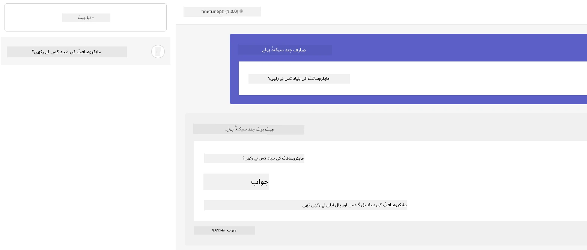

---

<!-- CO-OP TRANSLATOR DISCLAIMER START -->
**دستخطی نوٹ**:  
اس دستاویز کا ترجمہ مصنوعی ذہانت کی ترجمہ سروس [Co-op Translator](https://github.com/Azure/co-op-translator) کے ذریعے کیا گیا ہے۔ اگرچہ ہم درستگی کی کوشش کرتے ہیں، براہ کرم اس بات سے آگاہ رہیں کہ خودکار ترجمے میں غلطیاں یا غیر درستیاں شامل ہو سکتی ہیں۔ اصل دستاویز اپنی مادری زبان میں ہی معتبر ماخذ سمجھی جائے گی۔ اہم معلومات کے لیے پیشہ ور انسانی ترجمہ کی تجویز دی جاتی ہے۔ اس ترجمے کے استعمال سے ہونے والی کسی بھی غلط فہمی یا غلط تعبیر کی ذمہ داری ہم پر نہیں ہوگی۔
<!-- CO-OP TRANSLATOR DISCLAIMER END -->