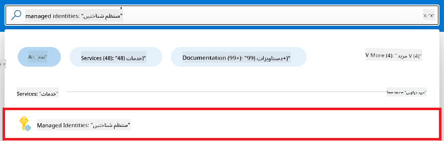
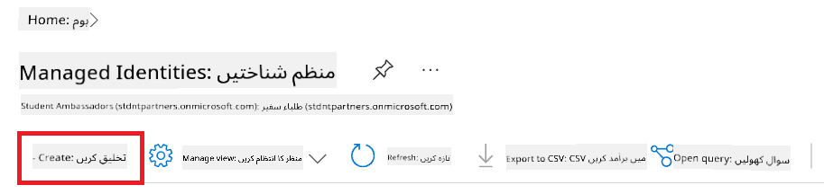
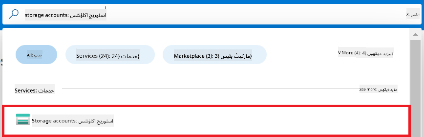
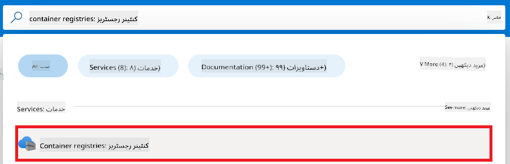
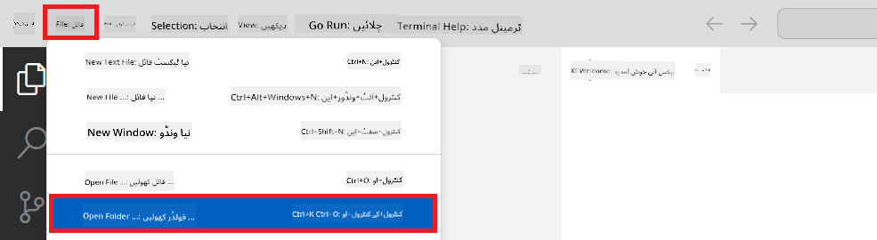
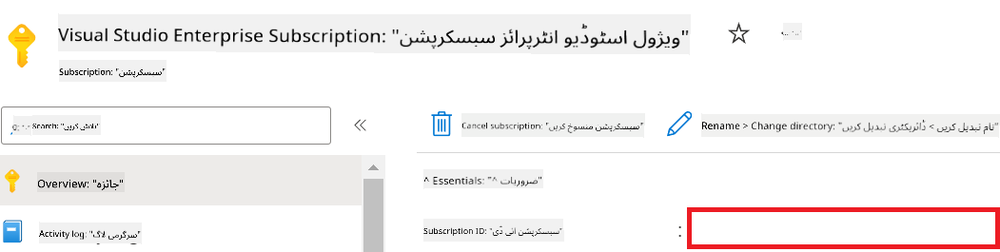
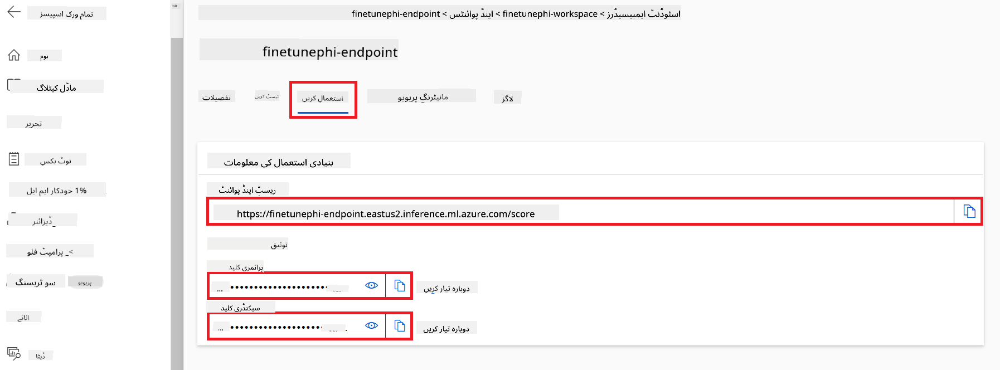
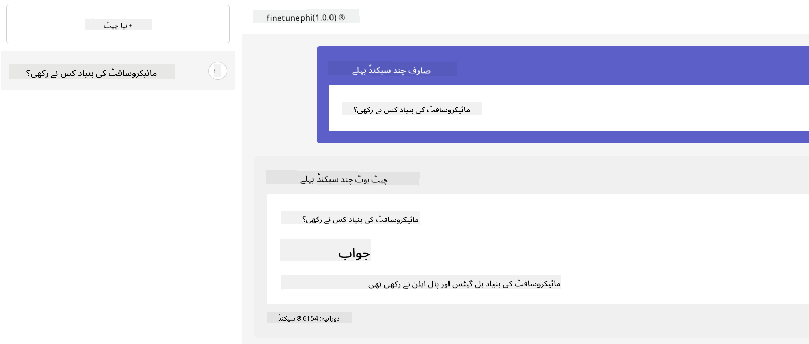

<!--
CO_OP_TRANSLATOR_METADATA:
{
  "original_hash": "455be2b7b9c3390d367d528f8fab2aa0",
  "translation_date": "2025-05-07T14:03:54+00:00",
  "source_file": "md/02.Application/01.TextAndChat/Phi3/E2E_Phi-3-FineTuning_PromptFlow_Integration.md",
  "language_code": "ur"
}
-->
# Fine-tune and Integrate custom Phi-3 models with Prompt flow

یہ end-to-end (E2E) نمونہ Microsoft Tech Community کے "[Fine-Tune and Integrate Custom Phi-3 Models with Prompt Flow: Step-by-Step Guide](https://techcommunity.microsoft.com/t5/educator-developer-blog/fine-tune-and-integrate-custom-phi-3-models-with-prompt-flow/ba-p/4178612?WT.mc_id=aiml-137032-kinfeylo)" رہنما پر مبنی ہے۔ یہ کسٹم Phi-3 ماڈلز کو fine-tune، deploy، اور Prompt flow کے ساتھ integrate کرنے کے عمل کا تعارف کراتا ہے۔

## Overview

اس E2E نمونے میں، آپ سیکھیں گے کہ Phi-3 ماڈل کو کیسے fine-tune کیا جائے اور اسے Prompt flow کے ساتھ کیسے integrate کیا جائے۔ Azure Machine Learning اور Prompt flow کا فائدہ اٹھاتے ہوئے، آپ کسٹم AI ماڈلز کو deploy اور استعمال کرنے کے لیے ورک فلو قائم کریں گے۔ یہ E2E نمونہ تین منظرناموں میں تقسیم ہے:

**Scenario 1: Azure وسائل کا سیٹ اپ اور fine-tuning کی تیاری**

**Scenario 2: Phi-3 ماڈل کو fine-tune کرنا اور Azure Machine Learning Studio میں deploy کرنا**

**Scenario 3: Prompt flow کے ساتھ integration اور اپنے کسٹم ماڈل کے ساتھ چیٹ کرنا**

یہاں اس E2E نمونے کا ایک جائزہ ہے۔


### Table of Contents

1. **[Scenario 1: Azure وسائل کا سیٹ اپ اور fine-tuning کی تیاری](../../../../../../md/02.Application/01.TextAndChat/Phi3)**
    - [Azure Machine Learning Workspace بنائیں](../../../../../../md/02.Application/01.TextAndChat/Phi3)
    - [Azure Subscription میں GPU کوٹہ درخواست کریں](../../../../../../md/02.Application/01.TextAndChat/Phi3)
    - [رول اسائنمنٹ شامل کریں](../../../../../../md/02.Application/01.TextAndChat/Phi3)
    - [پروجیکٹ سیٹ اپ کریں](../../../../../../md/02.Application/01.TextAndChat/Phi3)
    - [fine-tuning کے لیے ڈیٹاسیٹ تیار کریں](../../../../../../md/02.Application/01.TextAndChat/Phi3)

1. **[Scenario 2: Phi-3 ماڈل کو fine-tune کریں اور Azure Machine Learning Studio میں deploy کریں](../../../../../../md/02.Application/01.TextAndChat/Phi3)**
    - [Azure CLI سیٹ اپ کریں](../../../../../../md/02.Application/01.TextAndChat/Phi3)
    - [Phi-3 ماڈل کو fine-tune کریں](../../../../../../md/02.Application/01.TextAndChat/Phi3)
    - [fine-tuned ماڈل کو deploy کریں](../../../../../../md/02.Application/01.TextAndChat/Phi3)

1. **[Scenario 3: Prompt flow کے ساتھ integration اور اپنے کسٹم ماڈل کے ساتھ چیٹ کریں](../../../../../../md/02.Application/01.TextAndChat/Phi3)**
    - [کسٹم Phi-3 ماڈل کو Prompt flow کے ساتھ integrate کریں](../../../../../../md/02.Application/01.TextAndChat/Phi3)
    - [اپنے کسٹم ماڈل کے ساتھ چیٹ کریں](../../../../../../md/02.Application/01.TextAndChat/Phi3)

## Scenario 1: Azure وسائل کا سیٹ اپ اور fine-tuning کی تیاری

### Azure Machine Learning Workspace بنائیں

1. پورٹل پیج کے اوپر **search bar** میں *azure machine learning* ٹائپ کریں اور ظاہر ہونے والے اختیارات میں سے **Azure Machine Learning** منتخب کریں۔

    

1. نیویگیشن مینو سے **+ Create** منتخب کریں۔

1. نیویگیشن مینو سے **New workspace** منتخب کریں۔

    

1. درج ذیل کام انجام دیں:

    - اپنی Azure **Subscription** منتخب کریں۔
    - استعمال کرنے کے لیے **Resource group** منتخب کریں (اگر ضرورت ہو تو نیا بنائیں)۔
    - **Workspace Name** درج کریں۔ یہ منفرد ہونا چاہیے۔
    - اپنی پسند کا **Region** منتخب کریں۔
    - استعمال کرنے کے لیے **Storage account** منتخب کریں (اگر ضرورت ہو تو نیا بنائیں)۔
    - استعمال کرنے کے لیے **Key vault** منتخب کریں (اگر ضرورت ہو تو نیا بنائیں)۔
    - استعمال کرنے کے لیے **Application insights** منتخب کریں (اگر ضرورت ہو تو نیا بنائیں)۔
    - استعمال کرنے کے لیے **Container registry** منتخب کریں (اگر ضرورت ہو تو نیا بنائیں)۔

    

1. **Review + Create** منتخب کریں۔

1. **Create** منتخب کریں۔

### Azure Subscription میں GPU کوٹہ درخواست کریں

اس E2E نمونے میں، آپ fine-tuning کے لیے *Standard_NC24ads_A100_v4 GPU* استعمال کریں گے، جس کے لیے کوٹہ کی درخواست ضروری ہے، اور deployment کے لیے *Standard_E4s_v3* CPU استعمال کریں گے، جس کے لیے کوٹہ کی درخواست ضروری نہیں۔

> [!NOTE]
>
> صرف Pay-As-You-Go سبسکرپشنز (معیاری سبسکرپشن قسم) GPU الاٹمنٹ کے اہل ہیں؛ benefit سبسکرپشنز اس وقت سپورٹ نہیں کی جاتیں۔
>
> جو لوگ benefit سبسکرپشنز استعمال کر رہے ہیں (جیسے Visual Studio Enterprise Subscription) یا جو fine-tuning اور deployment کا عمل جلدی آزمانا چاہتے ہیں، اس ٹیوٹوریل میں CPU کے ساتھ محدود ڈیٹاسیٹ استعمال کر کے fine-tuning کی رہنمائی بھی فراہم کی گئی ہے۔ تاہم، یہ نوٹ کرنا ضروری ہے کہ GPU کے ساتھ بڑے ڈیٹاسیٹس پر fine-tuning کے نتائج نمایاں بہتر ہوتے ہیں۔

1. [Azure ML Studio](https://ml.azure.com/home?wt.mc_id=studentamb_279723) پر جائیں۔

1. *Standard NCADSA100v4 Family* کوٹہ کی درخواست کے لیے درج ذیل کام کریں:

    - بائیں طرف کے ٹیب سے **Quota** منتخب کریں۔
    - استعمال کے لیے **Virtual machine family** منتخب کریں۔ مثال کے طور پر، **Standard NCADSA100v4 Family Cluster Dedicated vCPUs** منتخب کریں، جس میں *Standard_NC24ads_A100_v4* GPU شامل ہے۔
    - نیویگیشن مینو سے **Request quota** منتخب کریں۔

        

    - Request quota صفحہ میں، استعمال کے لیے **New cores limit** درج کریں۔ مثال کے طور پر، 24۔
    - Request quota صفحہ میں، GPU کوٹہ کی درخواست کے لیے **Submit** منتخب کریں۔

> [!NOTE]
> آپ اپنی ضرورت کے مطابق GPU یا CPU منتخب کرنے کے لیے [Sizes for Virtual Machines in Azure](https://learn.microsoft.com/azure/virtual-machines/sizes/overview?tabs=breakdownseries%2Cgeneralsizelist%2Ccomputesizelist%2Cmemorysizelist%2Cstoragesizelist%2Cgpusizelist%2Cfpgasizelist%2Chpcsizelist) دستاویز ملاحظہ کر سکتے ہیں۔

### رول اسائنمنٹ شامل کریں

اپنے ماڈلز کو fine-tune اور deploy کرنے کے لیے، آپ کو پہلے User Assigned Managed Identity (UAI) بنانا ہوگی اور اسے مناسب اجازتیں دینی ہوں گی۔ یہ UAI deployment کے دوران authentication کے لیے استعمال ہوگی۔

#### User Assigned Managed Identity(UAI) بنائیں

1. پورٹل پیج کے اوپر **search bar** میں *managed identities* ٹائپ کریں اور ظاہر ہونے والے اختیارات میں سے **Managed Identities** منتخب کریں۔

    

1. **+ Create** منتخب کریں۔

    

1. درج ذیل کام کریں:

    - اپنی Azure **Subscription** منتخب کریں۔
    - استعمال کے لیے **Resource group** منتخب کریں (اگر ضرورت ہو تو نیا بنائیں)۔
    - اپنی پسند کا **Region** منتخب کریں۔
    - **Name** درج کریں۔ یہ منفرد ہونا چاہیے۔

1. **Review + create** منتخب کریں۔

1. **+ Create** منتخب کریں۔

#### Managed Identity کو Contributor رول اسائن کریں

1. اس Managed Identity resource پر جائیں جو آپ نے بنائی ہے۔

1. بائیں طرف کے ٹیب سے **Azure role assignments** منتخب کریں۔

1. نیویگیشن مینو سے **+Add role assignment** منتخب کریں۔

1. Add role assignment صفحہ میں درج ذیل کریں:
    - **Scope** کو **Resource group** منتخب کریں۔
    - اپنی Azure **Subscription** منتخب کریں۔
    - استعمال کے لیے **Resource group** منتخب کریں۔
    - **Role** کو **Contributor** منتخب کریں۔

    

1. **Save** منتخب کریں۔

#### Managed Identity کو Storage Blob Data Reader رول اسائن کریں

1. پورٹل پیج کے اوپر **search bar** میں *storage accounts* ٹائپ کریں اور ظاہر ہونے والے اختیارات میں سے **Storage accounts** منتخب کریں۔

    

1. اس storage account کو منتخب کریں جو آپ کے Azure Machine Learning workspace سے منسلک ہے۔ مثال کے طور پر، *finetunephistorage*۔

1. Add role assignment صفحہ پر جانے کے لیے درج ذیل کریں:

    - وہ Azure Storage account کھولیں جو آپ نے بنایا ہے۔
    - بائیں طرف کے ٹیب سے **Access Control (IAM)** منتخب کریں۔
    - نیویگیشن مینو سے **+ Add** منتخب کریں۔
    - نیویگیشن مینو سے **Add role assignment** منتخب کریں۔

    

1. Add role assignment صفحہ میں درج ذیل کریں:

    - Role صفحہ میں، **search bar** میں *Storage Blob Data Reader* ٹائپ کریں اور ظاہر ہونے والے اختیارات میں سے **Storage Blob Data Reader** منتخب کریں۔
    - Role صفحہ میں، **Next** منتخب کریں۔
    - Members صفحہ میں، **Assign access to** کے تحت **Managed identity** منتخب کریں۔
    - Members صفحہ میں، **+ Select members** منتخب کریں۔
    - Select managed identities صفحہ میں، اپنی Azure **Subscription** منتخب کریں۔
    - Select managed identities صفحہ میں، **Managed identity** کے طور پر **Manage Identity** منتخب کریں۔
    - Select managed identities صفحہ میں، وہ Manage Identity منتخب کریں جو آپ نے بنایا ہے۔ مثال کے طور پر، *finetunephi-managedidentity*۔
    - Select managed identities صفحہ میں، **Select** منتخب کریں۔

    

1. **Review + assign** منتخب کریں۔

#### Managed Identity کو AcrPull رول اسائن کریں

1. پورٹل پیج کے اوپر **search bar** میں *container registries* ٹائپ کریں اور ظاہر ہونے والے اختیارات میں سے **Container registries** منتخب کریں۔

    

1. اس container registry کو منتخب کریں جو Azure Machine Learning workspace سے منسلک ہے۔ مثال کے طور پر، *finetunephicontainerregistries*

1. Add role assignment صفحہ پر جانے کے لیے درج ذیل کریں:

    - بائیں طرف کے ٹیب سے **Access Control (IAM)** منتخب کریں۔
    - نیویگیشن مینو سے **+ Add** منتخب کریں۔
    - نیویگیشن مینو سے **Add role assignment** منتخب کریں۔

1. Add role assignment صفحہ میں درج ذیل کریں:

    - Role صفحہ میں، **search bar** میں *AcrPull* ٹائپ کریں اور ظاہر ہونے والے اختیارات میں سے **AcrPull** منتخب کریں۔
    - Role صفحہ میں، **Next** منتخب کریں۔
    - Members صفحہ میں، **Assign access to** کے تحت **Managed identity** منتخب کریں۔
    - Members صفحہ میں، **+ Select members** منتخب کریں۔
    - Select managed identities صفحہ میں، اپنی Azure **Subscription** منتخب کریں۔
    - Select managed identities صفحہ میں، **Managed identity** کے طور پر **Manage Identity** منتخب کریں۔
    - Select managed identities صفحہ میں، وہ Manage Identity منتخب کریں جو آپ نے بنایا ہے۔ مثال کے طور پر، *finetunephi-managedidentity*۔
    - Select managed identities صفحہ میں، **Select** منتخب کریں۔
    - **Review + assign** منتخب کریں۔

### پروجیکٹ سیٹ اپ کریں

اب، آپ ایک فولڈر بنائیں گے جہاں کام کریں گے اور ایک virtual environment قائم کریں گے تاکہ ایسا پروگرام تیار کیا جا سکے جو صارفین کے ساتھ تعامل کرے اور Azure Cosmos DB سے محفوظ شدہ چیٹ ہسٹری کو اپنی جوابات کی معلومات کے لیے استعمال کرے۔

#### کام کے لیے فولڈر بنائیں

1. ایک terminal کھولیں اور درج ذیل کمانڈ ٹائپ کریں تاکہ default راستے میں *finetune-phi* نام کا فولڈر بنایا جا سکے۔

    ```console
    mkdir finetune-phi
    ```

1. اپنی terminal میں درج ذیل کمانڈ ٹائپ کریں تاکہ آپ اس *finetune-phi* فولڈر میں جائیں جو آپ نے بنایا ہے۔

    ```console
    cd finetune-phi
    ```

#### virtual environment بنائیں

1. اپنی terminal میں درج ذیل کمانڈ ٹائپ کریں تاکہ *.venv* نام کا virtual environment بنایا جا سکے۔

    ```console
    python -m venv .venv
    ```

1. اپنی terminal میں درج ذیل کمانڈ ٹائپ کریں تاکہ virtual environment کو activate کیا جا سکے۔

    ```console
    .venv\Scripts\activate.bat
    ```

> [!NOTE]
>
> اگر یہ کامیاب ہوا تو آپ کو کمانڈ پرامپٹ سے پہلے *(.venv)* نظر آنا چاہیے۔

#### مطلوبہ پیکجز انسٹال کریں

1. اپنی terminal میں درج ذیل کمانڈز ٹائپ کریں تاکہ مطلوبہ پیکجز انسٹال کیے جا سکیں۔

    ```console
    pip install datasets==2.19.1
    pip install transformers==4.41.1
    pip install azure-ai-ml==1.16.0
    pip install torch==2.3.1
    pip install trl==0.9.4
    pip install promptflow==1.12.0
    ```

#### پروجیکٹ فائلیں بنائیں

اس مشق میں، آپ اپنے پروجیکٹ کے لیے ضروری فائلیں بنائیں گے۔ ان فائلوں میں ڈیٹاسیٹ ڈاؤن لوڈ کرنے، Azure Machine Learning ماحول قائم کرنے، Phi-3 ماڈل کو fine-tune کرنے، اور fine-tuned ماڈل کو deploy کرنے کے لیے اسکرپٹس شامل ہیں۔ آپ *conda.yml* فائل بھی بنائیں گے تاکہ fine-tuning ماحول قائم کیا جا سکے۔

اس مشق میں آپ یہ کریں گے:

- *download_dataset.py* فائل بنائیں تاکہ ڈیٹاسیٹ ڈاؤن لوڈ کیا جا سکے۔
- *setup_ml.py* فائل بنائیں تاکہ Azure Machine Learning ماحول قائم کیا جا سکے۔
- *finetuning_dir* فولڈر میں *fine_tune.py* فائل بنائیں تاکہ ڈیٹاسیٹ استعمال کرتے ہوئے Phi-3 ماڈل کو fine-tune کیا جا سکے۔
- fine-tuning ماحول کے لیے *conda.yml* فائل بنائیں۔
- fine-tuned ماڈل کو deploy کرنے کے لیے *deploy_model.py* فائل بنائیں۔
- fine-tuned ماڈل کو integrate اور Prompt flow کے ذریعے execute کرنے کے لیے *integrate_with_promptflow.py* فائل بنائیں۔
- Prompt flow کے ورک فلو ڈھانچے کے لیے flow.dag.yml فائل بنائیں۔
- Azure معلومات داخل کرنے کے لیے *config.py* فائل بنائیں۔

> [!NOTE]
>
> مکمل فولڈر ڈھانچہ:
>
> ```text
> └── YourUserName
> .    └── finetune-phi
> .        ├── finetuning_dir
> .        │      └── fine_tune.py
> .        ├── conda.yml
> .        ├── config.py
> .        ├── deploy_model.py
> .        ├── download_dataset.py
> .        ├── flow.dag.yml
> .        ├── integrate_with_promptflow.py
> .        └── setup_ml.py
> ```

1. **Visual Studio Code** کھولیں۔

1. مینو بار سے **File** منتخب کریں۔

1. **Open Folder** منتخب کریں۔

1. وہ *finetune-phi* فولڈر منتخب کریں جو آپ نے بنایا ہے، جو *C:\Users\yourUserName\finetune-phi* پر واقع ہے۔

    

1. Visual Studio Code کے بائیں پین میں، رائٹ کلک کریں اور **New File** منتخب کریں تاکہ *download_dataset.py* نام کی نئی فائل بنائیں۔

1. Visual Studio Code کے بائیں پین میں، رائٹ کلک کریں اور **New File** منتخب کریں تاکہ *setup_ml.py* نام کی نئی فائل بنائیں۔

1. Visual Studio Code کے بائیں پین میں، رائٹ کلک کریں اور **New File** منتخب کریں تاکہ *deploy_model.py* نام کی نئی فائل بنائیں۔

    

1. Visual Studio Code کے بائیں پین میں، رائٹ کلک کریں اور **New Folder** منتخب کریں تاکہ *finetuning_dir* نام کا نیا فولڈر بنائیں۔

1. *finetuning_dir* فولڈر میں، *fine_tune.py* نام کی نئی فائل بنائیں۔

#### *conda.yml* فائل بنائیں اور ترتیب دیں

1. Visual Studio Code کے بائیں پین میں، رائٹ کلک کریں اور **New File** منتخب کریں تاکہ *conda.yml* نام کی نئی فائل بنائیں۔

1. *conda.yml* فائل میں درج ذیل کوڈ شامل کریں تاکہ Phi-3 ماڈل کے fine-tuning ماحول کو سیٹ اپ کیا جا سکے۔

    ```yml
    name: phi-3-training-env
    channels:
      - defaults
      - conda-forge
    dependencies:
      - python=3.10
      - pip
      - numpy<2.0
      - pip:
          - torch==2.4.0
          - torchvision==0.19.0
          - trl==0.8.6
          - transformers==4.41
          - datasets==2.21.0
          - azureml-core==1.57.0
          - azure-storage-blob==12.19.0
          - azure-ai-ml==1.16
          - azure-identity==1.17.1
          - accelerate==0.33.0
          - mlflow==2.15.1
          - azureml-mlflow==1.57.0
    ```

#### *config.py* فائل بنائیں اور ترتیب دیں

1. Visual Studio Code کے بائیں پین میں، رائٹ کلک کریں اور **New File** منتخب کریں تاکہ *config.py* نام کی نئی فائل بنائیں۔

1. *config.py* فائل میں درج ذیل کوڈ شامل کریں تاکہ اپنی Azure معلومات داخل کی جا سکیں۔

    ```python
    # Azure settings
    AZURE_SUBSCRIPTION_ID = "your_subscription_id"
    AZURE_RESOURCE_GROUP_NAME = "your_resource_group_name" # "TestGroup"

    # Azure Machine Learning settings
    AZURE_ML_WORKSPACE_NAME = "your_workspace_name" # "finetunephi-workspace"

    # Azure Managed Identity settings
    AZURE_MANAGED_IDENTITY_CLIENT_ID = "your_azure_managed_identity_client_id"
    AZURE_MANAGED_IDENTITY_NAME = "your_azure_managed_identity_name" # "finetunephi-mangedidentity"
    AZURE_MANAGED_IDENTITY_RESOURCE_ID = f"/subscriptions/{AZURE_SUBSCRIPTION_ID}/resourceGroups/{AZURE_RESOURCE_GROUP_NAME}/providers/Microsoft.ManagedIdentity/userAssignedIdentities/{AZURE_MANAGED_IDENTITY_NAME}"

    # Dataset file paths
    TRAIN_DATA_PATH = "data/train_data.jsonl"
    TEST_DATA_PATH = "data/test_data.jsonl"

    # Fine-tuned model settings
    AZURE_MODEL_NAME = "your_fine_tuned_model_name" # "finetune-phi-model"
    AZURE_ENDPOINT_NAME = "your_fine_tuned_model_endpoint_name" # "finetune-phi-endpoint"
    AZURE_DEPLOYMENT_NAME = "your_fine_tuned_model_deployment_name" # "finetune-phi-deployment"

    AZURE_ML_API_KEY = "your_fine_tuned_model_api_key"
    AZURE_ML_ENDPOINT = "your_fine_tuned_model_endpoint_uri" # "https://{your-endpoint-name}.{your-region}.inference.ml.azure.com/score"
    ```

#### Azure environment variables شامل کریں

1. Azure Subscription ID شامل کرنے کے لیے درج


1. Azure Workspace Name شامل کرنے کے لیے درج ذیل کام انجام دیں:

    - اس Azure Machine Learning resource پر جائیں جو آپ نے بنایا ہے۔
    - اپنا اکاؤنٹ نام *config.py* فائل میں کاپی اور پیسٹ کریں۔

    

1. Azure Resource Group Name شامل کرنے کے لیے درج ذیل کام انجام دیں:

    - اس Azure Machine Learning resource پر جائیں جو آپ نے بنایا ہے۔
    - اپنا Azure Resource Group Name *config.py* فائل میں کاپی اور پیسٹ کریں۔

    

2. Azure Managed Identity نام شامل کرنے کے لیے درج ذیل کام انجام دیں:

    - اس Managed Identities resource پر جائیں جو آپ نے بنایا ہے۔
    - اپنا Azure Managed Identity نام *config.py* فائل میں کاپی اور پیسٹ کریں۔

    

### ڈیٹا سیٹ کو fine-tuning کے لیے تیار کریں

اس مشق میں، آپ *download_dataset.py* فائل چلا کر *ULTRACHAT_200k* ڈیٹا سیٹ اپنے لوکل ماحول میں ڈاؤن لوڈ کریں گے۔ پھر آپ اس ڈیٹا سیٹ کو Azure Machine Learning میں Phi-3 ماڈل کی fine-tuning کے لیے استعمال کریں گے۔

#### *download_dataset.py* کے ذریعے اپنا ڈیٹا سیٹ ڈاؤن لوڈ کریں

1. Visual Studio Code میں *download_dataset.py* فائل کھولیں۔

1. *download_dataset.py* میں درج ذیل کوڈ شامل کریں۔

    ```python
    import json
    import os
    from datasets import load_dataset
    from config import (
        TRAIN_DATA_PATH,
        TEST_DATA_PATH)

    def load_and_split_dataset(dataset_name, config_name, split_ratio):
        """
        Load and split a dataset.
        """
        # Load the dataset with the specified name, configuration, and split ratio
        dataset = load_dataset(dataset_name, config_name, split=split_ratio)
        print(f"Original dataset size: {len(dataset)}")
        
        # Split the dataset into train and test sets (80% train, 20% test)
        split_dataset = dataset.train_test_split(test_size=0.2)
        print(f"Train dataset size: {len(split_dataset['train'])}")
        print(f"Test dataset size: {len(split_dataset['test'])}")
        
        return split_dataset

    def save_dataset_to_jsonl(dataset, filepath):
        """
        Save a dataset to a JSONL file.
        """
        # Create the directory if it does not exist
        os.makedirs(os.path.dirname(filepath), exist_ok=True)
        
        # Open the file in write mode
        with open(filepath, 'w', encoding='utf-8') as f:
            # Iterate over each record in the dataset
            for record in dataset:
                # Dump the record as a JSON object and write it to the file
                json.dump(record, f)
                # Write a newline character to separate records
                f.write('\n')
        
        print(f"Dataset saved to {filepath}")

    def main():
        """
        Main function to load, split, and save the dataset.
        """
        # Load and split the ULTRACHAT_200k dataset with a specific configuration and split ratio
        dataset = load_and_split_dataset("HuggingFaceH4/ultrachat_200k", 'default', 'train_sft[:1%]')
        
        # Extract the train and test datasets from the split
        train_dataset = dataset['train']
        test_dataset = dataset['test']

        # Save the train dataset to a JSONL file
        save_dataset_to_jsonl(train_dataset, TRAIN_DATA_PATH)
        
        # Save the test dataset to a separate JSONL file
        save_dataset_to_jsonl(test_dataset, TEST_DATA_PATH)

    if __name__ == "__main__":
        main()

    ```

> [!TIP]
>
> **کم سے کم ڈیٹا سیٹ کے ساتھ CPU استعمال کرتے ہوئے fine-tuning کی رہنمائی**
>
> اگر آپ CPU استعمال کر کے fine-tuning کرنا چاہتے ہیں تو یہ طریقہ اُن لوگوں کے لیے بہترین ہے جن کے پاس benefit subscriptions ہیں (جیسے Visual Studio Enterprise Subscription) یا جو fine-tuning اور deployment کے عمل کو جلدی آزمانا چاہتے ہیں۔
>
> `dataset = load_and_split_dataset("HuggingFaceH4/ultrachat_200k", 'default', 'train_sft[:1%]')` with `dataset = load_and_split_dataset("HuggingFaceH4/ultrachat_200k", 'default', 'train_sft[:10]')` سے تبدیل کریں۔
>

1. اپنے ٹرمینل میں درج ذیل کمانڈ ٹائپ کریں تاکہ اسکرپٹ چل سکے اور ڈیٹا سیٹ آپ کے لوکل ماحول میں ڈاؤن لوڈ ہو جائے۔

    ```console
    python download_data.py
    ```

1. تصدیق کریں کہ ڈیٹا سیٹ کامیابی سے آپ کے لوکل *finetune-phi/data* فولڈر میں محفوظ ہو گئے ہیں۔

> [!NOTE]
>
> **ڈیٹا سیٹ کا سائز اور fine-tuning کا وقت**
>
> اس E2E نمونے میں، آپ صرف 1% ڈیٹا سیٹ (`train_sft[:1%]`) استعمال کر رہے ہیں۔ اس سے ڈیٹا کی مقدار بہت کم ہو جاتی ہے، جس سے اپلوڈ اور fine-tuning دونوں کے عمل کی رفتار بڑھ جاتی ہے۔ آپ فیصد کو ایڈجسٹ کر کے تربیتی وقت اور ماڈل کی کارکردگی کے درمیان مناسب توازن تلاش کر سکتے ہیں۔ ڈیٹا سیٹ کے چھوٹے حصے کا استعمال fine-tuning کے لیے درکار وقت کو کم کرتا ہے، جس سے E2E نمونہ کے لیے عمل زیادہ قابل انتظام ہو جاتا ہے۔

## منظر نامہ 2: Phi-3 ماڈل کی fine-tuning اور Azure Machine Learning Studio میں تعیناتی

### Azure CLI سیٹ اپ کریں

اپنے ماحول کی توثیق کے لیے Azure CLI سیٹ اپ کرنا ضروری ہے۔ Azure CLI آپ کو کمانڈ لائن سے براہ راست Azure وسائل کو منظم کرنے کی اجازت دیتا ہے اور Azure Machine Learning کو ان وسائل تک رسائی کے لیے ضروری اسناد فراہم کرتا ہے۔ شروع کرنے کے لیے [Azure CLI انسٹال کریں](https://learn.microsoft.com/cli/azure/install-azure-cli)

1. ٹرمینل کھولیں اور Azure اکاؤنٹ میں لاگ ان ہونے کے لیے درج ذیل کمانڈ ٹائپ کریں۔

    ```console
    az login
    ```

1. استعمال کے لیے اپنا Azure اکاؤنٹ منتخب کریں۔

1. استعمال کے لیے اپنا Azure subscription منتخب کریں۔

    

> [!TIP]
>
> اگر Azure میں سائن ان کرنے میں دشواری ہو رہی ہے تو ڈیوائس کوڈ استعمال کرنے کی کوشش کریں۔ ٹرمینل کھولیں اور Azure اکاؤنٹ میں سائن ان کرنے کے لیے درج ذیل کمانڈ ٹائپ کریں:
>
> ```console
> az login --use-device-code
> ```
>

### Phi-3 ماڈل کی fine-tuning کریں

اس مشق میں، آپ فراہم کردہ ڈیٹا سیٹ کا استعمال کرتے ہوئے Phi-3 ماڈل کی fine-tuning کریں گے۔ سب سے پہلے، آپ *fine_tune.py* فائل میں fine-tuning کا عمل متعین کریں گے۔ پھر، آپ Azure Machine Learning ماحول کو ترتیب دیں گے اور *setup_ml.py* فائل چلا کر fine-tuning کا عمل شروع کریں گے۔ یہ اسکرپٹ یقینی بناتا ہے کہ fine-tuning Azure Machine Learning ماحول کے اندر ہو۔

*setup_ml.py* چلانے سے آپ Azure Machine Learning ماحول میں fine-tuning کا عمل چلائیں گے۔

#### *fine_tune.py* فائل میں کوڈ شامل کریں

1. *finetuning_dir* فولڈر پر جائیں اور Visual Studio Code میں *fine_tune.py* فائل کھولیں۔

1. *fine_tune.py* میں درج ذیل کوڈ شامل کریں۔

    ```python
    import argparse
    import sys
    import logging
    import os
    from datasets import load_dataset
    import torch
    import mlflow
    from transformers import AutoModelForCausalLM, AutoTokenizer, TrainingArguments
    from trl import SFTTrainer

    # To avoid the INVALID_PARAMETER_VALUE error in MLflow, disable MLflow integration
    os.environ["DISABLE_MLFLOW_INTEGRATION"] = "True"

    # Logging setup
    logging.basicConfig(
        format="%(asctime)s - %(levelname)s - %(name)s - %(message)s",
        datefmt="%Y-%m-%d %H:%M:%S",
        handlers=[logging.StreamHandler(sys.stdout)],
        level=logging.WARNING
    )
    logger = logging.getLogger(__name__)

    def initialize_model_and_tokenizer(model_name, model_kwargs):
        """
        Initialize the model and tokenizer with the given pretrained model name and arguments.
        """
        model = AutoModelForCausalLM.from_pretrained(model_name, **model_kwargs)
        tokenizer = AutoTokenizer.from_pretrained(model_name)
        tokenizer.model_max_length = 2048
        tokenizer.pad_token = tokenizer.unk_token
        tokenizer.pad_token_id = tokenizer.convert_tokens_to_ids(tokenizer.pad_token)
        tokenizer.padding_side = 'right'
        return model, tokenizer

    def apply_chat_template(example, tokenizer):
        """
        Apply a chat template to tokenize messages in the example.
        """
        messages = example["messages"]
        if messages[0]["role"] != "system":
            messages.insert(0, {"role": "system", "content": ""})
        example["text"] = tokenizer.apply_chat_template(
            messages, tokenize=False, add_generation_prompt=False
        )
        return example

    def load_and_preprocess_data(train_filepath, test_filepath, tokenizer):
        """
        Load and preprocess the dataset.
        """
        train_dataset = load_dataset('json', data_files=train_filepath, split='train')
        test_dataset = load_dataset('json', data_files=test_filepath, split='train')
        column_names = list(train_dataset.features)

        train_dataset = train_dataset.map(
            apply_chat_template,
            fn_kwargs={"tokenizer": tokenizer},
            num_proc=10,
            remove_columns=column_names,
            desc="Applying chat template to train dataset",
        )

        test_dataset = test_dataset.map(
            apply_chat_template,
            fn_kwargs={"tokenizer": tokenizer},
            num_proc=10,
            remove_columns=column_names,
            desc="Applying chat template to test dataset",
        )

        return train_dataset, test_dataset

    def train_and_evaluate_model(train_dataset, test_dataset, model, tokenizer, output_dir):
        """
        Train and evaluate the model.
        """
        training_args = TrainingArguments(
            bf16=True,
            do_eval=True,
            output_dir=output_dir,
            eval_strategy="epoch",
            learning_rate=5.0e-06,
            logging_steps=20,
            lr_scheduler_type="cosine",
            num_train_epochs=3,
            overwrite_output_dir=True,
            per_device_eval_batch_size=4,
            per_device_train_batch_size=4,
            remove_unused_columns=True,
            save_steps=500,
            seed=0,
            gradient_checkpointing=True,
            gradient_accumulation_steps=1,
            warmup_ratio=0.2,
        )

        trainer = SFTTrainer(
            model=model,
            args=training_args,
            train_dataset=train_dataset,
            eval_dataset=test_dataset,
            max_seq_length=2048,
            dataset_text_field="text",
            tokenizer=tokenizer,
            packing=True
        )

        train_result = trainer.train()
        trainer.log_metrics("train", train_result.metrics)

        mlflow.transformers.log_model(
            transformers_model={"model": trainer.model, "tokenizer": tokenizer},
            artifact_path=output_dir,
        )

        tokenizer.padding_side = 'left'
        eval_metrics = trainer.evaluate()
        eval_metrics["eval_samples"] = len(test_dataset)
        trainer.log_metrics("eval", eval_metrics)

    def main(train_file, eval_file, model_output_dir):
        """
        Main function to fine-tune the model.
        """
        model_kwargs = {
            "use_cache": False,
            "trust_remote_code": True,
            "torch_dtype": torch.bfloat16,
            "device_map": None,
            "attn_implementation": "eager"
        }

        # pretrained_model_name = "microsoft/Phi-3-mini-4k-instruct"
        pretrained_model_name = "microsoft/Phi-3.5-mini-instruct"

        with mlflow.start_run():
            model, tokenizer = initialize_model_and_tokenizer(pretrained_model_name, model_kwargs)
            train_dataset, test_dataset = load_and_preprocess_data(train_file, eval_file, tokenizer)
            train_and_evaluate_model(train_dataset, test_dataset, model, tokenizer, model_output_dir)

    if __name__ == "__main__":
        parser = argparse.ArgumentParser()
        parser.add_argument("--train-file", type=str, required=True, help="Path to the training data")
        parser.add_argument("--eval-file", type=str, required=True, help="Path to the evaluation data")
        parser.add_argument("--model_output_dir", type=str, required=True, help="Directory to save the fine-tuned model")
        args = parser.parse_args()
        main(args.train_file, args.eval_file, args.model_output_dir)

    ```

1. *fine_tune.py* فائل محفوظ کریں اور بند کریں۔

> [!TIP]
> **آپ Phi-3.5 ماڈل کی fine-tuning بھی کر سکتے ہیں**
>
> *fine_tune.py* فائل میں، آپ `pretrained_model_name` from `"microsoft/Phi-3-mini-4k-instruct"` to any model you want to fine-tune. For example, if you change it to `"microsoft/Phi-3.5-mini-instruct"`, you'll be using the Phi-3.5-mini-instruct model for fine-tuning. To find and use the model name you prefer, visit [Hugging Face](https://huggingface.co/), search for the model you're interested in, and then copy and paste its name into the `pretrained_model_name` فیلڈ کو اپنی اسکرپٹ میں تبدیل کر سکتے ہیں۔
>
> :::image type="content" source="../../imgs/03/FineTuning-PromptFlow/finetunephi3.5.png" alt-text="Phi-3.5 کی fine tune کریں۔":::
>

#### *setup_ml.py* فائل میں کوڈ شامل کریں

1. Visual Studio Code میں *setup_ml.py* فائل کھولیں۔

1. *setup_ml.py* میں درج ذیل کوڈ شامل کریں۔

    ```python
    import logging
    from azure.ai.ml import MLClient, command, Input
    from azure.ai.ml.entities import Environment, AmlCompute
    from azure.identity import AzureCliCredential
    from config import (
        AZURE_SUBSCRIPTION_ID,
        AZURE_RESOURCE_GROUP_NAME,
        AZURE_ML_WORKSPACE_NAME,
        TRAIN_DATA_PATH,
        TEST_DATA_PATH
    )

    # Constants

    # Uncomment the following lines to use a CPU instance for training
    # COMPUTE_INSTANCE_TYPE = "Standard_E16s_v3" # cpu
    # COMPUTE_NAME = "cpu-e16s-v3"
    # DOCKER_IMAGE_NAME = "mcr.microsoft.com/azureml/openmpi4.1.0-ubuntu20.04:latest"

    # Uncomment the following lines to use a GPU instance for training
    COMPUTE_INSTANCE_TYPE = "Standard_NC24ads_A100_v4"
    COMPUTE_NAME = "gpu-nc24s-a100-v4"
    DOCKER_IMAGE_NAME = "mcr.microsoft.com/azureml/curated/acft-hf-nlp-gpu:59"

    CONDA_FILE = "conda.yml"
    LOCATION = "eastus2" # Replace with the location of your compute cluster
    FINETUNING_DIR = "./finetuning_dir" # Path to the fine-tuning script
    TRAINING_ENV_NAME = "phi-3-training-environment" # Name of the training environment
    MODEL_OUTPUT_DIR = "./model_output" # Path to the model output directory in azure ml

    # Logging setup to track the process
    logger = logging.getLogger(__name__)
    logging.basicConfig(
        format="%(asctime)s - %(levelname)s - %(name)s - %(message)s",
        datefmt="%Y-%m-%d %H:%M:%S",
        level=logging.WARNING
    )

    def get_ml_client():
        """
        Initialize the ML Client using Azure CLI credentials.
        """
        credential = AzureCliCredential()
        return MLClient(credential, AZURE_SUBSCRIPTION_ID, AZURE_RESOURCE_GROUP_NAME, AZURE_ML_WORKSPACE_NAME)

    def create_or_get_environment(ml_client):
        """
        Create or update the training environment in Azure ML.
        """
        env = Environment(
            image=DOCKER_IMAGE_NAME,  # Docker image for the environment
            conda_file=CONDA_FILE,  # Conda environment file
            name=TRAINING_ENV_NAME,  # Name of the environment
        )
        return ml_client.environments.create_or_update(env)

    def create_or_get_compute_cluster(ml_client, compute_name, COMPUTE_INSTANCE_TYPE, location):
        """
        Create or update the compute cluster in Azure ML.
        """
        try:
            compute_cluster = ml_client.compute.get(compute_name)
            logger.info(f"Compute cluster '{compute_name}' already exists. Reusing it for the current run.")
        except Exception:
            logger.info(f"Compute cluster '{compute_name}' does not exist. Creating a new one with size {COMPUTE_INSTANCE_TYPE}.")
            compute_cluster = AmlCompute(
                name=compute_name,
                size=COMPUTE_INSTANCE_TYPE,
                location=location,
                tier="Dedicated",  # Tier of the compute cluster
                min_instances=0,  # Minimum number of instances
                max_instances=1  # Maximum number of instances
            )
            ml_client.compute.begin_create_or_update(compute_cluster).wait()  # Wait for the cluster to be created
        return compute_cluster

    def create_fine_tuning_job(env, compute_name):
        """
        Set up the fine-tuning job in Azure ML.
        """
        return command(
            code=FINETUNING_DIR,  # Path to fine_tune.py
            command=(
                "python fine_tune.py "
                "--train-file ${{inputs.train_file}} "
                "--eval-file ${{inputs.eval_file}} "
                "--model_output_dir ${{inputs.model_output}}"
            ),
            environment=env,  # Training environment
            compute=compute_name,  # Compute cluster to use
            inputs={
                "train_file": Input(type="uri_file", path=TRAIN_DATA_PATH),  # Path to the training data file
                "eval_file": Input(type="uri_file", path=TEST_DATA_PATH),  # Path to the evaluation data file
                "model_output": MODEL_OUTPUT_DIR
            }
        )

    def main():
        """
        Main function to set up and run the fine-tuning job in Azure ML.
        """
        # Initialize ML Client
        ml_client = get_ml_client()

        # Create Environment
        env = create_or_get_environment(ml_client)
        
        # Create or get existing compute cluster
        create_or_get_compute_cluster(ml_client, COMPUTE_NAME, COMPUTE_INSTANCE_TYPE, LOCATION)

        # Create and Submit Fine-Tuning Job
        job = create_fine_tuning_job(env, COMPUTE_NAME)
        returned_job = ml_client.jobs.create_or_update(job)  # Submit the job
        ml_client.jobs.stream(returned_job.name)  # Stream the job logs
        
        # Capture the job name
        job_name = returned_job.name
        print(f"Job name: {job_name}")

    if __name__ == "__main__":
        main()

    ```

1. `COMPUTE_INSTANCE_TYPE`, `COMPUTE_NAME`, and `LOCATION` کو اپنی مخصوص تفصیلات سے بدلیں۔

    ```python
   # Uncomment the following lines to use a GPU instance for training
    COMPUTE_INSTANCE_TYPE = "Standard_NC24ads_A100_v4"
    COMPUTE_NAME = "gpu-nc24s-a100-v4"
    ...
    LOCATION = "eastus2" # Replace with the location of your compute cluster
    ```

> [!TIP]
>
> **کم سے کم ڈیٹا سیٹ کے ساتھ CPU استعمال کرتے ہوئے fine-tuning کی رہنمائی**
>
> اگر آپ CPU استعمال کر کے fine-tuning کرنا چاہتے ہیں تو یہ طریقہ اُن لوگوں کے لیے بہترین ہے جن کے پاس benefit subscriptions ہیں (جیسے Visual Studio Enterprise Subscription) یا جو fine-tuning اور deployment کے عمل کو جلدی آزمانا چاہتے ہیں۔
>
> 1. *setup_ml* فائل کھولیں۔
> 1. `COMPUTE_INSTANCE_TYPE`, `COMPUTE_NAME`, and `DOCKER_IMAGE_NAME` with the following. If you do not have access to *Standard_E16s_v3*, you can use an equivalent CPU instance or request a new quota.
> 1. Replace `LOCATION` کو اپنی مخصوص تفصیلات سے بدلیں۔
>
>    ```python
>    # Uncomment the following lines to use a CPU instance for training
>    COMPUTE_INSTANCE_TYPE = "Standard_E16s_v3" # cpu
>    COMPUTE_NAME = "cpu-e16s-v3"
>    DOCKER_IMAGE_NAME = "mcr.microsoft.com/azureml/openmpi4.1.0-ubuntu20.04:latest"
>    LOCATION = "eastus2" # Replace with the location of your compute cluster
>    ```
>

1. *setup_ml.py* اسکرپٹ چلانے اور Azure Machine Learning میں fine-tuning کا عمل شروع کرنے کے لیے درج ذیل کمانڈ ٹائپ کریں۔

    ```python
    python setup_ml.py
    ```

1. اس مشق میں، آپ نے کامیابی سے Azure Machine Learning کا استعمال کرتے ہوئے Phi-3 ماڈل کی fine-tuning کی۔ *setup_ml.py* اسکرپٹ چلانے سے آپ نے Azure Machine Learning ماحول سیٹ اپ کیا اور *fine_tune.py* فائل میں متعین fine-tuning کا عمل شروع کیا۔ یاد رکھیں کہ fine-tuning کا عمل کافی وقت لے سکتا ہے۔ `python setup_ml.py` command, you need to wait for the process to complete. You can monitor the status of the fine-tuning job by following the link provided in the terminal to the Azure Machine Learning portal.

    

### Deploy the fine-tuned model

To integrate the fine-tuned Phi-3 model with Prompt Flow, you need to deploy the model to make it accessible for real-time inference. This process involves registering the model, creating an online endpoint, and deploying the model.

#### Set the model name, endpoint name, and deployment name for deployment

1. Open *config.py* file.

1. Replace `AZURE_MODEL_NAME = "your_fine_tuned_model_name"` with the desired name for your model.

1. Replace `AZURE_ENDPOINT_NAME = "your_fine_tuned_model_endpoint_name"` with the desired name for your endpoint.

1. Replace `AZURE_DEPLOYMENT_NAME = "your_fine_tuned_model_deployment_name"` میں اپنی تعیناتی کے لیے مطلوبہ نام شامل کریں۔

#### *deploy_model.py* فائل میں کوڈ شامل کریں

*deploy_model.py* فائل چلانے سے پورا deployment عمل خودکار ہو جاتا ہے۔ یہ ماڈل کو رجسٹر کرتا ہے، endpoint بناتا ہے، اور config.py فائل میں متعین سیٹنگز کے مطابق تعیناتی انجام دیتا ہے، جن میں ماڈل کا نام، endpoint کا نام، اور deployment کا نام شامل ہیں۔

1. Visual Studio Code میں *deploy_model.py* فائل کھولیں۔

1. *deploy_model.py* میں درج ذیل کوڈ شامل کریں۔

    ```python
    import logging
    from azure.identity import AzureCliCredential
    from azure.ai.ml import MLClient
    from azure.ai.ml.entities import Model, ProbeSettings, ManagedOnlineEndpoint, ManagedOnlineDeployment, IdentityConfiguration, ManagedIdentityConfiguration, OnlineRequestSettings
    from azure.ai.ml.constants import AssetTypes

    # Configuration imports
    from config import (
        AZURE_SUBSCRIPTION_ID,
        AZURE_RESOURCE_GROUP_NAME,
        AZURE_ML_WORKSPACE_NAME,
        AZURE_MANAGED_IDENTITY_RESOURCE_ID,
        AZURE_MANAGED_IDENTITY_CLIENT_ID,
        AZURE_MODEL_NAME,
        AZURE_ENDPOINT_NAME,
        AZURE_DEPLOYMENT_NAME
    )

    # Constants
    JOB_NAME = "your-job-name"
    COMPUTE_INSTANCE_TYPE = "Standard_E4s_v3"

    deployment_env_vars = {
        "SUBSCRIPTION_ID": AZURE_SUBSCRIPTION_ID,
        "RESOURCE_GROUP_NAME": AZURE_RESOURCE_GROUP_NAME,
        "UAI_CLIENT_ID": AZURE_MANAGED_IDENTITY_CLIENT_ID,
    }

    # Logging setup
    logging.basicConfig(
        format="%(asctime)s - %(levelname)s - %(name)s - %(message)s",
        datefmt="%Y-%m-%d %H:%M:%S",
        level=logging.DEBUG
    )
    logger = logging.getLogger(__name__)

    def get_ml_client():
        """Initialize and return the ML Client."""
        credential = AzureCliCredential()
        return MLClient(credential, AZURE_SUBSCRIPTION_ID, AZURE_RESOURCE_GROUP_NAME, AZURE_ML_WORKSPACE_NAME)

    def register_model(ml_client, model_name, job_name):
        """Register a new model."""
        model_path = f"azureml://jobs/{job_name}/outputs/artifacts/paths/model_output"
        logger.info(f"Registering model {model_name} from job {job_name} at path {model_path}.")
        run_model = Model(
            path=model_path,
            name=model_name,
            description="Model created from run.",
            type=AssetTypes.MLFLOW_MODEL,
        )
        model = ml_client.models.create_or_update(run_model)
        logger.info(f"Registered model ID: {model.id}")
        return model

    def delete_existing_endpoint(ml_client, endpoint_name):
        """Delete existing endpoint if it exists."""
        try:
            endpoint_result = ml_client.online_endpoints.get(name=endpoint_name)
            logger.info(f"Deleting existing endpoint {endpoint_name}.")
            ml_client.online_endpoints.begin_delete(name=endpoint_name).result()
            logger.info(f"Deleted existing endpoint {endpoint_name}.")
        except Exception as e:
            logger.info(f"No existing endpoint {endpoint_name} found to delete: {e}")

    def create_or_update_endpoint(ml_client, endpoint_name, description=""):
        """Create or update an endpoint."""
        delete_existing_endpoint(ml_client, endpoint_name)
        logger.info(f"Creating new endpoint {endpoint_name}.")
        endpoint = ManagedOnlineEndpoint(
            name=endpoint_name,
            description=description,
            identity=IdentityConfiguration(
                type="user_assigned",
                user_assigned_identities=[ManagedIdentityConfiguration(resource_id=AZURE_MANAGED_IDENTITY_RESOURCE_ID)]
            )
        )
        endpoint_result = ml_client.online_endpoints.begin_create_or_update(endpoint).result()
        logger.info(f"Created new endpoint {endpoint_name}.")
        return endpoint_result

    def create_or_update_deployment(ml_client, endpoint_name, deployment_name, model):
        """Create or update a deployment."""

        logger.info(f"Creating deployment {deployment_name} for endpoint {endpoint_name}.")
        deployment = ManagedOnlineDeployment(
            name=deployment_name,
            endpoint_name=endpoint_name,
            model=model.id,
            instance_type=COMPUTE_INSTANCE_TYPE,
            instance_count=1,
            environment_variables=deployment_env_vars,
            request_settings=OnlineRequestSettings(
                max_concurrent_requests_per_instance=3,
                request_timeout_ms=180000,
                max_queue_wait_ms=120000
            ),
            liveness_probe=ProbeSettings(
                failure_threshold=30,
                success_threshold=1,
                period=100,
                initial_delay=500,
            ),
            readiness_probe=ProbeSettings(
                failure_threshold=30,
                success_threshold=1,
                period=100,
                initial_delay=500,
            ),
        )
        deployment_result = ml_client.online_deployments.begin_create_or_update(deployment).result()
        logger.info(f"Created deployment {deployment.name} for endpoint {endpoint_name}.")
        return deployment_result

    def set_traffic_to_deployment(ml_client, endpoint_name, deployment_name):
        """Set traffic to the specified deployment."""
        try:
            # Fetch the current endpoint details
            endpoint = ml_client.online_endpoints.get(name=endpoint_name)
            
            # Log the current traffic allocation for debugging
            logger.info(f"Current traffic allocation: {endpoint.traffic}")
            
            # Set the traffic allocation for the deployment
            endpoint.traffic = {deployment_name: 100}
            
            # Update the endpoint with the new traffic allocation
            endpoint_poller = ml_client.online_endpoints.begin_create_or_update(endpoint)
            updated_endpoint = endpoint_poller.result()
            
            # Log the updated traffic allocation for debugging
            logger.info(f"Updated traffic allocation: {updated_endpoint.traffic}")
            logger.info(f"Set traffic to deployment {deployment_name} at endpoint {endpoint_name}.")
            return updated_endpoint
        except Exception as e:
            # Log any errors that occur during the process
            logger.error(f"Failed to set traffic to deployment: {e}")
            raise


    def main():
        ml_client = get_ml_client()

        registered_model = register_model(ml_client, AZURE_MODEL_NAME, JOB_NAME)
        logger.info(f"Registered model ID: {registered_model.id}")

        endpoint = create_or_update_endpoint(ml_client, AZURE_ENDPOINT_NAME, "Endpoint for finetuned Phi-3 model")
        logger.info(f"Endpoint {AZURE_ENDPOINT_NAME} is ready.")

        try:
            deployment = create_or_update_deployment(ml_client, AZURE_ENDPOINT_NAME, AZURE_DEPLOYMENT_NAME, registered_model)
            logger.info(f"Deployment {AZURE_DEPLOYMENT_NAME} is created for endpoint {AZURE_ENDPOINT_NAME}.")

            set_traffic_to_deployment(ml_client, AZURE_ENDPOINT_NAME, AZURE_DEPLOYMENT_NAME)
            logger.info(f"Traffic is set to deployment {AZURE_DEPLOYMENT_NAME} at endpoint {AZURE_ENDPOINT_NAME}.")
        except Exception as e:
            logger.error(f"Failed to create or update deployment: {e}")

    if __name__ == "__main__":
        main()

    ```

1. `JOB_NAME`:

    - Navigate to Azure Machine Learning resource that you created.
    - Select **Studio web URL** to open the Azure Machine Learning workspace.
    - Select **Jobs** from the left side tab.
    - Select the experiment for fine-tuning. For example, *finetunephi*.
    - Select the job that you created.
    - Copy and paste your job Name into the `JOB_NAME = "your-job-name"` in *deploy_model.py* file.

1. Replace `COMPUTE_INSTANCE_TYPE` کو اپنی مخصوص تفصیلات سے بدلنے کے لیے درج ذیل کام کریں۔

1. *deploy_model.py* اسکرپٹ چلانے اور Azure Machine Learning میں تعیناتی کا عمل شروع کرنے کے لیے درج ذیل کمانڈ ٹائپ کریں۔

    ```python
    python deploy_model.py
    ```

> [!WARNING]
> اپنے اکاؤنٹ پر اضافی چارجز سے بچنے کے لیے، Azure Machine Learning workspace میں بنائے گئے endpoint کو حذف کرنا یقینی بنائیں۔
>

#### Azure Machine Learning Workspace میں تعیناتی کی صورتحال چیک کریں

1. [Azure ML Studio](https://ml.azure.com/home?wt.mc_id=studentamb_279723) پر جائیں۔

1. اس Azure Machine Learning workspace پر جائیں جو آپ نے بنایا ہے۔

1. Azure Machine Learning workspace کھولنے کے لیے **Studio web URL** منتخب کریں۔

1. بائیں جانب والے ٹیب سے **Endpoints** منتخب کریں۔

    

2. وہ endpoint منتخب کریں جو آپ نے بنایا ہے۔

    

3. اس صفحہ پر، آپ تعیناتی کے عمل کے دوران بنائے گئے endpoints کا انتظام کر سکتے ہیں۔

## منظر نامہ 3: Prompt flow کے ساتھ انضمام اور اپنے کسٹم ماڈل کے ساتھ چیٹ کریں

### کسٹم Phi-3 ماڈل کو Prompt flow کے ساتھ مربوط کریں

اپنے fine-tuned ماڈل کو کامیابی سے تعینات کرنے کے بعد، اب آپ اسے Prompt flow کے ساتھ مربوط کر سکتے ہیں تاکہ اپنے ماڈل کو حقیقی وقت کی ایپلیکیشنز میں استعمال کر سکیں، جو آپ کے کسٹم Phi-3 ماڈل کے ساتھ مختلف interactive کاموں کو ممکن بناتا ہے۔

#### fine-tuned Phi-3 ماڈل کی api key اور endpoint uri سیٹ کریں

1. اس Azure Machine Learning workspace پر جائیں جو آپ نے بنایا ہے۔
1. بائیں جانب والے ٹیب سے **Endpoints** منتخب کریں۔
1. وہ endpoint منتخب کریں جو آپ نے بنایا ہے۔
1. نیویگیشن مینو سے **Consume** منتخب کریں۔
1. اپنی **REST endpoint** کو *config.py* فائل میں کاپی اور پیسٹ کریں، `AZURE_ML_ENDPOINT = "your_fine_tuned_model_endpoint_uri"` with your **REST endpoint**.
1. Copy and paste your **Primary key** into the *config.py* file, replacing `AZURE_ML_API_KEY = "your_fine_tuned_model_api_key"` کو اپنی **Primary key** سے بدلتے ہوئے۔

    

#### *flow.dag.yml* فائل میں کوڈ شامل کریں

1. Visual Studio Code میں *flow.dag.yml* فائل کھولیں۔

1. *flow.dag.yml* میں درج ذیل کوڈ شامل کریں۔

    ```yml
    inputs:
      input_data:
        type: string
        default: "Who founded Microsoft?"

    outputs:
      answer:
        type: string
        reference: ${integrate_with_promptflow.output}

    nodes:
    - name: integrate_with_promptflow
      type: python
      source:
        type: code
        path: integrate_with_promptflow.py
      inputs:
        input_data: ${inputs.input_data}
    ```

#### *integrate_with_promptflow.py* فائل میں کوڈ شامل کریں

1. Visual Studio Code میں *integrate_with_promptflow.py* فائل کھولیں۔

1. *integrate_with_promptflow.py* میں درج ذیل کوڈ شامل کریں۔

    ```python
    import logging
    import requests
    from promptflow.core import tool
    import asyncio
    import platform
    from config import (
        AZURE_ML_ENDPOINT,
        AZURE_ML_API_KEY
    )

    # Logging setup
    logging.basicConfig(
        format="%(asctime)s - %(levelname)s - %(name)s - %(message)s",
        datefmt="%Y-%m-%d %H:%M:%S",
        level=logging.DEBUG
    )
    logger = logging.getLogger(__name__)

    def query_azml_endpoint(input_data: list, endpoint_url: str, api_key: str) -> str:
        """
        Send a request to the Azure ML endpoint with the given input data.
        """
        headers = {
            "Content-Type": "application/json",
            "Authorization": f"Bearer {api_key}"
        }
        data = {
            "input_data": [input_data],
            "params": {
                "temperature": 0.7,
                "max_new_tokens": 128,
                "do_sample": True,
                "return_full_text": True
            }
        }
        try:
            response = requests.post(endpoint_url, json=data, headers=headers)
            response.raise_for_status()
            result = response.json()[0]
            logger.info("Successfully received response from Azure ML Endpoint.")
            return result
        except requests.exceptions.RequestException as e:
            logger.error(f"Error querying Azure ML Endpoint: {e}")
            raise

    def setup_asyncio_policy():
        """
        Setup asyncio event loop policy for Windows.
        """
        if platform.system() == 'Windows':
            asyncio.set_event_loop_policy(asyncio.WindowsSelectorEventLoopPolicy())
            logger.info("Set Windows asyncio event loop policy.")

    @tool
    def my_python_tool(input_data: str) -> str:
        """
        Tool function to process input data and query the Azure ML endpoint.
        """
        setup_asyncio_policy()
        return query_azml_endpoint(input_data, AZURE_ML_ENDPOINT, AZURE_ML_API_KEY)

    ```

### اپنے کسٹم ماڈل کے ساتھ چیٹ کریں

1. *deploy_model.py* اسکرپٹ چلانے اور Azure Machine Learning میں تعیناتی کا عمل شروع کرنے کے لیے درج ذیل کمانڈ ٹائپ کریں۔

    ```python
    pf flow serve --source ./ --port 8080 --host localhost
    ```

1. نتائج کی مثال یہاں ہے: اب آپ اپنے کسٹم Phi-3 ماڈل کے ساتھ چیٹ کر سکتے ہیں۔ مشورہ دیا جاتا ہے کہ سوالات fine-tuning کے لیے استعمال کیے گئے ڈیٹا کی بنیاد پر کریں۔

    

**دستخطی**:  
یہ دستاویز AI ترجمہ سروس [Co-op Translator](https://github.com/Azure/co-op-translator) کا استعمال کرتے ہوئے ترجمہ کی گئی ہے۔ اگرچہ ہم درستگی کے لیے کوشاں ہیں، براہ کرم آگاہ رہیں کہ خودکار تراجم میں غلطیاں یا عدم درستیاں ہو سکتی ہیں۔ اصل دستاویز اپنی مادری زبان میں ہی مستند ماخذ سمجھی جانی چاہیے۔ اہم معلومات کے لیے پیشہ ور انسانی ترجمہ کی سفارش کی جاتی ہے۔ اس ترجمے کے استعمال سے پیدا ہونے والی کسی بھی غلط فہمی یا غلط تشریح کے لیے ہم ذمہ دار نہیں ہیں۔